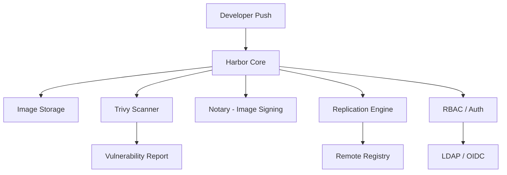

# How to Run Harbor Container Registry with Vulnerability Scanning

Author: [nawazdhandala](https://github.com/nawazdhandala)

Tags: docker, harbor, container registry, vulnerability scanning, Trivy, image management, DevSecOps

Description: Deploy Harbor container registry in Docker with built-in vulnerability scanning to secure your container image supply chain.

---

Public registries like Docker Hub are convenient, but organizations that take security seriously need a private registry with access control, audit logging, and vulnerability scanning. Harbor is an open-source container registry that provides all of this. It integrates Trivy for vulnerability scanning, supports image signing with Notary, offers role-based access control, and replicates images across multiple registries. Running Harbor in Docker gives you an enterprise-grade registry without the enterprise price tag.

## What Harbor Provides

Harbor goes well beyond basic image storage. It is a full container artifact management platform.

- **Vulnerability scanning** - scans every image automatically with Trivy
- **Role-based access control** - project-level permissions with LDAP/OIDC integration
- **Image replication** - sync images between Harbor instances or to/from Docker Hub, AWS ECR, and GCR
- **Content trust** - image signing and verification with Notary
- **Garbage collection** - reclaim storage from deleted image layers
- **Audit logging** - track who pushed, pulled, and scanned what
- **Webhook notifications** - trigger actions on image events



## Prerequisites

- Docker Engine 20.10+
- Docker Compose v2
- At least 4 GB RAM
- 50 GB+ disk space for image storage
- A domain name (recommended for TLS)

## Installing Harbor

Harbor provides an offline installer that bundles everything needed. Download it and extract.

```bash
# Download the Harbor online installer
curl -L https://github.com/goharbor/harbor/releases/download/v2.10.0/harbor-online-installer-v2.10.0.tgz -o harbor-installer.tgz

# Extract the installer
tar xzf harbor-installer.tgz
cd harbor
```

## Configuration

Copy the template configuration and customize it for your environment.

```bash
# Copy the example configuration
cp harbor.yml.tmpl harbor.yml
```

Edit the key settings in `harbor.yml`.

```yaml
# harbor.yml - Key configuration sections

# The external URL where Harbor will be accessible
hostname: registry.example.com

# HTTPS configuration - strongly recommended for production
https:
  port: 443
  certificate: /etc/harbor/certs/server.crt
  private_key: /etc/harbor/certs/server.key

# For local development without TLS, use HTTP instead
# http:
#   port: 80

# Admin password - change this immediately
harbor_admin_password: Harbor12345

# Database configuration
database:
  password: harbor-db-password
  max_idle_conns: 100
  max_open_conns: 900

# Storage backend for images
data_volume: /data/harbor

# Trivy vulnerability scanner - enable this
trivy:
  # Always scan on push
  insecure: false
  github_token: ""
  # Skip databases update when scanner starts
  skip_update: false

# Job service configuration
jobservice:
  max_job_workers: 10

# Log settings
log:
  level: info
  local:
    rotate_count: 50
    rotate_size: 200M
    location: /var/log/harbor
```

## Generating TLS Certificates

For production use, get certificates from a real CA. For testing, generate self-signed certificates.

```bash
# Create a directory for certificates
mkdir -p /etc/harbor/certs

# Generate a CA key and certificate
openssl genrsa -out /etc/harbor/certs/ca.key 4096
openssl req -x509 -new -nodes -sha512 -days 3650 \
  -subj "/CN=Harbor CA" \
  -key /etc/harbor/certs/ca.key \
  -out /etc/harbor/certs/ca.crt

# Generate a server key
openssl genrsa -out /etc/harbor/certs/server.key 4096

# Generate a certificate signing request
openssl req -sha512 -new \
  -subj "/CN=registry.example.com" \
  -key /etc/harbor/certs/server.key \
  -out /etc/harbor/certs/server.csr

# Create an extensions file for SAN
cat > /etc/harbor/certs/v3.ext <<EOF
authorityKeyIdentifier=keyid,issuer
basicConstraints=CA:FALSE
keyUsage = digitalSignature, nonRepudiation, keyEncipherment, dataEncipherment
extendedKeyUsage = serverAuth
subjectAltName = @alt_names

[alt_names]
DNS.1=registry.example.com
DNS.2=harbor
IP.1=192.168.1.100
EOF

# Sign the certificate
openssl x509 -req -sha512 -days 3650 \
  -extfile /etc/harbor/certs/v3.ext \
  -CA /etc/harbor/certs/ca.crt -CAkey /etc/harbor/certs/ca.key -CAcreateserial \
  -in /etc/harbor/certs/server.csr \
  -out /etc/harbor/certs/server.crt
```

## Installing and Starting Harbor

Run the Harbor installer with Trivy scanning enabled.

```bash
# Run the installer with Trivy scanner
sudo ./install.sh --with-trivy

# Check that all containers are running
docker compose ps
```

Harbor creates and manages its own Docker Compose file. You should see about 10 containers running: core, portal, database, redis, registry, registryctl, jobservice, trivy-adapter, proxy, and log.

Access the web UI at `https://registry.example.com` (or `http://localhost` if using HTTP). Log in with:

- Username: `admin`
- Password: the password you set in `harbor.yml`

## Configuring Docker Clients

Configure Docker on your development machines to trust and use the Harbor registry.

```bash
# If using self-signed certificates, add the CA to Docker's trusted certs
sudo mkdir -p /etc/docker/certs.d/registry.example.com
sudo cp /etc/harbor/certs/ca.crt /etc/docker/certs.d/registry.example.com/

# Restart Docker to pick up the new certificate
sudo systemctl restart docker

# Log in to Harbor
docker login registry.example.com
```

## Pushing and Scanning Images

Push an image to Harbor and watch it get scanned automatically.

```bash
# Tag a local image for the Harbor registry
docker tag myapp:latest registry.example.com/myproject/myapp:latest

# Push to Harbor
docker push registry.example.com/myproject/myapp:latest
```

Harbor triggers a vulnerability scan automatically on push (if configured). Check scan results through the UI or API.

```bash
# Get vulnerability scan results via the API
curl -k -u admin:Harbor12345 \
  "https://registry.example.com/api/v2.0/projects/myproject/repositories/myapp/artifacts/latest?with_scan_overview=true" \
  | python3 -m json.tool

# Manually trigger a scan on an existing artifact
curl -k -u admin:Harbor12345 -X POST \
  "https://registry.example.com/api/v2.0/projects/myproject/repositories/myapp/artifacts/latest/scan"
```

## Setting Up Scan-on-Push

Configure projects to automatically scan every image as it arrives.

```bash
# Enable automatic scanning for a project via the API
curl -k -u admin:Harbor12345 -X PUT \
  "https://registry.example.com/api/v2.0/projects/1" \
  -H "Content-Type: application/json" \
  -d '{
    "metadata": {
      "auto_scan": "true",
      "severity": "critical"
    }
  }'
```

## Setting Up Image Replication

Replicate images between Harbor instances or pull from external registries.

```bash
# Create a replication rule to pull from Docker Hub
curl -k -u admin:Harbor12345 -X POST \
  "https://registry.example.com/api/v2.0/replication/policies" \
  -H "Content-Type: application/json" \
  -d '{
    "name": "docker-hub-mirror",
    "src_registry": {"id": 1},
    "dest_namespace": "mirror",
    "trigger": {"type": "scheduled", "trigger_settings": {"cron": "0 0 * * *"}},
    "filters": [
      {"type": "name", "value": "library/nginx"},
      {"type": "tag", "value": "stable*"}
    ],
    "enabled": true
  }'
```

## Garbage Collection

Over time, deleted image tags leave orphaned layers. Run garbage collection to reclaim space.

```bash
# Trigger garbage collection via the API
curl -k -u admin:Harbor12345 -X POST \
  "https://registry.example.com/api/v2.0/system/gc/schedule" \
  -H "Content-Type: application/json" \
  -d '{"schedule": {"type": "Manual"}}'

# Check garbage collection status
curl -k -u admin:Harbor12345 \
  "https://registry.example.com/api/v2.0/system/gc" \
  | python3 -m json.tool
```

## Backup and Restore

```bash
# Stop Harbor before backup
cd /path/to/harbor
docker compose down

# Back up the database
docker run --rm -v harbor_harbor-db:/data -v $(pwd):/backup \
  alpine tar czf /backup/harbor-db-$(date +%Y%m%d).tar.gz /data

# Back up the image storage
tar czf harbor-storage-$(date +%Y%m%d).tar.gz /data/harbor/registry

# Restart Harbor
docker compose up -d
```

## Conclusion

Harbor in Docker provides a production-ready private container registry with integrated security scanning. Every image pushed to Harbor gets automatically scanned by Trivy, giving your team visibility into vulnerabilities before deployment. The role-based access control keeps projects isolated, replication keeps registries in sync across environments, and the audit log provides accountability. For organizations building a secure container supply chain, Harbor is the foundation you need.
