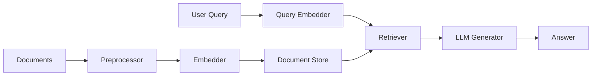

# How to Run Haystack AI Framework in Docker

Author: [nawazdhandala](https://github.com/nawazdhandala)

Tags: docker, haystack, ai framework, rag, llm, nlp, search, docker compose

Description: Deploy the Haystack AI framework in Docker to build retrieval-augmented generation (RAG) pipelines, semantic search, and question answering systems.

---

Haystack is an open-source framework by deepset for building AI applications powered by large language models. It excels at retrieval-augmented generation (RAG), semantic search, and question answering over your own documents. The framework connects to various LLM providers, vector databases, and document stores through a modular pipeline architecture. Running Haystack in Docker lets you deploy these pipelines as production services with all dependencies neatly packaged.

## What You Can Build with Haystack

Haystack pipelines combine components for:

- **Document processing**: Splitting, cleaning, and converting documents
- **Embedding**: Converting text into vector representations
- **Retrieval**: Finding relevant documents using semantic or keyword search
- **Generation**: Using LLMs to generate answers based on retrieved context
- **Evaluation**: Measuring pipeline accuracy and performance



## Quick Start with Docker

Start with a simple Haystack application in Docker.

```dockerfile
# Dockerfile
# Haystack RAG application with FastAPI
FROM python:3.11-slim

WORKDIR /app

# Install Haystack with all common integrations
RUN pip install --no-cache-dir \
    haystack-ai \
    "fastapi[standard]" \
    uvicorn \
    sentence-transformers \
    pypdf

# Copy the application code
COPY app.py /app/

EXPOSE 8000

CMD ["uvicorn", "app:app", "--host", "0.0.0.0", "--port", "8000"]
```

Create the application:

```python
# app.py
# Haystack RAG API with in-memory document store
from haystack import Pipeline
from haystack.document_stores.in_memory import InMemoryDocumentStore
from haystack.components.embedders import (
    SentenceTransformersDocumentEmbedder,
    SentenceTransformersTextEmbedder,
)
from haystack.components.retrievers.in_memory import InMemoryEmbeddingRetriever
from haystack.components.builders import PromptBuilder
from haystack.components.generators import HuggingFaceLocalGenerator
from haystack import Document
from fastapi import FastAPI, HTTPException
from pydantic import BaseModel

app = FastAPI(title="Haystack RAG API")

# Initialize the document store
document_store = InMemoryDocumentStore()

# Sample documents to search over
documents = [
    Document(content="Docker containers package applications with their dependencies for consistent deployment across environments."),
    Document(content="Kubernetes orchestrates containerized workloads across clusters of machines for high availability."),
    Document(content="Docker Compose defines multi-container applications using a YAML configuration file."),
    Document(content="Container images are built from Dockerfiles that specify the base image and application layers."),
    Document(content="Docker volumes persist data beyond the container lifecycle and provide better I/O performance."),
]

# Build the indexing pipeline to embed and store documents
indexing_pipeline = Pipeline()
indexing_pipeline.add_component(
    "embedder",
    SentenceTransformersDocumentEmbedder(model="sentence-transformers/all-MiniLM-L6-v2")
)
indexing_pipeline.connect("embedder", "writer")

# Embed and store the documents
doc_embedder = SentenceTransformersDocumentEmbedder(
    model="sentence-transformers/all-MiniLM-L6-v2"
)
doc_embedder.warm_up()
docs_with_embeddings = doc_embedder.run(documents)
document_store.write_documents(docs_with_embeddings["documents"])

# Build the query pipeline
query_embedder = SentenceTransformersTextEmbedder(
    model="sentence-transformers/all-MiniLM-L6-v2"
)

retriever = InMemoryEmbeddingRetriever(document_store=document_store, top_k=3)

# Create the RAG pipeline
rag_pipeline = Pipeline()
rag_pipeline.add_component("query_embedder", query_embedder)
rag_pipeline.add_component("retriever", retriever)
rag_pipeline.connect("query_embedder.embedding", "retriever.query_embedding")


class QueryRequest(BaseModel):
    question: str


class QueryResponse(BaseModel):
    question: str
    documents: list
    answer: str


@app.post("/query")
async def query(request: QueryRequest):
    """Search documents using semantic similarity."""
    result = rag_pipeline.run({
        "query_embedder": {"text": request.question}
    })

    docs = result["retriever"]["documents"]
    context = "\n".join([doc.content for doc in docs])

    return QueryResponse(
        question=request.question,
        documents=[{"content": doc.content, "score": doc.score} for doc in docs],
        answer=context
    )


@app.get("/health")
async def health():
    return {"status": "ok", "documents": document_store.count_documents()}
```

Build and run:

```bash
# Build the Docker image
docker build -t haystack-rag .

# Run the container
docker run -d \
  --name haystack-rag \
  -p 8000:8000 \
  haystack-rag

# Wait for model download and startup
docker logs -f haystack-rag
```

## Docker Compose with Vector Database

For production, use a proper vector database instead of in-memory storage.

```yaml
# docker-compose.yml
# Haystack with Qdrant vector database for persistent semantic search
version: "3.8"

services:
  haystack:
    build: .
    container_name: haystack
    ports:
      - "8000:8000"
    environment:
      - QDRANT_URL=http://qdrant:6333
      - EMBEDDING_MODEL=sentence-transformers/all-MiniLM-L6-v2
    depends_on:
      qdrant:
        condition: service_healthy
    restart: unless-stopped

  qdrant:
    image: qdrant/qdrant:latest
    container_name: qdrant
    ports:
      - "6333:6333"
      - "6334:6334"
    volumes:
      # Persist vector database storage
      - qdrant_data:/qdrant/storage
    healthcheck:
      test: ["CMD", "curl", "-f", "http://localhost:6333/healthz"]
      interval: 10s
      timeout: 5s
      retries: 5
    restart: unless-stopped

volumes:
  qdrant_data:
```

Update the application to use Qdrant:

```python
# app_qdrant.py
# Haystack RAG with Qdrant vector database
import os
from haystack import Pipeline, Document
from haystack.components.embedders import (
    SentenceTransformersDocumentEmbedder,
    SentenceTransformersTextEmbedder,
)
from haystack_integrations.document_stores.qdrant import QdrantDocumentStore
from haystack_integrations.components.retrievers.qdrant import QdrantEmbeddingRetriever
from fastapi import FastAPI, UploadFile, File
from pydantic import BaseModel

app = FastAPI(title="Haystack RAG API with Qdrant")

QDRANT_URL = os.environ.get("QDRANT_URL", "http://localhost:6333")
EMBEDDING_MODEL = os.environ.get("EMBEDDING_MODEL", "sentence-transformers/all-MiniLM-L6-v2")

# Initialize Qdrant document store
document_store = QdrantDocumentStore(
    url=QDRANT_URL,
    embedding_dim=384,
    recreate_index=False,
)

# Document embedder for indexing
doc_embedder = SentenceTransformersDocumentEmbedder(model=EMBEDDING_MODEL)
doc_embedder.warm_up()

# Query pipeline components
query_embedder = SentenceTransformersTextEmbedder(model=EMBEDDING_MODEL)
retriever = QdrantEmbeddingRetriever(document_store=document_store, top_k=5)

# Build the query pipeline
query_pipeline = Pipeline()
query_pipeline.add_component("query_embedder", query_embedder)
query_pipeline.add_component("retriever", retriever)
query_pipeline.connect("query_embedder.embedding", "retriever.query_embedding")


class IngestRequest(BaseModel):
    documents: list[str]


@app.post("/ingest")
async def ingest_documents(request: IngestRequest):
    """Add documents to the vector store."""
    docs = [Document(content=text) for text in request.documents]
    result = doc_embedder.run(docs)
    document_store.write_documents(result["documents"])
    return {"ingested": len(request.documents)}


class QueryRequest(BaseModel):
    question: str


@app.post("/query")
async def query(request: QueryRequest):
    """Search for relevant documents."""
    result = query_pipeline.run({
        "query_embedder": {"text": request.question}
    })

    docs = result["retriever"]["documents"]
    return {
        "question": request.question,
        "results": [
            {"content": doc.content, "score": doc.score}
            for doc in docs
        ]
    }
```

Update the Dockerfile to include the Qdrant integration:

```dockerfile
# Dockerfile with Qdrant support
FROM python:3.11-slim

WORKDIR /app

RUN pip install --no-cache-dir \
    haystack-ai \
    qdrant-haystack \
    "fastapi[standard]" \
    uvicorn \
    sentence-transformers \
    pypdf

COPY app_qdrant.py /app/app.py

EXPOSE 8000

CMD ["uvicorn", "app:app", "--host", "0.0.0.0", "--port", "8000"]
```

## Ingesting and Querying Documents

```bash
# Start the full stack
docker compose up -d

# Wait for services to be ready
sleep 10

# Ingest some documents
curl -X POST http://localhost:8000/ingest \
  -H "Content-Type: application/json" \
  -d '{
    "documents": [
      "Docker containers use Linux namespaces for process isolation.",
      "Container images are composed of layers, each representing a filesystem diff.",
      "Docker Compose orchestrates multi-container applications on a single host.",
      "Volumes provide persistent storage that survives container restarts.",
      "Docker networks enable container-to-container communication using DNS."
    ]
  }'

# Query the documents
curl -X POST http://localhost:8000/query \
  -H "Content-Type: application/json" \
  -d '{"question": "How do containers store data persistently?"}' | python3 -m json.tool
```

## Adding PDF Document Processing

Extend the pipeline to ingest PDF files.

```python
# Add this endpoint to the FastAPI application
from haystack.components.converters import PyPDFToDocument
from haystack.components.preprocessors import DocumentSplitter

@app.post("/ingest/pdf")
async def ingest_pdf(file: UploadFile = File(...)):
    """Ingest a PDF file into the document store."""
    import tempfile

    # Save the uploaded PDF
    with tempfile.NamedTemporaryFile(suffix=".pdf", delete=False) as tmp:
        content = await file.read()
        tmp.write(content)
        tmp_path = tmp.name

    # Convert PDF to documents
    converter = PyPDFToDocument()
    result = converter.run(sources=[tmp_path])

    # Split into smaller chunks
    splitter = DocumentSplitter(split_by="sentence", split_length=3)
    split_result = splitter.run(documents=result["documents"])

    # Embed and store
    embedded = doc_embedder.run(split_result["documents"])
    document_store.write_documents(embedded["documents"])

    os.unlink(tmp_path)
    return {"ingested_chunks": len(split_result["documents"])}
```

## Monitoring the Pipeline

```bash
# Check service health
curl http://localhost:8000/health

# Monitor resource usage
docker stats haystack qdrant

# View Haystack logs
docker compose logs -f haystack

# Check Qdrant collection info
curl http://localhost:6333/collections | python3 -m json.tool
```

## Summary

Haystack in Docker provides a clean deployment path for RAG pipelines, semantic search, and question answering systems. The framework's modular design lets you swap components - change the vector database, switch embedding models, or plug in different LLM providers. Docker Compose brings all the pieces together: the application, the vector database, and any supporting services. The combination gives you a production-ready AI pipeline that handles document ingestion, embedding, retrieval, and generation in a repeatable, scalable setup.
