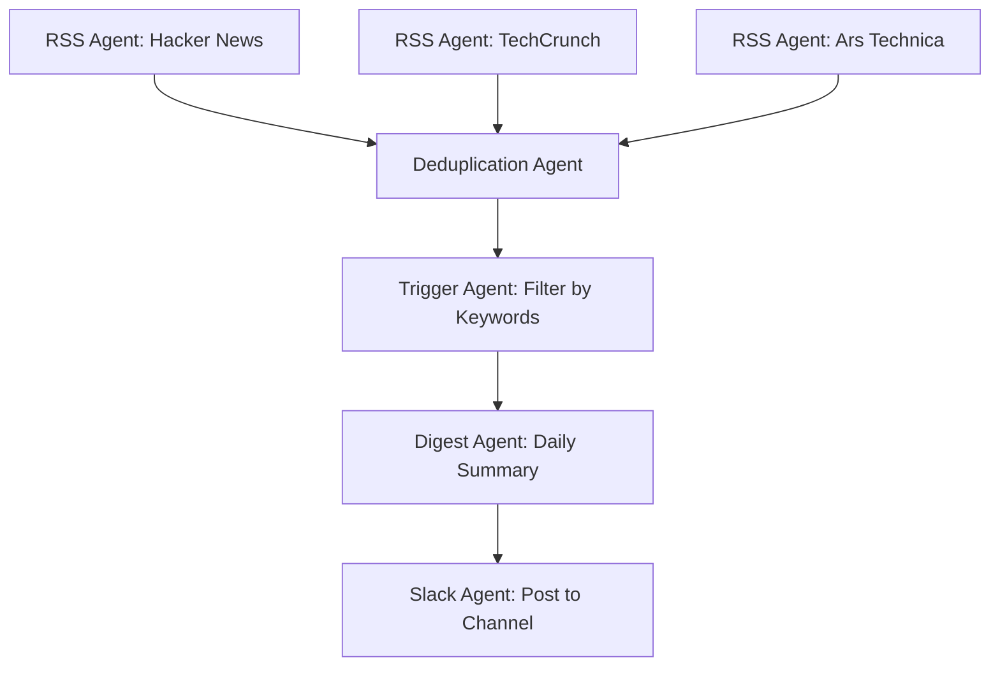

# How to Run Huginn in Docker for Automated Agents

Author: [nawazdhandala](https://github.com/nawazdhandala)

Tags: Docker, Huginn, Automation, Agents, Web Scraping, Docker Compose, Self-Hosted

Description: Deploy Huginn in Docker to create automated agents that monitor websites, process data, and trigger actions on your behalf.

---

Huginn is a system for building agents that perform automated tasks online. Named after one of Odin's ravens in Norse mythology (the one that represents "thought"), Huginn agents watch websites for changes, process RSS feeds, send notifications, aggregate data from APIs, and chain together into complex workflows. Think of it as a self-hosted, programmable IFTTT with far more power and flexibility.

Running Huginn in Docker simplifies what would otherwise be a complex Ruby on Rails deployment. This guide covers setting it up with Docker Compose, creating your first agents, building multi-agent scenarios, and keeping the system running reliably.

## What Huginn Agents Can Do

Each Huginn agent performs a specific task. You chain agents together to build complex automations. Some examples:

- Monitor a web page and get notified when the price drops
- Watch an RSS feed and post new items to Slack
- Check the weather forecast and send you a morning summary
- Scrape job listings and aggregate them into a daily email digest
- Monitor government data feeds for changes
- Track package deliveries across carriers
- Watch Twitter/X for mentions and log them to a spreadsheet

The key difference from tools like n8n or Zapier is that Huginn agents run continuously on schedules and maintain state between runs. An agent remembers what it saw last time and only reports changes.

## Prerequisites

Docker and Docker Compose are required. Huginn uses around 500 MB to 1 GB of RAM depending on the number of active agents.

```bash
# Verify Docker installation
docker --version
docker compose version
```

## Quick Start

Get Huginn running quickly with the all-in-one image.

```bash
# Run Huginn with embedded MySQL (good for testing)
docker run -d \
  --name huginn \
  -p 3000:3000 \
  -v huginn-data:/var/lib/mysql \
  ghcr.io/huginn/huginn
```

Open `http://your-server-ip:3000` and log in with the default credentials: admin / password. Change the password immediately through the web interface.

## Production Setup with Docker Compose

For production, separate the database from the application and use PostgreSQL for better performance.

```yaml
# docker-compose.yml - Huginn with PostgreSQL
version: "3.8"

services:
  huginn:
    image: ghcr.io/huginn/huginn
    container_name: huginn
    restart: unless-stopped
    ports:
      - "3000:3000"
    environment:
      # Database configuration
      DATABASE_ADAPTER: postgresql
      DATABASE_HOST: huginn-postgres
      DATABASE_PORT: 5432
      DATABASE_NAME: huginn
      DATABASE_USERNAME: huginn
      DATABASE_PASSWORD: ${POSTGRES_PASSWORD}
      # Application settings
      DOMAIN: huginn.yourdomain.com
      HUGINN_SEED_USERNAME: admin
      HUGINN_SEED_PASSWORD: ${ADMIN_PASSWORD}
      # Email settings for sending notifications
      SMTP_DOMAIN: yourdomain.com
      SMTP_SERVER: smtp.gmail.com
      SMTP_PORT: 587
      SMTP_USER_NAME: ${SMTP_USER}
      SMTP_PASSWORD: ${SMTP_PASSWORD}
      SMTP_AUTHENTICATION: plain
      SMTP_ENABLE_STARTTLS_AUTO: "true"
      EMAIL_FROM_ADDRESS: huginn@yourdomain.com
      # Timezone
      TIMEZONE: America/New_York
    depends_on:
      huginn-postgres:
        condition: service_healthy

  huginn-postgres:
    image: postgres:16-alpine
    container_name: huginn-postgres
    restart: unless-stopped
    volumes:
      - huginn-postgres-data:/var/lib/postgresql/data
    environment:
      POSTGRES_DB: huginn
      POSTGRES_USER: huginn
      POSTGRES_PASSWORD: ${POSTGRES_PASSWORD}
    healthcheck:
      test: ["CMD-SHELL", "pg_isready -U huginn"]
      interval: 10s
      timeout: 5s
      retries: 5

volumes:
  huginn-postgres-data:
```

Create the environment file.

```bash
# .env - Sensitive values for Huginn
POSTGRES_PASSWORD=your-secure-postgres-password
ADMIN_PASSWORD=your-secure-admin-password
SMTP_USER=your-email@gmail.com
SMTP_PASSWORD=your-app-specific-password
```

Start the stack.

```bash
# Launch Huginn and PostgreSQL
docker compose up -d

# Wait for initialization (first run takes a minute)
docker compose logs -f huginn
```

## Understanding Agent Types

Huginn ships with dozens of agent types. Here are the most useful categories.

**Source agents** bring data into the system:
- WebsiteAgent: scrapes web pages using CSS selectors
- RssAgent: reads RSS/Atom feeds
- WebhookAgent: receives incoming HTTP requests
- ImapFolderAgent: monitors email inboxes

**Processing agents** transform and filter data:
- EventFormattingAgent: reformats event data
- TriggerAgent: fires when conditions are met
- DeduplicationAgent: removes duplicate events
- JavaScriptAgent: runs custom JS code on events

**Action agents** do things with the processed data:
- EmailAgent: sends email notifications
- SlackAgent: posts to Slack channels
- PostAgent: makes HTTP requests to external APIs
- ShellCommandAgent: runs commands on the server

## Creating Your First Agent: Website Price Monitor

Here is a step-by-step example of monitoring a product page for price changes.

1. Log into Huginn and click "New Agent"
2. Select "Website Agent" as the type
3. Configure it with the following options:

```json
{
  "expected_update_period_in_days": 1,
  "url": "https://store.example.com/product-page",
  "type": "html",
  "mode": "on_change",
  "extract": {
    "title": {
      "css": "h1.product-title",
      "value": "normalize-space(.)"
    },
    "price": {
      "css": "span.price",
      "value": "normalize-space(.)"
    }
  }
}
```

Set the schedule to run every 6 hours. The "on_change" mode means it only creates events when the extracted data differs from the previous run.

4. Create a second agent, an EmailAgent or SlackAgent, that receives events from the WebsiteAgent.

```json
{
  "subject": "Price Change: {{title}}",
  "body": "The price of {{title}} changed to {{price}}.",
  "expected_receive_period_in_days": 7
}
```

Set the source of this agent to the WebsiteAgent you created in step 3.

## Building a Multi-Agent Scenario

Here is a more complex example: aggregate tech news from multiple RSS feeds, filter for relevant topics, and post a daily digest to Slack.



Create each agent in sequence:

The RSS Agent configuration (create one for each feed):

```json
{
  "expected_update_period_in_days": 1,
  "url": "https://hnrss.org/frontpage",
  "clean": false,
  "headers": {}
}
```

The Trigger Agent filters for relevant keywords:

```json
{
  "expected_receive_period_in_days": 1,
  "keep_event": true,
  "rules": [
    {
      "type": "regex",
      "value": "docker|kubernetes|devops|monitoring",
      "path": "title"
    }
  ]
}
```

The Digest Agent collects events over 24 hours:

```json
{
  "expected_receive_period_in_days": 2,
  "message": "Here are today's relevant tech articles:\n\n* [{{event.title}}]({{event.url}})\n",
  "retained_events": 50
}
```

## Webhook Agent for External Integrations

The WebhookAgent lets external services trigger Huginn workflows.

```json
{
  "secret": "your-webhook-secret",
  "expected_receive_period_in_days": 1,
  "payload_path": "."
}
```

After creating this agent, you get a URL like `https://huginn.yourdomain.com/users/1/web_requests/123/your-webhook-secret`. Point your monitoring tool's webhook at this URL, and Huginn will process incoming events.

```bash
# Test the webhook
curl -X POST \
  -H "Content-Type: application/json" \
  -d '{"alert": "High CPU", "server": "web-01"}' \
  https://huginn.yourdomain.com/users/1/web_requests/123/your-webhook-secret
```

## Backup and Restore

Back up the PostgreSQL database and the Huginn configuration.

```bash
# Backup the database
docker exec huginn-postgres pg_dump -U huginn huginn > huginn-backup-$(date +%Y%m%d).sql

# Restore from backup
docker exec -i huginn-postgres psql -U huginn huginn < huginn-backup-20260208.sql
```

You can also export your agents as a "scenario" from the Huginn web interface, which produces a JSON file you can import on another instance.

## Resource Monitoring

Huginn's Ruby process can be memory-hungry with many active agents.

```bash
# Check resource usage
docker stats huginn --no-stream

# View agent run logs
docker compose logs --tail 100 huginn
```

Add memory limits to the compose file if you are on a shared server.

```yaml
deploy:
  resources:
    limits:
      memory: 1G
    reservations:
      memory: 512M
```

## Summary

Huginn gives you a programmable automation framework that excels at monitoring, scraping, and data processing tasks that run on schedules. Its agent-based model with persistent state makes it uniquely suited for "watch and react" scenarios that tools like Zapier handle but at a much higher cost. Running it in Docker with PostgreSQL provides a stable, production-ready deployment. Combine it with OneUptime for infrastructure monitoring and use Huginn agents to enrich, filter, and route those alerts to the right people through the right channels.
