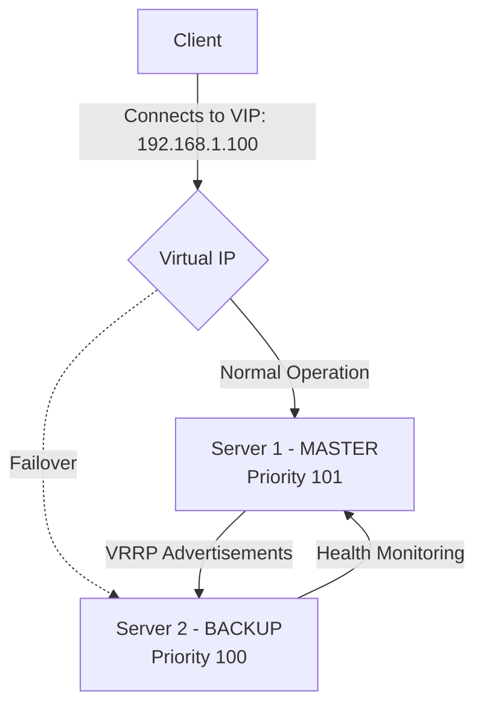

# How to Run Keepalived in Docker for Virtual IP Failover

Author: [nawazdhandala](https://github.com/nawazdhandala)

Tags: Docker, Keepalived, VRRP, High Availability, Failover, Virtual IP, Networking

Description: Configure Keepalived in Docker to provide virtual IP failover using VRRP for high availability service deployments.

---

Keepalived provides high availability through the Virtual Router Redundancy Protocol (VRRP). It assigns a floating virtual IP address to a group of servers, ensuring that if the active server goes down, another one takes over the IP address seamlessly. Clients never need to know which physical server they are talking to - they just connect to the virtual IP.

Running Keepalived in Docker requires some special networking considerations because VRRP operates at the network layer. This guide covers how to set up Keepalived containers for virtual IP failover, including active-passive and active-active configurations.

## How VRRP Works

VRRP works by electing one server as the MASTER and the others as BACKUP. The MASTER holds the virtual IP and responds to traffic. BACKUP servers listen for VRRP advertisements from the MASTER. If they stop hearing advertisements, the highest-priority BACKUP promotes itself to MASTER and takes over the virtual IP.



## Prerequisites

Keepalived in Docker requires elevated network privileges because it manipulates IP addresses and sends multicast VRRP packets. You need:

- Two or more Docker hosts on the same Layer 2 network
- The `NET_ADMIN` and `NET_BROADCAST` capabilities for the container
- Host networking mode (VRRP does not work with Docker bridge networks)
- A free IP address on the subnet to use as the virtual IP

## Basic Setup: Active-Passive Failover

### MASTER Node Configuration

Create the Keepalived configuration for the primary server.

```bash
# keepalived-master.conf - Primary server configuration
# This server has higher priority and will be the default MASTER

global_defs {
    # Unique identifier for this Keepalived instance
    router_id MASTER_NODE
    # Disable email notifications (configure SMTP for production)
    enable_script_security
}

# Health check script that verifies the target service is running
vrrp_script check_service {
    script "/usr/local/bin/check_service.sh"
    interval 2        # Run every 2 seconds
    weight -20        # Reduce priority by 20 if the check fails
    fall 3            # Mark as failed after 3 consecutive failures
    rise 2            # Mark as recovered after 2 consecutive successes
}

vrrp_instance VI_1 {
    state MASTER
    interface eth0                 # Network interface to bind to
    virtual_router_id 51          # Must be the same on all nodes in the group
    priority 101                  # Higher priority becomes MASTER
    advert_int 1                  # Send VRRP advertisements every 1 second

    # Authentication between VRRP peers
    authentication {
        auth_type PASS
        auth_pass secretkey123
    }

    # The virtual IP address that floats between nodes
    virtual_ipaddress {
        192.168.1.100/24
    }

    # Run the health check script defined above
    track_script {
        check_service
    }

    # Scripts to execute on state transitions
    notify_master "/usr/local/bin/notify.sh MASTER"
    notify_backup "/usr/local/bin/notify.sh BACKUP"
    notify_fault  "/usr/local/bin/notify.sh FAULT"
}
```

### BACKUP Node Configuration

The backup configuration is nearly identical but with a lower priority.

```bash
# keepalived-backup.conf - Backup server configuration
# Lower priority means this server only takes over when the MASTER fails

global_defs {
    router_id BACKUP_NODE
    enable_script_security
}

vrrp_script check_service {
    script "/usr/local/bin/check_service.sh"
    interval 2
    weight -20
    fall 3
    rise 2
}

vrrp_instance VI_1 {
    state BACKUP
    interface eth0
    virtual_router_id 51          # Must match the MASTER's router ID
    priority 100                  # Lower than MASTER's 101
    advert_int 1

    authentication {
        auth_type PASS
        auth_pass secretkey123    # Must match MASTER's password
    }

    virtual_ipaddress {
        192.168.1.100/24          # Same VIP as MASTER
    }

    track_script {
        check_service
    }

    notify_master "/usr/local/bin/notify.sh MASTER"
    notify_backup "/usr/local/bin/notify.sh BACKUP"
    notify_fault  "/usr/local/bin/notify.sh FAULT"
}
```

### Health Check Script

Create a script that verifies your actual service is healthy.

```bash
#!/bin/bash
# check_service.sh - Verify the target service is responding
# Exit code 0 = healthy, non-zero = unhealthy

# Check if Nginx is responding on port 80
curl -sf http://localhost:80/health > /dev/null 2>&1
exit $?
```

### Notification Script

This script runs whenever Keepalived transitions between states.

```bash
#!/bin/bash
# notify.sh - Log and alert on VRRP state changes
# Receives the new state as an argument

STATE=$1
TIMESTAMP=$(date '+%Y-%m-%d %H:%M:%S')

echo "${TIMESTAMP} - VRRP state changed to: ${STATE}" >> /var/log/keepalived-notify.log

case $STATE in
    MASTER)
        echo "${TIMESTAMP} - This node is now MASTER. VIP is active here."
        # Optionally send an alert
        # curl -X POST https://alerts.example.com/webhook -d "Node became MASTER"
        ;;
    BACKUP)
        echo "${TIMESTAMP} - This node is now BACKUP. VIP has moved away."
        ;;
    FAULT)
        echo "${TIMESTAMP} - This node is in FAULT state. Service check failed."
        ;;
esac
```

## Docker Compose Setup

### MASTER Node docker-compose.yml

```yaml
# docker-compose.yml for the MASTER Keepalived node
# Host networking is required for VRRP to function properly
version: "3.8"

services:
  keepalived:
    image: osixia/keepalived:2.0.20
    container_name: keepalived-master
    restart: unless-stopped
    # Host network mode is mandatory for VRRP
    network_mode: host
    cap_add:
      - NET_ADMIN       # Required to manage IP addresses
      - NET_BROADCAST    # Required for VRRP multicast
    environment:
      - KEEPALIVED_VIRTUAL_IPS=192.168.1.100
      - KEEPALIVED_UNICAST_PEERS=
      - KEEPALIVED_PRIORITY=101
      - KEEPALIVED_INTERFACE=eth0
    volumes:
      - ./keepalived-master.conf:/container/service/keepalived/assets/keepalived.conf:ro
      - ./check_service.sh:/usr/local/bin/check_service.sh:ro
      - ./notify.sh:/usr/local/bin/notify.sh:ro

  # The actual service being protected by Keepalived
  nginx:
    image: nginx:alpine
    container_name: web-server
    restart: unless-stopped
    network_mode: host
    volumes:
      - ./html:/usr/share/nginx/html:ro
```

### BACKUP Node docker-compose.yml

```yaml
# docker-compose.yml for the BACKUP Keepalived node
# Deploy this on a second server on the same network
version: "3.8"

services:
  keepalived:
    image: osixia/keepalived:2.0.20
    container_name: keepalived-backup
    restart: unless-stopped
    network_mode: host
    cap_add:
      - NET_ADMIN
      - NET_BROADCAST
    environment:
      - KEEPALIVED_VIRTUAL_IPS=192.168.1.100
      - KEEPALIVED_PRIORITY=100
      - KEEPALIVED_INTERFACE=eth0
    volumes:
      - ./keepalived-backup.conf:/container/service/keepalived/assets/keepalived.conf:ro
      - ./check_service.sh:/usr/local/bin/check_service.sh:ro
      - ./notify.sh:/usr/local/bin/notify.sh:ro

  nginx:
    image: nginx:alpine
    container_name: web-server
    restart: unless-stopped
    network_mode: host
    volumes:
      - ./html:/usr/share/nginx/html:ro
```

## Building a Custom Keepalived Image

If the pre-built image does not meet your needs, build your own.

```dockerfile
# Dockerfile for a custom Keepalived image
# Includes additional tools for health checking
FROM alpine:3.19

RUN apk add --no-cache \
    keepalived \
    curl \
    bash \
    iputils \
    && rm -rf /var/cache/apk/*

# Copy configuration and scripts
COPY keepalived.conf /etc/keepalived/keepalived.conf
COPY check_service.sh /usr/local/bin/check_service.sh
COPY notify.sh /usr/local/bin/notify.sh

RUN chmod +x /usr/local/bin/check_service.sh /usr/local/bin/notify.sh

# Keepalived runs in the foreground
CMD ["keepalived", "--dont-fork", "--log-console", "-D"]
```

```bash
# Build and run the custom image
docker build -t keepalived-custom .
docker run -d \
  --name keepalived \
  --network host \
  --cap-add NET_ADMIN \
  --cap-add NET_BROADCAST \
  keepalived-custom
```

## Testing Failover

Verify that failover works correctly by simulating a failure on the MASTER node.

```bash
# On the MASTER node, check the current VRRP state
docker exec keepalived-master cat /tmp/keepalived.data

# Verify the VIP is assigned to the MASTER's interface
ip addr show eth0 | grep 192.168.1.100

# Simulate a failure by stopping the MASTER's Keepalived
docker stop keepalived-master

# On the BACKUP node, confirm it has taken over the VIP
ip addr show eth0 | grep 192.168.1.100

# Test that the service is still accessible through the VIP
curl http://192.168.1.100

# Restart the MASTER and verify it reclaims the VIP
docker start keepalived-master
# Wait a few seconds for VRRP re-election
sleep 5
ip addr show eth0 | grep 192.168.1.100
```

## Unicast VRRP (For Cloud Environments)

Cloud providers often block multicast traffic. Use unicast VRRP instead.

```bash
# Unicast VRRP configuration
# Replace multicast with direct peer communication

vrrp_instance VI_1 {
    state MASTER
    interface eth0
    virtual_router_id 51
    priority 101
    advert_int 1

    # Use unicast instead of multicast
    unicast_src_ip 192.168.1.10     # This node's real IP
    unicast_peer {
        192.168.1.11                 # The other node's real IP
    }

    authentication {
        auth_type PASS
        auth_pass secretkey123
    }

    virtual_ipaddress {
        192.168.1.100/24
    }
}
```

## Combining Keepalived with HAProxy

A common production pattern pairs Keepalived with HAProxy. Keepalived manages the floating VIP, and HAProxy handles the actual load balancing.

```yaml
# Combined Keepalived + HAProxy setup
version: "3.8"

services:
  keepalived:
    image: osixia/keepalived:2.0.20
    container_name: keepalived
    network_mode: host
    cap_add:
      - NET_ADMIN
      - NET_BROADCAST
    volumes:
      - ./keepalived.conf:/container/service/keepalived/assets/keepalived.conf:ro
      - ./check_haproxy.sh:/usr/local/bin/check_service.sh:ro

  haproxy:
    image: haproxy:2.9-alpine
    container_name: haproxy
    network_mode: host
    volumes:
      - ./haproxy.cfg:/usr/local/etc/haproxy/haproxy.cfg:ro
```

Where check_haproxy.sh verifies HAProxy is running:

```bash
#!/bin/bash
# check_haproxy.sh - Verify HAProxy is accepting connections
# Used by Keepalived to determine if this node should hold the VIP
killall -0 haproxy 2>/dev/null
exit $?
```

## Monitoring VRRP State

Track Keepalived state transitions to detect flapping or persistent failures.

```bash
# View Keepalived logs from the container
docker logs -f keepalived-master

# Check the current VRRP state
docker exec keepalived-master keepalived --dump-conf

# Monitor state changes in real time using the notification log
docker exec keepalived-master tail -f /var/log/keepalived-notify.log
```

Integrate these state changes with your monitoring system. OneUptime can alert your team when failover events occur, helping you investigate root causes before they become recurring problems.

## Production Considerations

Set the `advert_int` to 1 second for fast failover detection. Use authentication to prevent rogue VRRP instances from hijacking the VIP. Always test failover in a staging environment before deploying to production. Monitor both nodes to ensure the BACKUP is healthy and ready to take over. Keep the health check script simple and fast - a slow check delays failover detection. Use unicast mode in cloud environments where multicast is not supported.

Keepalived in Docker gives you automatic IP failover with sub-second detection times. Combined with a load balancer like HAProxy, it forms the foundation of a highly available service architecture.
