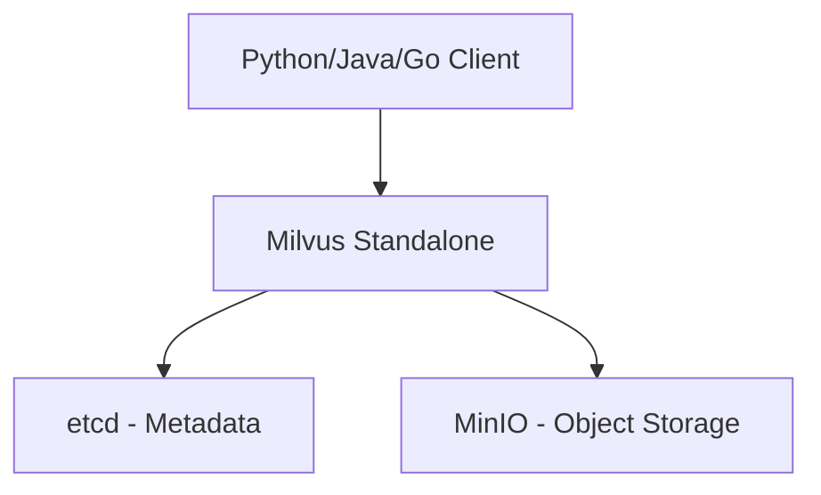

# How to Run Milvus Vector Database in Docker

Author: [nawazdhandala](https://github.com/nawazdhandala)

Tags: Docker, Milvus, Vector Database, AI, Machine Learning, DevOps

Description: Deploy Milvus vector database in Docker for similarity search on embeddings with practical indexing examples

---

Milvus is an open-source vector database purpose-built for similarity search at scale. It stores high-dimensional vectors (embeddings) and performs nearest-neighbor lookups in milliseconds, even across billions of vectors. If you are building AI applications that need semantic search, recommendation engines, or image retrieval, Milvus provides the infrastructure to store and query embeddings efficiently. Docker is the fastest way to get a working Milvus instance.

## What Are Vector Databases For?

Traditional databases search by exact matches or ranges. Vector databases search by similarity. When you convert text, images, or audio into numerical embeddings using models like OpenAI's text-embedding-ada-002 or sentence-transformers, you get high-dimensional vectors. Finding the "most similar" items means finding the nearest neighbors in that vector space.

This powers use cases like:
- Semantic search (find documents by meaning, not just keywords)
- Recommendation systems (find similar products or content)
- Image search (find visually similar images)
- RAG (Retrieval-Augmented Generation) for LLM applications
- Anomaly detection (find data points far from normal clusters)

## Milvus Architecture

Milvus has several deployment modes. The standalone mode runs all components in a single process, suitable for development and small-scale production.



## Docker Compose Deployment

Milvus standalone requires etcd for metadata and MinIO for object storage. The official Compose file bundles everything together.

```yaml
# docker-compose.yml
version: "3.8"

services:
  etcd:
    image: quay.io/coreos/etcd:v3.5.11
    container_name: milvus-etcd
    environment:
      ETCD_AUTO_COMPACTION_MODE: revision
      ETCD_AUTO_COMPACTION_RETENTION: "1000"
      ETCD_QUOTA_BACKEND_BYTES: "4294967296"
      ETCD_SNAPSHOT_COUNT: "50000"
    command: etcd
      -advertise-client-urls=http://127.0.0.1:2379
      -listen-client-urls=http://0.0.0.0:2379
      --data-dir=/etcd
    volumes:
      - etcd_data:/etcd
    healthcheck:
      test: ["CMD", "etcdctl", "endpoint", "health"]
      interval: 30s
      timeout: 20s
      retries: 3

  minio:
    image: minio/minio:RELEASE.2024-01-01T16-36-33Z
    container_name: milvus-minio
    environment:
      MINIO_ACCESS_KEY: minioadmin
      MINIO_SECRET_KEY: minioadmin
    ports:
      - "9001:9001"  # MinIO console
    volumes:
      - minio_data:/minio_data
    command: minio server /minio_data --console-address ":9001"
    healthcheck:
      test: ["CMD", "curl", "-f", "http://localhost:9000/minio/health/live"]
      interval: 30s
      timeout: 20s
      retries: 3

  milvus:
    image: milvusdb/milvus:v2.4.0
    container_name: milvus-standalone
    ports:
      - "19530:19530"  # gRPC port
      - "9091:9091"    # Metrics port
    environment:
      ETCD_ENDPOINTS: etcd:2379
      MINIO_ADDRESS: minio:9000
    volumes:
      - milvus_data:/var/lib/milvus
    depends_on:
      etcd:
        condition: service_healthy
      minio:
        condition: service_healthy
    healthcheck:
      test: ["CMD", "curl", "-f", "http://localhost:9091/healthz"]
      interval: 30s
      timeout: 20s
      retries: 3
    deploy:
      resources:
        limits:
          memory: 4G

volumes:
  etcd_data:
  minio_data:
  milvus_data:
```

Start the stack.

```bash
# Launch Milvus and its dependencies
docker compose up -d

# Wait for all services to be healthy
docker compose ps
```

## Installing the Python Client

The pymilvus library is the primary way to interact with Milvus.

```bash
# Install the Milvus Python SDK
pip install pymilvus
```

## Creating a Collection

Collections in Milvus are similar to tables in relational databases. Each collection has a schema defining the fields, including at least one vector field.

```python
# create_collection.py
from pymilvus import connections, Collection, FieldSchema, CollectionSchema, DataType

# Connect to Milvus
connections.connect("default", host="localhost", port="19530")

# Define the schema
fields = [
    FieldSchema(name="id", dtype=DataType.INT64, is_primary=True, auto_id=True),
    FieldSchema(name="title", dtype=DataType.VARCHAR, max_length=512),
    FieldSchema(name="category", dtype=DataType.VARCHAR, max_length=100),
    # Vector field: 384 dimensions (typical for sentence-transformers/all-MiniLM-L6-v2)
    FieldSchema(name="embedding", dtype=DataType.FLOAT_VECTOR, dim=384),
]

schema = CollectionSchema(fields, description="Document embeddings for semantic search")

# Create the collection
collection = Collection("documents", schema)

print(f"Collection created: {collection.name}")
print(f"Schema: {collection.schema}")
```

## Inserting Vectors

Generate embeddings and insert them along with metadata.

```python
# insert_data.py
from pymilvus import connections, Collection
from sentence_transformers import SentenceTransformer
import numpy as np

# Connect to Milvus
connections.connect("default", host="localhost", port="19530")
collection = Collection("documents")

# Load an embedding model
model = SentenceTransformer("all-MiniLM-L6-v2")

# Sample documents
documents = [
    {"title": "Introduction to Docker", "category": "devops"},
    {"title": "Building REST APIs with Flask", "category": "backend"},
    {"title": "Kubernetes pod scheduling", "category": "devops"},
    {"title": "React hooks explained", "category": "frontend"},
    {"title": "Database indexing strategies", "category": "databases"},
    {"title": "Container networking fundamentals", "category": "devops"},
    {"title": "GraphQL vs REST API design", "category": "backend"},
    {"title": "CSS Grid layout tutorial", "category": "frontend"},
    {"title": "PostgreSQL query optimization", "category": "databases"},
    {"title": "CI/CD pipeline with GitHub Actions", "category": "devops"},
]

# Generate embeddings
titles = [doc["title"] for doc in documents]
embeddings = model.encode(titles)

# Insert data
data = [
    titles,                                          # title field
    [doc["category"] for doc in documents],          # category field
    embeddings.tolist(),                             # embedding field
]

insert_result = collection.insert(data)
print(f"Inserted {len(insert_result.primary_keys)} vectors")

# Flush to ensure data is persisted
collection.flush()
```

## Building an Index

Milvus needs an index on the vector field for fast similarity search. Different index types offer different trade-offs.

```python
# build_index.py
from pymilvus import connections, Collection

connections.connect("default", host="localhost", port="19530")
collection = Collection("documents")

# Build an IVF_FLAT index
# nlist = number of clusters (higher = faster search, more memory)
index_params = {
    "metric_type": "COSINE",    # Cosine similarity (also supports L2, IP)
    "index_type": "IVF_FLAT",   # Inverted file index
    "params": {"nlist": 128}
}

collection.create_index("embedding", index_params)
print("Index built successfully")

# Load collection into memory for searching
collection.load()
print("Collection loaded into memory")
```

## Performing Similarity Search

Search for documents similar to a query.

```python
# search.py
from pymilvus import connections, Collection
from sentence_transformers import SentenceTransformer

connections.connect("default", host="localhost", port="19530")
collection = Collection("documents")
collection.load()

model = SentenceTransformer("all-MiniLM-L6-v2")

# Encode the search query
query = "How do containers work?"
query_vector = model.encode([query])

# Search for the 5 most similar documents
results = collection.search(
    data=query_vector.tolist(),
    anns_field="embedding",
    param={"metric_type": "COSINE", "params": {"nprobe": 16}},
    limit=5,
    output_fields=["title", "category"]
)

print(f"Query: '{query}'")
print("-" * 50)
for hits in results:
    for hit in hits:
        print(f"  Score: {hit.score:.4f} | {hit.entity.get('title')} [{hit.entity.get('category')}]")
```

## Filtered Search

Combine vector similarity with metadata filtering.

```python
# Filter by category while performing vector search
results = collection.search(
    data=query_vector.tolist(),
    anns_field="embedding",
    param={"metric_type": "COSINE", "params": {"nprobe": 16}},
    limit=5,
    # Only search within the "devops" category
    expr='category == "devops"',
    output_fields=["title", "category"]
)
```

## Index Types Comparison

Choosing the right index depends on your dataset size and accuracy requirements.

| Index Type | Best For | Speed | Accuracy | Memory |
|-----------|----------|-------|----------|--------|
| FLAT | Small datasets (<100K) | Slow | Perfect | Low |
| IVF_FLAT | Medium datasets | Good | High | Medium |
| IVF_SQ8 | Large datasets | Fast | Good | Low |
| HNSW | Low-latency requirements | Very fast | Very high | High |

For most applications, start with IVF_FLAT and switch to HNSW if you need lower latency and can afford more memory.

## Monitoring Milvus

Check cluster health and metrics.

```bash
# Health check
curl http://localhost:9091/healthz

# Milvus metrics (Prometheus format)
curl http://localhost:9091/metrics

# Container resource usage
docker stats milvus-standalone --no-stream
```

## Backup

Back up the underlying storage volumes.

```bash
# Stop Milvus before backing up
docker compose stop milvus

# Create a backup of the data volume
docker run --rm -v milvus_data:/source -v $(pwd)/backup:/backup \
  alpine tar czf /backup/milvus_data.tar.gz -C /source .

# Restart Milvus
docker compose start milvus
```

## Summary

Milvus in Docker provides a production-grade vector database for AI and similarity search applications. Deploy it with Docker Compose alongside etcd and MinIO, create collections with vector fields, build indexes for fast search, and query using the Python SDK. Choose the right index type based on your dataset size and latency requirements. For RAG applications, combine Milvus with an embedding model to store and retrieve context for LLM prompts. The Docker deployment handles all the infrastructure so you can focus on building your AI features.
