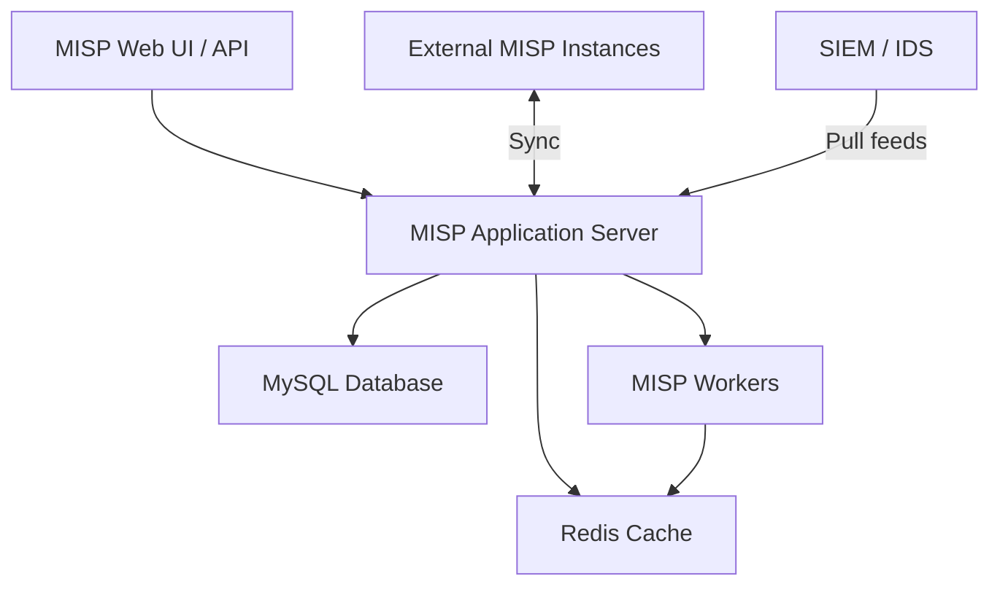

# How to Run MISP in Docker for Threat Intelligence

Author: [nawazdhandala](https://github.com/nawazdhandala)

Tags: docker, misp, threat intelligence, security, IOC, containerization, cybersecurity

Description: Deploy MISP threat intelligence platform in Docker to share, store, and correlate indicators of compromise across your security team.

---

Threat intelligence sharing sits at the heart of modern security operations. MISP (Malware Information Sharing Platform) is the de facto open-source standard for collecting, storing, and distributing indicators of compromise (IOCs) and threat data. Running MISP in Docker cuts the notoriously complicated installation process down to a few commands.

This guide covers deploying MISP with Docker Compose, configuring it for first use, and connecting it to other tools in your security stack.

## Why MISP?

MISP started as a project to share malware indicators between trusted organizations. Over the years it has grown into a full threat intelligence platform that handles structured threat data, galaxies, taxonomies, and automated correlation. Security teams use it to:

- Store and search IOCs like IP addresses, domains, file hashes, and URLs
- Share threat data with partner organizations through synchronization
- Correlate events automatically to find links between incidents
- Feed indicators into SIEMs, firewalls, and IDS systems
- Track campaigns, threat actors, and attack patterns

The platform uses a flexible data model built around events, attributes, and objects. Each event represents a threat or incident and contains attributes (the actual IOCs) grouped into objects for context.

## Prerequisites

You need the following on your host system:

- Docker Engine 20.10+
- Docker Compose v2
- At least 4 GB RAM available for containers
- 30 GB free disk space (MISP databases can grow quickly)

```bash
# Verify Docker is running
docker info --format '{{.ServerVersion}}'
```

## Architecture

MISP requires several supporting services. The Docker deployment includes MySQL for the main database, Redis for caching and job queuing, and the MISP application itself running on Apache with PHP.



## Setting Up the Project

The MISP project maintains an official Docker setup. Clone the repository and configure it for your environment.

```bash
# Clone the official MISP Docker repository
git clone https://github.com/MISP/misp-docker.git
cd misp-docker

# Copy the example environment file
cp template.env .env
```

Edit the `.env` file to set your specific values.

```bash
# .env - Key configuration values for MISP Docker deployment

# Base URL where MISP will be accessible
MISP_BASEURL=https://misp.example.com

# MySQL credentials
MYSQL_ROOT_PASSWORD=change-this-root-password
MYSQL_DATABASE=misp
MYSQL_USER=misp
MYSQL_PASSWORD=change-this-misp-password

# MISP admin email and organization
MISP_ADMIN_EMAIL=admin@example.com
MISP_ADMIN_PASSPHRASE=ChangeMe!SecurePassword123

# GPG key passphrase for signing
MISP_GPG_PASSPHRASE=gpg-secure-passphrase

# Timezone
TIMEZONE=UTC
```

## Docker Compose Configuration

If you want to build a custom compose file instead of using the repository default, here is a complete configuration.

```yaml
# docker-compose.yml - Full MISP stack
version: "3.8"

services:
  misp-db:
    image: mysql:8.0
    container_name: misp-db
    environment:
      MYSQL_ROOT_PASSWORD: ${MYSQL_ROOT_PASSWORD}
      MYSQL_DATABASE: ${MYSQL_DATABASE}
      MYSQL_USER: ${MYSQL_USER}
      MYSQL_PASSWORD: ${MYSQL_PASSWORD}
    volumes:
      # Persist MySQL data between restarts
      - mysql_data:/var/lib/mysql
    networks:
      - misp-net
    restart: unless-stopped
    command: --default-authentication-plugin=mysql_native_password

  misp-redis:
    image: redis:7-alpine
    container_name: misp-redis
    networks:
      - misp-net
    restart: unless-stopped
    # Limit Redis memory usage
    command: redis-server --maxmemory 256mb --maxmemory-policy allkeys-lru

  misp-core:
    image: ghcr.io/misp/misp-docker/misp-core:latest
    container_name: misp-core
    depends_on:
      - misp-db
      - misp-redis
    ports:
      # HTTPS port for web access
      - "443:443"
      # HTTP port (redirects to HTTPS)
      - "80:80"
    environment:
      MISP_BASEURL: ${MISP_BASEURL}
      MYSQL_HOST: misp-db
      MYSQL_PORT: 3306
      MYSQL_DATABASE: ${MYSQL_DATABASE}
      MYSQL_USER: ${MYSQL_USER}
      MYSQL_PASSWORD: ${MYSQL_PASSWORD}
      REDIS_HOST: misp-redis
      MISP_ADMIN_EMAIL: ${MISP_ADMIN_EMAIL}
      MISP_ADMIN_PASSPHRASE: ${MISP_ADMIN_PASSPHRASE}
    volumes:
      # Persist MISP configuration and files
      - misp_config:/var/www/MISP/app/Config
      - misp_files:/var/www/MISP/app/files
      - misp_gpg:/var/www/MISP/.gnupg
    networks:
      - misp-net
    restart: unless-stopped

volumes:
  mysql_data:
  misp_config:
  misp_files:
  misp_gpg:

networks:
  misp-net:
    driver: bridge
```

## Launching MISP

Start the full stack and wait for initialization.

```bash
# Pull the latest images
docker compose pull

# Start all services
docker compose up -d

# Follow the MISP core logs during first startup
docker compose logs -f misp-core
```

The first startup takes several minutes because MISP needs to initialize the database schema, load default taxonomies, and configure the application. Watch the logs until you see Apache reporting it is ready to serve requests.

Once ready, open `https://localhost` in your browser. Accept the self-signed certificate warning. Log in with the admin email and passphrase you configured in the `.env` file.

## Post-Installation Configuration

After logging in, complete these essential setup steps.

**Change the default password** if you used a temporary one. Navigate to Administration, then My Profile, then Change Password.

**Enable default feeds.** MISP ships with a list of community threat intelligence feeds. Enable them from Sync Actions, then Feeds.

```bash
# Enable all default feeds via the API
curl -k -X POST https://localhost/feeds/enableFeed \
  -H "Authorization: YOUR_API_KEY" \
  -H "Content-Type: application/json" \
  -H "Accept: application/json" \
  -d '{"Feed": {"enabled": true}}'
```

**Fetch feed data** to populate your instance with initial threat data.

```bash
# Trigger a feed fetch for all enabled feeds
curl -k -X GET https://localhost/feeds/fetchFromAllFeeds \
  -H "Authorization: YOUR_API_KEY" \
  -H "Accept: application/json"
```

## Working with the MISP API

The API is where MISP really shines for automation. Here are some common operations.

```python
# Python script for interacting with MISP
# Requires: pip install pymisp
from pymisp import PyMISP

# Connect to your MISP instance
misp = PyMISP(
    url="https://localhost",
    key="YOUR_API_KEY",
    ssl=False  # Set True in production with valid certs
)

# Create a new event for a phishing campaign
event = misp.new_event(
    distribution=0,  # Your organization only
    threat_level_id=2,  # Medium
    analysis=1,  # Ongoing
    info="Phishing campaign targeting finance department"
)

# Add IOCs to the event
event_id = event["Event"]["id"]

# Add a malicious URL
misp.add_attribute(event_id, type="url", value="https://evil-phishing-site.example.com")

# Add a sender email
misp.add_attribute(event_id, type="email-src", value="attacker@spoofed-domain.com")

# Add a file hash from the malicious attachment
misp.add_attribute(
    event_id,
    type="sha256",
    value="e3b0c44298fc1c149afbf4c8996fb92427ae41e4649b934ca495991b7852b855"
)

# Search for all events containing a specific IP
results = misp.search(value="192.168.1.100", type_attribute="ip-dst")
print(f"Found {len(results)} matching events")
```

## Setting Up Synchronization

MISP instances can synchronize events with each other. This is how organizations share threat intelligence with trusted partners.

On the remote MISP instance, create a sync user. Then on your local instance, add the remote server.

```bash
# Add a remote MISP server for synchronization
curl -k -X POST https://localhost/servers/add \
  -H "Authorization: YOUR_API_KEY" \
  -H "Content-Type: application/json" \
  -d '{
    "Server": {
      "name": "Partner MISP",
      "url": "https://partner-misp.example.com",
      "authkey": "REMOTE_SYNC_KEY",
      "push": true,
      "pull": true,
      "self_signed": false
    }
  }'
```

## Exporting Data to SIEM Tools

MISP can export IOCs in formats that your SIEM or IDS can consume directly.

```bash
# Export all indicators in CSV format for SIEM ingestion
curl -k -X POST https://localhost/attributes/restSearch \
  -H "Authorization: YOUR_API_KEY" \
  -H "Content-Type: application/json" \
  -d '{
    "returnFormat": "csv",
    "type": ["ip-dst", "domain", "url", "sha256"],
    "published": true,
    "last": "30d"
  }' -o misp_iocs.csv

# Export in Suricata rule format for IDS
curl -k -X POST https://localhost/attributes/restSearch \
  -H "Authorization: YOUR_API_KEY" \
  -H "Content-Type: application/json" \
  -d '{
    "returnFormat": "suricata",
    "published": true,
    "last": "7d"
  }' -o misp_suricata.rules
```

## Maintenance and Backup

Keep your MISP instance healthy with regular maintenance tasks.

```bash
# Back up the MySQL database
docker exec misp-db mysqldump -u root -p"${MYSQL_ROOT_PASSWORD}" misp > misp_backup_$(date +%Y%m%d).sql

# Back up MISP configuration files
docker cp misp-core:/var/www/MISP/app/Config ./misp_config_backup

# Update MISP to the latest version
docker compose pull
docker compose up -d

# Clear the Redis cache if you experience stale data
docker exec misp-redis redis-cli FLUSHALL
```

## Troubleshooting

**MISP workers not running.** Check the worker status and restart them.

```bash
# Check worker status
docker exec misp-core /var/www/MISP/app/Console/cake Admin getSetting workers

# Restart all workers
docker exec misp-core /var/www/MISP/app/Console/cake Admin restartWorkers
```

**Database connection errors.** Verify MySQL is healthy and the credentials match.

```bash
# Test MySQL connection from the MISP container
docker exec misp-core mysql -h misp-db -u misp -p"${MYSQL_PASSWORD}" -e "SELECT 1"
```

## Conclusion

MISP in Docker gives security teams a powerful threat intelligence platform without the headache of managing dependencies on bare metal. The containerized deployment handles the complex stack of MySQL, Redis, and the PHP application in isolated services that you can scale and update independently. Once running, connect it to your SIEM, share intelligence with partners through synchronization, and build automated workflows with the Python API. Your threat intelligence program starts with a single `docker compose up`.
