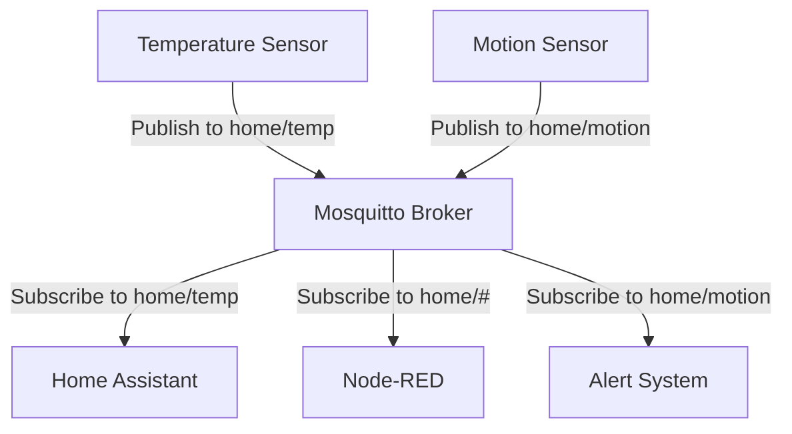

# How to Run Mosquitto MQTT in Docker for IoT

Author: [nawazdhandala](https://github.com/nawazdhandala)

Tags: docker, mosquitto, mqtt, iot, messaging, self-hosted, sensors

Description: Set up Eclipse Mosquitto MQTT broker in Docker to handle messaging between IoT devices, sensors, and automation platforms.

---

MQTT is the standard messaging protocol for IoT devices. It is lightweight, uses minimal bandwidth, and works reliably even on constrained networks. Eclipse Mosquitto is the most widely used open-source MQTT broker, and running it in Docker makes deployment trivial. This guide walks you through setting up Mosquitto with authentication, TLS encryption, and persistent message storage.

## How MQTT Works

MQTT follows a publish-subscribe pattern. Devices publish messages to topics, and other devices subscribe to those topics to receive messages. A broker sits in the middle, routing messages from publishers to subscribers. This decoupled design means devices do not need to know about each other directly.



A sensor publishes a temperature reading to `home/temp`. Any client subscribed to that topic, or a wildcard like `home/#`, receives the message. The broker handles all the routing.

## Prerequisites

- A Linux server with Docker and Docker Compose installed
- At least 256 MB of RAM (Mosquitto is very lightweight)
- IoT devices or clients that speak MQTT
- Optional: a domain name and TLS certificates for encrypted connections

## Project Setup

```bash
# Create directory structure for Mosquitto
mkdir -p ~/mosquitto/{config,data,log}
cd ~/mosquitto
```

## Basic Configuration

Create the Mosquitto configuration file:

```
# config/mosquitto.conf - Mosquitto MQTT Broker Configuration

# Listen on the standard MQTT port on all interfaces
listener 1883

# Enable WebSocket connections on port 9001
listener 9001
protocol websockets

# Persist session and message data to disk
persistence true
persistence_location /mosquitto/data/

# Log to file and stdout
log_dest file /mosquitto/log/mosquitto.log
log_dest stdout
log_type all

# Require authentication (important for security)
allow_anonymous false

# Password file location
password_file /mosquitto/config/passwd
```

## Docker Compose Configuration

```yaml
# docker-compose.yml - Eclipse Mosquitto MQTT Broker
version: "3.8"

services:
  mosquitto:
    image: eclipse-mosquitto:2
    container_name: mosquitto
    restart: unless-stopped
    ports:
      # Standard MQTT port
      - "1883:1883"
      # MQTT over WebSocket
      - "9001:9001"
      # MQTT with TLS (uncomment when TLS is configured)
      # - "8883:8883"
    volumes:
      # Configuration files
      - ./config:/mosquitto/config
      # Persistent message storage
      - ./data:/mosquitto/data
      # Log files
      - ./log:/mosquitto/log
```

## Creating Users and Passwords

Before starting the broker, create a password file. Mosquitto provides a utility for this:

```bash
# Create the password file with the first user
docker run --rm -v ~/mosquitto/config:/mosquitto/config \
  eclipse-mosquitto:2 \
  mosquitto_passwd -c /mosquitto/config/passwd sensor_user

# Add additional users (note: -c flag creates a new file, omit it to append)
docker run --rm -v ~/mosquitto/config:/mosquitto/config \
  eclipse-mosquitto:2 \
  mosquitto_passwd /mosquitto/config/passwd homeassistant

docker run --rm -v ~/mosquitto/config:/mosquitto/config \
  eclipse-mosquitto:2 \
  mosquitto_passwd /mosquitto/config/passwd nodered
```

Each command prompts you for a password. Choose strong, unique passwords for each client.

## Starting Mosquitto

```bash
# Start the Mosquitto broker
docker compose up -d
```

Verify it started cleanly:

```bash
# Check the Mosquitto logs
docker compose logs -f mosquitto
```

You should see a message like "mosquitto version 2.x.x running" followed by "Opening ipv4 listen socket on port 1883."

## Testing the Broker

Install the Mosquitto client tools on your host to test the broker:

```bash
# Install Mosquitto clients (Ubuntu/Debian)
sudo apt install mosquitto-clients
```

Open two terminal windows. In the first, subscribe to a test topic:

```bash
# Subscribe to the test topic with authentication
mosquitto_sub -h localhost -p 1883 \
  -u sensor_user -P your_password \
  -t "test/message" -v
```

In the second terminal, publish a message:

```bash
# Publish a test message
mosquitto_pub -h localhost -p 1883 \
  -u sensor_user -P your_password \
  -t "test/message" \
  -m "Hello from Mosquitto in Docker"
```

The subscriber window should display the message immediately.

## Topic Structure Best Practices

Organize your MQTT topics in a hierarchical structure that makes sense for your environment:

```
# Recommended topic hierarchy for a home IoT setup
home/living_room/temperature
home/living_room/humidity
home/kitchen/motion
home/garage/door/status
home/garage/door/command

# Use 'status' for readings and 'command' for actions
devices/thermostat/status    # Current temperature, mode
devices/thermostat/command   # Set temperature, change mode
```

Use forward slashes to create hierarchy and wildcards for broad subscriptions:

```bash
# Subscribe to all sensors in the living room
mosquitto_sub -t "home/living_room/#" -v

# Subscribe to all temperature readings in the house
mosquitto_sub -t "home/+/temperature" -v
```

The `#` wildcard matches any number of levels. The `+` wildcard matches exactly one level.

## Enabling TLS Encryption

For production deployments, encrypt MQTT traffic with TLS. First, place your certificate files in the config directory:

```bash
# Copy your certificates to the Mosquitto config directory
cp fullchain.pem ~/mosquitto/config/
cp privkey.pem ~/mosquitto/config/
cp ca.pem ~/mosquitto/config/
```

Update the Mosquitto configuration to add a TLS listener:

```
# Add TLS listener to mosquitto.conf
listener 8883
cafile /mosquitto/config/ca.pem
certfile /mosquitto/config/fullchain.pem
keyfile /mosquitto/config/privkey.pem

# Require TLS version 1.2 or higher
tls_version tlsv1.2
```

Uncomment the 8883 port mapping in `docker-compose.yml` and restart:

```bash
# Restart Mosquitto to load TLS configuration
docker compose restart mosquitto
```

Test the encrypted connection:

```bash
# Connect to the TLS-encrypted MQTT port
mosquitto_sub -h your-domain.com -p 8883 \
  --cafile ca.pem \
  -u sensor_user -P your_password \
  -t "test/#" -v
```

## Access Control Lists

Limit which users can publish or subscribe to specific topics by creating an ACL file:

```
# config/acl.conf - Access control rules

# sensor_user can only publish to sensor topics
user sensor_user
topic write home/+/temperature
topic write home/+/humidity
topic write home/+/motion

# homeassistant has full access to everything
user homeassistant
topic readwrite #

# nodered can read all topics and write commands
user nodered
topic read #
topic write devices/+/command
```

Add the ACL file to the Mosquitto configuration:

```
# Add this line to mosquitto.conf
acl_file /mosquitto/config/acl.conf
```

## Retained Messages

MQTT supports retained messages, where the broker stores the last message on a topic and delivers it immediately to new subscribers. This is useful for status topics:

```bash
# Publish a retained message (notice the -r flag)
mosquitto_pub -t "home/thermostat/status" \
  -u sensor_user -P your_password \
  -m '{"temperature": 22.5, "mode": "heat"}' -r
```

New subscribers to that topic will immediately receive the last known state instead of waiting for the next update.

## Monitoring Broker Health

Check active connections and message throughput using the built-in system topics:

```bash
# Subscribe to Mosquitto's internal statistics topics
mosquitto_sub -t '$SYS/#' -v -u homeassistant -P your_password
```

Key metrics include:

- `$SYS/broker/clients/connected` - Number of active connections
- `$SYS/broker/messages/received` - Total messages received
- `$SYS/broker/load/messages/received/1min` - Message rate per minute

## Backup and Maintenance

```bash
# Back up Mosquitto configuration and persistent data
tar czf ~/mosquitto-backup-$(date +%Y%m%d).tar.gz ~/mosquitto/
```

The persistent data in the `data` directory includes retained messages and session information. The password file and ACL file in `config` hold your security settings.

## Monitoring with OneUptime

Monitor your MQTT broker with OneUptime using a TCP port monitor on port 1883. If the broker becomes unreachable, your entire IoT infrastructure loses its communication backbone. Set up alerts so you can restore service quickly when issues arise.

## Wrapping Up

Running Mosquitto in Docker gives you a solid, production-ready MQTT broker for IoT messaging. With authentication, TLS encryption, and access control lists, you can secure device communications properly. The lightweight footprint means even a Raspberry Pi can handle thousands of messages per second, making Mosquitto an excellent choice for home and small-scale industrial IoT deployments.
