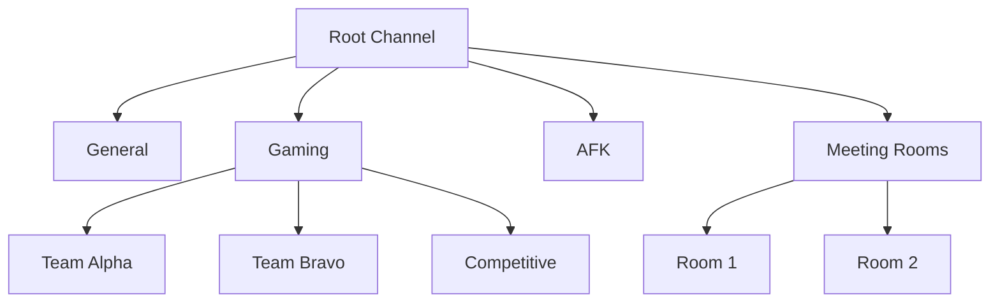

# How to Run Mumble Server in Docker for Voice Chat

Author: [nawazdhandala](https://github.com/nawazdhandala)

Tags: Docker, Mumble, Murmur, Voice Chat, VoIP, Self-Hosted, Gaming

Description: Set up a self-hosted Mumble voice chat server in Docker with low latency audio, channel management, and ACL permissions.

---

Mumble is an open-source, low-latency voice chat application built for gamers, teams, and communities. Its server component, called Murmur (or mumble-server), delivers crystal-clear audio with minimal delay. Unlike Discord or TeamSpeak, Mumble is completely self-hosted, giving you full control over your voice communication infrastructure.

Running Murmur in Docker is the easiest way to get a voice server up and running. This guide covers everything from a basic single-container setup to a production-grade deployment with SSL, access controls, and monitoring.

## Why Mumble?

Mumble uses the Opus codec and a custom low-latency protocol that achieves round-trip times as low as 10-30 milliseconds. That matters for gaming, live collaboration, and any scenario where voice delay is distracting. Mumble also supports positional audio for games, encrypted connections by default, and a fine-grained permission system through Access Control Lists (ACLs).

## Quick Start

The fastest way to get Murmur running is a single Docker command.

```bash
# Start a Murmur server with default settings
# Port 64738 handles both TCP (control) and UDP (voice) traffic
docker run -d \
  --name mumble-server \
  -p 64738:64738/tcp \
  -p 64738:64738/udp \
  -v mumble-data:/data \
  mumblevoip/mumble-server:latest
```

After the container starts, check the logs to find the auto-generated SuperUser password.

```bash
# Retrieve the SuperUser password from the container logs
# You will need this to manage the server through the Mumble client
docker logs mumble-server 2>&1 | grep "SuperUser"
```

## Docker Compose Setup

For a persistent and configurable deployment, use Docker Compose.

```yaml
# docker-compose.yml for Mumble voice server
# Includes persistent data, custom configuration, and resource limits
version: "3.8"

services:
  mumble:
    image: mumblevoip/mumble-server:latest
    container_name: mumble-server
    restart: unless-stopped
    ports:
      - "64738:64738/tcp"   # TCP control channel
      - "64738:64738/udp"   # UDP voice data
    volumes:
      - mumble-data:/data
      - ./murmur.ini:/etc/murmur.ini:ro
    environment:
      - MUMBLE_SUPERUSER_PASSWORD=YourStrongPassword123
    deploy:
      resources:
        limits:
          cpus: "2.0"
          memory: 512M
        reservations:
          cpus: "0.5"
          memory: 128M

volumes:
  mumble-data:
    driver: local
```

## Custom Configuration

Create a murmur.ini file for detailed server settings.

```ini
; murmur.ini - Mumble server configuration
; This file controls all aspects of the Murmur server behavior

; Welcome message shown to users when they connect
welcometext="<br />Welcome to our Mumble server.<br />Please be respectful in all channels.<br />"

; Server port (TCP and UDP)
port=64738

; Maximum number of concurrent users
users=100

; Server password (leave empty for public access)
serverpassword=

; Maximum bandwidth per user in bits per second
; 72000 is suitable for the Opus codec at good quality
bandwidth=72000

; Enable text-to-speech for messages
allowhtml=true

; Log file path inside the container
logfile=/data/murmur.log

; Database path for storing user registrations, channels, and ACLs
database=/data/murmur.sqlite

; SSL certificate paths (optional, Murmur generates self-signed if absent)
; sslCert=/data/cert.pem
; sslKey=/data/key.pem

; Register the server on the public Mumble server list
; registerName=My Mumble Server
; registerUrl=https://mumble.example.com
; registerHostname=mumble.example.com

; Ice interface for remote administration (optional)
; ice="tcp -h 127.0.0.1 -p 6502"

; gRPC interface (Mumble 1.5+)
; grpc="127.0.0.1:50051"

; Enable automatic channel cleanup when empty
autobanAttempts=10
autobanTimeframe=120
autobanTime=300
```

## Setting the SuperUser Password

The SuperUser account has full administrative control over the server. Set it explicitly rather than relying on the auto-generated password.

```bash
# Set a new SuperUser password on the running container
docker exec -it mumble-server murmurd -ini /etc/murmur.ini -supw YourNewPassword

# Alternatively, use the environment variable approach in docker-compose.yml
# MUMBLE_SUPERUSER_PASSWORD=YourStrongPassword123
```

## Channel Structure

Mumble organizes voice communication into a tree of channels. You create and manage channels through the Mumble client when connected as SuperUser, or through the API. Here is a typical channel layout for a gaming community.



## Adding SSL/TLS Certificates

While Murmur generates self-signed certificates automatically, you should use proper certificates for production.

```bash
# Generate certificates using Let's Encrypt with certbot
# Make sure your domain points to the server first
certbot certonly --standalone -d mumble.example.com

# Copy certificates to the Mumble data directory
cp /etc/letsencrypt/live/mumble.example.com/fullchain.pem ./certs/cert.pem
cp /etc/letsencrypt/live/mumble.example.com/privkey.pem ./certs/key.pem
```

Update your Docker Compose to mount the certificates.

```yaml
    volumes:
      - mumble-data:/data
      - ./certs/cert.pem:/data/cert.pem:ro
      - ./certs/key.pem:/data/key.pem:ro
      - ./murmur.ini:/etc/murmur.ini:ro
```

Then enable the certificate paths in murmur.ini by uncommenting the `sslCert` and `sslKey` lines.

## Access Control Lists (ACLs)

Mumble's ACL system controls who can speak, who can enter channels, and who can manage server settings. ACLs are configured per-channel through the Mumble client. Common setups include:

- Password-protected channels for private meetings
- Speak-only restrictions where regular users can listen but not talk
- Temporary channels that users can create and manage themselves
- Admin-only channels restricted to registered users with specific groups

To configure ACLs, right-click a channel in the Mumble client while connected as SuperUser and select "Edit." The ACL tab lets you add rules based on user groups.

## Monitoring Server Health

Keep track of your Mumble server with health checks and log monitoring.

```yaml
    # Health check verifies the TCP control port is responding
    healthcheck:
      test: ["CMD", "nc", "-z", "localhost", "64738"]
      interval: 30s
      timeout: 5s
      retries: 3
      start_period: 10s
```

```bash
# Monitor connected users and server stats from the logs
docker logs -f mumble-server

# Check the number of connected users by examining the log output
docker logs mumble-server 2>&1 | grep -c "Authenticated"

# Monitor container resource usage in real time
docker stats mumble-server
```

## Backup and Restore

Mumble stores all its state in a SQLite database. Regular backups protect your channel structure, user registrations, and ACL configurations.

```bash
# Create a backup of the Mumble database
docker exec mumble-server cp /data/murmur.sqlite /data/murmur-backup-$(date +%Y%m%d).sqlite

# Or copy the database out of the container
docker cp mumble-server:/data/murmur.sqlite ./backups/murmur-$(date +%Y%m%d).sqlite

# Restore from backup by stopping the server and copying the file back
docker stop mumble-server
docker cp ./backups/murmur-20260208.sqlite mumble-server:/data/murmur.sqlite
docker start mumble-server
```

## Running Multiple Virtual Servers

Murmur supports running multiple virtual servers on a single instance, each with its own channel structure and user base.

```ini
; In murmur.ini, enable the Ice or gRPC interface
; Then use the Mumble client or a web admin panel to create virtual servers
ice="tcp -h 127.0.0.1 -p 6502"
```

## Performance Tips

Mumble is lightweight by design. A single-core server with 256 MB of RAM can handle 50-100 concurrent users. For larger deployments, keep these tips in mind. Use the UDP protocol exclusively for voice data by ensuring port 64738/udp is not blocked. Set the bandwidth limit appropriately for your network - 72000 bps per user works well for most scenarios. Place the server geographically close to your users to minimize latency. Monitor the container's CPU usage, as audio encoding is the primary resource consumer.

## Connecting to Your Server

Download the Mumble client from the official website, then add your server. Enter the hostname or IP address, port 64738, and your username. If you set a server password, you will need that too. Once connected, log in as SuperUser to manage channels and permissions.

Mumble in Docker gives you a private, high-quality voice communication platform that you own and control. The low latency and strong encryption make it suitable for gaming communities, remote teams, and anyone who values both performance and privacy.
