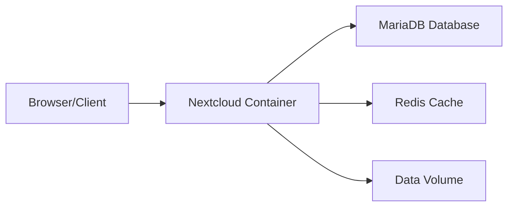

# How to Run Nextcloud in Docker for File Sharing

Author: [nawazdhandala](https://github.com/nawazdhandala)

Tags: docker, nextcloud, file-sharing, self-hosted, cloud-storage, docker-compose

Description: Step-by-step guide to deploying Nextcloud with Docker Compose for self-hosted file sharing, sync, and collaboration.

---

Nextcloud is a self-hosted file sharing and collaboration platform that gives you full control over your data. Think of it as your own private Dropbox or Google Drive, but running on hardware you own. Docker makes Nextcloud deployment repeatable and clean, handling the web server, PHP runtime, and database in isolated containers. This guide covers everything from initial setup to production hardening.

## Why Self-Host File Sharing?

Cloud storage services are convenient, but they come with trade-offs. You pay monthly fees that add up over time, your files live on someone else's servers, and storage limits can be restrictive. Nextcloud eliminates all three problems. You store files on your own hardware, pay nothing beyond electricity, and scale storage by adding drives.

## Prerequisites

You will need:

- A server or VM running Linux with Docker and Docker Compose installed
- At least 2 GB of RAM (4 GB recommended for smooth performance)
- Adequate disk space for your files (an external drive or NAS mount works well)
- A domain name if you plan to access Nextcloud over the internet
- Ports 80 and 443 available on the host

## Architecture Overview

The Nextcloud Docker setup uses three containers working together:



The Nextcloud container handles the web interface and file operations. MariaDB stores metadata, user accounts, and sharing information. Redis provides caching for faster page loads and file locking.

## Project Setup

Create a dedicated directory for the Nextcloud stack:

```bash
# Create project directory with subdirectories for persistent data
mkdir -p ~/nextcloud/{db,data,config}
cd ~/nextcloud
```

## Docker Compose File

This Compose file defines all three services with proper networking and volume mounts:

```yaml
# docker-compose.yml - Full Nextcloud stack with MariaDB and Redis
version: "3.8"

services:
  db:
    image: mariadb:11
    container_name: nextcloud-db
    restart: unless-stopped
    command: --transaction-isolation=READ-COMMITTED --log-bin=binlog --binlog-format=ROW
    environment:
      # Database credentials - change these for production
      MYSQL_ROOT_PASSWORD: rootpassword_change_me
      MYSQL_DATABASE: nextcloud
      MYSQL_USER: nextcloud
      MYSQL_PASSWORD: dbpassword_change_me
    volumes:
      # Persist database files across restarts
      - ./db:/var/lib/mysql
    networks:
      - nextcloud-net

  redis:
    image: redis:7-alpine
    container_name: nextcloud-redis
    restart: unless-stopped
    # Require a password for Redis connections
    command: redis-server --requirepass redis_password_change_me
    networks:
      - nextcloud-net

  app:
    image: nextcloud:stable
    container_name: nextcloud-app
    restart: unless-stopped
    ports:
      # Map port 8080 on the host to port 80 inside the container
      - "8080:80"
    environment:
      # Database connection settings
      MYSQL_HOST: db
      MYSQL_DATABASE: nextcloud
      MYSQL_USER: nextcloud
      MYSQL_PASSWORD: dbpassword_change_me
      # Redis cache configuration
      REDIS_HOST: redis
      REDIS_HOST_PASSWORD: redis_password_change_me
      # Nextcloud admin account created on first run
      NEXTCLOUD_ADMIN_USER: admin
      NEXTCLOUD_ADMIN_PASSWORD: adminpassword_change_me
      # Set your domain or IP address
      NEXTCLOUD_TRUSTED_DOMAINS: "your-domain.com 192.168.1.100"
    volumes:
      # Main data directory where all user files are stored
      - ./data:/var/www/html/data
      # Configuration files
      - ./config:/var/www/html/config
    depends_on:
      - db
      - redis
    networks:
      - nextcloud-net

networks:
  nextcloud-net:
    driver: bridge
```

## Starting the Stack

Launch all three containers:

```bash
# Start the entire Nextcloud stack in detached mode
docker compose up -d
```

Watch the logs to make sure everything initializes correctly:

```bash
# Monitor startup logs across all services
docker compose logs -f
```

The first startup takes a couple of minutes because Nextcloud creates the database schema and configures itself. Once you see "Apache/2" in the logs, the server is ready.

Open your browser and navigate to `http://<your-server-ip>:8080`. You should see the Nextcloud login page. Sign in with the admin credentials you defined in the Compose file.

## Configuring Trusted Domains

If you access Nextcloud from multiple addresses (local IP, domain name, localhost), you need to add each one as a trusted domain. Edit the config file directly:

```bash
# Add additional trusted domains by editing config.php
docker exec -it nextcloud-app bash -c "cat /var/www/html/config/config.php"
```

You can also edit `./config/config.php` on the host and add entries to the `trusted_domains` array:

```php
// Add all domains and IPs you will use to access Nextcloud
'trusted_domains' =>
array (
  0 => '192.168.1.100:8080',
  1 => 'cloud.your-domain.com',
  2 => 'localhost:8080',
),
```

## Setting Up a Reverse Proxy with Nginx

For production use, put Nextcloud behind a reverse proxy with SSL. Install Nginx on the host and create a site configuration:

```nginx
# /etc/nginx/sites-available/nextcloud
server {
    listen 80;
    server_name cloud.your-domain.com;

    # Redirect all HTTP traffic to HTTPS
    return 301 https://$server_name$request_uri;
}

server {
    listen 443 ssl http2;
    server_name cloud.your-domain.com;

    ssl_certificate /etc/letsencrypt/live/cloud.your-domain.com/fullchain.pem;
    ssl_certificate_key /etc/letsencrypt/live/cloud.your-domain.com/privkey.pem;

    # Increase upload size limit to support large files
    client_max_body_size 10G;

    location / {
        proxy_pass http://127.0.0.1:8080;
        proxy_set_header Host $host;
        proxy_set_header X-Real-IP $remote_addr;
        proxy_set_header X-Forwarded-For $proxy_add_x_forwarded_for;
        proxy_set_header X-Forwarded-Proto $scheme;
    }
}
```

After setting up the reverse proxy, tell Nextcloud it is behind one by adding this to `config.php`:

```php
// Tell Nextcloud to trust the reverse proxy
'overwriteprotocol' => 'https',
'overwrite.cli.url' => 'https://cloud.your-domain.com',
'trusted_proxies' => ['127.0.0.1'],
```

## Installing Apps

Nextcloud has a rich app ecosystem. Install apps through the web UI under Apps, or use the command line:

```bash
# Install commonly used Nextcloud apps via the OCC command
docker exec -u www-data nextcloud-app php occ app:install calendar
docker exec -u www-data nextcloud-app php occ app:install contacts
docker exec -u www-data nextcloud-app php occ app:install tasks
docker exec -u www-data nextcloud-app php occ app:install notes
```

## Background Jobs Configuration

Nextcloud needs background tasks to run regularly for maintenance, file scanning, and notifications. The recommended approach uses cron:

```bash
# Add a cron job on the host to trigger Nextcloud background tasks every 5 minutes
(crontab -l 2>/dev/null; echo "*/5 * * * * docker exec -u www-data nextcloud-app php cron.php") | crontab -
```

Then set Nextcloud to use cron for background jobs in Settings > Administration > Basic settings.

## Performance Optimization

Enable APCu memory caching and configure Redis file locking in `config.php`:

```php
// Performance tuning settings for config.php
'memcache.local' => '\OC\Memcache\APCu',
'memcache.distributed' => '\OC\Memcache\Redis',
'memcache.locking' => '\OC\Memcache\Redis',
'redis' => array(
    'host' => 'redis',
    'port' => 6379,
    'password' => 'redis_password_change_me',
),
```

## Backup Strategy

Regular backups are essential. Back up three things: the database, the data directory, and the config directory.

```bash
# Back up the MariaDB database to a SQL file
docker exec nextcloud-db mysqldump -u root -prootpassword_change_me nextcloud > ~/nextcloud-backup/db_$(date +%Y%m%d).sql

# Back up data and config directories
rsync -a ~/nextcloud/data/ ~/nextcloud-backup/data/
rsync -a ~/nextcloud/config/ ~/nextcloud-backup/config/
```

## Updating Nextcloud

When a new version is available, update through Docker:

```bash
# Pull the latest stable image and recreate the container
docker compose pull app
docker compose up -d app
```

After the container restarts, Nextcloud runs its database migration automatically. Check the admin panel for any additional upgrade steps.

## Monitoring with OneUptime

Keep tabs on your Nextcloud instance by setting up OneUptime monitors. Create an HTTP monitor for the login page and set alerts for response time thresholds. If your file sharing platform goes down, you want to know before your users do.

## Wrapping Up

Nextcloud in Docker gives you a fully featured file sharing platform that rivals commercial cloud storage. With MariaDB for reliable data storage and Redis for caching, the stack performs well even with multiple users. The Docker approach means upgrades are smooth, backups are straightforward, and you can tear down and rebuild the entire setup from the Compose file alone.
