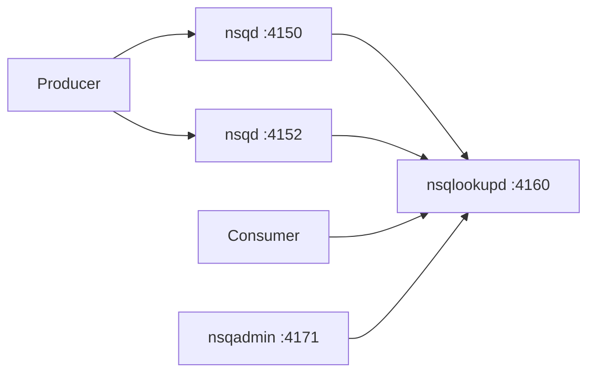

# How to Run NSQ Message Queue in Docker

Author: [nawazdhandala](https://github.com/nawazdhandala)

Tags: Docker, NSQ, Message Queues, Distributed Systems, DevOps, Golang

Description: Deploy the NSQ real-time distributed messaging platform in Docker with producers, consumers, and the NSQ admin web interface.

---

NSQ is a real-time distributed messaging platform built by the team at Bitly. It was designed for scale and operational simplicity. Unlike brokerless systems, NSQ has no single point of failure and no complex broker configuration. Messages are delivered in a push-based model, which means consumers receive messages as soon as they arrive rather than polling for them.

NSQ is written in Go, deploys as a set of small binaries, and has virtually no external dependencies. Running it in Docker gives you a complete messaging system in seconds.

## NSQ Components

NSQ has three main components:

- **nsqd** - The daemon that receives, queues, and delivers messages to consumers. Each nsqd instance is independent and can run standalone.
- **nsqlookupd** - The discovery service that helps consumers find which nsqd instances have the topics they want. Think of it as DNS for NSQ.
- **nsqadmin** - A web UI for monitoring and managing NSQ clusters in real-time.



## Quick Start

Run all three NSQ components:

```bash
# Create a network for NSQ components to communicate
docker network create nsq-net

# Start nsqlookupd - the discovery service
docker run -d \
  --name nsqlookupd \
  --network nsq-net \
  -p 4160:4160 \
  -p 4161:4161 \
  nsqio/nsq /nsqlookupd

# Start nsqd - the message daemon
docker run -d \
  --name nsqd \
  --network nsq-net \
  -p 4150:4150 \
  -p 4151:4151 \
  nsqio/nsq /nsqd \
    --lookupd-tcp-address=nsqlookupd:4160 \
    --broadcast-address=nsqd

# Start nsqadmin - the web UI
docker run -d \
  --name nsqadmin \
  --network nsq-net \
  -p 4171:4171 \
  nsqio/nsq /nsqadmin \
    --lookupd-http-address=nsqlookupd:4161
```

Open `http://localhost:4171` to access the NSQ Admin dashboard.

## Docker Compose Setup

The Docker Compose approach is cleaner and easier to manage:

```yaml
# docker-compose.yml - Complete NSQ messaging platform
version: "3.8"

services:
  nsqlookupd:
    image: nsqio/nsq
    command: /nsqlookupd
    ports:
      # TCP port for nsqd registration
      - "4160:4160"
      # HTTP port for consumer discovery and admin queries
      - "4161:4161"
    restart: unless-stopped

  nsqd:
    image: nsqio/nsq
    command: >
      /nsqd
        --lookupd-tcp-address=nsqlookupd:4160
        --broadcast-address=nsqd
        --data-path=/data
        --mem-queue-size=10000
        --max-msg-size=1048576
    ports:
      # TCP port for producers and consumers
      - "4150:4150"
      # HTTP port for the nsqd API
      - "4151:4151"
    volumes:
      # Persist message data to disk
      - nsqd_data:/data
    depends_on:
      - nsqlookupd
    restart: unless-stopped

  nsqadmin:
    image: nsqio/nsq
    command: /nsqadmin --lookupd-http-address=nsqlookupd:4161
    ports:
      # Web UI
      - "4171:4171"
    depends_on:
      - nsqlookupd
    restart: unless-stopped

volumes:
  nsqd_data:
```

Start the complete stack:

```bash
# Launch all NSQ components
docker compose up -d

# Verify all services are healthy
docker compose ps
```

## Publishing Messages

NSQ supports message publishing over both TCP and HTTP. The HTTP API is great for testing:

```bash
# Publish a single message to a topic using the HTTP API
curl -d "Hello NSQ" http://localhost:4151/pub?topic=test-topic

# Publish multiple messages at once (one per line)
curl -d "message1
message2
message3" http://localhost:4151/mpub?topic=test-topic

# Publish a JSON message
curl -d '{"event": "user_signup", "user_id": "abc123", "timestamp": 1707350400}' \
  http://localhost:4151/pub?topic=events
```

## Consuming Messages

NSQ delivers messages to channels. Each channel receives a copy of every message on a topic. Multiple consumers on the same channel share the workload (competing consumers pattern).

Use the `nsq_tail` utility to consume messages for testing:

```bash
# Consume messages from the test-topic in real time
docker exec nsqd /nsq_tail \
  --lookupd-http-address=nsqlookupd:4161 \
  --topic=test-topic \
  --channel=tail

# Consume from a specific nsqd instance directly
docker exec nsqd /nsq_tail \
  --nsqd-tcp-address=localhost:4150 \
  --topic=test-topic \
  --channel=debug
```

## Go Producer and Consumer

NSQ is written in Go, and the Go client is the most mature:

```go
// producer.go - NSQ message producer
package main

import (
    "encoding/json"
    "fmt"
    "log"
    "time"

    "github.com/nsqio/go-nsq"
)

type Event struct {
    Type      string    `json:"type"`
    UserID    string    `json:"user_id"`
    Timestamp time.Time `json:"timestamp"`
}

func main() {
    // Create a producer connected to nsqd
    producer, err := nsq.NewProducer("localhost:4150", nsq.NewConfig())
    if err != nil {
        log.Fatal(err)
    }
    defer producer.Stop()

    // Publish 100 events
    for i := 0; i < 100; i++ {
        event := Event{
            Type:      "page_view",
            UserID:    fmt.Sprintf("user-%d", i),
            Timestamp: time.Now(),
        }

        body, _ := json.Marshal(event)
        err := producer.Publish("events", body)
        if err != nil {
            log.Printf("Error publishing: %v", err)
            continue
        }
        fmt.Printf("Published event for user-%d\n", i)
    }
}
```

```go
// consumer.go - NSQ message consumer
package main

import (
    "encoding/json"
    "fmt"
    "log"
    "os"
    "os/signal"
    "syscall"

    "github.com/nsqio/go-nsq"
)

// MessageHandler processes incoming NSQ messages
type MessageHandler struct{}

func (h *MessageHandler) HandleMessage(m *nsq.Message) error {
    var event map[string]interface{}
    if err := json.Unmarshal(m.Body, &event); err != nil {
        log.Printf("Error parsing message: %v", err)
        return err
    }

    fmt.Printf("Processed event: type=%s user=%s\n",
        event["type"], event["user_id"])

    // Return nil to acknowledge the message
    // Return an error to trigger requeue
    return nil
}

func main() {
    config := nsq.NewConfig()
    config.MaxInFlight = 10 // Process up to 10 messages concurrently

    // Create a consumer for the "events" topic on the "processor" channel
    consumer, err := nsq.NewConsumer("events", "processor", config)
    if err != nil {
        log.Fatal(err)
    }

    // Add the message handler with 3 concurrent goroutines
    consumer.AddConcurrentHandlers(&MessageHandler{}, 3)

    // Connect through nsqlookupd for automatic topic discovery
    err = consumer.ConnectToNSQLookupd("localhost:4161")
    if err != nil {
        log.Fatal(err)
    }

    // Wait for interrupt signal to gracefully shut down
    sigChan := make(chan os.Signal, 1)
    signal.Notify(sigChan, syscall.SIGINT, syscall.SIGTERM)
    <-sigChan

    consumer.Stop()
}
```

## Python Consumer

```python
# consumer.py - NSQ consumer in Python using gnsq
import gnsq
import json

def handler(consumer, message):
    """Process each incoming NSQ message."""
    data = json.loads(message.body.decode('utf-8'))
    print(f"Received: {data}")
    return True  # Returning True acknowledges the message

# Create a consumer connected through nsqlookupd
consumer = gnsq.Consumer(
    topic='events',
    channel='python-processor',
    lookupd_http_addresses=['http://localhost:4161'],
    max_in_flight=5
)

consumer.on_message.connect(handler)
consumer.start()
```

## Scaling with Multiple nsqd Instances

For higher throughput, run multiple nsqd instances:

```yaml
# docker-compose-scaled.yml - NSQ with multiple nsqd nodes
version: "3.8"

services:
  nsqlookupd:
    image: nsqio/nsq
    command: /nsqlookupd
    ports:
      - "4160:4160"
      - "4161:4161"

  nsqd-1:
    image: nsqio/nsq
    command: >
      /nsqd
        --lookupd-tcp-address=nsqlookupd:4160
        --broadcast-address=nsqd-1
        --data-path=/data
    ports:
      - "4150:4150"
    volumes:
      - nsqd1_data:/data
    depends_on:
      - nsqlookupd

  nsqd-2:
    image: nsqio/nsq
    command: >
      /nsqd
        --lookupd-tcp-address=nsqlookupd:4160
        --broadcast-address=nsqd-2
        --data-path=/data
    ports:
      - "4152:4150"
    volumes:
      - nsqd2_data:/data
    depends_on:
      - nsqlookupd

  nsqadmin:
    image: nsqio/nsq
    command: /nsqadmin --lookupd-http-address=nsqlookupd:4161
    ports:
      - "4171:4171"
    depends_on:
      - nsqlookupd

volumes:
  nsqd1_data:
  nsqd2_data:
```

## Monitoring and Management

```bash
# View topic and channel statistics
curl -s http://localhost:4151/stats | python3 -m json.tool

# Check which nsqd nodes are registered with nsqlookupd
curl -s http://localhost:4161/nodes | python3 -m json.tool

# View all known topics
curl -s http://localhost:4161/topics | python3 -m json.tool

# Empty a channel (discard all messages)
curl -X POST "http://localhost:4151/channel/empty?topic=test-topic&channel=tail"

# Pause a channel (stop message delivery)
curl -X POST "http://localhost:4151/channel/pause?topic=test-topic&channel=processor"

# Delete a topic entirely
curl -X POST "http://localhost:4151/topic/delete?topic=old-topic"
```

## Summary

NSQ provides a simple, decentralized messaging solution that scales horizontally by adding more nsqd instances. There is no complex configuration, no leader election, and no replication to worry about. Each nsqd handles its own messages independently, while nsqlookupd provides the discovery layer that ties everything together. The Docker Compose setup gives you a full NSQ cluster in seconds, and the HTTP API makes it trivial to publish messages from any language or tool. NSQ is an excellent choice when you need reliable messaging without the operational complexity of heavier systems like Kafka or RabbitMQ.
