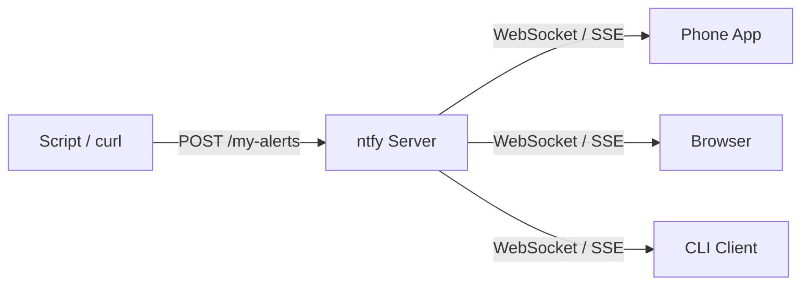

# How to Run ntfy in Docker for Push Notifications

Author: [nawazdhandala](https://github.com/nawazdhandala)

Tags: Docker, ntfy, Push Notifications, Self-Hosted, Alerts, Docker Compose, DevOps

Description: Set up ntfy in Docker as a self-hosted push notification service with HTTP-based pub/sub and mobile app support.

---

ntfy (pronounced "notify") is a simple, HTTP-based pub/sub notification service. You publish a message to a topic using a plain HTTP request, and anyone subscribed to that topic receives it instantly. No accounts, no API keys, no complex configuration. This simplicity makes ntfy extremely versatile for scripts, cron jobs, CI/CD pipelines, and monitoring alerts.

While ntfy.sh offers a free hosted version, running your own instance in Docker gives you full control over your data, no rate limits, and the ability to work entirely offline. This guide walks through deploying ntfy in Docker, configuring it for production, and integrating it with your workflows.

## How ntfy Works

The concept is beautifully simple. You pick a topic name (essentially a URL path), POST a message to it, and anyone subscribed to that topic gets the message. Topics are created on the fly, no setup required.



## Prerequisites

Docker and Docker Compose are all you need. ntfy uses minimal resources, around 20-50 MB of RAM, making it suitable for even the smallest server.

```bash
# Check that Docker is installed
docker --version
docker compose version
```

## Quick Start

Send your first notification in three commands.

```bash
# Start ntfy with a single command
docker run -d \
  --name ntfy \
  -p 2586:80 \
  -v ntfy-cache:/var/cache/ntfy \
  -v ntfy-etc:/etc/ntfy \
  binwiederhier/ntfy serve

# Send a test notification
curl -d "Hello from Docker" http://localhost:2586/test-topic

# Subscribe to the topic in another terminal (will print messages as they arrive)
curl -s http://localhost:2586/test-topic/sse
```

That is the entire workflow. No authentication setup, no token generation, no application registration.

## Production Setup with Docker Compose

For a persistent, configurable deployment, use Docker Compose with a proper configuration file.

```yaml
# docker-compose.yml - ntfy push notification server
version: "3.8"

services:
  ntfy:
    image: binwiederhier/ntfy:latest
    container_name: ntfy
    restart: unless-stopped
    command: serve
    ports:
      - "2586:80"
    volumes:
      # Cache for message persistence
      - ntfy-cache:/var/cache/ntfy
      # Configuration directory
      - ./server.yml:/etc/ntfy/server.yml:ro
      # User database for authentication
      - ntfy-auth:/var/lib/ntfy
    environment:
      TZ: America/New_York
    healthcheck:
      test: ["CMD", "wget", "-q", "--spider", "http://localhost:80/v1/health"]
      interval: 30s
      timeout: 5s
      retries: 3
    deploy:
      resources:
        limits:
          memory: 256M

volumes:
  ntfy-cache:
  ntfy-auth:
```

Create the server configuration file.

```yaml
# server.yml - ntfy server configuration

# Base URL for the server (used in email notifications and web app)
base-url: "https://ntfy.yourdomain.com"

# Cache messages for 24 hours so late subscribers can catch up
cache-duration: "24h"

# Store cached messages in a SQLite database
cache-file: "/var/cache/ntfy/cache.db"

# Enable the web UI
enable-web: true

# Attachment settings
attachment-cache-dir: "/var/cache/ntfy/attachments"
attachment-total-size-limit: "1G"
attachment-file-size-limit: "50M"
attachment-expiry-duration: "24h"

# Rate limiting per IP
visitor-request-limit-burst: 60
visitor-request-limit-replenish: "5s"
```

Start the service.

```bash
# Launch ntfy
docker compose up -d

# Verify it is running
docker compose logs ntfy
```

## Adding Authentication

By default, ntfy topics are open to anyone who knows the topic name. For a private server, enable authentication.

```yaml
# Add to server.yml
auth-file: "/var/lib/ntfy/user.db"
auth-default-access: "deny-all"
```

Then create users and set permissions.

```bash
# Create an admin user
docker exec -it ntfy ntfy user add --role=admin admin

# Create a regular user
docker exec -it ntfy ntfy user add alerts-user

# Grant access to specific topics
docker exec -it ntfy ntfy access alerts-user "server-*" write
docker exec -it ntfy ntfy access alerts-user "server-*" read

# Grant read access to everyone for public topics (optional)
docker exec -it ntfy ntfy access everyone "public-*" read
```

When authentication is enabled, include credentials in your requests.

```bash
# Send a notification with authentication
curl -u alerts-user:password \
  -d "Server backup completed successfully" \
  http://localhost:2586/server-backups
```

## Sending Notifications from Scripts

ntfy is designed for simplicity. Here are several ways to send messages.

```bash
# Simple message with just a body
curl -d "Deployment finished" http://localhost:2586/deployments

# Message with a title and priority
curl \
  -H "Title: Disk Space Warning" \
  -H "Priority: high" \
  -H "Tags: warning,disk" \
  -d "Server storage at 92% capacity" \
  http://localhost:2586/server-alerts

# Message with a click action (opens a URL when tapped)
curl \
  -H "Title: Build Failed" \
  -H "Click: https://ci.example.com/builds/1234" \
  -H "Tags: x,build" \
  -d "Pipeline #1234 failed at the test stage" \
  http://localhost:2586/ci-alerts

# Message with an attachment
curl \
  -H "Filename: report.pdf" \
  -H "Title: Monthly Report" \
  -T /path/to/report.pdf \
  http://localhost:2586/reports
```

## Using ntfy with Cron Jobs

A common pattern is to notify on cron job success or failure.

```bash
#!/bin/bash
# backup-with-notify.sh - Database backup with ntfy notification

NTFY_URL="http://localhost:2586/server-backups"
BACKUP_FILE="/backups/db-$(date +%Y%m%d).sql.gz"

# Run the backup and capture the result
if pg_dump production_db | gzip > "$BACKUP_FILE" 2>/tmp/backup-error.log; then
    SIZE=$(du -h "$BACKUP_FILE" | cut -f1)
    curl -s \
        -H "Title: Backup Success" \
        -H "Tags: white_check_mark" \
        -d "Database backup completed. Size: $SIZE" \
        "$NTFY_URL"
else
    ERROR=$(cat /tmp/backup-error.log)
    curl -s \
        -H "Title: Backup FAILED" \
        -H "Priority: urgent" \
        -H "Tags: rotating_light" \
        -d "Database backup failed: $ERROR" \
        "$NTFY_URL"
fi
```

## Subscribing on Your Phone

ntfy has official apps for both Android (F-Droid and Google Play) and iOS (App Store).

1. Install the ntfy app on your phone
2. Open the app and go to Settings
3. Set the default server to your self-hosted URL (e.g., https://ntfy.yourdomain.com)
4. Add your credentials if authentication is enabled
5. Subscribe to topics by tapping the + button

The app maintains a persistent connection and delivers notifications in real time, similar to any other push notification.

## Subscribing from the Command Line

For server-side automation, you can subscribe to topics and process messages programmatically.

```bash
# Subscribe to a topic and print messages as they arrive (Server-Sent Events)
curl -s http://localhost:2586/server-alerts/sse

# Subscribe with JSON output for easier parsing
curl -s http://localhost:2586/server-alerts/json | while read -r line; do
    title=$(echo "$line" | jq -r '.title // "No title"')
    message=$(echo "$line" | jq -r '.message')
    echo "[$title] $message"
done
```

## Putting ntfy Behind a Reverse Proxy

For HTTPS access, put ntfy behind your reverse proxy. The WebSocket and SSE connections need proper proxy configuration.

```yaml
# Traefik labels for ntfy
labels:
  - "traefik.enable=true"
  - "traefik.http.routers.ntfy.rule=Host(`ntfy.yourdomain.com`)"
  - "traefik.http.routers.ntfy.entrypoints=websecure"
  - "traefik.http.routers.ntfy.tls.certresolver=letsencrypt"
  - "traefik.http.services.ntfy.loadbalancer.server.port=80"
```

For Nginx:

```nginx
# Nginx config for ntfy with WebSocket and long-polling support
server {
    listen 443 ssl;
    server_name ntfy.yourdomain.com;

    location / {
        proxy_pass http://localhost:2586;
        proxy_set_header Host $host;
        proxy_set_header X-Real-IP $remote_addr;
        proxy_set_header X-Forwarded-For $proxy_add_x_forwarded_for;

        # Required for WebSocket connections
        proxy_set_header Upgrade $http_upgrade;
        proxy_set_header Connection "upgrade";

        # Allow long-polling connections to stay open
        proxy_read_timeout 1800s;
    }
}
```

## Integration with Monitoring Tools

ntfy integrates with several monitoring and automation tools out of the box. For OneUptime or similar monitoring platforms, use a webhook to POST to ntfy when an alert fires.

```bash
# Example webhook payload from a monitoring tool
curl \
  -H "Title: Alert: High CPU Usage" \
  -H "Priority: high" \
  -H "Tags: warning,cpu" \
  -d "CPU usage on web-server-01 exceeded 95% for 5 minutes" \
  http://localhost:2586/monitoring-alerts
```

## Summary

ntfy stands out for its radical simplicity. There is no complex setup, no API key management, and no client libraries to install. Any tool that can make an HTTP request can send notifications, and the mobile apps deliver them to your pocket in real time. Running it in Docker keeps the deployment clean, and adding authentication ensures your topics stay private. For teams and home labs alike, ntfy is one of the easiest self-hosted services you can deploy.
