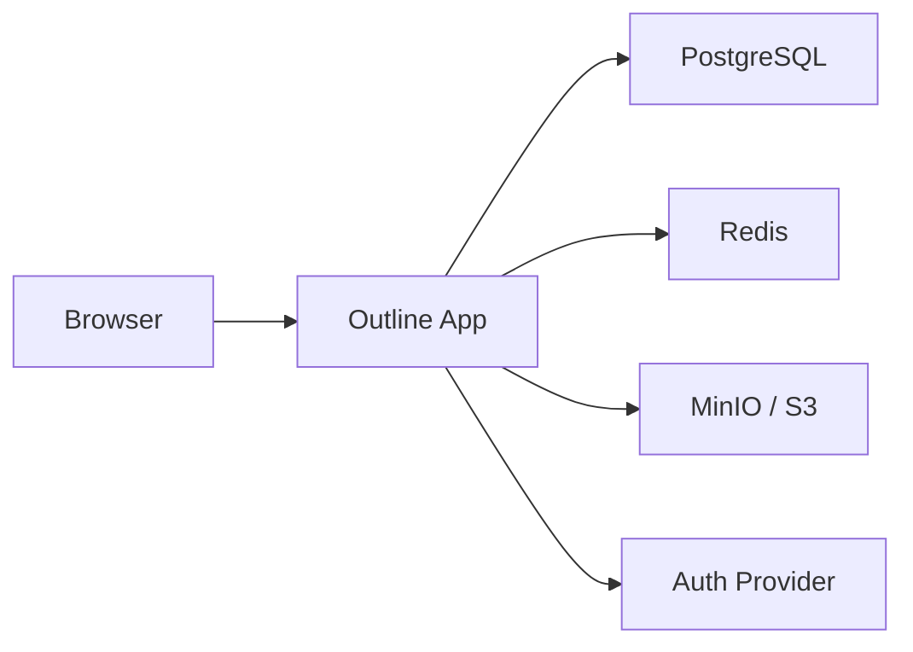

# How to Run Outline in Docker for Team Wiki

Author: [nawazdhandala](https://github.com/nawazdhandala)

Tags: docker, outline, wiki, team-collaboration, self-hosted, documentation

Description: Deploy Outline wiki in Docker for a fast, beautiful team knowledge base with real-time collaboration and Slack integration.

---

Outline is a modern team wiki and knowledge base that emphasizes speed, beautiful design, and real-time collaboration. If you have used Notion or Slite, Outline provides a similar experience but on your own infrastructure. It supports Markdown editing, nested document collections, and integrations with Slack, Google, and other services. Running Outline in Docker requires a few supporting services, but the result is a polished documentation platform your team will actually want to use.

## Why Outline?

Many wiki tools feel clunky or outdated. Outline was built with a modern web application mindset. Pages load instantly, the editor is responsive and supports Markdown shortcuts, and multiple people can edit the same document simultaneously. The search is fast and searches through document content, not just titles. Collections keep documents organized without forcing a rigid hierarchy.

## Prerequisites

- A Linux server with Docker and Docker Compose installed
- At least 2 GB of RAM
- A domain name with SSL (required for authentication)
- An authentication provider (Google, Slack, OIDC, or SAML)
- An S3-compatible storage bucket for file uploads (MinIO works for self-hosted)

Outline requires an external authentication provider. It does not have built-in username/password login. This is by design for security, but it means you need to set up OAuth before getting started.

## Architecture Overview



Outline needs PostgreSQL for data storage, Redis for caching and real-time features, and S3-compatible storage for file uploads.

## Project Setup

```bash
# Create the Outline project directory
mkdir -p ~/outline/{db,redis,minio-data}
cd ~/outline
```

## Setting Up Authentication

Before writing the Docker Compose file, you need OAuth credentials. Here is how to set up Slack authentication (the most common choice):

1. Go to https://api.slack.com/apps and create a new app
2. Under OAuth & Permissions, add the redirect URL: `https://wiki.your-domain.com/auth/slack.callback`
3. Add the required scopes: `identity.basic`, `identity.email`, `identity.avatar`, `identity.team`
4. Note the Client ID and Client Secret

For Google authentication:

1. Go to the Google Cloud Console and create OAuth credentials
2. Set the redirect URI to `https://wiki.your-domain.com/auth/google.callback`
3. Note the Client ID and Client Secret

## Generating Secret Keys

Outline needs two random secret keys. Generate them:

```bash
# Generate the secret key and utils secret
openssl rand -hex 32
openssl rand -hex 32
```

Save both values for the Compose file.

## Docker Compose Configuration

```yaml
# docker-compose.yml - Outline Team Wiki
version: "3.8"

services:
  db:
    image: postgres:16-alpine
    container_name: outline-db
    restart: unless-stopped
    environment:
      POSTGRES_DB: outline
      POSTGRES_USER: outline
      POSTGRES_PASSWORD: db_password_change_me
    volumes:
      - ./db:/var/lib/postgresql/data
    networks:
      - outline-net

  redis:
    image: redis:7-alpine
    container_name: outline-redis
    restart: unless-stopped
    networks:
      - outline-net

  minio:
    image: minio/minio:latest
    container_name: outline-minio
    restart: unless-stopped
    command: server /data --console-address ":9001"
    environment:
      MINIO_ROOT_USER: outline_minio
      MINIO_ROOT_PASSWORD: minio_password_change_me
    volumes:
      - ./minio-data:/data
    ports:
      - "9000:9000"
      - "9001:9001"
    networks:
      - outline-net

  outline:
    image: outlinewiki/outline:latest
    container_name: outline
    restart: unless-stopped
    depends_on:
      - db
      - redis
      - minio
    ports:
      - "3000:3000"
    environment:
      # Application secrets (generated with openssl rand -hex 32)
      SECRET_KEY: your_generated_secret_key_here
      UTILS_SECRET: your_generated_utils_secret_here

      # Database
      DATABASE_URL: postgres://outline:db_password_change_me@db:5432/outline
      PGSSLMODE: disable

      # Redis
      REDIS_URL: redis://redis:6379

      # Application URL
      URL: https://wiki.your-domain.com
      PORT: 3000

      # File storage (MinIO / S3)
      AWS_ACCESS_KEY_ID: outline_minio
      AWS_SECRET_ACCESS_KEY: minio_password_change_me
      AWS_REGION: us-east-1
      AWS_S3_UPLOAD_BUCKET_URL: http://minio:9000
      AWS_S3_UPLOAD_BUCKET_NAME: outline
      AWS_S3_FORCE_PATH_STYLE: "true"
      AWS_S3_ACL: private

      # Slack authentication (replace with your credentials)
      SLACK_CLIENT_ID: your_slack_client_id
      SLACK_CLIENT_SECRET: your_slack_client_secret

      # Or use Google authentication instead
      # GOOGLE_CLIENT_ID: your_google_client_id
      # GOOGLE_CLIENT_SECRET: your_google_client_secret

      # Force HTTPS
      FORCE_HTTPS: "true"

      # Enable websockets for real-time collaboration
      ENABLE_UPDATES: "true"
    networks:
      - outline-net

networks:
  outline-net:
    driver: bridge
```

## Creating the MinIO Bucket

Before starting Outline, create the storage bucket in MinIO:

```bash
# Start MinIO first
docker compose up -d minio

# Wait for MinIO to be ready
sleep 5

# Create the outline bucket using the MinIO client
docker run --rm --network outline-net \
  --entrypoint /bin/sh minio/mc -c \
  "mc alias set local http://minio:9000 outline_minio minio_password_change_me && \
   mc mb local/outline && \
   mc anonymous set download local/outline"
```

## Starting Outline

```bash
# Start all services
docker compose up -d
```

Watch the logs for the database migration:

```bash
# Monitor the startup and database migration
docker compose logs -f outline
```

Outline runs database migrations automatically on first start. Once you see "Listening on http://0.0.0.0:3000," the application is ready.

## Setting Up the Reverse Proxy

Outline requires HTTPS. Set up Nginx as a reverse proxy:

```nginx
# /etc/nginx/sites-available/outline
server {
    listen 443 ssl http2;
    server_name wiki.your-domain.com;

    ssl_certificate /etc/letsencrypt/live/wiki.your-domain.com/fullchain.pem;
    ssl_certificate_key /etc/letsencrypt/live/wiki.your-domain.com/privkey.pem;

    location / {
        proxy_pass http://127.0.0.1:3000;
        proxy_set_header Host $host;
        proxy_set_header X-Real-IP $remote_addr;
        proxy_set_header X-Forwarded-For $proxy_add_x_forwarded_for;
        proxy_set_header X-Forwarded-Proto $scheme;

        # WebSocket support for real-time collaboration
        proxy_http_version 1.1;
        proxy_set_header Upgrade $http_upgrade;
        proxy_set_header Connection "upgrade";
    }
}
```

## First Login

Navigate to `https://wiki.your-domain.com` and click "Continue with Slack" (or Google, depending on your config). Authenticate with your workspace, and Outline creates your account. The first user to log in becomes the admin.

## Organizing Content

Outline uses collections to organize documents:

- **Collections** are top-level containers (like "Engineering," "Product," "Company")
- **Documents** live inside collections and can be nested within each other
- **Templates** provide starting points for common document types

Create a collection by clicking "New collection" in the sidebar. Then create documents inside it. Drag and drop documents to reorder or nest them.

## Real-Time Collaboration

Multiple users can edit the same document simultaneously. Changes appear in real time, similar to Google Docs. Each user's cursor is visible with their name, so you can see who is editing what.

## Slash Commands

The Outline editor supports slash commands for quick formatting. Type `/` anywhere in a document to see available options:

- `/heading` - Insert a heading
- `/table` - Create a table
- `/code` - Insert a code block
- `/image` - Upload an image
- `/embed` - Embed external content
- `/math` - Insert a LaTeX math formula

## API and Integrations

Outline has a comprehensive API. Generate an API key in Settings > API:

```bash
# List all documents via the API
curl -X POST "https://wiki.your-domain.com/api/documents.list" \
  -H "Authorization: Bearer YOUR_API_TOKEN" \
  -H "Content-Type: application/json" \
  -d '{"limit": 25}'
```

## Backup Strategy

```bash
# Dump the PostgreSQL database
docker exec outline-db pg_dump -U outline outline > ~/outline-backup/db_$(date +%Y%m%d).sql

# Back up MinIO file storage
tar czf ~/outline-backup/minio_$(date +%Y%m%d).tar.gz ~/outline/minio-data/
```

## Updating Outline

```bash
# Pull the latest image and restart
docker compose pull outline
docker compose up -d outline
```

## Monitoring with OneUptime

Monitor your Outline instance with OneUptime. A team wiki is most critical during incidents and onboarding, exactly the times when you cannot afford downtime. Set up HTTP monitoring and configure alerts for immediate notification.

## Wrapping Up

Outline in Docker provides a beautiful, fast team wiki that people genuinely enjoy using. The real-time collaboration, Markdown editing, and clean organization make it a strong alternative to Notion for teams that want to self-host. While the initial setup is more involved than simpler wiki tools, the end result is worth the effort.
