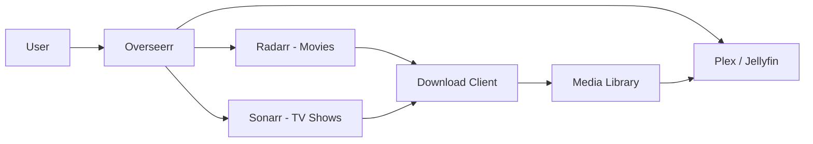

# How to Run Overseerr in Docker for Media Requests

Author: [nawazdhandala](https://github.com/nawazdhandala)

Tags: docker, overseerr, plex, media-server, self-hosted, media-management

Description: Deploy Overseerr in Docker to let users request movies and TV shows that automatically get added to your media server library.

---

Overseerr is a request management tool for media servers like Plex and Jellyfin. It provides a beautiful interface where your users (family, friends, roommates) can browse, discover, and request movies and TV shows. Those requests then flow automatically to download managers like Radarr and Sonarr, which handle fetching the media. Think of it as a self-service portal for your media library.

## Why Overseerr?

Without Overseerr, managing media requests usually means getting text messages from friends asking you to add shows to your Plex server. You then manually search for the content, add it to Radarr or Sonarr, and wait for it to download. Overseerr automates this entire workflow. Users browse a Netflix-like interface, click "Request," and the media appears in your library without you lifting a finger.

## Architecture



Overseerr integrates with your existing media stack. It checks Plex or Jellyfin to see what you already have, connects to Radarr and Sonarr to fulfill requests, and provides users with status updates on their requests.

## Prerequisites

- A Linux server with Docker and Docker Compose installed
- A working Plex or Jellyfin media server
- Radarr installed and configured for movies
- Sonarr installed and configured for TV shows
- At least 512 MB of RAM

## Project Setup

```bash
# Create the Overseerr project directory
mkdir -p ~/overseerr/config
cd ~/overseerr
```

## Docker Compose Configuration

```yaml
# docker-compose.yml - Overseerr Media Request Manager
version: "3.8"

services:
  overseerr:
    image: lscr.io/linuxserver/overseerr:latest
    container_name: overseerr
    restart: unless-stopped
    ports:
      # Web UI
      - "5055:5055"
    environment:
      - PUID=1000
      - PGID=1000
      - TZ=America/New_York
    volumes:
      # Persist configuration and database
      - ./config:/config
```

## Starting Overseerr

```bash
# Start Overseerr in detached mode
docker compose up -d
```

Check the logs:

```bash
# Verify clean startup
docker compose logs -f overseerr
```

Open `http://<your-server-ip>:5055` in your browser. The setup wizard begins automatically.

## Initial Setup - Plex Integration

The first step connects Overseerr to your Plex account:

1. Click "Sign In with Plex" and authenticate with your Plex account
2. Overseerr shows your Plex server. Select it.
3. Choose which libraries to sync (Movies, TV Shows)
4. Click "Start Sync" to import your existing library

The library sync tells Overseerr what you already have, so users will not request content that is already available.

## Configuring Radarr (Movies)

Connect Overseerr to Radarr for automatic movie requests:

1. Go to Settings > Services
2. Click "Add Radarr Server"
3. Fill in the connection details:

```
Server Name: Radarr
Hostname: 192.168.1.100 (or your Radarr server IP)
Port: 7878
API Key: (find this in Radarr > Settings > General)
SSL: No (unless Radarr uses HTTPS)
Base URL: (leave blank unless Radarr uses a URL base)
```

4. Click "Test" to verify the connection
5. Select the default quality profile (e.g., "HD-1080p")
6. Select the root folder (where Radarr stores movies)
7. Enable "Default Server" if this is your only Radarr instance
8. Save

## Configuring Sonarr (TV Shows)

The Sonarr setup follows the same pattern:

1. Go to Settings > Services
2. Click "Add Sonarr Server"
3. Fill in the connection details:

```
Server Name: Sonarr
Hostname: 192.168.1.100
Port: 8989
API Key: (find this in Sonarr > Settings > General)
SSL: No
```

4. Test the connection
5. Select the default quality profile
6. Select the root folder for TV shows
7. Choose language profile and series type (Standard for most shows)
8. Enable "Default Server" and save

## User Management

Overseerr supports multiple authentication methods:

- **Plex authentication** - Users sign in with their Plex account. Anyone you have shared your Plex server with can sign in.
- **Local accounts** - Create accounts directly in Overseerr for users without Plex.
- **Jellyfin authentication** - If using Jellyfin instead of Plex.

Configure user defaults in Settings > Users:

```
# Recommended user permission settings
Auto-approve Movies: No (requires admin approval)
Auto-approve TV: No
Request Limit: 10 per week
Default Permissions: Request (not Admin)
```

For trusted family members, you might enable auto-approve so their requests go straight to Radarr/Sonarr without waiting for your approval.

## How Requests Work

From the user's perspective:

1. Browse or search for a movie or TV show on the Overseerr dashboard
2. Click on the title to see details, ratings, and trailers
3. Click "Request" and confirm
4. Overseerr shows the request status (Pending, Approved, Processing, Available)
5. Once the media downloads and is added to Plex, the status changes to "Available"

From the admin's perspective:

1. Receive a notification about a new request
2. Review the request in the Requests section
3. Approve or decline with an optional message to the user
4. Radarr or Sonarr handles the rest automatically

## Notification Setup

Configure notifications to stay informed about requests. Overseerr supports many notification channels:

### Email Notifications

```
# Settings > Notifications > Email
SMTP Host: smtp.gmail.com
SMTP Port: 587
Encryption: STARTTLS
Username: your-email@gmail.com
Password: your-app-password
Sender Address: overseerr@your-domain.com
```

### Discord Notifications

```
# Settings > Notifications > Discord
Webhook URL: https://discord.com/api/webhooks/YOUR_WEBHOOK_URL
```

### Telegram Notifications

```
# Settings > Notifications > Telegram
Bot Token: YOUR_BOT_TOKEN
Chat ID: YOUR_CHAT_ID
```

Enable notification types per channel: new requests, approved requests, available media, and declined requests.

## Discovery and Recommendations

Overseerr's homepage shows trending, popular, and upcoming titles from TheMovieDB. Users can browse by genre, discover new content, and see recommendations based on what is already in the library. This makes finding new content to request enjoyable rather than feeling like a chore.

## Request Limits and Quotas

Control how many requests users can make to prevent abuse:

1. Go to Settings > Users
2. Set movie and TV request limits (e.g., 5 movies per week, 3 TV shows per week)
3. These limits apply to all non-admin users by default

You can override limits for individual users in their profile settings.

## Issue Reporting

Overseerr includes an issue reporting system. Users can report problems with existing media (wrong audio, bad quality, missing subtitles). Issues appear in the admin panel for review.

## API Access

Overseerr has a REST API for automation:

```bash
# Get pending requests via the API
curl -s "http://localhost:5055/api/v1/request?filter=pending" \
  -H "X-Api-Key: YOUR_OVERSEERR_API_KEY" | python3 -m json.tool

# Approve a request
curl -X POST "http://localhost:5055/api/v1/request/1/approve" \
  -H "X-Api-Key: YOUR_OVERSEERR_API_KEY"
```

Find your API key in Settings > General.

## Reverse Proxy for External Access

If users need to access Overseerr outside your local network:

```nginx
# /etc/nginx/sites-available/overseerr
server {
    listen 443 ssl http2;
    server_name requests.your-domain.com;

    ssl_certificate /etc/letsencrypt/live/requests.your-domain.com/fullchain.pem;
    ssl_certificate_key /etc/letsencrypt/live/requests.your-domain.com/privkey.pem;

    location / {
        proxy_pass http://127.0.0.1:5055;
        proxy_set_header Host $host;
        proxy_set_header X-Real-IP $remote_addr;
        proxy_set_header X-Forwarded-For $proxy_add_x_forwarded_for;
        proxy_set_header X-Forwarded-Proto $scheme;
    }
}
```

## Backup and Updates

```bash
# Back up Overseerr configuration and database
tar czf ~/overseerr-backup-$(date +%Y%m%d).tar.gz ~/overseerr/config/

# Update to the latest version
docker compose pull
docker compose up -d
```

## Monitoring with OneUptime

Monitor Overseerr with OneUptime by setting up an HTTP check on port 5055. While Overseerr going down will not affect existing media playback, it blocks new requests and loses the nice browsing experience for your users. Monitoring ensures you stay on top of availability.

## Wrapping Up

Overseerr in Docker transforms your media server setup from a one-person operation into a self-service platform. Users get a polished interface for discovering and requesting content, while automation handles everything from request approval to download completion. It is the piece that ties Plex, Radarr, and Sonarr together into a seamless workflow.
