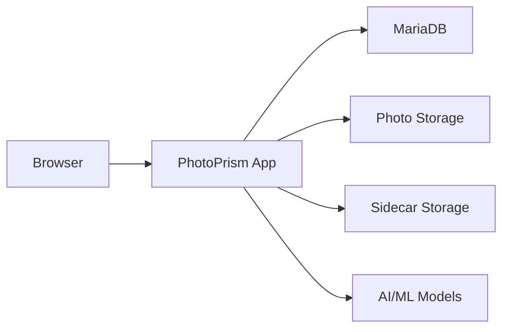

# How to Run PhotoPrism in Docker for Photo Browsing

Author: [nawazdhandala](https://github.com/nawazdhandala)

Tags: docker, photoprism, photos, self-hosted, ai, image-management

Description: Set up PhotoPrism in Docker to organize and browse your photo library with AI-powered face recognition and auto-tagging.

---

PhotoPrism is a self-hosted photo management application that uses AI to automatically tag, categorize, and organize your picture library. Think of it as a private alternative to Google Photos. It recognizes faces, identifies objects and scenes, extracts location data from GPS metadata, and generates a browsable timeline of your memories. Running PhotoPrism in Docker makes it simple to deploy on any server that can access your photo storage.

## Why Self-Host Your Photos?

Cloud photo services are convenient but come with real trade-offs. Google Photos scans your images for ad targeting. Apple iCloud locks you into their ecosystem. Both charge ongoing fees for storage beyond the free tier. PhotoPrism gives you unlimited storage (bounded only by your hardware), complete privacy, and no monthly bills. Your photos stay on your hardware, and the AI processing runs locally.

## Prerequisites

- A Linux server with Docker and Docker Compose installed
- At least 4 GB of RAM (AI features need memory)
- Adequate storage for your photo library
- A modern CPU (AVX2 support recommended for AI features)
- Optional: a GPU for faster AI processing

## Architecture



PhotoPrism stores metadata in MariaDB, keeps original photos untouched in the storage directory, and writes AI-generated metadata to sidecar files.

## Project Setup

```bash
# Create the PhotoPrism project directory
mkdir -p ~/photoprism/{storage,db}
cd ~/photoprism
```

## Docker Compose Configuration

```yaml
# docker-compose.yml - PhotoPrism Photo Management
version: "3.8"

services:
  db:
    image: mariadb:11
    container_name: photoprism-db
    restart: unless-stopped
    command: >
      --innodb-buffer-pool-size=512M
      --transaction-isolation=READ-COMMITTED
      --character-set-server=utf8mb4
      --collation-server=utf8mb4_unicode_ci
      --max-connections=512
      --innodb-rollback-on-timeout=OFF
      --innodb-lock-wait-timeout=120
    environment:
      MARIADB_AUTO_UPGRADE: "1"
      MARIADB_INITDB_SKIP_TZINFO: "1"
      MARIADB_ROOT_PASSWORD: root_password_change_me
      MARIADB_DATABASE: photoprism
      MARIADB_USER: photoprism
      MARIADB_PASSWORD: db_password_change_me
    volumes:
      - ./db:/var/lib/mysql
    networks:
      - photoprism-net

  photoprism:
    image: photoprism/photoprism:latest
    container_name: photoprism
    restart: unless-stopped
    depends_on:
      - db
    ports:
      # Web interface
      - "2342:2342"
    environment:
      # Admin account password (minimum 8 characters)
      PHOTOPRISM_ADMIN_PASSWORD: "admin_password_change_me"
      # Public URL where PhotoPrism is accessible
      PHOTOPRISM_SITE_URL: "http://192.168.1.100:2342/"
      # Database connection
      PHOTOPRISM_DATABASE_DRIVER: "mysql"
      PHOTOPRISM_DATABASE_SERVER: "db:3306"
      PHOTOPRISM_DATABASE_NAME: "photoprism"
      PHOTOPRISM_DATABASE_USER: "photoprism"
      PHOTOPRISM_DATABASE_PASSWORD: "db_password_change_me"
      # Feature toggles
      PHOTOPRISM_DETECT_NSFW: "false"
      PHOTOPRISM_UPLOAD_NSFW: "true"
      # Disable authentication for private networks (set to "public")
      # or keep authentication enabled (set to "password")
      PHOTOPRISM_AUTH_MODE: "password"
      # Originals storage limit in GB (-1 for unlimited)
      PHOTOPRISM_ORIGINALS_LIMIT: -1
      # Quality settings
      PHOTOPRISM_JPEG_QUALITY: 85
      PHOTOPRISM_THUMB_SIZE: 2048
      PHOTOPRISM_THUMB_SIZE_UNCACHED: 7680
    volumes:
      # Original photos - mount your photo library here (read-only is fine)
      - /mnt/photos:/photoprism/originals:ro
      # Import directory for new photos
      - /mnt/photos/import:/photoprism/import
      # PhotoPrism storage for cache, thumbnails, and sidecar files
      - ./storage:/photoprism/storage
    networks:
      - photoprism-net

networks:
  photoprism-net:
    driver: bridge
```

## Starting PhotoPrism

```bash
# Start the PhotoPrism stack
docker compose up -d
```

Monitor the startup:

```bash
# Watch initialization progress
docker compose logs -f photoprism
```

Once you see "server started," open `http://<your-server-ip>:2342` in your browser. Log in with the username `admin` and the password you set in the Compose file.

## Indexing Your Photos

After the first login, PhotoPrism needs to scan your photo library. Go to Library > Index and click "Start." You can also trigger indexing from the command line:

```bash
# Start a full index of the photo library
docker exec photoprism photoprism index

# For a faster re-index that only processes new files
docker exec photoprism photoprism index --cleanup
```

Indexing speed depends on your library size and hardware. A library of 50,000 photos typically takes a few hours on a modern CPU. During indexing, PhotoPrism:

- Reads EXIF metadata (date, location, camera settings)
- Generates thumbnails in multiple sizes
- Runs AI classification on each image
- Detects and clusters faces
- Extracts color information

## Face Recognition

PhotoPrism automatically detects faces in your photos and clusters them. Navigate to People in the sidebar to see detected faces. Click on a face cluster and assign a name. Once named, PhotoPrism uses that identity to find the same person across your entire library.

You can merge face clusters if the same person was split into multiple groups. Select clusters and use the merge action to combine them.

## Smart Search

The search bar understands natural language queries:

```
# Example search queries
sunset beach               # Photos with both sunset and beach tags
face:John                  # Photos containing John's face
year:2024 month:july       # Photos from July 2024
camera:iPhone              # Photos taken with an iPhone
country:Japan              # Photos geolocated in Japan
color:red                  # Photos where red is dominant
type:video                 # Only video files
path:vacation/2024         # Photos from a specific folder
```

## Albums and Organization

Create albums manually or let PhotoPrism generate them automatically:

- **Calendar albums** - Auto-generated based on dates
- **Location albums** - Auto-generated based on GPS data
- **Manual albums** - Create custom albums and add photos to them
- **Moments** - PhotoPrism identifies meaningful clusters of photos (trips, events)

## Importing New Photos

Place new photos in the import directory and trigger an import:

```bash
# Import new photos from the import directory
docker exec photoprism photoprism import
```

The import process copies files into the originals directory with a consistent naming structure, then indexes them. You can also upload photos directly through the web UI.

## Scheduled Indexing

Set up a cron job to automatically index new photos:

```bash
# Add a nightly indexing job at 3 AM
(crontab -l 2>/dev/null; echo "0 3 * * * docker exec photoprism photoprism index --cleanup") | crontab -
```

## Performance Tuning

For large libraries, tune the MariaDB buffer pool and PhotoPrism's thumbnail settings:

```yaml
# Increase MariaDB buffer for better query performance
command: --innodb-buffer-pool-size=1G

# In PhotoPrism environment, adjust worker count
PHOTOPRISM_WORKERS: 4
```

Store the PhotoPrism storage directory on an SSD for faster thumbnail access. The originals can stay on slower HDD storage since they are read less frequently.

## Backup Strategy

```bash
# Back up the database
docker exec photoprism-db mysqldump -u photoprism -pdb_password_change_me photoprism > ~/photoprism-backup/db_$(date +%Y%m%d).sql

# Back up the storage directory (thumbnails, sidecar files, AI data)
rsync -a ~/photoprism/storage/ ~/photoprism-backup/storage/
```

Your original photos should have their own backup strategy. PhotoPrism does not modify originals, so they can be backed up independently.

## Updating PhotoPrism

```bash
# Pull the latest image and restart
docker compose pull photoprism
docker compose up -d photoprism
```

After major updates, re-run indexing to take advantage of improved AI models:

```bash
# Re-index after a major update
docker exec photoprism photoprism index
```

## Monitoring with OneUptime

Monitor your PhotoPrism instance with OneUptime. Set up an HTTP monitor on port 2342 to check availability. Your photo library is irreplaceable, and while PhotoPrism going down does not affect the stored files, you want to know quickly so you can restore access.

## Wrapping Up

PhotoPrism in Docker gives you a private, AI-powered photo management platform that rivals Google Photos in features. Face recognition, smart search, automatic categorization, and a beautiful browsing experience make it a genuine replacement for cloud photo services. With Docker handling the deployment, you get a reproducible setup that is easy to maintain and update.
