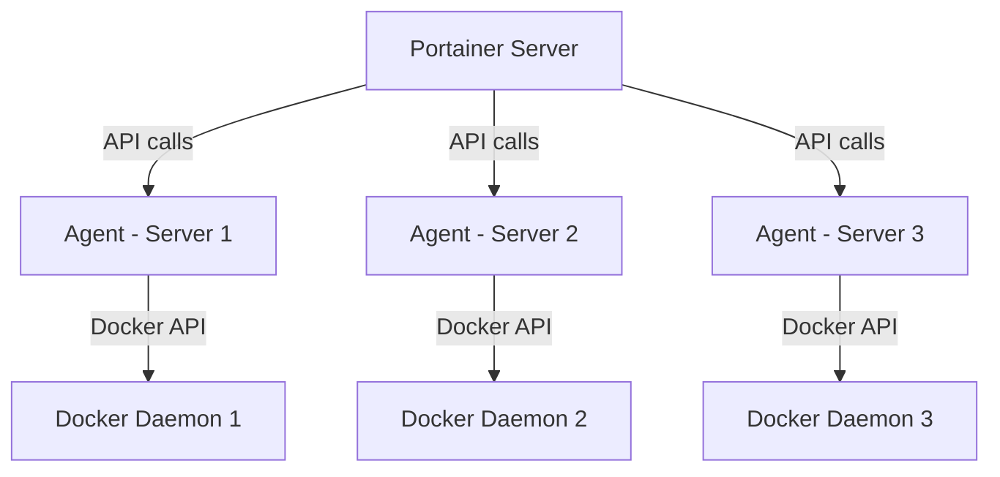

# How to Run Portainer Agent in Docker for Remote Management

Author: [nawazdhandala](https://github.com/nawazdhandala)

Tags: Docker, Portainer, Remote Management, Container Management, DevOps, Docker Swarm, Monitoring

Description: Deploy Portainer Agent on remote Docker hosts to manage containers, images, volumes, and networks from a central Portainer dashboard.

---

Managing Docker across multiple servers through SSH and command-line tools gets tedious fast. Portainer solves this with a web-based management interface, and the Portainer Agent extends that management to remote Docker hosts. Install the agent on each server, connect it to your central Portainer instance, and you can manage every container, image, volume, and network from a single dashboard. This guide covers deploying and configuring the Portainer Agent for remote Docker management.

## How Portainer Agent Works

The Portainer Agent runs as a lightweight container on each Docker host you want to manage. It exposes a secure API that the central Portainer server communicates with. The agent acts as a proxy, translating Portainer's requests into Docker API calls on the local Docker daemon.

This architecture means you never need to expose the Docker socket over the network. The agent handles authentication and communication securely.



## Setting Up Portainer Server

Before deploying agents, you need a central Portainer server. If you do not have one yet, set it up:

```bash
# Create a volume for Portainer's persistent data
docker volume create portainer_data

# Start the Portainer server with the web UI on port 9443
docker run -d \
  --name portainer \
  --restart=always \
  -p 8000:8000 \
  -p 9443:9443 \
  -v /var/run/docker.sock:/var/run/docker.sock \
  -v portainer_data:/data \
  portainer/portainer-ce:latest
```

Open `https://localhost:9443` and create your admin account on first access.

Port 8000 is used for Edge Agent communication. Port 9443 serves the web interface over HTTPS.

## Deploying the Portainer Agent

On each remote Docker host, deploy the agent:

```bash
# Deploy the Portainer Agent on a remote Docker host
docker run -d \
  --name portainer_agent \
  --restart=always \
  -p 9001:9001 \
  -v /var/run/docker.sock:/var/run/docker.sock \
  -v /var/lib/docker/volumes:/var/lib/docker/volumes \
  portainer/agent:latest
```

The agent needs two volume mounts:
- `/var/run/docker.sock` gives the agent access to the Docker daemon
- `/var/lib/docker/volumes` allows Portainer to browse volume contents

Port 9001 is where the agent listens for connections from the Portainer server.

## Connecting the Agent to Portainer

Once the agent is running on the remote host, connect it from the Portainer server:

1. Log into your Portainer server dashboard
2. Navigate to Environments > Add Environment
3. Select "Agent" as the environment type
4. Enter the agent's address: `remote-host-ip:9001`
5. Give the environment a descriptive name
6. Click "Connect"

Portainer will verify the connection and add the remote host to your management dashboard.

You can also connect via the Portainer API:

```bash
# Add a remote agent environment via the Portainer API
# First, get your API token by logging in
TOKEN=$(curl -sk -X POST "https://localhost:9443/api/auth" \
  -H "Content-Type: application/json" \
  -d '{"username":"admin","password":"your-password"}' | jq -r '.jwt')

# Add the remote agent endpoint
curl -sk -X POST "https://localhost:9443/api/endpoints" \
  -H "Authorization: Bearer ${TOKEN}" \
  -H "Content-Type: application/json" \
  -d '{
    "Name": "Production Server 1",
    "EndpointCreationType": 2,
    "URL": "tcp://192.168.1.100:9001",
    "TLS": false,
    "GroupID": 1
  }'
```

## Docker Compose for the Agent

For a more structured deployment:

```yaml
# docker-compose.agent.yml - Portainer Agent deployment
version: "3.8"

services:
  portainer-agent:
    image: portainer/agent:latest
    container_name: portainer_agent
    restart: always
    ports:
      - "9001:9001"
    volumes:
      # Required: Docker socket access for container management
      - /var/run/docker.sock:/var/run/docker.sock
      # Required: Volume access for browsing volume contents
      - /var/lib/docker/volumes:/var/lib/docker/volumes
    environment:
      # Optional: set a shared secret for agent-server communication
      AGENT_SECRET: your-shared-secret-here
```

When using `AGENT_SECRET`, set the same secret on the Portainer server side when adding the environment.

## Deploying the Agent on Docker Swarm

For Docker Swarm clusters, deploy the agent as a global service so it runs on every node:

```bash
# Deploy the Portainer Agent across all Swarm nodes
docker service create \
  --name portainer_agent \
  --network portainer_agent_network \
  --mode global \
  --constraint 'node.platform.os == linux' \
  --mount type=bind,src=/var/run/docker.sock,dst=/var/run/docker.sock \
  --mount type=bind,src=/var/lib/docker/volumes,dst=/var/lib/docker/volumes \
  --publish mode=host,target=9001,published=9001 \
  portainer/agent:latest
```

Or with a Docker Compose file for Swarm:

```yaml
# docker-compose.swarm-agent.yml - Portainer Agent for Swarm clusters
version: "3.8"

services:
  agent:
    image: portainer/agent:latest
    volumes:
      - /var/run/docker.sock:/var/run/docker.sock
      - /var/lib/docker/volumes:/var/lib/docker/volumes
    networks:
      - agent_network
    deploy:
      mode: global
      placement:
        constraints:
          - node.platform.os == linux

networks:
  agent_network:
    driver: overlay
    attachable: true
```

Deploy it:

```bash
# Deploy the agent stack to the Swarm cluster
docker stack deploy -c docker-compose.swarm-agent.yml portainer-agent
```

## Edge Agent for Firewalled Environments

When remote hosts are behind firewalls and cannot accept incoming connections, use the Edge Agent instead. The Edge Agent initiates outbound connections to the Portainer server, which works through NAT and firewalls:

```bash
# Deploy the Portainer Edge Agent (initiates outbound connections)
docker run -d \
  --name portainer_edge_agent \
  --restart=always \
  -v /var/run/docker.sock:/var/run/docker.sock \
  -v /var/lib/docker/volumes:/var/lib/docker/volumes \
  -v /:/host \
  -e EDGE=1 \
  -e EDGE_ID=your-edge-id \
  -e EDGE_KEY=your-edge-key \
  -e EDGE_INSECURE_POLL=1 \
  portainer/agent:latest
```

The `EDGE_ID` and `EDGE_KEY` values come from the Portainer server when you add an Edge environment.

## Securing Agent Communication

For production deployments, secure the agent communication:

```yaml
# Secure agent deployment with TLS and secrets
services:
  portainer-agent:
    image: portainer/agent:latest
    restart: always
    ports:
      - "9001:9001"
    volumes:
      - /var/run/docker.sock:/var/run/docker.sock
      - /var/lib/docker/volumes:/var/lib/docker/volumes
    environment:
      # Shared secret must match the Portainer server configuration
      AGENT_SECRET: ${AGENT_SECRET}
      # Restrict which Portainer server can connect
      CAP_HOST_MANAGEMENT: 1
```

Restrict network access to the agent port using firewall rules:

```bash
# Allow only the Portainer server IP to reach the agent port
sudo ufw allow from 10.0.0.1 to any port 9001 proto tcp
sudo ufw deny 9001
```

## Managing Remote Containers

Once connected, you can manage remote containers through the Portainer UI or API:

```bash
# List containers on a remote environment via the Portainer API
ENDPOINT_ID=2  # ID of the remote environment

curl -sk "https://localhost:9443/api/endpoints/${ENDPOINT_ID}/docker/containers/json?all=true" \
  -H "Authorization: Bearer ${TOKEN}" | jq '.[].Names'
```

```bash
# Restart a container on a remote host via the API
CONTAINER_ID="abc123"

curl -sk -X POST \
  "https://localhost:9443/api/endpoints/${ENDPOINT_ID}/docker/containers/${CONTAINER_ID}/restart" \
  -H "Authorization: Bearer ${TOKEN}"
```

## Monitoring Agent Health

Check that agents are connected and healthy:

```bash
# List all connected environments and their status
curl -sk "https://localhost:9443/api/endpoints" \
  -H "Authorization: Bearer ${TOKEN}" | jq '.[] | {id: .Id, name: .Name, status: .Status}'
```

Status values: 1 = up, 2 = down.

Set up alerts for disconnected agents by polling this endpoint regularly.

## Wrapping Up

The Portainer Agent transforms Docker management from a per-server SSH task into a centralized, visual operation. Deploy the agent on each Docker host, connect it to your Portainer server, and manage your entire container fleet from one dashboard. The Edge Agent variant handles firewalled environments by reversing the connection direction. Combined with proper secrets and firewall rules, the setup is secure enough for production while being simple enough to deploy in minutes.
