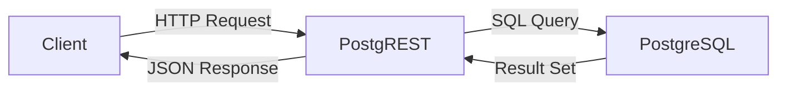

# How to Run PostgREST in Docker for Instant REST APIs

Author: [nawazdhandala](https://github.com/nawazdhandala)

Tags: Docker, PostgREST, REST API, PostgreSQL, API, Database, Containers, Backend, DevOps

Description: Learn how to deploy PostgREST in Docker to instantly generate a full REST API from your PostgreSQL database schema without writing any backend code.

---

PostgREST is a standalone web server that turns your PostgreSQL database directly into a RESTful API. You define your tables, views, and functions in PostgreSQL, and PostgREST automatically generates API endpoints for every table and view. There is no backend code to write, no ORM to configure, and no route definitions to maintain. The database schema IS the API.

This approach works surprisingly well for many applications. If your business logic can live in PostgreSQL functions and your access control can be expressed with row-level security policies, PostgREST eliminates an entire layer of code. Docker makes deploying PostgREST and PostgreSQL together straightforward.

## Prerequisites

You need:

- Docker Engine 20.10+
- Docker Compose v2
- Basic familiarity with SQL

```bash
# Verify your Docker installation
docker --version
docker compose version
```

## How PostgREST Works

The architecture is simple. PostgREST connects to PostgreSQL as a specific database role and introspects the schema. It builds a routing table based on what it finds, then serves HTTP requests by translating them into SQL queries.



## Docker Compose Setup

Here is a complete Docker Compose file that sets up PostgreSQL and PostgREST together.

```yaml
# docker-compose.yml - PostgREST with PostgreSQL
version: "3.8"

services:
  # PostgreSQL database - the single source of truth
  db:
    image: postgres:16-alpine
    environment:
      POSTGRES_DB: app
      POSTGRES_USER: postgres
      POSTGRES_PASSWORD: postgres_pass
    volumes:
      - pgdata:/var/lib/postgresql/data
      # Initialize the database with our schema on first run
      - ./init.sql:/docker-entrypoint-initdb.d/init.sql
    ports:
      - "5432:5432"
    healthcheck:
      test: ["CMD-SHELL", "pg_isready -U postgres"]
      interval: 5s
      timeout: 5s
      retries: 10
    networks:
      - postgrest-network

  # PostgREST - automatically generates the REST API
  postgrest:
    image: postgrest/postgrest:v12.0.2
    ports:
      - "3000:3000"
    environment:
      # Connection string for the database
      PGRST_DB_URI: postgresql://postgres:postgres_pass@db:5432/app
      # The schema to expose through the API
      PGRST_DB_SCHEMAS: api
      # The role used for unauthenticated requests
      PGRST_DB_ANON_ROLE: web_anon
      # JWT secret for authenticated requests (change in production)
      PGRST_JWT_SECRET: "super-secret-jwt-key-with-at-least-32-characters!!"
      PGRST_OPENAPI_SERVER_PROXY_URI: http://localhost:3000
    depends_on:
      db:
        condition: service_healthy
    networks:
      - postgrest-network

  # Swagger UI - provides interactive API documentation
  swagger:
    image: swaggerapi/swagger-ui
    ports:
      - "8080:8080"
    environment:
      API_URL: http://localhost:3000/
    networks:
      - postgrest-network

volumes:
  pgdata:

networks:
  postgrest-network:
    driver: bridge
```

## Database Initialization Script

PostgREST works best when you create a dedicated schema for API-accessible objects and a dedicated role for anonymous access. Create the initialization SQL file.

```sql
-- init.sql - Database schema that PostgREST will expose as an API

-- Create a dedicated schema for the API
CREATE SCHEMA IF NOT EXISTS api;

-- Create a role for unauthenticated (anonymous) API access
CREATE ROLE web_anon NOLOGIN;

-- Grant the anonymous role access to the API schema
GRANT USAGE ON SCHEMA api TO web_anon;

-- Create a sample 'todos' table in the API schema
CREATE TABLE api.todos (
    id SERIAL PRIMARY KEY,
    title TEXT NOT NULL,
    done BOOLEAN NOT NULL DEFAULT FALSE,
    created_at TIMESTAMPTZ NOT NULL DEFAULT NOW()
);

-- Allow anonymous users to read and create todos
GRANT SELECT, INSERT ON api.todos TO web_anon;
GRANT USAGE, SELECT ON SEQUENCE api.todos_id_seq TO web_anon;

-- Create a 'products' table for a more realistic example
CREATE TABLE api.products (
    id SERIAL PRIMARY KEY,
    name TEXT NOT NULL,
    description TEXT,
    price NUMERIC(10, 2) NOT NULL CHECK (price >= 0),
    stock INTEGER NOT NULL DEFAULT 0 CHECK (stock >= 0),
    category TEXT,
    created_at TIMESTAMPTZ NOT NULL DEFAULT NOW(),
    updated_at TIMESTAMPTZ NOT NULL DEFAULT NOW()
);

-- Allow full CRUD on products for anonymous users (restrict in production)
GRANT SELECT, INSERT, UPDATE, DELETE ON api.products TO web_anon;
GRANT USAGE, SELECT ON SEQUENCE api.products_id_seq TO web_anon;

-- Insert some sample data
INSERT INTO api.todos (title, done) VALUES
    ('Set up PostgREST', TRUE),
    ('Create database schema', TRUE),
    ('Build frontend', FALSE),
    ('Deploy to production', FALSE);

INSERT INTO api.products (name, description, price, stock, category) VALUES
    ('Widget A', 'A basic widget', 9.99, 100, 'widgets'),
    ('Widget B', 'A premium widget', 24.99, 50, 'widgets'),
    ('Gadget X', 'An advanced gadget', 149.99, 25, 'gadgets');

-- Create a function that PostgREST can call as an RPC endpoint
CREATE OR REPLACE FUNCTION api.search_products(search_term TEXT)
RETURNS SETOF api.products AS $$
    SELECT * FROM api.products
    WHERE name ILIKE '%' || search_term || '%'
       OR description ILIKE '%' || search_term || '%';
$$ LANGUAGE sql STABLE;

-- Grant execute permission on the function
GRANT EXECUTE ON FUNCTION api.search_products(TEXT) TO web_anon;
```

## Starting the Stack

```bash
# Start PostgreSQL first, then PostgREST
docker compose up -d

# Verify all services are running
docker compose ps

# Check PostgREST logs for any connection errors
docker compose logs postgrest
```

## Using the REST API

PostgREST is now serving your database tables as REST endpoints. Here are common operations.

### Reading Data

```bash
# Get all todos
curl http://localhost:3000/todos

# Get all products
curl http://localhost:3000/products

# Get a single product by ID
curl "http://localhost:3000/products?id=eq.1"

# Filter products by category
curl "http://localhost:3000/products?category=eq.widgets"

# Select specific columns
curl "http://localhost:3000/products?select=name,price"

# Pagination - get 10 items starting from offset 0
curl "http://localhost:3000/products?limit=10&offset=0"

# Order results by price descending
curl "http://localhost:3000/products?order=price.desc"

# Complex filter: products under $50 with stock > 0
curl "http://localhost:3000/products?price=lt.50&stock=gt.0"
```

### Creating Data

```bash
# Create a new todo
curl -X POST http://localhost:3000/todos \
  -H "Content-Type: application/json" \
  -d '{"title": "Learn PostgREST", "done": false}'

# Create a new product
curl -X POST http://localhost:3000/products \
  -H "Content-Type: application/json" \
  -H "Prefer: return=representation" \
  -d '{"name": "Gadget Y", "description": "A new gadget", "price": 79.99, "stock": 30, "category": "gadgets"}'
```

The `Prefer: return=representation` header tells PostgREST to return the created object in the response.

### Updating Data

```bash
# Mark a todo as done
curl -X PATCH "http://localhost:3000/todos?id=eq.3" \
  -H "Content-Type: application/json" \
  -d '{"done": true}'

# Update product stock
curl -X PATCH "http://localhost:3000/products?id=eq.1" \
  -H "Content-Type: application/json" \
  -d '{"stock": 85}'
```

### Deleting Data

```bash
# Delete a todo by ID
curl -X DELETE "http://localhost:3000/todos?id=eq.4"
```

### Calling Functions (RPC)

```bash
# Search products using the PostgreSQL function we defined
curl -X POST http://localhost:3000/rpc/search_products \
  -H "Content-Type: application/json" \
  -d '{"search_term": "widget"}'
```

## Adding Authentication with JWT

PostgREST supports JWT-based authentication. Create a role for authenticated users and protect certain operations.

```sql
-- Add an authenticated role with more permissions
CREATE ROLE authenticated_user NOLOGIN;
GRANT USAGE ON SCHEMA api TO authenticated_user;
GRANT ALL ON ALL TABLES IN SCHEMA api TO authenticated_user;
GRANT USAGE, SELECT ON ALL SEQUENCES IN SCHEMA api TO authenticated_user;
```

Generate a JWT token and pass it in requests.

```bash
# Make an authenticated request with a JWT token
curl http://localhost:3000/products \
  -H "Authorization: Bearer YOUR_JWT_TOKEN"
```

## Row-Level Security

PostgreSQL's row-level security lets you control which rows each user can access.

```sql
-- Enable row-level security on the todos table
ALTER TABLE api.todos ENABLE ROW LEVEL SECURITY;

-- Allow anonymous users to only see their own todos
CREATE POLICY todos_anonymous ON api.todos
    FOR SELECT
    TO web_anon
    USING (TRUE);

-- Authenticated users can manage only their own data
CREATE POLICY todos_user ON api.todos
    FOR ALL
    TO authenticated_user
    USING (TRUE);
```

## API Documentation with Swagger

PostgREST generates an OpenAPI specification automatically. Access the Swagger UI at `http://localhost:8080` to browse and test all available endpoints interactively.

## Stopping and Cleaning Up

```bash
# Stop the stack
docker compose stop

# Remove containers and networks
docker compose down

# Remove everything including the database volume
docker compose down -v
```

## Summary

PostgREST turns your PostgreSQL database into a REST API with zero backend code. By defining your tables, views, functions, and security policies in SQL, you get a complete API that supports filtering, pagination, sorting, bulk operations, and authentication. Docker Compose ties everything together, giving you a portable, reproducible setup. For many CRUD-heavy applications, PostgREST eliminates the need for a custom backend entirely, letting you focus on the database design and the frontend experience.
