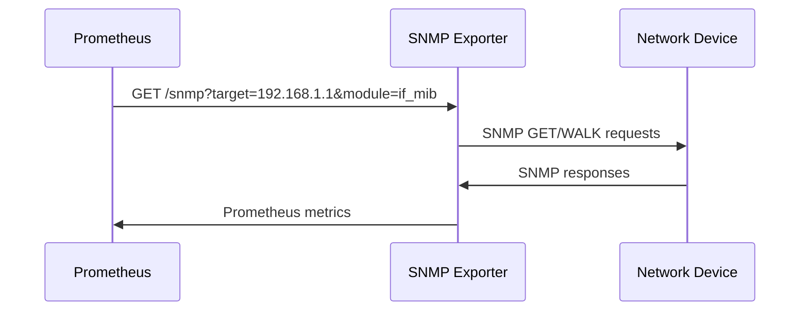

# How to Run Prometheus SNMP Exporter in Docker

Author: [nawazdhandala](https://github.com/nawazdhandala)

Tags: Docker, Prometheus, SNMP, Monitoring, Network, Exporter, Grafana

Description: Deploy the Prometheus SNMP Exporter in Docker to collect metrics from network devices and visualize them with Grafana dashboards.

---

The Prometheus SNMP Exporter bridges the gap between traditional SNMP-based network monitoring and the Prometheus metrics ecosystem. It translates SNMP OIDs (Object Identifiers) from network devices into Prometheus-compatible metrics, allowing you to monitor routers, switches, firewalls, and other network equipment alongside your application metrics in a single platform.

This guide shows you how to deploy the SNMP Exporter in Docker, configure it for your devices, set up Prometheus scrape targets, and build Grafana dashboards for network visibility.

## How the SNMP Exporter Works

The SNMP Exporter does not poll devices on its own. Instead, Prometheus sends scrape requests to the exporter with the target device as a parameter. The exporter then queries the device via SNMP and returns the results as Prometheus metrics.



## Quick Start

Run the SNMP Exporter with the default configuration, which includes modules for common MIBs.

```bash
# Start the SNMP Exporter with default configuration
# Port 9116 serves the metrics endpoint
docker run -d \
  --name snmp-exporter \
  -p 9116:9116 \
  prom/snmp-exporter:latest
```

Test it by querying a device manually.

```bash
# Query a network device through the exporter
# Replace the target IP with your device's address
curl "http://localhost:9116/snmp?target=192.168.1.1&module=if_mib"

# Check the exporter's own metrics
curl "http://localhost:9116/metrics"
```

## Docker Compose Setup

Deploy the SNMP Exporter alongside Prometheus and Grafana for a complete monitoring stack.

```yaml
# docker-compose.yml - SNMP monitoring stack
# Includes SNMP Exporter, Prometheus, and Grafana
version: "3.8"

services:
  snmp-exporter:
    image: prom/snmp-exporter:latest
    container_name: snmp-exporter
    restart: unless-stopped
    ports:
      - "9116:9116"
    volumes:
      - ./snmp.yml:/etc/snmp_exporter/snmp.yml:ro
    networks:
      - monitoring

  prometheus:
    image: prom/prometheus:latest
    container_name: prometheus
    restart: unless-stopped
    ports:
      - "9090:9090"
    volumes:
      - ./prometheus.yml:/etc/prometheus/prometheus.yml:ro
      - prometheus-data:/prometheus
    command:
      - "--config.file=/etc/prometheus/prometheus.yml"
      - "--storage.tsdb.retention.time=90d"
    networks:
      - monitoring

  grafana:
    image: grafana/grafana:latest
    container_name: grafana
    restart: unless-stopped
    ports:
      - "3000:3000"
    environment:
      - GF_SECURITY_ADMIN_PASSWORD=admin
    volumes:
      - grafana-data:/var/lib/grafana
    networks:
      - monitoring

volumes:
  prometheus-data:
  grafana-data:

networks:
  monitoring:
    driver: bridge
```

## Prometheus Configuration

Configure Prometheus to scrape metrics through the SNMP Exporter for each target device.

```yaml
# prometheus.yml - Prometheus configuration with SNMP targets
# Uses relabeling to pass the target device to the SNMP Exporter

global:
  scrape_interval: 60s      # SNMP polling every 60 seconds
  evaluation_interval: 60s

scrape_configs:
  # Scrape the SNMP Exporter's own metrics
  - job_name: "snmp-exporter"
    static_configs:
      - targets: ["snmp-exporter:9116"]

  # Scrape network devices through the SNMP Exporter
  - job_name: "snmp-network-devices"
    scrape_interval: 60s
    scrape_timeout: 30s
    static_configs:
      - targets:
          - "192.168.1.1"    # Core router
          - "192.168.1.2"    # Distribution switch
          - "192.168.1.3"    # Access switch
          - "192.168.1.4"    # Firewall
        labels:
          site: "datacenter-1"
      - targets:
          - "10.0.1.1"      # Branch router
          - "10.0.1.2"      # Branch switch
        labels:
          site: "branch-office"
    metrics_path: /snmp
    params:
      module: [if_mib]       # Which SNMP module to use
      auth: [public_v2]      # Which auth config to use
    relabel_configs:
      # The SNMP Exporter needs the target as a parameter
      - source_labels: [__address__]
        target_label: __param_target
      # Keep the original target as a label
      - source_labels: [__param_target]
        target_label: instance
      # Point the scrape at the SNMP Exporter service
      - target_label: __address__
        replacement: snmp-exporter:9116

  # Monitor different device types with different modules
  - job_name: "snmp-ups-devices"
    scrape_interval: 120s
    static_configs:
      - targets:
          - "192.168.1.50"   # UPS unit 1
          - "192.168.1.51"   # UPS unit 2
    metrics_path: /snmp
    params:
      module: [apcups]
    relabel_configs:
      - source_labels: [__address__]
        target_label: __param_target
      - source_labels: [__param_target]
        target_label: instance
      - target_label: __address__
        replacement: snmp-exporter:9116
```

## Custom SNMP Configuration

The default snmp.yml covers common MIBs, but you often need custom configurations for vendor-specific OIDs. Use the SNMP Exporter's generator tool to create configurations from MIB files.

```yaml
# generator.yml - Input for the SNMP Exporter config generator
# Defines which MIBs and OIDs to export as Prometheus metrics

auths:
  # SNMPv2c community string authentication
  public_v2:
    community: public
    version: 2

  # SNMPv3 with authentication and encryption
  secure_v3:
    version: 3
    security_level: authPriv
    username: monitoring
    password: auth_password_here
    auth_protocol: SHA
    priv_protocol: AES
    priv_password: priv_password_here

modules:
  # Interface MIB - traffic counters, interface status, errors
  if_mib:
    walk:
      - ifDescr
      - ifType
      - ifSpeed
      - ifAdminStatus
      - ifOperStatus
      - ifHCInOctets
      - ifHCOutOctets
      - ifInErrors
      - ifOutErrors
      - ifInDiscards
      - ifOutDiscards
    lookups:
      - source_indexes: [ifIndex]
        lookup: ifDescr
        drop_source_indexes: false

  # System MIB - uptime, description, contact info
  system_mib:
    walk:
      - sysDescr
      - sysUpTime
      - sysName
      - sysLocation
      - sysContact

  # Cisco-specific MIBs
  cisco:
    walk:
      - cpmCPUTotal5minRev       # CPU utilization
      - ciscoMemoryPoolUsed      # Memory usage
      - ciscoMemoryPoolFree
      - ciscoEnvMonTemperatureValue  # Temperature sensors
    lookups:
      - source_indexes: [cpmCPUTotalIndex]
        lookup: cpmCPUTotalPhysicalIndex
```

Generate the snmp.yml configuration from the generator file.

```bash
# Run the SNMP Exporter generator to create snmp.yml from MIB files
# Mount your MIB directory and generator.yml into the container
docker run --rm \
  -v $(pwd)/generator.yml:/opt/generator.yml \
  -v $(pwd)/mibs:/opt/mibs \
  -v $(pwd)/output:/opt/output \
  prom/snmp-generator:latest \
  generate -g /opt/generator.yml -m /opt/mibs -o /opt/output/snmp.yml

# Copy the generated file to the SNMP Exporter's config directory
cp output/snmp.yml ./snmp.yml
```

## Useful PromQL Queries

Once metrics are flowing, use these queries in Prometheus or Grafana.

```promql
# Interface traffic rate in bits per second (inbound)
rate(ifHCInOctets{instance="192.168.1.1", ifDescr="GigabitEthernet0/1"}[5m]) * 8

# Interface traffic rate in bits per second (outbound)
rate(ifHCOutOctets{instance="192.168.1.1", ifDescr="GigabitEthernet0/1"}[5m]) * 8

# Interface error rate
rate(ifInErrors{instance="192.168.1.1"}[5m])

# Device uptime in days
sysUpTime{instance="192.168.1.1"} / 8640000

# Interfaces that are operationally down but administratively up (potential problems)
ifOperStatus{ifAdminStatus="1"} == 2

# Top 10 busiest interfaces by inbound traffic
topk(10, rate(ifHCInOctets[5m]) * 8)

# Total bandwidth utilization percentage per interface
(rate(ifHCInOctets[5m]) * 8) / (ifSpeed * 1000000) * 100
```

## Setting Up Alerting Rules

Create Prometheus alerting rules for network events.

```yaml
# alert-rules.yml - Prometheus alerting rules for network devices
groups:
  - name: network-alerts
    rules:
      # Alert when a device stops responding to SNMP
      - alert: DeviceUnreachable
        expr: up{job="snmp-network-devices"} == 0
        for: 5m
        labels:
          severity: critical
        annotations:
          summary: "Network device {{ $labels.instance }} is unreachable"
          description: "SNMP queries to {{ $labels.instance }} have been failing for 5 minutes."

      # Alert on high interface error rate
      - alert: HighInterfaceErrors
        expr: rate(ifInErrors[5m]) > 10
        for: 10m
        labels:
          severity: warning
        annotations:
          summary: "High error rate on {{ $labels.ifDescr }} of {{ $labels.instance }}"

      # Alert when an interface goes down
      - alert: InterfaceDown
        expr: ifOperStatus{ifAdminStatus="1"} == 2
        for: 2m
        labels:
          severity: critical
        annotations:
          summary: "Interface {{ $labels.ifDescr }} on {{ $labels.instance }} is down"

      # Alert on high bandwidth utilization (over 80%)
      - alert: HighBandwidthUtilization
        expr: (rate(ifHCInOctets[5m]) * 8) / (ifSpeed * 1000000) * 100 > 80
        for: 15m
        labels:
          severity: warning
        annotations:
          summary: "High bandwidth on {{ $labels.ifDescr }} of {{ $labels.instance }}"
```

## Troubleshooting

When the exporter returns no data or errors, diagnose the issue step by step.

```bash
# Test SNMP connectivity to a device directly
docker exec snmp-exporter snmpwalk -v2c -c public 192.168.1.1 system

# Check the exporter logs for errors
docker logs snmp-exporter

# Verify the snmp.yml configuration is valid
docker exec snmp-exporter cat /etc/snmp_exporter/snmp.yml | head -50

# Test a specific module via the HTTP endpoint
curl -v "http://localhost:9116/snmp?target=192.168.1.1&module=if_mib&auth=public_v2"
```

## Production Tips

Set the Prometheus scrape interval to 60 seconds for SNMP targets. Faster polling creates unnecessary load on network devices. Use SNMPv3 with authentication and encryption for production environments. Group devices by site or function using Prometheus labels. Monitor the SNMP Exporter's own metrics (scrape duration, error count) to detect polling problems early. Use recording rules in Prometheus for expensive queries that run frequently.

The Prometheus SNMP Exporter in Docker integrates network device monitoring into your existing Prometheus and Grafana stack. You get the power of PromQL for querying network metrics, Grafana for visualization, and Alertmanager for notifications, all without leaving the tools your team already knows.
