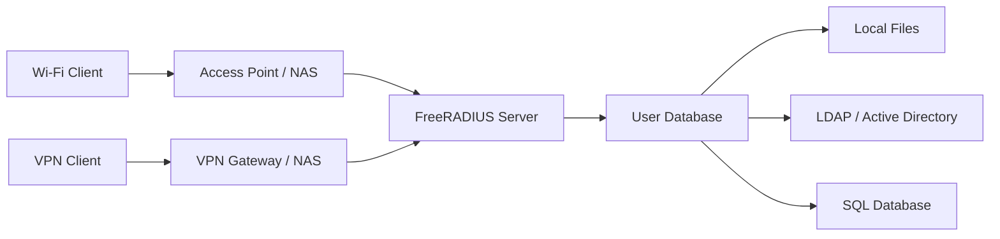

# How to Run RADIUS Server (FreeRADIUS) in Docker

Author: [nawazdhandala](https://github.com/nawazdhandala)

Tags: Docker, FreeRADIUS, RADIUS, Authentication, Network Security, AAA, 802.1X

Description: Deploy FreeRADIUS in Docker for centralized network authentication, authorization, and accounting with LDAP and SQL backends.

---

RADIUS (Remote Authentication Dial-In User Service) is the backbone of network authentication in enterprises, ISPs, and educational institutions. It handles the "triple A" of network security: Authentication, Authorization, and Accounting. FreeRADIUS is the most widely deployed RADIUS server in the world, handling authentication for a third of all internet users.

Running FreeRADIUS in Docker simplifies what is traditionally a complex setup involving multiple configuration files and backend integrations. This guide covers deploying FreeRADIUS in Docker with various authentication backends, from simple file-based users to LDAP and SQL databases.

## Use Cases for FreeRADIUS

FreeRADIUS handles authentication for a wide range of network services:

- Wi-Fi authentication using WPA2/WPA3 Enterprise (802.1X)
- VPN user authentication
- Network switch port access control (802.1X wired)
- ISP subscriber management
- Eduroam (educational roaming) networks

## Architecture



The client device authenticates through a Network Access Server (NAS), such as a Wi-Fi access point or VPN gateway. The NAS forwards the credentials to FreeRADIUS, which checks them against its configured backend and returns an Access-Accept or Access-Reject response.

## Quick Start

Run FreeRADIUS with the default file-based user authentication.

```bash
# Start FreeRADIUS in debug mode to see authentication requests in real time
# Debug mode (-X) is useful for initial testing and troubleshooting
docker run -d \
  --name freeradius \
  -p 1812:1812/udp \
  -p 1813:1813/udp \
  -v freeradius-config:/etc/freeradius \
  freeradius/freeradius-server:latest \
  -X
```

Port 1812/udp handles authentication requests, and port 1813/udp handles accounting.

## Docker Compose Setup

A production setup uses Docker Compose with persistent configuration and optional database backends.

```yaml
# docker-compose.yml for FreeRADIUS with MariaDB backend
# Includes persistent configuration and database storage
version: "3.8"

services:
  freeradius:
    image: freeradius/freeradius-server:latest
    container_name: freeradius
    restart: unless-stopped
    ports:
      - "1812:1812/udp"   # Authentication
      - "1813:1813/udp"   # Accounting
      - "18120:18120/tcp"  # Status (optional)
    volumes:
      - ./raddb:/etc/raddb
      - freeradius-logs:/var/log/freeradius
    depends_on:
      mariadb:
        condition: service_healthy
    networks:
      - radius-net

  mariadb:
    image: mariadb:10.11
    container_name: radius-db
    restart: unless-stopped
    environment:
      MYSQL_ROOT_PASSWORD: rootpassword
      MYSQL_DATABASE: radius
      MYSQL_USER: radius
      MYSQL_PASSWORD: radiusdbpassword
    volumes:
      - mariadb-data:/var/lib/mysql
      - ./sql/schema.sql:/docker-entrypoint-initdb.d/schema.sql:ro
    healthcheck:
      test: ["CMD", "mariadb-admin", "ping", "-h", "localhost", "-u", "root", "-prootpassword"]
      interval: 10s
      timeout: 5s
      retries: 5
    networks:
      - radius-net

volumes:
  freeradius-logs:
  mariadb-data:

networks:
  radius-net:
    driver: bridge
```

## Configuring Clients (NAS Devices)

Every device that sends authentication requests to FreeRADIUS must be registered as a client. Edit the clients.conf file.

```bash
# clients.conf - Define which devices can send RADIUS requests
# Each client needs an IP address and shared secret

# Allow requests from the local Docker network
client docker_network {
    ipaddr = 172.16.0.0/12
    secret = testing123
    shortname = docker
}

# Wi-Fi access point
client wifi_ap {
    ipaddr = 192.168.1.10
    secret = ap_shared_secret_here
    shortname = office-wifi
    nastype = other
}

# VPN gateway
client vpn_gateway {
    ipaddr = 10.0.0.1
    secret = vpn_shared_secret_here
    shortname = vpn
    nastype = other
}

# Allow requests from any IP (only for testing, never use in production)
# client any {
#     ipaddr = 0.0.0.0/0
#     secret = testing123
# }
```

## File-Based User Authentication

The simplest authentication method uses a flat file. Edit the users file in the raddb directory.

```bash
# users - File-based user authentication
# Format: username Auth-Type := method, attributes

# Basic username and password authentication
bob     Cleartext-Password := "bobspassword"
        Reply-Message := "Welcome, Bob!"

# User with VLAN assignment (for 802.1X)
alice   Cleartext-Password := "alicespassword"
        Tunnel-Type := VLAN,
        Tunnel-Medium-Type := IEEE-802,
        Tunnel-Private-Group-Id := "100",
        Reply-Message := "Welcome to VLAN 100, Alice."

# User with bandwidth limits (for ISP accounting)
charlie Cleartext-Password := "charliespassword"
        WISPr-Bandwidth-Max-Down := 10485760,
        WISPr-Bandwidth-Max-Up := 5242880,
        Session-Timeout := 86400

# Default deny rule - reject unknown users
DEFAULT Auth-Type := Reject
        Reply-Message := "Access denied. Contact your administrator."
```

## SQL Backend Configuration

For larger deployments, store users in a database. First, initialize the database schema.

```sql
-- schema.sql - FreeRADIUS database tables
-- Import this into the MariaDB container on first run

CREATE TABLE IF NOT EXISTS radcheck (
    id INT(11) UNSIGNED NOT NULL AUTO_INCREMENT,
    username VARCHAR(64) NOT NULL DEFAULT '',
    attribute VARCHAR(64) NOT NULL DEFAULT '',
    op CHAR(2) NOT NULL DEFAULT ':=',
    value VARCHAR(253) NOT NULL DEFAULT '',
    PRIMARY KEY (id),
    KEY username (username)
);

CREATE TABLE IF NOT EXISTS radreply (
    id INT(11) UNSIGNED NOT NULL AUTO_INCREMENT,
    username VARCHAR(64) NOT NULL DEFAULT '',
    attribute VARCHAR(64) NOT NULL DEFAULT '',
    op CHAR(2) NOT NULL DEFAULT '=',
    value VARCHAR(253) NOT NULL DEFAULT '',
    PRIMARY KEY (id),
    KEY username (username)
);

CREATE TABLE IF NOT EXISTS radgroupcheck (
    id INT(11) UNSIGNED NOT NULL AUTO_INCREMENT,
    groupname VARCHAR(64) NOT NULL DEFAULT '',
    attribute VARCHAR(64) NOT NULL DEFAULT '',
    op CHAR(2) NOT NULL DEFAULT ':=',
    value VARCHAR(253) NOT NULL DEFAULT '',
    PRIMARY KEY (id),
    KEY groupname (groupname)
);

CREATE TABLE IF NOT EXISTS radusergroup (
    id INT(11) UNSIGNED NOT NULL AUTO_INCREMENT,
    username VARCHAR(64) NOT NULL DEFAULT '',
    groupname VARCHAR(64) NOT NULL DEFAULT '',
    priority INT(11) NOT NULL DEFAULT 1,
    PRIMARY KEY (id),
    KEY username (username)
);

CREATE TABLE IF NOT EXISTS radacct (
    radacctid BIGINT(21) NOT NULL AUTO_INCREMENT,
    acctsessionid VARCHAR(64) NOT NULL DEFAULT '',
    acctuniqueid VARCHAR(32) NOT NULL DEFAULT '',
    username VARCHAR(64) NOT NULL DEFAULT '',
    nasipaddress VARCHAR(15) NOT NULL DEFAULT '',
    acctstarttime DATETIME NULL DEFAULT NULL,
    acctupdatetime DATETIME NULL DEFAULT NULL,
    acctstoptime DATETIME NULL DEFAULT NULL,
    acctsessiontime INT(12) UNSIGNED DEFAULT NULL,
    acctinputoctets BIGINT(20) DEFAULT NULL,
    acctoutputoctets BIGINT(20) DEFAULT NULL,
    calledstationid VARCHAR(50) NOT NULL DEFAULT '',
    callingstationid VARCHAR(50) NOT NULL DEFAULT '',
    acctterminatecause VARCHAR(32) NOT NULL DEFAULT '',
    framedipaddress VARCHAR(15) NOT NULL DEFAULT '',
    PRIMARY KEY (radacctid),
    UNIQUE KEY acctuniqueid (acctuniqueid),
    KEY username (username),
    KEY acctstarttime (acctstarttime)
);

-- Insert a test user
INSERT INTO radcheck (username, attribute, op, value) VALUES ('testuser', 'Cleartext-Password', ':=', 'testpass');
INSERT INTO radreply (username, attribute, op, value) VALUES ('testuser', 'Reply-Message', '=', 'Welcome, test user!');
```

Configure FreeRADIUS to use the SQL module by editing the site configuration.

```bash
# mods-available/sql - SQL module configuration
sql {
    driver = "rlm_sql_mysql"
    dialect = "mysql"

    server = "radius-db"
    port = 3306
    login = "radius"
    password = "radiusdbpassword"
    radius_db = "radius"

    # Connection pool settings
    pool {
        start = 5
        min = 3
        max = 20
        spare = 5
        uses = 0
        lifetime = 0
        idle_timeout = 60
    }

    read_clients = yes
    client_table = "nas"
}
```

## Testing Authentication

Use the radtest utility to verify your configuration.

```bash
# Test authentication from outside the container
# radtest username password radius-server port shared-secret
docker exec freeradius radtest testuser testpass localhost 0 testing123

# Expected output for successful authentication:
# Sent Access-Request Id 123 from 0.0.0.0:port to 127.0.0.1:1812 length 75
# Received Access-Accept Id 123 from 127.0.0.1:1812 to 0.0.0.0:port length 35

# Test from an external machine (use the server's IP)
radtest bob bobspassword 192.168.1.5 0 testing123

# Test with EAP-TTLS (requires eapol_test from wpa_supplicant)
eapol_test -c eapol_test.conf -s testing123 -a 192.168.1.5
```

## LDAP Integration

Connect FreeRADIUS to an LDAP server or Active Directory for centralized user management.

```bash
# mods-available/ldap - LDAP module configuration
ldap {
    server = "ldap://ldap-server:389"
    identity = "cn=admin,dc=example,dc=com"
    password = "ldap_admin_password"
    base_dn = "dc=example,dc=com"

    user {
        base_dn = "ou=users,${..base_dn}"
        filter = "(uid=%{%{Stripped-User-Name}:-%{User-Name}})"
    }

    group {
        base_dn = "ou=groups,${..base_dn}"
        filter = "(objectClass=groupOfNames)"
        membership_attribute = "member"
    }

    options {
        chase_referrals = yes
        rebind = yes
    }

    pool {
        start = 5
        min = 3
        max = 20
    }
}
```

## Monitoring and Logging

Enable detailed logging for troubleshooting and compliance.

```bash
# View real-time authentication logs
docker logs -f freeradius

# Run FreeRADIUS in debug mode to see full request processing
docker exec -it freeradius freeradius -X

# Check accounting records in the database
docker exec radius-db mysql -u radius -pradiusdbpassword radius \
  -e "SELECT username, nasipaddress, acctstarttime, acctsessiontime FROM radacct ORDER BY acctstarttime DESC LIMIT 10;"
```

## Production Security

For a production FreeRADIUS deployment, never use `testing123` as a shared secret. Generate strong, unique secrets for each NAS client. Restrict the client list to only the IP addresses that need RADIUS access. Use TLS for RADIUS communication (RadSec) when possible. Enable accounting to maintain audit trails. Regularly rotate shared secrets and user passwords. Monitor failed authentication attempts to detect brute-force attacks.

FreeRADIUS in Docker brings enterprise network authentication into a manageable, containerized package. Whether you are securing a corporate Wi-Fi network or managing ISP subscriber access, this setup gives you the flexibility and reliability that FreeRADIUS is known for.
