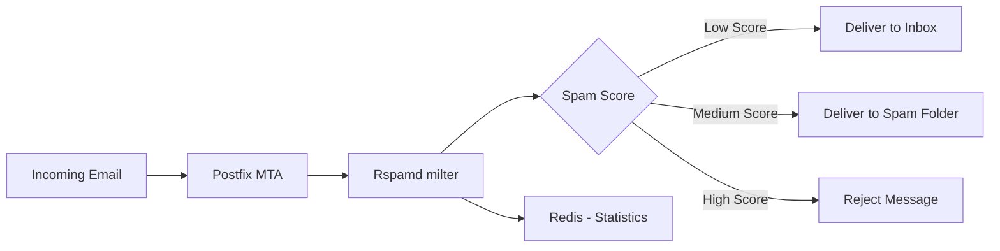

# How to Run Rspamd in Docker for Spam Filtering

Author: [nawazdhandala](https://github.com/nawazdhandala)

Tags: Docker, Rspamd, Spam Filter, Email, Security, Redis, Containers, Mail Server, DevOps

Description: Deploy Rspamd in Docker as a high-performance spam filtering system with Bayesian learning, DKIM signing, greylisting, and Redis-backed statistics.

---

Rspamd is a fast, free, and open-source spam filtering system. It uses a variety of techniques to score incoming email messages, including regular expressions, statistical analysis (Bayesian filtering), URL blacklists, SPF/DKIM/DMARC validation, fuzzy hashing, neural networks, and custom Lua rules. It is written in C for performance and can process thousands of messages per second on modest hardware.

If you run your own mail server with Postfix or any other MTA, Rspamd integrates as a milter (mail filter) to scan incoming and outgoing messages. Docker makes deploying Rspamd straightforward, with Redis as a backend for statistics and learning data.

## Prerequisites

You need:

- Docker Engine 20.10+
- Docker Compose v2
- A mail server (Postfix, Exim, etc.) to integrate with
- At least 1GB of RAM

```bash
# Verify Docker
docker --version
docker compose version
```

## How Rspamd Works

Rspamd sits between your mail transfer agent (MTA) and the mailbox. It examines each message and assigns a spam score based on multiple checks.



## Docker Compose Configuration

Here is a complete setup with Rspamd, Redis, and ClamAV for antivirus scanning.

```yaml
# docker-compose.yml - Rspamd spam filtering stack
version: "3.8"

services:
  # Rspamd - the main spam filtering engine
  rspamd:
    image: rspamd/rspamd:latest
    container_name: rspamd
    ports:
      # Web interface for management and statistics
      - "11334:11334"
      # Milter protocol for MTA integration
      - "11332:11332"
      # Rspamd worker for scanning
      - "11333:11333"
    volumes:
      # Persistent data for learned spam/ham
      - rspamd-data:/var/lib/rspamd
      # Custom configuration overrides
      - ./config/rspamd/local.d:/etc/rspamd/local.d
      - ./config/rspamd/override.d:/etc/rspamd/override.d
    depends_on:
      - redis
    networks:
      - rspamd-network
    restart: unless-stopped

  # Redis stores Rspamd statistics, Bayesian data, and rate limits
  redis:
    image: redis:7-alpine
    container_name: rspamd-redis
    volumes:
      - redis-data:/data
    command: redis-server --maxmemory 256mb --maxmemory-policy volatile-lru
    networks:
      - rspamd-network
    restart: unless-stopped

  # ClamAV for virus scanning (optional, uses ~1GB RAM)
  clamav:
    image: clamav/clamav:latest
    container_name: rspamd-clamav
    volumes:
      - clamav-data:/var/lib/clamav
    networks:
      - rspamd-network
    restart: unless-stopped

volumes:
  rspamd-data:
  redis-data:
  clamav-data:

networks:
  rspamd-network:
    driver: bridge
```

## Configuration Files

Create the configuration directory structure.

```bash
# Create directories for Rspamd configuration overrides
mkdir -p config/rspamd/local.d config/rspamd/override.d
```

### Redis Configuration

Tell Rspamd to use Redis for all its storage needs.

```bash
# config/rspamd/local.d/redis.conf
# Point Rspamd to the Redis container
servers = "redis:6379";
```

Write this to the file.

```bash
# Create the Redis configuration for Rspamd
cat > config/rspamd/local.d/redis.conf << 'EOF'
servers = "redis:6379";
EOF
```

### Classifier Configuration (Bayesian Filtering)

Configure the Bayesian classifier to use Redis.

```bash
# config/rspamd/local.d/classifier-bayes.conf
cat > config/rspamd/local.d/classifier-bayes.conf << 'EOF'
# Use Redis as the backend for Bayesian statistics
backend = "redis";
servers = "redis:6379";

# Minimum number of learned messages before activating the classifier
min_learns = 200;

# Auto-learn from messages with very high or very low scores
autolearn = true;
EOF
```

### DKIM Signing

Configure Rspamd to sign outgoing emails with DKIM.

```bash
# Generate a DKIM key pair
mkdir -p config/rspamd/dkim
openssl genrsa -out config/rspamd/dkim/yourdomain.com.key 2048
openssl rsa -in config/rspamd/dkim/yourdomain.com.key -pubout -out config/rspamd/dkim/yourdomain.com.pub
```

```bash
# config/rspamd/local.d/dkim_signing.conf
cat > config/rspamd/local.d/dkim_signing.conf << 'EOF'
# Enable DKIM signing for outgoing mail
enabled = true;

# DKIM signing configuration
path = "/var/lib/rspamd/dkim/$domain.key";
selector = "dkim";

# Sign messages from these domains
allow_username_mismatch = true;

# Use relaxed canonicalization
sign_headers = "from:sender:reply-to:subject:date:message-id:to:cc:mime-version:content-type:content-transfer-encoding:resent-to:resent-cc:resent-from:resent-sender:resent-message-id:in-reply-to:references:list-id:list-owner:list-unsubscribe:list-subscribe:list-post";
EOF
```

### Greylisting

Greylisting temporarily rejects mail from unknown senders, which stops a significant amount of spam.

```bash
# config/rspamd/local.d/greylist.conf
cat > config/rspamd/local.d/greylist.conf << 'EOF'
# Enable greylisting for unknown senders
enabled = true;

# Delay before accepting greylisted mail (5 minutes)
greylist_min_score = 4;
timeout = 300s;

# Whitelist known good senders after they retry
whitelisted_ip = [
  "127.0.0.1",
];
EOF
```

### Rate Limiting

Prevent abuse by rate-limiting email sending.

```bash
# config/rspamd/local.d/ratelimit.conf
cat > config/rspamd/local.d/ratelimit.conf << 'EOF'
# Rate limits per sender
rates {
  # Limit authenticated users
  to = {
    selector = "rcpts";
    bucket = {
      burst = 100;
      rate = "1 / 1m";
    };
  };
  # Limit by sender IP
  bounce_to_ip = {
    selector = "ip";
    bucket = {
      burst = 5;
      rate = "1 / 5m";
    };
  };
}
EOF
```

### Antivirus Integration

If you are running ClamAV, configure Rspamd to use it.

```bash
# config/rspamd/local.d/antivirus.conf
cat > config/rspamd/local.d/antivirus.conf << 'EOF'
# ClamAV integration
clamav {
  action = "reject";
  type = "clamav";
  servers = "clamav:3310";
  scan_mime_parts = true;
  scan_text_mime = true;
  scan_image_mime = true;
}
EOF
```

### Web Interface Password

Set a password for the Rspamd web dashboard.

```bash
# Generate a password hash
docker run --rm rspamd/rspamd rspamadm pw -p your_password_here

# config/rspamd/local.d/worker-controller.inc
cat > config/rspamd/local.d/worker-controller.inc << 'EOF'
# Password for the web interface (use the hash from rspamadm pw)
password = "$2$your_hashed_password_here";
# Bind to all interfaces for Docker
bind_socket = "*:11334";
EOF
```

## Starting the Stack

```bash
# Start all services
docker compose up -d

# Check the logs
docker compose logs -f rspamd

# Verify all containers are healthy
docker compose ps
```

## Accessing the Web Interface

Open `http://localhost:11334` in your browser and enter the controller password. The dashboard shows:

- Real-time scanning statistics
- Spam/ham ratio charts
- Symbol hit frequencies
- Throughput graphs
- Configuration viewer

## Integrating with Postfix

Configure your Postfix mail server to use Rspamd as a milter.

```bash
# Add these lines to Postfix main.cf
# If Rspamd is on the same Docker network:
smtpd_milters = inet:rspamd:11332
non_smtpd_milters = inet:rspamd:11332
milter_protocol = 6
milter_default_action = accept
milter_mail_macros = i {mail_addr} {client_addr} {client_name} {auth_authen}
```

If Postfix runs on the host, use the published port.

```bash
# For Postfix running on the host machine
smtpd_milters = inet:127.0.0.1:11332
```

## Training the Bayesian Filter

Rspamd learns from messages you classify as spam or ham (not spam).

```bash
# Learn a message as spam
docker exec rspamd rspamc learn_spam < spam_message.eml

# Learn a message as ham (not spam)
docker exec rspamd rspamc learn_ham < ham_message.eml

# Check the learning statistics
docker exec rspamd rspamc stat

# Learn from a directory of messages
for f in /path/to/spam/*.eml; do
  docker exec -i rspamd rspamc learn_spam < "$f"
done
```

## Scanning a Message

Test Rspamd by scanning a message directly.

```bash
# Scan a message file
docker exec -i rspamd rspamc < test_message.eml

# Scan with full symbol details
docker exec -i rspamd rspamc symbols < test_message.eml

# Check a specific URL or domain
docker exec rspamd rspamc urls < test_message.eml
```

## Monitoring and Statistics

```bash
# View real-time statistics
docker exec rspamd rspamc stat

# Check learned message counts
docker exec rspamd rspamc counters

# View the top triggered rules
docker exec rspamd rspamc counters --sort-by=frequency
```

## Updating Rspamd

```bash
# Pull the latest image
docker compose pull

# Restart with the new version
docker compose up -d

# Check the version
docker exec rspamd rspamd --version
```

## Stopping and Cleaning Up

```bash
# Stop all services
docker compose down

# Remove everything including learned data
docker compose down -v
```

## Summary

Rspamd is a powerful, high-performance spam filtering system that integrates cleanly with any mail server through the milter protocol. Running it in Docker with Redis gives you a self-contained filtering stack with Bayesian learning, DKIM signing, greylisting, rate limiting, and antivirus scanning. The web dashboard provides real-time visibility into your mail filtering pipeline. Train the Bayesian filter with your own spam and ham samples, and Rspamd becomes increasingly accurate over time. For anyone running a self-hosted mail server, Rspamd is one of the best spam filtering options available.
