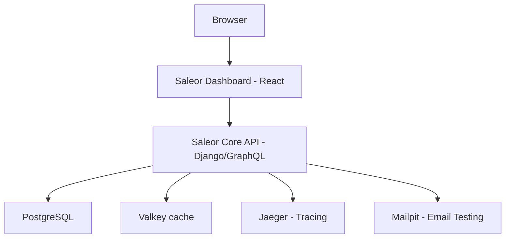

# How to Run Saleor in Docker for E-Commerce

Author: [nawazdhandala](https://github.com/nawazdhandala)

Tags: Docker, Saleor, E-Commerce, Python, GraphQL, PostgreSQL, Redis, Headless Commerce, Container

Description: Step-by-step guide to deploying Saleor, the GraphQL-first headless e-commerce platform, in Docker with PostgreSQL, Redis, and Jaeger for a complete development setup.

---

Saleor is a GraphQL-first, headless e-commerce platform built with Python and Django. It stands out from other commerce platforms because of its API-first design. Every feature is accessible through a well-structured GraphQL API, which gives frontend developers tremendous flexibility. The platform handles everything from product catalogs and inventory management to checkout flows and payment processing.

Running Saleor locally used to require installing Python, PostgreSQL, a cache backend, and several other dependencies by hand. Docker eliminates that friction entirely. This guide walks you through deploying the full Saleor stack in containers.

## Prerequisites

Make sure you have these tools ready:

- Docker Engine 20.10+
- Docker Compose v2
- Git (for cloning the Saleor repository)
- At least 5GB of RAM allocated to Docker

```bash
# Verify your Docker setup

docker --version
docker compose version
git --version
```

## Cloning the Saleor Platform Repository

Saleor provides an official Docker-based setup in their platform repository. This is the fastest way to get started.

```bash
# Clone the official Saleor platform repository
git clone https://github.com/saleor/saleor-platform.git

# Enter the platform directory and follow the Docker Compose workflow
cd saleor-platform
```

## Understanding the Architecture

The Saleor platform consists of several interconnected services.


```mermaid
graph TD
    A[Browser] --> B[Saleor Dashboard - React]
    B --> D[Saleor Core API - Django/GraphQL]
    D --> E[PostgreSQL]
    D --> F[Valkey cache]
    D --> G[Jaeger - Tracing]
    D --> H[Mailpit - Email Testing]
```

## Docker Compose Configuration

If you want to build the setup from scratch instead of using the platform repo, here is a complete Docker Compose file.

```yaml
services:
  # Saleor Core API - the main backend service
  api:
    image: ghcr.io/saleor/saleor:3.23
    ports:
      - "8000:8000"
    restart: unless-stopped
    environment:
      DATABASE_URL: postgres://saleor:saleor@db/saleor
      CACHE_URL: redis://cache:6379/0
      CELERY_BROKER_URL: redis://cache:6379/1
      SECRET_KEY: changeme
      DEFAULT_CHANNEL_SLUG: default-channel
      DASHBOARD_URL: http://localhost:9000/
      ALLOWED_HOSTS: localhost,127.0.0.1,api
      DEFAULT_FROM_EMAIL: noreply@example.com
      EMAIL_URL: smtp://mailpit:1025
      OTEL_SERVICE_NAME: saleor
      OTEL_TRACES_EXPORTER: otlp
      OTEL_EXPORTER_OTLP_ENDPOINT: http://jaeger:4317
    depends_on:
      - db
      - cache
      - jaeger
    volumes:
      - saleor-media:/app/media
    networks:
      - saleor-network

  # Celery worker for async tasks like email sending
  worker:
    image: ghcr.io/saleor/saleor:3.23
    command: celery -A saleor --app=saleor.celeryconf:app worker --loglevel=info -B
    restart: unless-stopped
    environment:
      DATABASE_URL: postgres://saleor:saleor@db/saleor
      CACHE_URL: redis://cache:6379/0
      CELERY_BROKER_URL: redis://cache:6379/1
      SECRET_KEY: changeme
      DEFAULT_CHANNEL_SLUG: default-channel
      DEFAULT_FROM_EMAIL: noreply@example.com
      EMAIL_URL: smtp://mailpit:1025
    depends_on:
      - cache
      - mailpit
    volumes:
      - saleor-media:/app/media
    networks:
      - saleor-network

  # Saleor Dashboard - admin panel
  dashboard:
    image: ghcr.io/saleor/saleor-dashboard:3.23
    ports:
      - "9000:80"
    restart: unless-stopped

  # PostgreSQL database
  db:
    image: postgres:15-alpine
    restart: unless-stopped
    environment:
      POSTGRES_USER: saleor
      POSTGRES_PASSWORD: saleor
    volumes:
      - saleor-db:/var/lib/postgresql/data
    ports:
      - "5432:5432"
    networks:
      - saleor-network

  # Valkey for caching and Celery task queue
  cache:
    image: valkey/valkey:8.1-alpine
    restart: unless-stopped
    ports:
      - "6379:6379"
    volumes:
      - saleor-cache:/data
    networks:
      - saleor-network

  # Jaeger for distributed tracing
  jaeger:
    image: jaegertracing/jaeger
    restart: unless-stopped
    ports:
      - "16686:16686"   # Jaeger UI
      - "4317:4317"     # OTLP gRPC
      - "4318:4318"     # OTLP HTTP
    networks:
      - saleor-network
    volumes:
      - type: tmpfs
        target: /tmp

  # Mailpit catches all outgoing emails for testing
  mailpit:
    image: axllent/mailpit
    restart: unless-stopped
    ports:
      - "8025:8025"    # Web UI
      - "1025:1025"    # SMTP
    networks:
      - saleor-network

volumes:
  saleor-db:
  saleor-cache:
  saleor-media:

networks:
  saleor-network:
    driver: bridge
```

## Starting the Stack

After the initialization commands below have completed, bring up all the services.

```bash
# Start the entire Saleor stack
docker compose up

# Check that all containers are running
docker compose ps

# Watch the API logs for the startup sequence
docker compose logs -f api
```

## Running Database Migrations

Before starting the full stack for the first time, apply database migrations and create an admin user.

```bash
# Apply all database migrations
docker compose run --rm api python3 manage.py migrate

# Create a superuser for the admin dashboard if you are not loading sample data
docker compose run --rm api python3 manage.py createsuperuser
```

Follow the prompts to set up your email and password.

## Populating Sample Data

Saleor includes a command to populate the database with sample products, categories, and other demo data.

```bash
# Populate the database with sample data for testing
docker compose run --rm api python3 manage.py populatedb --createsuperuser

# This creates an admin user with:
# Email: admin@example.com
# Password: admin
```

## Accessing the Services

Once everything is running, these are the URLs for each service:

| Service | URL | Purpose |
|---------|-----|---------|
| GraphQL API | http://localhost:8000/graphql/ | Main API endpoint |
| Dashboard | http://localhost:9000 | Admin panel |
| Jaeger UI | http://localhost:16686 | Distributed tracing |
| Mailpit | http://localhost:8025 | Email testing |

## Querying the GraphQL API

Saleor exposes everything through GraphQL. You can use the built-in GraphiQL interface at `http://localhost:8000/graphql/`.

```graphql
# Query to fetch all products with their names and prices
{
  products(first: 10, channel: "default-channel") {
    edges {
      node {
        name
        description
        pricing {
          priceRange {
            start {
              gross {
                amount
                currency
              }
            }
          }
        }
      }
    }
  }
}
```

You can also query from the command line using curl.

```bash
# Fetch products via curl
curl -X POST http://localhost:8000/graphql/ \
  -H "Content-Type: application/json" \
  -d '{"query": "{ products(first: 5, channel: \"default-channel\") { edges { node { name } } } }"}'
```

## Managing Orders and Checkout

Create a checkout session through the API.

```graphql
# Create a new checkout with a product variant
mutation {
  checkoutCreate(
    input: {
      channel: "default-channel"
      lines: [{ quantity: 1, variantId: "UHJvZHVjdFZhcmlhbnQ6MQ==" }]
      email: "customer@example.com"
    }
  ) {
    checkout {
      id
      totalPrice {
        gross {
          amount
          currency
        }
      }
    }
    errors {
      field
      message
    }
  }
}
```

## Monitoring with Jaeger

Saleor integrates with Jaeger for distributed tracing. Open `http://localhost:16686` in your browser to view traces. Select "saleor" from the service dropdown to see API request traces, database query durations, and external service calls.

## Useful Management Commands

```bash
# Clear the Valkey cache
docker compose exec cache valkey-cli FLUSHALL

# Check the Celery worker status
docker compose exec worker celery -A saleor --app=saleor.celeryconf:app inspect active

# Export products to a file
docker compose exec api python manage.py dumpdata product --indent 2 > products.json

# Run the test suite
docker compose exec api pytest

# Open a Django shell for debugging
docker compose exec api python manage.py shell
```

## Stopping and Cleaning Up

```bash
# Stop all services
docker compose stop

# Remove containers but preserve database data
docker compose down

# Remove everything, including all stored data
docker compose down -v
```

## Summary

Saleor is a powerful headless commerce platform that leverages GraphQL and Django to provide a flexible e-commerce backend. Running it in Docker gives you the local development stack, including the API server, Celery workers for background tasks, a React-based admin dashboard, and observability tools like Jaeger. The setup is reproducible and portable. Whether you are prototyping a new store or building a production-grade commerce platform, Docker makes the path from zero to running much shorter.
