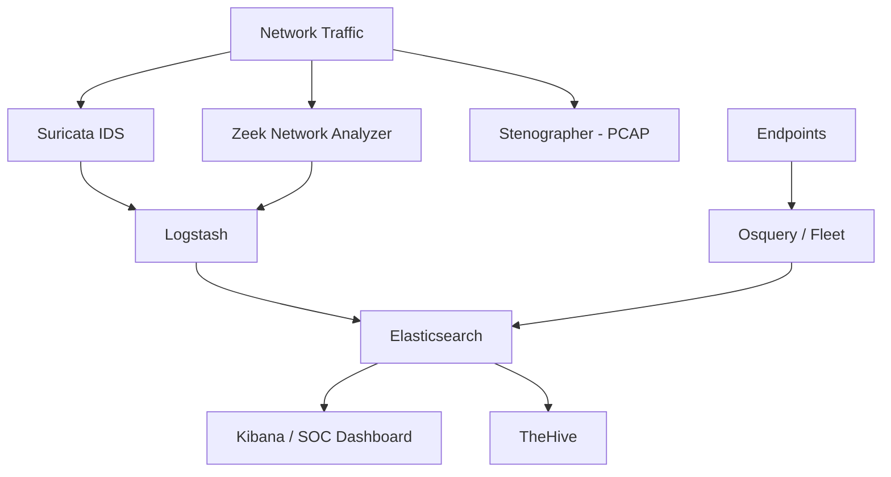

# How to Run Security Onion in Docker

Author: [nawazdhandala](https://github.com/nawazdhandala)

Tags: docker, security onion, network security, IDS, NSM, containerization, threat hunting

Description: Deploy Security Onion network security monitoring suite with Docker for full packet capture, intrusion detection, and threat hunting.

---

Network security monitoring requires capturing traffic, analyzing it for threats, and storing enough data for forensic investigation. Security Onion is a Linux distribution that bundles together the best open-source tools for this job, including Suricata, Zeek, Elasticsearch, and Kibana. While Security Onion traditionally runs as a full operating system, many of its components can run in Docker containers, making it easier to deploy and manage.

This guide covers deploying Security Onion's containerized components and setting up a capable network security monitoring platform.

## Understanding Security Onion's Architecture

Security Onion 2 moved to a containerized architecture internally, even when installed as a full distribution. The platform manages its own Docker containers behind the scenes. The key components include:

- **Suricata** - signature-based intrusion detection engine
- **Zeek** (formerly Bro) - network traffic analyzer that generates detailed logs
- **Stenographer** - full packet capture for forensic analysis
- **Elasticsearch** - stores and indexes all alert and log data
- **Kibana** - visualization and dashboarding
- **TheHive** - incident response case management
- **CyberChef** - data decoding and analysis tool
- **Fleet** - osquery manager for endpoint visibility



## Prerequisites

Security Onion is resource intensive. Network security monitoring generates substantial amounts of data.

- Docker Engine 20.10+
- Docker Compose v2
- Minimum 16 GB RAM (32 GB recommended for production)
- 500 GB+ disk space for packet captures and logs
- A network interface in promiscuous mode for traffic capture
- Linux host (required for packet capture)

```bash
# Enable promiscuous mode on your capture interface
sudo ip link set eth1 promisc on

# Verify the interface is in promiscuous mode
ip link show eth1 | grep PROMISC
```

## Running Individual Security Onion Components

Rather than installing the full Security Onion distribution, you can run its core components individually in Docker. This gives you more control over the deployment and lets you pick only the tools you need.

### Setting Up Suricata

Suricata is the IDS engine that matches network traffic against signature rules.

```yaml
# docker-compose-suricata.yml
version: "3.8"

services:
  suricata:
    image: jasonish/suricata:latest
    container_name: suricata
    # Network host mode required for packet capture
    network_mode: host
    cap_add:
      # Required for raw packet access
      - NET_ADMIN
      - NET_RAW
      - SYS_NICE
    volumes:
      # Persist Suricata logs
      - suricata_logs:/var/log/suricata
      # Custom rules directory
      - ./suricata/rules:/var/lib/suricata/rules
      # Configuration file
      - ./suricata/suricata.yaml:/etc/suricata/suricata.yaml
    # Specify the capture interface
    command: -i eth1 --set outputs.eve-log.filetype=regular
    restart: unless-stopped

volumes:
  suricata_logs:
```

Create a basic Suricata configuration.

```yaml
# suricata/suricata.yaml - Core Suricata settings
%YAML 1.1
---

vars:
  address-groups:
    HOME_NET: "[192.168.0.0/16,10.0.0.0/8,172.16.0.0/12]"
    EXTERNAL_NET: "!$HOME_NET"

af-packet:
  - interface: eth1
    cluster-id: 99
    cluster-type: cluster_flow
    defrag: yes

outputs:
  - eve-log:
      enabled: yes
      filetype: regular
      filename: eve.json
      types:
        - alert
        - http
        - dns
        - tls
        - files
        - flow
```

### Setting Up Zeek

Zeek generates detailed protocol logs from network traffic. It does not use signatures but instead records metadata about every connection.

```yaml
# docker-compose-zeek.yml
version: "3.8"

services:
  zeek:
    image: zeek/zeek:latest
    container_name: zeek
    network_mode: host
    cap_add:
      - NET_ADMIN
      - NET_RAW
    volumes:
      # Zeek log output
      - zeek_logs:/opt/zeek/logs
      # Custom Zeek scripts
      - ./zeek/local.zeek:/opt/zeek/share/zeek/site/local.zeek
    command: zeek -i eth1 local
    restart: unless-stopped

volumes:
  zeek_logs:
```

### Centralizing Logs with Elasticsearch and Kibana

Both Suricata and Zeek produce structured log data. Collect it all in Elasticsearch for searching and visualization.

```yaml
# docker-compose-elk.yml - Elasticsearch and Kibana for log analysis
version: "3.8"

services:
  elasticsearch:
    image: docker.elastic.co/elasticsearch/elasticsearch:8.11.0
    container_name: so-elasticsearch
    environment:
      - discovery.type=single-node
      - xpack.security.enabled=false
      - "ES_JAVA_OPTS=-Xms2g -Xmx2g"
    volumes:
      - es_data:/usr/share/elasticsearch/data
    ports:
      - "9200:9200"
    networks:
      - so-net
    restart: unless-stopped

  kibana:
    image: docker.elastic.co/kibana/kibana:8.11.0
    container_name: so-kibana
    depends_on:
      - elasticsearch
    ports:
      - "5601:5601"
    environment:
      ELASTICSEARCH_HOSTS: '["http://elasticsearch:9200"]'
    networks:
      - so-net
    restart: unless-stopped

  filebeat:
    image: docker.elastic.co/beats/filebeat:8.11.0
    container_name: so-filebeat
    user: root
    volumes:
      - ./filebeat.yml:/usr/share/filebeat/filebeat.yml:ro
      # Mount Suricata logs
      - suricata_logs:/var/log/suricata:ro
      # Mount Zeek logs
      - zeek_logs:/opt/zeek/logs:ro
    networks:
      - so-net
    restart: unless-stopped

volumes:
  es_data:
  suricata_logs:
    external: true
  zeek_logs:
    external: true

networks:
  so-net:
    driver: bridge
```

Configure Filebeat to ship both Suricata and Zeek logs.

```yaml
# filebeat.yml - Collect Suricata and Zeek logs
filebeat.modules:
  - module: suricata
    eve:
      enabled: true
      var.paths: ["/var/log/suricata/eve.json"]

  - module: zeek
    connection:
      enabled: true
      var.paths: ["/opt/zeek/logs/current/conn.log"]
    dns:
      enabled: true
      var.paths: ["/opt/zeek/logs/current/dns.log"]
    http:
      enabled: true
      var.paths: ["/opt/zeek/logs/current/http.log"]
    ssl:
      enabled: true
      var.paths: ["/opt/zeek/logs/current/ssl.log"]
    files:
      enabled: true
      var.paths: ["/opt/zeek/logs/current/files.log"]

output.elasticsearch:
  hosts: ["http://elasticsearch:9200"]

setup.kibana:
  host: "http://kibana:5601"

# Automatically set up dashboards on first run
setup.dashboards.enabled: true
```

## Updating Suricata Rules

Keep your detection capabilities current by regularly updating rules.

```bash
# Update Suricata rules using suricata-update inside the container
docker exec suricata suricata-update

# Add the Emerging Threats ruleset
docker exec suricata suricata-update enable-source et/open

# Reload rules without restarting
docker exec suricata suricatasc -c reload-rules
```

## Threat Hunting Queries

With data flowing into Elasticsearch, use Kibana to hunt for threats across your network traffic.

```bash
# Search for DNS queries to known-bad domains in the last 24 hours
curl -s "http://localhost:9200/filebeat-*/_search" \
  -H "Content-Type: application/json" \
  -d '{
    "query": {
      "bool": {
        "must": [
          {"match": {"event.module": "zeek"}},
          {"match": {"event.dataset": "zeek.dns"}},
          {"range": {"@timestamp": {"gte": "now-24h"}}}
        ]
      }
    },
    "size": 50
  }' | jq '.hits.hits[]._source.dns.question.name'

# Find all Suricata alerts grouped by signature
curl -s "http://localhost:9200/filebeat-*/_search" \
  -H "Content-Type: application/json" \
  -d '{
    "size": 0,
    "query": {"match": {"event.module": "suricata"}},
    "aggs": {
      "top_alerts": {
        "terms": {"field": "suricata.eve.alert.signature.keyword", "size": 20}
      }
    }
  }' | jq '.aggregations.top_alerts.buckets'
```

## Monitoring and Maintenance

```bash
# Check disk usage across all containers
docker system df -v

# Rotate old Elasticsearch indices to free space
curl -X DELETE "http://localhost:9200/filebeat-$(date -d '30 days ago' +%Y.%m.%d)"

# Monitor Suricata performance stats
docker exec suricata cat /var/log/suricata/stats.log | tail -20
```

## Conclusion

Running Security Onion's core components in Docker gives you a flexible network security monitoring platform that you can tailor to your needs. Suricata catches known threats with signatures, Zeek generates rich protocol logs for hunting, and Elasticsearch ties it all together for analysis. Start with the components you need most and expand as your monitoring program matures. The containerized approach means you can scale each component independently and update them without affecting the rest of your stack.
