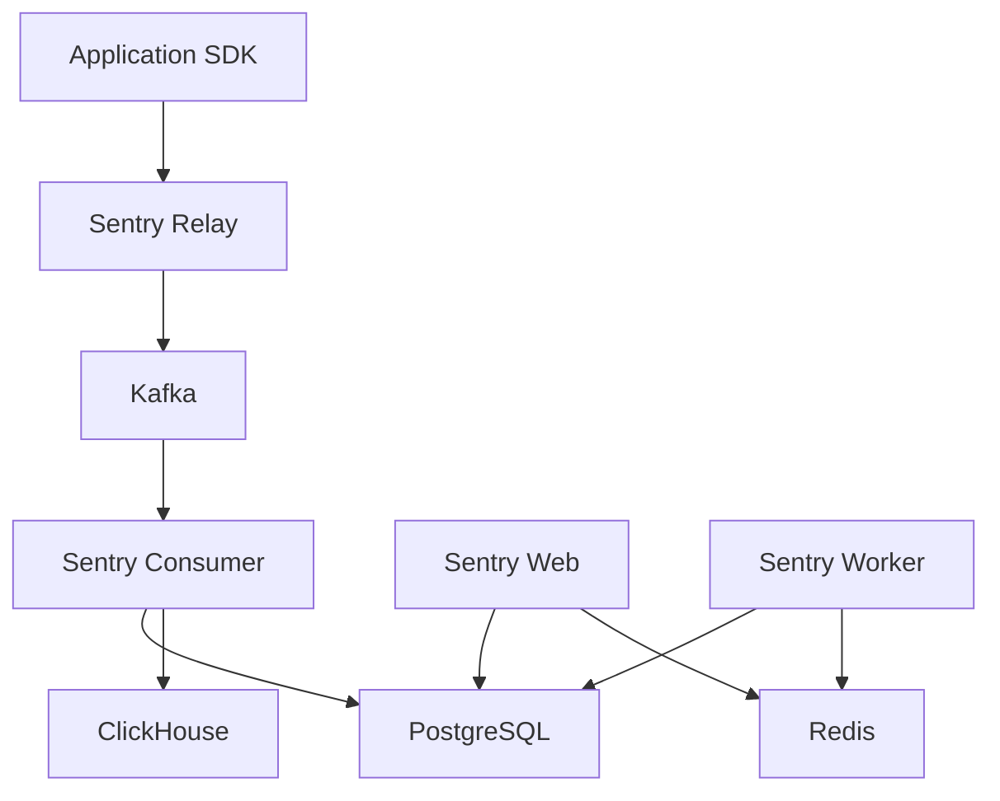

# How to Run Sentry in Docker for Error Tracking

Author: [nawazdhandala](https://github.com/nawazdhandala)

Tags: Docker, Sentry, Error Tracking, Monitoring, Observability, DevOps, Debugging

Description: Deploy a self-hosted Sentry instance in Docker for comprehensive error tracking, performance monitoring, and issue management.

---

Sentry is the leading open-source error tracking platform. It captures exceptions, stack traces, and performance data from your applications and organizes them into actionable issues. While Sentry offers a hosted SaaS service, you can also self-host it for free using Docker. Self-hosting gives you full control over your data, no per-event pricing limits, and the ability to run Sentry behind your firewall.

This guide walks through deploying self-hosted Sentry using Docker, configuring it for production use, and integrating it with a sample application.

## Architecture Overview

Self-hosted Sentry is a complex application with many internal services. It uses PostgreSQL for the primary database, Redis for caching and task queuing, Kafka for event ingestion, ClickHouse for search and analytics, and several Sentry-specific services for processing, symbolication, and the web interface.



## Prerequisites

Self-hosted Sentry requires significant resources. The minimum recommendation is 4 CPU cores and 16GB of RAM, with at least 20GB of free disk space. Docker and Docker Compose must be installed.

```bash
# Check available resources
docker info --format '{{.MemTotal}}'
docker --version
docker compose version
```

## Installing Self-Hosted Sentry

Sentry provides an official installation script that handles the entire setup. Clone the self-hosted repository first.

```bash
# Clone the Sentry self-hosted repository
git clone https://github.com/getsentry/self-hosted.git sentry-docker
cd sentry-docker

# Check out a stable release tag
git checkout 24.2.0
```

Run the installation script. This will pull all necessary Docker images, create the database schema, and generate configuration files.

```bash
# Run the installer - this takes 5-10 minutes
./install.sh
```

During installation, you will be prompted to create a superuser account. This account gives you admin access to the Sentry web UI.

## Starting Sentry

After installation completes, start all services.

```bash
# Start Sentry (this launches ~30 containers)
docker compose up -d

# Check that all services are running
docker compose ps
```

Sentry takes about 1-2 minutes to fully start. Access the web interface at `http://localhost:9000` and log in with the superuser credentials you created during installation.

## Configuration Files

The installation creates several configuration files you should review.

The main config file is `sentry/config.yml`. Here are the key settings.

```yaml
# sentry/config.yml - Core Sentry configuration

# Set your system URL (used in emails and notifications)
system.url-prefix: "http://localhost:9000"

# Mail settings for alert notifications
mail.host: "smtp.example.com"
mail.port: 587
mail.username: "sentry@example.com"
mail.password: "your-smtp-password"
mail.use-tls: true
mail.from: "sentry@example.com"

# File storage for source maps and debug symbols
filestore.backend: "filesystem"
filestore.options:
  location: "/data/files"
```

Additional Python-based settings live in `sentry/sentry.conf.py`.

```python
# sentry/sentry.conf.py - Advanced configuration

# Session cookie settings
SESSION_COOKIE_SECURE = False  # Set to True if using HTTPS

# Increase event retention (default is 90 days)
SENTRY_OPTIONS["system.event-retention-days"] = 180

# Rate limiting for ingestion
SENTRY_OPTIONS["store.ip-rate-limit"] = 0  # 0 = unlimited
SENTRY_OPTIONS["store.project-rate-limit"] = 0

# Enable performance monitoring
SENTRY_OPTIONS["performance.issues.all.problem-detection"] = True
```

## Creating a Project

After logging in, create a new project through the web UI. Go to Settings > Projects > Create Project. Select your platform (e.g., Python, JavaScript, Node.js) and Sentry will generate a DSN (Data Source Name) that your application uses to send events.

The DSN looks like this: `http://your-key@localhost:9000/1`

## Integrating with a Python Application

Here is a complete example of integrating Sentry with a Python Flask application running in Docker.

```dockerfile
# Dockerfile for the Flask app
FROM python:3.12-slim

WORKDIR /app
COPY requirements.txt .
RUN pip install --no-cache-dir -r requirements.txt
COPY . .

CMD ["python", "app.py"]
```

```
# requirements.txt
flask==3.0.0
sentry-sdk[flask]==1.40.0
```

```python
# app.py - Flask app with Sentry integration
import sentry_sdk
from sentry_sdk.integrations.flask import FlaskIntegration
from flask import Flask, jsonify
import os

# Initialize Sentry before creating the Flask app
sentry_sdk.init(
    dsn=os.environ.get("SENTRY_DSN"),
    integrations=[FlaskIntegration()],
    # Capture 100% of transactions for performance monitoring
    traces_sample_rate=1.0,
    # Associate errors with releases for tracking regressions
    release=os.environ.get("APP_VERSION", "1.0.0"),
    environment=os.environ.get("APP_ENV", "development"),
    # Send PII data (disable in production if needed)
    send_default_pii=True,
)

app = Flask(__name__)

@app.route("/")
def index():
    return jsonify({"status": "running"})

@app.route("/error")
def trigger_error():
    # This exception will be captured by Sentry automatically
    division_by_zero = 1 / 0
    return jsonify({"result": division_by_zero})

@app.route("/warning")
def trigger_warning():
    # Manually capture a message
    sentry_sdk.capture_message("This is a warning from the Docker app", level="warning")
    return jsonify({"status": "warning sent"})

@app.route("/user/<user_id>")
def get_user(user_id):
    # Set user context for this request
    sentry_sdk.set_user({"id": user_id, "email": f"user{user_id}@example.com"})
    # Set custom tags for filtering
    sentry_sdk.set_tag("feature", "user-lookup")
    return jsonify({"user_id": user_id})

if __name__ == "__main__":
    app.run(host="0.0.0.0", port=5000, debug=False)
```

Add the Flask app to your Docker Compose file.

```yaml
# Add this to your docker-compose.yml
  flask-app:
    build: ./flask-app
    environment:
      - SENTRY_DSN=http://your-key@sentry-web:9000/1
      - APP_VERSION=1.0.0
      - APP_ENV=development
    ports:
      - "5000:5000"
    depends_on:
      - web  # Sentry web service
```

## JavaScript Frontend Integration

For frontend applications, Sentry captures JavaScript errors and performance data.

```html
<!-- Add the Sentry SDK to your HTML -->
<script
  src="https://browser.sentry-cdn.com/7.100.0/bundle.tracing.min.js"
  crossorigin="anonymous"
></script>
<script>
  Sentry.init({
    // Point to your self-hosted instance
    dsn: "http://your-key@localhost:9000/2",
    integrations: [Sentry.browserTracingIntegration()],
    tracesSampleRate: 1.0,
    release: "frontend@1.0.0",
  });
</script>
```

## Source Maps for Better Stack Traces

Upload source maps so Sentry can display readable stack traces for minified JavaScript.

```bash
# Install the Sentry CLI
npm install -g @sentry/cli

# Upload source maps after your build step
sentry-cli releases new frontend@1.0.0 \
  --url http://localhost:9000 \
  --auth-token YOUR_AUTH_TOKEN \
  --org sentry \
  --project frontend

sentry-cli releases files frontend@1.0.0 upload-sourcemaps ./dist \
  --url http://localhost:9000 \
  --auth-token YOUR_AUTH_TOKEN \
  --org sentry \
  --project frontend
```

## Backup and Maintenance

Back up the Sentry database and configuration regularly.

```bash
# Backup PostgreSQL database
docker compose exec postgres pg_dump -U postgres -d postgres > sentry-backup.sql

# Backup the configuration files
tar czf sentry-config-backup.tar.gz sentry/

# Clean up old data to reclaim disk space
docker compose run --rm web cleanup --days 90
```

## Cleanup

```bash
# Stop all Sentry services and remove data
docker compose down -v
```

## Conclusion

Self-hosted Sentry gives you a powerful error tracking platform with no event limits. The Docker deployment handles the complexity of the many internal services, and once running, it provides the same capabilities as the hosted version. For teams that want error tracking combined with uptime monitoring, alerting, and status pages in a single platform, [OneUptime](https://oneuptime.com) offers an integrated solution that covers both error tracking and infrastructure monitoring.
