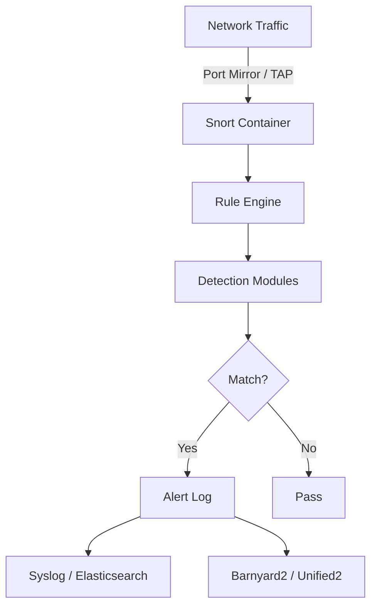

# How to Run Snort IDS in Docker

Author: [nawazdhandala](https://github.com/nawazdhandala)

Tags: Docker, Snort, IDS, Intrusion Detection, Network Security, Packet Analysis, NIDS

Description: Deploy Snort intrusion detection system in Docker for real-time network traffic analysis, threat detection, and security alerting.

---

Snort is one of the most widely deployed intrusion detection systems in the world. Created by Martin Roesch in 1998, it has evolved into a powerful network security tool that performs real-time traffic analysis, protocol inspection, and content matching to detect attacks, probes, and policy violations. Snort can identify port scans, buffer overflow attempts, CGI attacks, SMB probes, and thousands of other threat patterns.

Running Snort in Docker isolates the IDS from the host system and simplifies deployment across multiple network segments. This guide covers deploying Snort 3 in Docker for network intrusion detection, configuring rules, and integrating with log management systems.

## Snort Modes of Operation

Snort operates in three primary modes:

- **Sniffer Mode**: Reads and displays network packets (like tcpdump)
- **Packet Logger Mode**: Logs packets to disk for later analysis
- **Network Intrusion Detection Mode**: Analyzes traffic against rules and generates alerts

For this guide, we focus on the IDS mode since that is the primary production use case.

## Architecture



## Prerequisites

Running Snort for IDS requires access to network traffic. You need either:

- A network TAP or switch port mirror sending traffic to the Docker host
- The host network interface in promiscuous mode
- Docker's host networking mode for the Snort container

## Building a Snort 3 Docker Image

Snort 3 is a complete rewrite with improved performance and a modern architecture. Build a Docker image with the latest version.

```dockerfile
# Dockerfile - Snort 3 IDS
# Builds Snort 3 from packages on Ubuntu
FROM ubuntu:22.04

ENV DEBIAN_FRONTEND=noninteractive

# Install Snort 3 and dependencies
RUN apt-get update && apt-get install -y \
    snort \
    libdaq3 \
    libdnet \
    libhwloc-dev \
    libluajit-5.1-dev \
    libpcap-dev \
    libpcre3-dev \
    zlib1g-dev \
    curl \
    wget \
    net-tools \
    tcpdump \
    && rm -rf /var/lib/apt/lists/*

# Create directories for rules, logs, and configuration
RUN mkdir -p /etc/snort/rules \
    /var/log/snort \
    /usr/local/lib/snort_dynamicrules

# Copy the default configuration
COPY snort.conf /etc/snort/snort.conf
COPY local.rules /etc/snort/rules/local.rules

# Set up the log directory
VOLUME ["/var/log/snort", "/etc/snort/rules"]

# Run Snort in IDS mode on the specified interface
ENTRYPOINT ["snort"]
CMD ["-c", "/etc/snort/snort.conf", "-i", "eth0", "-A", "console", "-l", "/var/log/snort"]
```

## Docker Compose Setup

```yaml
# docker-compose.yml - Snort IDS deployment
# Uses host networking for direct access to network traffic
version: "3.8"

services:
  snort:
    build:
      context: .
      dockerfile: Dockerfile
    container_name: snort-ids
    restart: unless-stopped
    # Host network mode is required for packet capture
    network_mode: host
    cap_add:
      - NET_ADMIN     # Required for promiscuous mode
      - NET_RAW       # Required for raw packet capture
    volumes:
      - ./snort.conf:/etc/snort/snort.conf:ro
      - ./rules:/etc/snort/rules:ro
      - snort-logs:/var/log/snort
    command: >
      -c /etc/snort/snort.conf
      -i eth0
      -A full
      -l /var/log/snort
      --daq-dir /usr/lib/daq
    deploy:
      resources:
        limits:
          cpus: "4.0"
          memory: 4G

volumes:
  snort-logs:
    driver: local
```

## Snort Configuration

Create a snort.conf file tailored to your network.

```bash
# snort.conf - Snort IDS configuration
# Defines network variables, preprocessors, and rule paths

# Network variables - define YOUR network
# HOME_NET should include all IP ranges you want to protect
var HOME_NET [192.168.1.0/24,10.0.0.0/8,172.16.0.0/12]

# EXTERNAL_NET is everything that is NOT your home network
var EXTERNAL_NET !$HOME_NET

# Define specific server groups for targeted rules
var DNS_SERVERS $HOME_NET
var SMTP_SERVERS $HOME_NET
var HTTP_SERVERS $HOME_NET
var SQL_SERVERS $HOME_NET
var SSH_SERVERS $HOME_NET

# Port variables
portvar HTTP_PORTS [80,8080,8443,443]
portvar SSH_PORTS [22]
portvar DNS_PORTS [53]

# Paths
var RULE_PATH /etc/snort/rules
var LOG_DIR /var/log/snort

# Configure the detection engine
config detection: search-method ac-bnfa
config event_queue: max_queue 8 log 5 order_events content_length

# Preprocessor settings
# Stream reassembly for TCP
preprocessor stream5_global: track_tcp yes, track_udp yes, track_icmp yes
preprocessor stream5_tcp: policy balanced, detect_anomalies

# HTTP inspection
preprocessor http_inspect: global iis_unicode_map unicode.map 1252
preprocessor http_inspect_server: server default \
    ports { 80 8080 8443 } \
    server_flow_depth 1460 \
    client_flow_depth 1460

# ARP spoof detection
preprocessor arpspoof
preprocessor arpspoof_detect_host: 192.168.1.1 aa:bb:cc:dd:ee:ff

# Include rule files
include $RULE_PATH/local.rules
include $RULE_PATH/community-rules.rules

# Output plugins
output alert_fast: /var/log/snort/alert.fast
output unified2: filename snort.log, limit 128
```

## Writing Custom Rules

Snort rules define what traffic patterns to detect and alert on.

```bash
# local.rules - Custom Snort detection rules
# Each rule specifies the protocol, source, destination, and content to match

# Detect SSH brute force attempts (more than normal connection rate)
alert tcp $EXTERNAL_NET any -> $SSH_SERVERS $SSH_PORTS \
    (msg:"Potential SSH brute force"; \
    flow:to_server,established; \
    threshold: type both, track by_src, count 5, seconds 60; \
    classtype:attempted-admin; \
    sid:1000001; rev:1;)

# Detect SQL injection attempts in HTTP traffic
alert tcp $EXTERNAL_NET any -> $HTTP_SERVERS $HTTP_PORTS \
    (msg:"SQL Injection attempt detected"; \
    flow:to_server,established; \
    content:"SELECT"; nocase; http_uri; \
    content:"FROM"; nocase; http_uri; \
    content:"WHERE"; nocase; http_uri; \
    classtype:web-application-attack; \
    sid:1000002; rev:1;)

# Detect directory traversal attempts
alert tcp $EXTERNAL_NET any -> $HTTP_SERVERS $HTTP_PORTS \
    (msg:"Directory traversal attempt"; \
    flow:to_server,established; \
    content:"../"; http_uri; \
    content:"../"; http_uri; distance:0; \
    classtype:web-application-attack; \
    sid:1000003; rev:1;)

# Detect outbound DNS queries to known malicious domains
alert udp $HOME_NET any -> $EXTERNAL_NET $DNS_PORTS \
    (msg:"DNS query to suspicious domain"; \
    content:"|01 00 00 01|"; offset:2; depth:4; \
    content:"malware-domain"; nocase; \
    classtype:trojan-activity; \
    sid:1000004; rev:1;)

# Detect ICMP flood (ping flood DDoS)
alert icmp $EXTERNAL_NET any -> $HOME_NET any \
    (msg:"ICMP flood detected"; \
    threshold: type both, track by_src, count 100, seconds 10; \
    classtype:attempted-dos; \
    sid:1000005; rev:1;)

# Detect cleartext password transmission
alert tcp $HOME_NET any -> $EXTERNAL_NET any \
    (msg:"Cleartext password detected in traffic"; \
    flow:to_server,established; \
    content:"password="; nocase; \
    content:!"https"; \
    classtype:policy-violation; \
    sid:1000006; rev:1;)
```

## Downloading Community Rules

Snort community rules provide detection for known threats.

```bash
# Download the latest Snort community rules
wget https://www.snort.org/downloads/community/community-rules.tar.gz

# Extract the rules to the rules directory
tar xzf community-rules.tar.gz -C ./rules/

# For registered users, download subscriber rules (requires oinkcode)
# wget "https://www.snort.org/rules/snortrules-snapshot-31000.tar.gz?oinkcode=YOUR_OINKCODE" \
#   -O snort-rules.tar.gz

# Verify the rules are readable by Snort
docker exec snort-ids snort -c /etc/snort/snort.conf -T
```

## Testing Snort Detection

Verify that Snort is detecting threats correctly.

```bash
# Start Snort in console alert mode to see detections in real time
docker exec -it snort-ids snort -c /etc/snort/snort.conf -i eth0 -A console

# From another machine, trigger a test alert
# This simple ICMP ping should trigger the ICMP flood rule if repeated quickly
ping -f target-ip

# Test HTTP-based rules with curl
curl "http://target-ip/index.php?id=1' OR '1'='1"

# Check the alert log for detections
docker exec snort-ids cat /var/log/snort/alert.fast

# Read the full packet log with Snort
docker exec snort-ids snort -r /var/log/snort/snort.log -A console
```

## Forwarding Alerts to Syslog

Send Snort alerts to your centralized logging system.

```bash
# Add syslog output to snort.conf
# output alert_syslog: LOG_AUTH LOG_ALERT

# Or use Barnyard2 to process unified2 logs and forward them
# Barnyard2 reads the binary output and sends to databases or syslog
```

```yaml
  # Add a syslog forwarder sidecar to the Docker Compose stack
  log-forwarder:
    image: alpine:3.19
    container_name: snort-log-forwarder
    restart: unless-stopped
    volumes:
      - snort-logs:/var/log/snort:ro
    command: >
      sh -c "apk add --no-cache inotify-tools &&
      tail -F /var/log/snort/alert.fast |
      while read line; do
        logger -n syslog-server -P 514 -p local5.alert \"SNORT: $$line\";
      done"
    network_mode: host
```

## Performance Tuning

Snort needs tuning to handle high-bandwidth networks without dropping packets.

```bash
# Check for dropped packets (indicates Snort cannot keep up)
docker exec snort-ids snort --pcap-show-stats

# Increase the packet buffer on the host
sysctl -w net.core.rmem_max=16777216
sysctl -w net.core.rmem_default=16777216

# Use multiple Snort instances with packet distribution
# PF_RING or AF_PACKET with fanout distributes packets across workers
```

## Monitoring Snort Health

Ensure Snort keeps running and detecting threats.

```bash
# Check Snort process status
docker exec snort-ids ps aux | grep snort

# Monitor alert generation rate
docker exec snort-ids wc -l /var/log/snort/alert.fast

# Watch alerts in real time
docker exec snort-ids tail -f /var/log/snort/alert.fast
```

Integrate Snort alert volumes and process health with monitoring tools like OneUptime. Alert your security team when Snort stops generating alerts (which might mean it has crashed) or when alert rates spike (indicating an active attack).

## Production Considerations

For production Snort deployments, place the sensor on a network TAP rather than a switch mirror port - TAPs are more reliable and do not drop packets under load. Tune the HOME_NET variable to accurately reflect your network topology. Start with community rules and add custom rules based on your threat model. Disable rules that generate excessive false positives in your environment. Keep rules updated weekly at minimum. Use multiple Snort instances for networks exceeding 1 Gbps. Store alerts in a SIEM for correlation with other security events.

Snort in Docker provides a proven, community-backed intrusion detection system that you can deploy in minutes. It gives your security team real-time visibility into network threats and serves as an essential layer in a defense-in-depth security strategy.
