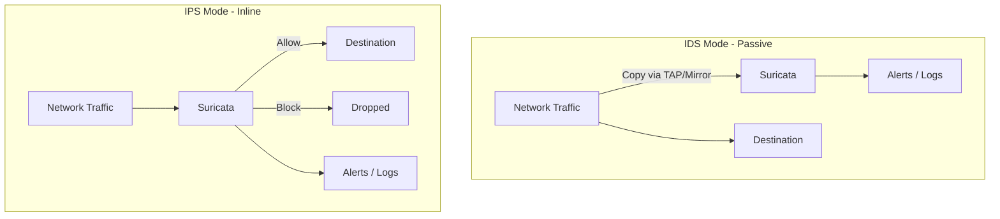

# How to Run Suricata IDS/IPS in Docker

Author: [nawazdhandala](https://github.com/nawazdhandala)

Tags: Docker, Suricata, IDS, IPS, Network Security, Threat Detection, Intrusion Prevention

Description: Deploy Suricata intrusion detection and prevention system in Docker for multi-threaded network security monitoring and threat blocking.

---

Suricata is a high-performance, open-source network threat detection engine developed by the Open Information Security Foundation (OISF). It functions as an intrusion detection system (IDS), intrusion prevention system (IPS), and network security monitoring tool. What sets Suricata apart from older tools like Snort is its multi-threaded architecture, which takes full advantage of modern multi-core processors to handle high-bandwidth networks without dropping packets.

Running Suricata in Docker simplifies deployment and lets you manage security monitoring alongside your other containerized infrastructure. This guide covers setting up Suricata in both IDS and IPS modes, configuring rules, and integrating with the Elastic Stack for visualization.

## IDS vs IPS Mode

Suricata operates in two primary modes:

- **IDS (Intrusion Detection System)**: Passively monitors network traffic and generates alerts when it detects suspicious activity. Traffic is not modified or blocked.
- **IPS (Intrusion Prevention System)**: Sits inline in the traffic path and can actively block malicious packets before they reach their destination.



## Quick Start

Run Suricata in IDS mode with a single command.

```bash
# Start Suricata in IDS mode monitoring the host network
# Host network mode gives Suricata direct access to network interfaces
docker run -d \
  --name suricata \
  --network host \
  --cap-add NET_ADMIN \
  --cap-add NET_RAW \
  --cap-add SYS_NICE \
  -v suricata-logs:/var/log/suricata \
  -v suricata-rules:/var/lib/suricata \
  jasonish/suricata:latest \
  -i eth0
```

## Docker Compose Setup

A production deployment needs persistent configuration, rules management, and log processing.

```yaml
# docker-compose.yml - Suricata IDS/IPS with Elasticsearch and Kibana
# Complete network security monitoring stack
version: "3.8"

services:
  suricata:
    image: jasonish/suricata:latest
    container_name: suricata
    restart: unless-stopped
    network_mode: host
    cap_add:
      - NET_ADMIN       # Manage network interfaces
      - NET_RAW          # Capture raw packets
      - SYS_NICE         # Set thread priorities
    volumes:
      - ./suricata.yaml:/etc/suricata/suricata.yaml:ro
      - ./rules:/var/lib/suricata/rules
      - suricata-logs:/var/log/suricata
      - suricata-run:/var/run/suricata
    command: -i eth0 --set "vars.address-groups.HOME_NET=[192.168.1.0/24,10.0.0.0/8]"

  # Elasticsearch for storing and searching alerts
  elasticsearch:
    image: docker.elastic.co/elasticsearch/elasticsearch:8.12.0
    container_name: suricata-es
    restart: unless-stopped
    environment:
      - discovery.type=single-node
      - xpack.security.enabled=false
      - "ES_JAVA_OPTS=-Xms1g -Xmx1g"
    volumes:
      - es-data:/usr/share/elasticsearch/data
    ports:
      - "9200:9200"

  # Kibana for visualizing Suricata alerts and network data
  kibana:
    image: docker.elastic.co/kibana/kibana:8.12.0
    container_name: suricata-kibana
    restart: unless-stopped
    environment:
      - ELASTICSEARCH_HOSTS=http://elasticsearch:9200
    ports:
      - "5601:5601"
    depends_on:
      - elasticsearch

  # Filebeat ships Suricata logs to Elasticsearch
  filebeat:
    image: docker.elastic.co/beats/filebeat:8.12.0
    container_name: suricata-filebeat
    restart: unless-stopped
    user: root
    volumes:
      - ./filebeat.yml:/usr/share/filebeat/filebeat.yml:ro
      - suricata-logs:/var/log/suricata:ro
    depends_on:
      - elasticsearch

volumes:
  suricata-logs:
  suricata-run:
  es-data:
```

## Suricata Configuration

Create a suricata.yaml configuration file for your environment.

```yaml
# suricata.yaml - Main Suricata configuration
# Controls detection engine, logging, and network settings

# Network variables
vars:
  address-groups:
    HOME_NET: "[192.168.1.0/24,10.0.0.0/8,172.16.0.0/12]"
    EXTERNAL_NET: "!$HOME_NET"
    HTTP_SERVERS: "$HOME_NET"
    DNS_SERVERS: "$HOME_NET"
    SMTP_SERVERS: "$HOME_NET"
    SQL_SERVERS: "$HOME_NET"
  port-groups:
    HTTP_PORTS: "80"
    SHELLCODE_PORTS: "!80"
    SSH_PORTS: "22"
    DNS_PORTS: "53"

# Logging configuration
outputs:
  # EVE JSON log - the primary output format
  # Contains all alerts, metadata, and protocol information
  - eve-log:
      enabled: yes
      filetype: regular
      filename: eve.json
      types:
        - alert:
            metadata: yes
            tagged-packets: yes
            xff:
              enabled: yes
              mode: extra-data
        - http:
            extended: yes
        - dns:
            query: yes
            answer: yes
        - tls:
            extended: yes
        - files:
            force-magic: yes
            force-hash: [md5, sha256]
        - smtp:
            extended: yes
        - flow
        - netflow
        - stats:
            totals: yes
            threads: yes

  # Fast alert log for quick review
  - fast:
      enabled: yes
      filename: fast.log

  # Packet capture for alerts
  - pcap-log:
      enabled: yes
      filename: log.pcap
      limit: 100mb
      max-files: 50
      mode: normal
      conditional: alerts

# Detection engine settings
detect:
  profile: medium
  custom-values:
    toclient-groups: 3
    toserver-groups: 25
  sgh-mpm-context: auto
  inspection-recursion-limit: 3000

# Multi-threading configuration
threading:
  set-cpu-affinity: no
  detect-thread-ratio: 1.0

# Stream engine settings for TCP reassembly
stream:
  memcap: 256mb
  checksum-validation: yes
  reassembly:
    memcap: 512mb
    depth: 1mb
    toserver-chunk-size: 2560
    toclient-chunk-size: 2560

# Application layer protocol detection
app-layer:
  protocols:
    http:
      enabled: yes
      memcap: 64mb
    tls:
      enabled: yes
      detection-ports:
        dp: 443
    dns:
      tcp:
        enabled: yes
      udp:
        enabled: yes
    ssh:
      enabled: yes
    smtp:
      enabled: yes
    ftp:
      enabled: yes

# Rule files
default-rule-path: /var/lib/suricata/rules
rule-files:
  - suricata.rules
  - local.rules
```

## Managing Rules with suricata-update

Suricata includes a built-in rule management tool that downloads and manages rules from multiple sources.

```bash
# Update rules from the default Emerging Threats Open ruleset
docker exec suricata suricata-update

# List available rule sources
docker exec suricata suricata-update list-sources

# Enable additional rule sources
docker exec suricata suricata-update enable-source et/open
docker exec suricata suricata-update enable-source oisf/trafficid

# Update rules and reload Suricata without restart
docker exec suricata suricata-update
docker exec suricata suricatasc -c reload-rules

# Disable specific rules that cause false positives
docker exec suricata suricata-update --disable-sid 2100498,2100366

# Check which rules are loaded
docker exec suricata suricata-update --dump-sample-configs
```

## Writing Custom Rules

Create custom Suricata rules for your specific environment.

```bash
# local.rules - Custom Suricata detection rules
# These supplement the downloaded rulesets with organization-specific detections

# Detect outbound connections to known C2 server IP ranges
alert ip $HOME_NET any -> [203.0.113.0/24] any \
    (msg:"Outbound connection to suspicious IP range"; \
    classtype:trojan-activity; \
    sid:9000001; rev:1;)

# Detect large DNS TXT record responses (possible DNS tunneling)
alert dns $HOME_NET any -> any any \
    (msg:"Large DNS TXT response - possible tunneling"; \
    dns.query; content:"|00 10|"; \
    dsize:>512; \
    threshold: type both, track by_src, count 10, seconds 60; \
    classtype:policy-violation; \
    sid:9000002; rev:1;)

# Detect HTTP requests with encoded shell commands
alert http $EXTERNAL_NET any -> $HTTP_SERVERS any \
    (msg:"HTTP request with encoded shell command"; \
    flow:established,to_server; \
    http.uri; content:"%2F bin%2F"; nocase; \
    classtype:web-application-attack; \
    sid:9000003; rev:1;)

# Detect SSH connections from unexpected countries (using GeoIP)
alert ssh $EXTERNAL_NET any -> $SSH_SERVERS $SSH_PORTS \
    (msg:"SSH connection from non-standard source"; \
    flow:established,to_server; \
    threshold: type both, track by_src, count 3, seconds 300; \
    classtype:attempted-admin; \
    sid:9000004; rev:1;)

# Detect cleartext credentials in HTTP POST
alert http $HOME_NET any -> $EXTERNAL_NET any \
    (msg:"Cleartext credentials in HTTP POST"; \
    flow:established,to_server; \
    http.method; content:"POST"; \
    http.request_body; content:"password"; nocase; \
    classtype:policy-violation; \
    sid:9000005; rev:1;)

# Detect potential data exfiltration via large uploads
alert tcp $HOME_NET any -> $EXTERNAL_NET any \
    (msg:"Large outbound data transfer - possible exfiltration"; \
    flow:established,to_server; \
    dsize:>50000; \
    threshold: type both, track by_src, count 100, seconds 300; \
    classtype:policy-violation; \
    sid:9000006; rev:1;)
```

## Filebeat Configuration

Ship Suricata logs to Elasticsearch for analysis and visualization.

```yaml
# filebeat.yml - Ship Suricata EVE JSON logs to Elasticsearch
filebeat.inputs:
  - type: log
    enabled: true
    paths:
      - /var/log/suricata/eve.json
    json.keys_under_root: true
    json.add_error_key: true
    json.overwrite_keys: true

output.elasticsearch:
  hosts: ["elasticsearch:9200"]
  index: "suricata-%{+yyyy.MM.dd}"

setup.template:
  name: "suricata"
  pattern: "suricata-*"

setup.ilm.enabled: false
```

## Running in IPS Mode

To run Suricata as an inline IPS that actively blocks malicious traffic, you need additional configuration.

```bash
# Run Suricata in IPS mode using NFQ (Netfilter Queue)
# First, set up iptables to send traffic through Suricata
iptables -I FORWARD -j NFQUEUE --queue-num 0
iptables -I INPUT -j NFQUEUE --queue-num 0
iptables -I OUTPUT -j NFQUEUE --queue-num 0

# Run Suricata in NFQ mode
docker run -d \
  --name suricata-ips \
  --network host \
  --cap-add NET_ADMIN \
  --cap-add NET_RAW \
  --cap-add SYS_NICE \
  -v ./suricata.yaml:/etc/suricata/suricata.yaml:ro \
  -v suricata-logs:/var/log/suricata \
  jasonish/suricata:latest \
  --set nfq.mode=accept \
  -q 0
```

Change rule actions from `alert` to `drop` for traffic you want to block.

```bash
# In IPS mode, use 'drop' instead of 'alert' to block traffic
drop tcp $EXTERNAL_NET any -> $HTTP_SERVERS $HTTP_PORTS \
    (msg:"Blocked SQL injection attempt"; \
    flow:established,to_server; \
    http.uri; content:"UNION SELECT"; nocase; \
    classtype:web-application-attack; \
    sid:9000010; rev:1;)
```

## Monitoring Suricata Performance

Track Suricata's performance to ensure it keeps up with network traffic.

```bash
# Check Suricata stats via the Unix socket
docker exec suricata suricatasc -c "dump-counters"

# View real-time performance metrics
docker exec suricata suricatasc -c "iface-stat eth0"

# Check for packet drops (indicates performance issues)
docker exec suricata suricatasc -c "dump-counters" | grep -i drop

# Monitor the alert rate
docker exec suricata wc -l /var/log/suricata/fast.log

# Watch alerts in real time
docker exec suricata tail -f /var/log/suricata/fast.log

# Parse EVE JSON for specific alert types
docker exec suricata sh -c "cat /var/log/suricata/eve.json | python3 -c \"
import sys, json
for line in sys.stdin:
    try:
        event = json.loads(line)
        if event.get('event_type') == 'alert':
            print(f\\\"{event['timestamp']} [{event['alert']['severity']}] {event['alert']['signature']}\\\")
    except: pass
\" | tail -20"
```

## Rule Tuning

Reduce false positives by tuning rules for your environment.

```yaml
# threshold.config - Suppress and threshold noisy rules
# Place in /etc/suricata/threshold.config

# Suppress a rule entirely for a specific source
suppress gen_id 1, sig_id 2100498, track by_src, ip 192.168.1.50

# Threshold a noisy rule to only alert once per minute per source
threshold gen_id 1, sig_id 2210000, type limit, track by_src, count 1, seconds 60

# Rate-limit a chatty rule
rate_filter gen_id 1, sig_id 2210050, track by_src, count 10, seconds 60, new_action alert, timeout 600
```

## Backup and Maintenance

Keep your Suricata deployment healthy with regular maintenance.

```bash
# Back up custom rules and configuration
docker cp suricata:/etc/suricata/suricata.yaml ./backup/
docker cp suricata:/var/lib/suricata/rules/local.rules ./backup/

# Rotate log files to prevent disk exhaustion
docker exec suricata suricatasc -c "reopen-log-files"

# Check disk usage of the log volume
docker exec suricata du -sh /var/log/suricata/
```

## Production Recommendations

For production Suricata deployments, use AF_PACKET or PF_RING for high-performance packet capture on busy networks. Pin Suricata threads to specific CPU cores for consistent performance. Start in IDS mode to understand your traffic patterns and false positive rates before switching to IPS mode. Update rules at least daily using suricata-update. Monitor packet drop rates and scale up resources if Suricata falls behind. Forward all EVE JSON logs to a SIEM or Elasticsearch for historical analysis. Track Suricata health with OneUptime to get alerts when the sensor goes down or starts dropping packets.

Suricata in Docker provides a modern, multi-threaded network security engine that detects and optionally blocks threats in real time. Its multi-threaded design handles the bandwidth demands of modern networks, and its comprehensive protocol analysis catches threats that simpler tools miss.
