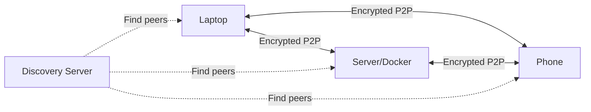

# How to Run Syncthing in Docker for File Synchronization

Author: [nawazdhandala](https://github.com/nawazdhandala)

Tags: docker, syncthing, file-sync, peer-to-peer, self-hosted, backup

Description: Deploy Syncthing in Docker to synchronize files between devices without relying on cloud storage or third-party servers.

---

Syncthing is an open-source, peer-to-peer file synchronization tool that keeps folders in sync across multiple devices without sending your data through any third-party servers. Every connection is encrypted end-to-end, and the relay infrastructure used for NAT traversal never sees your file contents. Docker deployment makes Syncthing easy to run on servers, NAS devices, and headless machines.

## Why Syncthing?

Dropbox, Google Drive, and OneDrive all require your files to pass through corporate servers. Syncthing connects your devices directly. Files travel between your own machines over encrypted connections. There is no cloud storage involved, no file size limits, no monthly fees, and no vendor lock-in. If both devices are on the same network, sync happens at full LAN speed.

## How Syncthing Works



Each device has a unique ID derived from its TLS certificate. Devices find each other through global discovery servers (which only know device IDs and IP addresses, never file contents) or local network announcements. Once connected, file changes propagate in real time.

## Prerequisites

- A Linux server with Docker and Docker Compose installed
- At least 512 MB of RAM
- Storage space for the files you want to sync
- Other Syncthing instances on devices you want to sync with (desktop apps available for all platforms)

## Project Setup

```bash
# Create the Syncthing project directory
mkdir -p ~/syncthing/{config,data}
cd ~/syncthing
```

## Docker Compose Configuration

```yaml
# docker-compose.yml - Syncthing File Synchronization
version: "3.8"

services:
  syncthing:
    image: syncthing/syncthing:latest
    container_name: syncthing
    restart: unless-stopped
    ports:
      # Web UI
      - "8384:8384"
      # Syncthing protocol (TCP and UDP for file transfers)
      - "22000:22000/tcp"
      - "22000:22000/udp"
      # Local discovery
      - "21027:21027/udp"
    environment:
      # Run as your user to match file permissions
      - PUID=1000
      - PGID=1000
      # Set timezone
      - TZ=America/New_York
    volumes:
      # Syncthing configuration and database
      - ./config:/var/syncthing/config
      # Sync folder - mount the directory you want to synchronize
      - ./data:/var/syncthing/data
      # You can mount additional directories as needed
      - /mnt/documents:/var/syncthing/documents
      - /mnt/photos:/var/syncthing/photos
    hostname: my-server
```

## Starting Syncthing

```bash
# Start Syncthing in detached mode
docker compose up -d
```

Check the logs:

```bash
# Verify Syncthing started successfully
docker compose logs -f syncthing
```

Open `http://<your-server-ip>:8384` in your browser. On the first visit, Syncthing generates a device ID and shows the main dashboard.

## Securing the Web UI

The first time you access the UI, Syncthing asks you to set a password. Do this immediately, especially if the server is accessible from the internet:

1. Click Actions (top right) > Settings
2. Go to the GUI tab
3. Set a username and password
4. Enable HTTPS for the GUI (optional but recommended)

You can also restrict the listening address to localhost if you only access it through SSH tunneling:

```bash
# Access the UI securely through an SSH tunnel
ssh -L 8384:localhost:8384 user@your-server
# Then open http://localhost:8384 in your local browser
```

## Understanding Device IDs

Every Syncthing instance has a unique device ID, a long string of letters and numbers. Find your Docker instance's ID on the main dashboard or in the logs:

```bash
# Get the device ID from logs
docker compose logs syncthing | grep "My ID"
```

The device ID looks something like: `ABCDEFG-HIJKLMN-OPQRSTU-VWXYZ12-3456789-ABCDEFG-HIJKLMN-OPQRSTU`

You will need to exchange device IDs between the machines you want to sync.

## Connecting Two Devices

To connect your Docker Syncthing instance with another device:

1. On Device A (Docker), click "Add Remote Device"
2. Enter Device B's ID
3. Give it a friendly name (e.g., "My Laptop")
4. Click Save

On Device B, accept the incoming connection request when it appears. Both devices now know about each other but are not sharing any folders yet.

## Setting Up Shared Folders

To sync a folder between devices:

1. On the Docker instance, click "Add Folder"
2. Set the Folder Label (display name) and Folder Path (e.g., `/var/syncthing/documents`)
3. Under the Sharing tab, check the remote devices that should have this folder
4. Under File Versioning, choose a versioning strategy (recommended for safety)
5. Click Save

On the remote device, accept the incoming folder share when prompted and choose where to store the files locally.

## File Versioning

Syncthing can keep old versions of modified or deleted files. Configure versioning per folder:

- **Trash Can** - Deleted files are moved to a `.stversions` folder. Simple and effective.
- **Simple** - Keeps the last N versions of each file.
- **Staggered** - Keeps versions with decreasing frequency over time (hourly for the past day, daily for the past month, weekly for the past year).
- **External** - Calls an external command for custom versioning.

```yaml
# Example: staggered versioning configuration in the Syncthing XML config
# Files versioned: hourly for 1 day, daily for 30 days, weekly for 1 year
<versioning type="staggered">
    <param key="cleanInterval" val="3600"></param>
    <param key="maxAge" val="31536000"></param>
</versioning>
```

## Ignore Patterns

Create a `.stignore` file in a synced folder to exclude files from synchronization:

```
# .stignore - Patterns for files to exclude from sync
# Ignore OS-generated files
.DS_Store
Thumbs.db
desktop.ini

# Ignore temporary files
*.tmp
*.temp
~*

# Ignore build outputs
node_modules
__pycache__
.git

# Ignore large media files in a documents folder
*.mp4
*.mkv
*.iso
```

Place the `.stignore` file in the root of the synced folder. Changes take effect immediately.

## Folder Types

Syncthing supports different folder types for different use cases:

- **Send & Receive** - Full two-way sync. Changes on any device propagate to all others.
- **Send Only** - This device sends changes but ignores incoming changes. Useful for a server that is the authoritative source.
- **Receive Only** - This device receives changes but does not push local modifications. Good for backup destinations.

For a backup scenario, set the server's folder to "Send Only" and the backup device's folder to "Receive Only."

## Monitoring Sync Status

The web UI shows sync progress, connected devices, and transfer rates. For headless monitoring, use the REST API:

```bash
# Check sync completion status for all folders
curl -s -H "X-API-Key: YOUR_API_KEY" \
  http://localhost:8384/rest/db/completion | python3 -m json.tool

# Check connected devices
curl -s -H "X-API-Key: YOUR_API_KEY" \
  http://localhost:8384/rest/system/connections | python3 -m json.tool
```

Find your API key in the Syncthing web UI under Actions > Settings > API Key.

## Performance Tuning

For large sync operations, adjust these settings in the web UI under Actions > Advanced:

- Increase `maxFolderConcurrency` if syncing many folders
- Adjust `maxSendKbps` and `maxRecvKbps` to limit bandwidth usage
- Set `pullerMaxPendingKiB` higher for faster sync of large files

## Backup Considerations

Since Syncthing is a sync tool, not a backup tool, deleted files propagate to all devices. File versioning provides some protection, but you should still maintain independent backups. Use Syncthing to sync files to a server, then run separate backup software on the server.

## Monitoring with OneUptime

Monitor your Syncthing instance with OneUptime. Set up an HTTP monitor against the web UI on port 8384. If Syncthing goes down, files stop syncing and changes can diverge between devices. Early detection lets you restore service before conflicts build up.

## Wrapping Up

Syncthing in Docker gives you private, encrypted file synchronization without trusting any third party with your data. The peer-to-peer architecture eliminates single points of failure, and the Docker deployment keeps the installation clean and portable. Whether you are syncing documents between a laptop and a server or maintaining backup copies across multiple locations, Syncthing handles it reliably.
