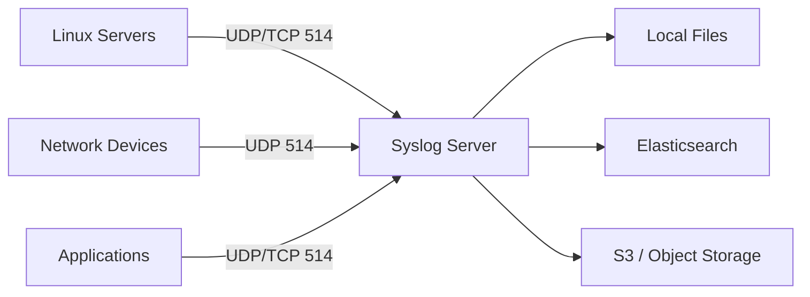

# How to Run Syslog Server in Docker

Author: [nawazdhandala](https://github.com/nawazdhandala)

Tags: Docker, Syslog, Logging, Rsyslog, Syslog-ng, Log Management, Network Monitoring

Description: Deploy a centralized syslog server in Docker to collect, parse, and store log messages from servers, network devices, and applications.

---

Syslog is the universal language of system logging. Every Linux server, network switch, firewall, and countless applications speak syslog natively. A centralized syslog server collects these messages into one place, making it possible to search across your entire infrastructure, correlate events from different sources, and maintain audit trails for compliance.

Running a syslog server in Docker gives you a flexible, portable log collection platform. This guide covers deploying both rsyslog and syslog-ng in Docker, with configurations for receiving logs from network devices, parsing structured data, and forwarding to modern log management systems.

## Syslog Basics

Syslog messages carry a facility (where the message came from), a severity level (how important it is), a timestamp, a hostname, and the message body. The protocol operates on UDP port 514 (traditional, unreliable) and TCP port 514 (reliable delivery). Modern implementations also support TLS encryption on port 6514.



## Quick Start with rsyslog

rsyslog is the default syslog daemon on most Linux distributions. It handles high message volumes efficiently.

```bash
# Start an rsyslog server that accepts logs on UDP and TCP port 514
docker run -d \
  --name syslog-server \
  -p 514:514/udp \
  -p 514:514/tcp \
  -v syslog-data:/var/log \
  rsyslog/syslog_appliance_alpine:latest
```

## Docker Compose with rsyslog

A production setup includes persistent storage, custom configuration, and log rotation.

```yaml
# docker-compose.yml - Centralized rsyslog server
# Receives logs from all infrastructure and stores them organized by host
version: "3.8"

services:
  rsyslog:
    image: rsyslog/syslog_appliance_alpine:latest
    container_name: syslog-server
    restart: unless-stopped
    ports:
      - "514:514/udp"    # Traditional syslog (UDP)
      - "514:514/tcp"    # Reliable syslog (TCP)
      - "6514:6514/tcp"  # Syslog over TLS
    volumes:
      - ./rsyslog.conf:/etc/rsyslog.conf:ro
      - ./rsyslog.d:/etc/rsyslog.d:ro
      - syslog-logs:/var/log/remote
    environment:
      - TZ=UTC
    deploy:
      resources:
        limits:
          cpus: "2.0"
          memory: 512M

volumes:
  syslog-logs:
    driver: local
```

## rsyslog Configuration

Create an rsyslog.conf that receives logs and organizes them by source hostname.

```bash
# rsyslog.conf - Central syslog server configuration
# Receives logs via UDP, TCP, and TLS, then stores by hostname and facility

# Load required modules
module(load="imudp")    # UDP syslog input
module(load="imtcp")    # TCP syslog input

# Listen on standard syslog ports
input(type="imudp" port="514")
input(type="imtcp" port="514")

# Global settings
global(
    workDirectory="/var/lib/rsyslog"
    maxMessageSize="8k"
)

# Template to organize log files by hostname and date
# Creates /var/log/remote/HOSTNAME/YYYY-MM-DD/facility.log
template(name="RemoteLogByHost" type="string"
    string="/var/log/remote/%HOSTNAME%/%$YEAR%-%$MONTH%-%$DAY%/%syslogfacility-text%.log"
)

# Template for structured log format with all metadata
template(name="DetailedFormat" type="string"
    string="%TIMESTAMP:::date-rfc3339% %HOSTNAME% %syslogtag%%msg:::sp-if-no-1st-sp%%msg:::drop-last-lf%\n"
)

# Store all remote logs organized by hostname
if $fromhost-ip != "127.0.0.1" then {
    action(
        type="omfile"
        dynaFile="RemoteLogByHost"
        template="DetailedFormat"
        dirCreateMode="0755"
        fileCreateMode="0644"
    )
    stop
}

# Local system logs
*.info;mail.none;authpriv.none;cron.none   /var/log/messages
authpriv.*                                  /var/log/secure
mail.*                                      /var/log/maillog
cron.*                                      /var/log/cron
```

## Syslog-ng Alternative

syslog-ng offers a more flexible configuration language and built-in support for parsing structured log formats.

```yaml
# docker-compose.yml - Syslog-ng server
version: "3.8"

services:
  syslog-ng:
    image: balabit/syslog-ng:latest
    container_name: syslog-ng-server
    restart: unless-stopped
    ports:
      - "514:514/udp"
      - "514:514/tcp"
      - "6514:6514/tcp"
    volumes:
      - ./syslog-ng.conf:/etc/syslog-ng/syslog-ng.conf:ro
      - syslog-logs:/var/log/remote
    command: ["syslog-ng", "-F", "--no-caps"]

volumes:
  syslog-logs:
```

```bash
# syslog-ng.conf - Syslog-ng server configuration
# Receives, parses, and stores logs with flexible routing

@version: 4.0
@include "scl.conf"

# Global options
options {
    chain_hostnames(off);
    use_dns(no);
    use_fqdn(no);
    keep_hostname(yes);
    stats_freq(3600);
    mark_freq(0);
    threaded(yes);
};

# Sources - where logs come from
source s_network {
    # UDP input (traditional syslog)
    network(
        transport("udp")
        port(514)
    );
    # TCP input (reliable delivery)
    network(
        transport("tcp")
        port(514)
    );
};

# Parse Cisco-style syslog messages
parser p_cisco {
    syslog-parser(
        flags(no-hostname)
    );
};

# Destination - store logs organized by host and facility
destination d_remote_by_host {
    file(
        "/var/log/remote/${HOST}/${YEAR}-${MONTH}-${DAY}/${FACILITY}.log"
        create_dirs(yes)
        dir_perm(0755)
        perm(0644)
    );
};

# Destination - forward to Elasticsearch (optional)
# destination d_elasticsearch {
#     elasticsearch-http(
#         url("http://elasticsearch:9200/_bulk")
#         index("syslog-${YEAR}.${MONTH}.${DAY}")
#         type("")
#     );
# };

# All-in-one log file for quick searching
destination d_all {
    file(
        "/var/log/remote/all.log"
        template("${ISODATE} ${HOST} ${FACILITY}.${LEVEL} ${MSGHDR}${MSG}\n")
    );
};

# Log routing - connect sources to destinations
log {
    source(s_network);
    destination(d_remote_by_host);
    destination(d_all);
};
```

## Configuring Log Sources

### Linux Servers

Configure rsyslog on each Linux server to forward logs to your central server.

```bash
# On each Linux server, create /etc/rsyslog.d/50-remote.conf
# Forward all logs to the central syslog server over TCP
*.* @@192.168.1.5:514

# Or use UDP (faster but unreliable)
# *.* @192.168.1.5:514

# Forward only specific facilities/severities
# auth,authpriv.* @@192.168.1.5:514
# *.err @@192.168.1.5:514

# Restart rsyslog to apply changes
# systemctl restart rsyslog
```

### Network Devices

Configure network devices to send syslog to your Docker server.

```bash
# Cisco IOS
# logging host 192.168.1.5
# logging trap informational
# logging facility local7
# logging source-interface Loopback0

# Juniper JunOS
# set system syslog host 192.168.1.5 any info
# set system syslog host 192.168.1.5 facility-override local7

# Palo Alto Firewall
# set shared log-settings syslog syslog-server server 192.168.1.5
# set shared log-settings syslog syslog-server transport UDP port 514
```

### Docker Containers

Docker can send container logs to your syslog server using the syslog logging driver.

```bash
# Run a container with syslog logging
docker run -d \
  --name my-app \
  --log-driver syslog \
  --log-opt syslog-address=tcp://192.168.1.5:514 \
  --log-opt syslog-facility=local0 \
  --log-opt tag="my-app" \
  nginx:alpine
```

## Log Rotation

Prevent disk space from filling up with automated log rotation.

```bash
# logrotate.conf - Rotate syslog files daily, keep 30 days
# Mount this into the container or run logrotate as a sidecar
/var/log/remote/*/*.log
/var/log/remote/*/*/*.log {
    daily
    rotate 30
    compress
    delaycompress
    missingok
    notifempty
    create 0644 root root
    sharedscripts
    postrotate
        /bin/kill -HUP $(cat /var/run/syslogd.pid 2>/dev/null) 2>/dev/null || true
    endscript
}
```

```yaml
  # Add a logrotate sidecar to the Docker Compose stack
  logrotate:
    image: alpine:3.19
    container_name: syslog-logrotate
    restart: unless-stopped
    volumes:
      - syslog-logs:/var/log/remote
      - ./logrotate.conf:/etc/logrotate.d/syslog:ro
    entrypoint: /bin/sh
    command: ["-c", "while true; do logrotate /etc/logrotate.d/syslog; sleep 86400; done"]
```

## Forwarding to Modern Log Platforms

Forward syslog data to Elasticsearch, Splunk, or other analysis platforms.

```bash
# rsyslog forwarding to Elasticsearch using the omelasticsearch module
# Add this to your rsyslog.d directory

module(load="omelasticsearch")

template(name="elasticsearch-index" type="string" string="syslog-%$YEAR%.%$MONTH%.%$DAY%")

template(name="json-syslog" type="list") {
    constant(value="{")
    constant(value="\"@timestamp\":\"") property(name="timereported" dateFormat="rfc3339") constant(value="\",")
    constant(value="\"host\":\"") property(name="hostname") constant(value="\",")
    constant(value="\"severity\":\"") property(name="syslogseverity-text") constant(value="\",")
    constant(value="\"facility\":\"") property(name="syslogfacility-text") constant(value="\",")
    constant(value="\"tag\":\"") property(name="syslogtag" format="json") constant(value="\",")
    constant(value="\"message\":\"") property(name="msg" format="json") constant(value="\"")
    constant(value="}")
}

action(
    type="omelasticsearch"
    server="elasticsearch"
    serverport="9200"
    template="json-syslog"
    searchIndex="elasticsearch-index"
    dynSearchIndex="on"
    bulkmode="on"
    queue.type="linkedlist"
    queue.size="5000"
    queue.dequeuebatchsize="300"
    action.resumeretrycount="-1"
)
```

## Searching Logs

Use standard command-line tools to search through collected logs.

```bash
# Search for authentication failures across all hosts
docker exec syslog-server grep -r "authentication failure" /var/log/remote/

# Find all logs from a specific host in the last hour
docker exec syslog-server find /var/log/remote/router-01/ -name "*.log" -mmin -60 -exec cat {} \;

# Count log messages per host for the current day
docker exec syslog-server sh -c 'for dir in /var/log/remote/*/; do host=$(basename "$dir"); count=$(cat "$dir"/$(date +%Y-%m-%d)/*.log 2>/dev/null | wc -l); echo "$host: $count messages"; done'
```

## Monitoring the Syslog Server

Make sure your syslog server stays healthy and keeps up with incoming messages.

```bash
# Check rsyslog internal statistics
docker exec syslog-server rsyslogd -N1

# Monitor disk usage of the log volume
docker exec syslog-server du -sh /var/log/remote/

# Watch incoming logs in real time
docker exec syslog-server tail -f /var/log/remote/all.log
```

Integrate syslog server health monitoring with OneUptime to get alerts when the server stops receiving logs or when disk usage approaches capacity.

## Production Tips

Use TCP instead of UDP for log transport whenever possible to prevent message loss. Enable TLS encryption for syslog traffic that crosses network boundaries. Set appropriate rate limits to prevent a log flood from a single source from overwhelming the server. Configure disk-based queuing in rsyslog so messages are not lost during destination outages. Plan your storage based on message volume - a busy network with 100 devices can easily generate several gigabytes of logs per day. Back up your logs to object storage for long-term retention and compliance.

A centralized syslog server in Docker is the foundation of infrastructure observability. It gives you a single place to search for events, investigate incidents, and maintain the audit trail that security and compliance requirements demand.
