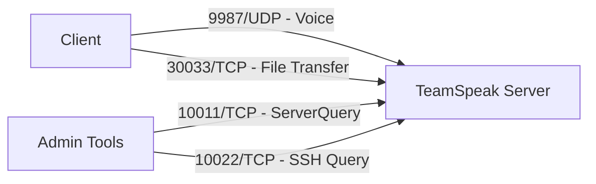

# How to Run TeamSpeak Server in Docker

Author: [nawazdhandala](https://github.com/nawazdhandala)

Tags: Docker, TeamSpeak, Voice Chat, VoIP, Gaming, Self-Hosted, Communication

Description: Deploy a TeamSpeak voice communication server using Docker with persistent storage, query access, and production configuration.

---

TeamSpeak has been a staple in voice communication for gaming communities, esports teams, and professional organizations for over two decades. Its client-server architecture provides low-latency voice chat with fine-grained permission systems, making it a reliable choice when you need a private, self-hosted voice platform.

Running TeamSpeak in Docker eliminates the usual friction of installing dependencies and managing service files. This guide walks through the complete process of deploying a TeamSpeak 3 server in Docker, from initial setup to production hardening.

## Prerequisites

You need the following before starting:

- Docker and Docker Compose installed on your server
- At least 512 MB of RAM and 1 CPU core (TeamSpeak is lightweight)
- Ports 9987/udp, 10011/tcp, 10022/tcp, and 30033/tcp available
- Acceptance of the TeamSpeak license agreement

## Understanding TeamSpeak Ports

TeamSpeak uses several ports for different functions.



- Port 9987 UDP: The main voice communication channel
- Port 30033 TCP: File transfer for sharing files within channels
- Port 10011 TCP: ServerQuery interface for remote administration
- Port 10022 TCP: SSH-based ServerQuery (alternative to raw TCP)

## Quick Start

Start a TeamSpeak server with a single command. You must accept the license agreement by setting the environment variable.

```bash
# Launch TeamSpeak with license acceptance
# The TS3SERVER_LICENSE=accept flag is required on first run
docker run -d \
  --name teamspeak \
  -p 9987:9987/udp \
  -p 10011:10011 \
  -p 10022:10022 \
  -p 30033:30033 \
  -e TS3SERVER_LICENSE=accept \
  -v ts3-data:/var/ts3server \
  teamspeak:3
```

After starting the container, retrieve the admin token and ServerQuery credentials from the logs.

```bash
# View the initial setup output containing the admin token
# Save these credentials - they are only shown once on first boot
docker logs teamspeak
```

The output will include a ServerAdmin privilege key (token) that you enter in the TeamSpeak client to claim admin rights, plus the ServerQuery admin password.

## Docker Compose Setup

A Docker Compose file provides a cleaner, reproducible setup.

```yaml
# docker-compose.yml for TeamSpeak 3 server
# Persistent volumes ensure data survives container recreation
version: "3.8"

services:
  teamspeak:
    image: teamspeak:3
    container_name: teamspeak-server
    restart: unless-stopped
    ports:
      - "9987:9987/udp"    # Voice communication
      - "10011:10011/tcp"  # ServerQuery (raw)
      - "10022:10022/tcp"  # ServerQuery (SSH)
      - "30033:30033/tcp"  # File transfer
    environment:
      # Accept the TeamSpeak license agreement
      TS3SERVER_LICENSE: accept
      # Database configuration (SQLite by default)
      TS3SERVER_DB_PLUGIN: ts3db_sqlite3
      TS3SERVER_DB_SQLCREATEPATH: create_sqlite
      # ServerQuery credentials
      TS3SERVER_QUERY_PROTOCOLS: raw,ssh
    volumes:
      - ts3-data:/var/ts3server
    deploy:
      resources:
        limits:
          cpus: "1.0"
          memory: 256M

volumes:
  ts3-data:
    driver: local
```

```bash
# Start the TeamSpeak server
docker compose up -d

# Follow the logs to capture initial credentials
docker compose logs -f teamspeak
```

## Using MariaDB for Larger Deployments

SQLite works fine for small servers, but larger installations benefit from a proper database. Here is a Compose setup with MariaDB.

```yaml
# docker-compose.yml with MariaDB backend for TeamSpeak
# Recommended for servers with more than 50 regular users
version: "3.8"

services:
  teamspeak:
    image: teamspeak:3
    container_name: teamspeak-server
    restart: unless-stopped
    ports:
      - "9987:9987/udp"
      - "10011:10011/tcp"
      - "10022:10022/tcp"
      - "30033:30033/tcp"
    environment:
      TS3SERVER_LICENSE: accept
      # Point TeamSpeak at the MariaDB container
      TS3SERVER_DB_PLUGIN: ts3db_mariadb
      TS3SERVER_DB_SQLCREATEPATH: create_mariadb
      TS3SERVER_DB_HOST: mariadb
      TS3SERVER_DB_USER: teamspeak
      TS3SERVER_DB_PASSWORD: ts3dbpassword
      TS3SERVER_DB_NAME: teamspeak
      TS3SERVER_DB_WAITUNTILREADY: "30"
    volumes:
      - ts3-files:/var/ts3server
    depends_on:
      mariadb:
        condition: service_healthy
    networks:
      - ts3-net

  mariadb:
    image: mariadb:10.11
    container_name: ts3-mariadb
    restart: unless-stopped
    environment:
      MYSQL_ROOT_PASSWORD: rootpassword
      MYSQL_DATABASE: teamspeak
      MYSQL_USER: teamspeak
      MYSQL_PASSWORD: ts3dbpassword
    volumes:
      - mariadb-data:/var/lib/mysql
    healthcheck:
      test: ["CMD", "mariadb-admin", "ping", "-h", "localhost", "-u", "root", "-prootpassword"]
      interval: 10s
      timeout: 5s
      retries: 5
      start_period: 30s
    networks:
      - ts3-net

volumes:
  ts3-files:
  mariadb-data:

networks:
  ts3-net:
    driver: bridge
```

## First-Time Server Configuration

After starting the server, connect with the TeamSpeak client and apply the admin token.

1. Open the TeamSpeak 3 client
2. Connect to your server's IP address on port 9987
3. When prompted, enter the privilege key from the container logs
4. You now have Server Admin rights

## ServerQuery Administration

The ServerQuery interface lets you manage the server programmatically or through a command-line interface.

```bash
# Connect to the ServerQuery interface using telnet
# Use the credentials from the initial container logs
docker exec -it teamspeak-server sh -c "telnet localhost 10011"

# Or connect from outside the container
telnet your-server-ip 10011

# After connecting, authenticate with the serveradmin credentials
# login serveradmin YOUR_PASSWORD
# use sid=1
# serverinfo
```

Common ServerQuery commands include:

```bash
# List all virtual servers
serverlist

# Show connected clients
clientlist

# Create a new channel
channelcreate channel_name=Gaming channel_topic=Gaming\ Channel

# Ban a client by their unique ID
banclient clid=5 time=3600 banreason=Rule\ violation

# Send a global message to all connected users
gm msg=Server\ maintenance\ in\ 10\ minutes
```

## Setting Up Server Groups and Permissions

TeamSpeak uses a layered permission system. Create server groups to organize users with different privilege levels.

```bash
# Through ServerQuery, create custom server groups
# First, get the list of existing groups
servergrouplist

# Create a new group (copies permissions from an existing group)
servergroupcopy ssgid=6 tsgid=0 name=Moderator type=1

# Assign a permission to the group
# i_channel_needed_modify_power controls who can edit channels
servergrouppermlist sgid=NEW_GROUP_ID
servergroupaddperm sgid=NEW_GROUP_ID permid=140 permvalue=75 permnegated=0 permskip=0
```

## Customizing the Server

Personalize your TeamSpeak server by editing various settings.

```bash
# Through ServerQuery, modify server properties
# Change the server name displayed in the client
serveredit virtualserver_name=My\ Gaming\ Community

# Set a welcome message
serveredit virtualserver_welcomemessage=Welcome\ to\ our\ server!

# Set the maximum number of clients
serveredit virtualserver_maxclients=128

# Enable or require a server password
serveredit virtualserver_password=optional_password

# Set the server icon (upload via file transfer first)
serveredit virtualserver_icon_id=ICON_ID
```

## Backup and Restore

Protect your server configuration and user data with regular backups.

```bash
# Create a snapshot of the virtual server (includes channels, groups, permissions)
# Through ServerQuery:
# serversnapshotcreate

# Back up the data volume from the host
docker run --rm \
  -v ts3-data:/source:ro \
  -v $(pwd)/backups:/backup \
  alpine tar czf /backup/ts3-backup-$(date +%Y%m%d).tar.gz -C /source .

# Restore from backup
docker stop teamspeak-server
docker run --rm \
  -v ts3-data:/target \
  -v $(pwd)/backups:/backup \
  alpine sh -c "rm -rf /target/* && tar xzf /backup/ts3-backup-20260208.tar.gz -C /target"
docker start teamspeak-server
```

## Health Monitoring

Add a health check to detect server issues early.

```yaml
    # Health check verifies the voice port is accepting connections
    healthcheck:
      test: ["CMD-SHELL", "nc -zu localhost 9987 || exit 1"]
      interval: 30s
      timeout: 5s
      retries: 3
      start_period: 15s
```

```bash
# Monitor container resource usage
docker stats teamspeak-server

# Check the number of connected users from outside the container
echo -e "login serveradmin PASSWORD\nuse sid=1\nclientlist\nquit" | nc your-server-ip 10011
```

## Security Hardening

Protect your TeamSpeak server with these measures. Restrict the ServerQuery interface to trusted IPs using Docker network rules or a firewall. Change the default ServerQuery admin password immediately after first boot. Enable the IP whitelist for ServerQuery by creating a query_ip_allowlist.txt file in the data volume. Set anti-flood protection values to prevent abuse. Disable file transfers if your server does not need them by not exposing port 30033.

```bash
# Create an IP allowlist for ServerQuery access
# Only listed IPs can connect to the admin interface
docker exec teamspeak-server sh -c 'echo "127.0.0.1" > /var/ts3server/query_ip_allowlist.txt'
docker restart teamspeak-server
```

## Production Considerations

For a production TeamSpeak deployment, keep these points in mind. Always use named volumes so data persists across container upgrades. Set resource limits in your Compose file to prevent runaway resource consumption. Place the server in a region close to your users for the lowest latency. Monitor the server with tools like OneUptime to get alerts when the voice service goes down. Plan for at least 20 KB/s of bandwidth per connected user for comfortable voice quality.

TeamSpeak in Docker gives you a proven, low-latency voice communication platform with minimal operational overhead. The containerized approach makes it easy to spin up multiple servers, test upgrades, and maintain consistent environments across development and production.
