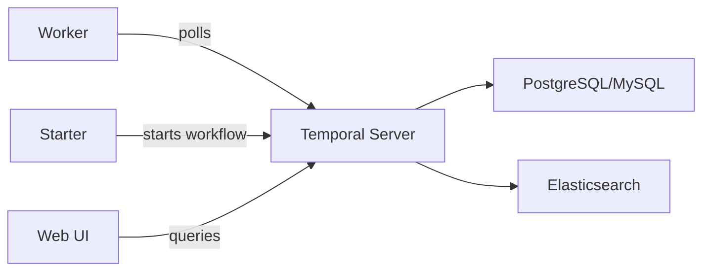

# How to Run Temporal in Docker for Workflow Orchestration

Author: [nawazdhandala](https://github.com/nawazdhandala)

Tags: Docker, Temporal, Workflow Orchestration, Microservices, Docker Compose, Distributed Systems

Description: Deploy Temporal workflow engine in Docker to orchestrate reliable, fault-tolerant distributed workflows for your microservices.

---

Temporal is a workflow orchestration platform that makes building reliable distributed applications significantly easier. Instead of managing message queues, retry logic, state machines, and failure handling yourself, you write workflow code that looks like normal functions. Temporal handles the durability, retries, and state persistence behind the scenes. Running Temporal in Docker gives you a local development environment that mirrors production, without needing a managed cloud service.

## What Temporal Does

Think about a complex business process like processing an e-commerce order: charge the payment, reserve inventory, send a confirmation email, schedule shipping. If any step fails, you need compensating actions (refunds, releasing inventory). Without Temporal, you would build this with message queues, database state tracking, and custom retry logic. With Temporal, you write it as a straightforward function with try/catch blocks, and the platform guarantees it runs to completion.

## Architecture Overview

Temporal consists of several components:



- **Temporal Server** manages workflow state and task distribution
- **Workers** execute your workflow and activity code
- **PostgreSQL or MySQL** stores workflow state durably
- **Elasticsearch** provides advanced workflow search (optional)
- **Web UI** lets you inspect and manage running workflows

## Docker Compose Setup

Here is a complete Docker Compose configuration for Temporal:

```yaml
# docker-compose.yml - Temporal server with all dependencies
version: "3.8"

services:
  postgresql:
    image: postgres:16
    environment:
      POSTGRES_USER: temporal
      POSTGRES_PASSWORD: temporal
    volumes:
      - pgdata:/var/lib/postgresql/data
    ports:
      - "5432:5432"
    networks:
      - temporal-net

  temporal:
    image: temporalio/auto-setup:latest
    depends_on:
      - postgresql
    environment:
      - DB=postgresql
      - DB_PORT=5432
      - POSTGRES_USER=temporal
      - POSTGRES_PWD=temporal
      - POSTGRES_SEEDS=postgresql
    ports:
      # gRPC port for workers and clients
      - "7233:7233"
    networks:
      - temporal-net

  temporal-ui:
    image: temporalio/ui:latest
    depends_on:
      - temporal
    environment:
      - TEMPORAL_ADDRESS=temporal:7233
      - TEMPORAL_CORS_ORIGINS=http://localhost:3000
    ports:
      - "8080:8080"
    networks:
      - temporal-net

  temporal-admin-tools:
    image: temporalio/admin-tools:latest
    depends_on:
      - temporal
    environment:
      - TEMPORAL_ADDRESS=temporal:7233
    networks:
      - temporal-net
    stdin_open: true
    tty: true

volumes:
  pgdata:

networks:
  temporal-net:
    driver: bridge
```

Start the stack:

```bash
# Launch Temporal and all its dependencies
docker compose up -d
```

Wait about 30 seconds for everything to initialize, then open the Temporal Web UI at `http://localhost:8080`.

## Writing a Workflow in Go

Here is a practical example of a Temporal workflow that processes an order. First, set up the Go project:

```bash
# Initialize a Go module for the Temporal worker
mkdir temporal-worker && cd temporal-worker
go mod init temporal-worker
go get go.temporal.io/sdk
```

Define the workflow:

```go
// workflows/order.go - Order processing workflow with compensation logic
package workflows

import (
	"time"

	"go.temporal.io/sdk/temporal"
	"go.temporal.io/sdk/workflow"
)

// OrderInput contains the data needed to process an order
type OrderInput struct {
	OrderID    string
	CustomerID string
	Items      []string
	TotalAmount float64
}

// OrderResult contains the final state of the processed order
type OrderResult struct {
	OrderID       string
	PaymentID     string
	ShipmentID    string
	Confirmed     bool
}

// ProcessOrder orchestrates the full order lifecycle
func ProcessOrder(ctx workflow.Context, input OrderInput) (*OrderResult, error) {
	// Configure activity options with retry policy
	activityOptions := workflow.ActivityOptions{
		StartToCloseTimeout: 30 * time.Second,
		RetryPolicy: &temporal.RetryPolicy{
			InitialInterval:    time.Second,
			BackoffCoefficient: 2.0,
			MaximumInterval:    time.Minute,
			MaximumAttempts:    5,
		},
	}
	ctx = workflow.WithActivityOptions(ctx, activityOptions)

	var result OrderResult
	result.OrderID = input.OrderID

	// Step 1: Charge payment
	var paymentID string
	err := workflow.ExecuteActivity(ctx, ChargePayment, input.OrderID, input.TotalAmount).Get(ctx, &paymentID)
	if err != nil {
		return nil, err
	}
	result.PaymentID = paymentID

	// Step 2: Reserve inventory
	err = workflow.ExecuteActivity(ctx, ReserveInventory, input.OrderID, input.Items).Get(ctx, nil)
	if err != nil {
		// Compensate: refund payment if inventory reservation fails
		_ = workflow.ExecuteActivity(ctx, RefundPayment, paymentID).Get(ctx, nil)
		return nil, err
	}

	// Step 3: Schedule shipment
	var shipmentID string
	err = workflow.ExecuteActivity(ctx, ScheduleShipment, input.OrderID, input.CustomerID).Get(ctx, &shipmentID)
	if err != nil {
		// Compensate: release inventory and refund payment
		_ = workflow.ExecuteActivity(ctx, ReleaseInventory, input.OrderID, input.Items).Get(ctx, nil)
		_ = workflow.ExecuteActivity(ctx, RefundPayment, paymentID).Get(ctx, nil)
		return nil, err
	}
	result.ShipmentID = shipmentID

	// Step 4: Send confirmation email
	_ = workflow.ExecuteActivity(ctx, SendConfirmationEmail, input.CustomerID, input.OrderID).Get(ctx, nil)

	result.Confirmed = true
	return &result, nil
}
```

Define the activities:

```go
// activities/order_activities.go - Activity implementations for order processing
package activities

import (
	"context"
	"fmt"

	"go.temporal.io/sdk/activity"
)

func ChargePayment(ctx context.Context, orderID string, amount float64) (string, error) {
	logger := activity.GetLogger(ctx)
	logger.Info("Charging payment", "orderID", orderID, "amount", amount)

	// Call your payment gateway here
	paymentID := fmt.Sprintf("pay_%s", orderID)
	return paymentID, nil
}

func RefundPayment(ctx context.Context, paymentID string) error {
	logger := activity.GetLogger(ctx)
	logger.Info("Refunding payment", "paymentID", paymentID)
	return nil
}

func ReserveInventory(ctx context.Context, orderID string, items []string) error {
	logger := activity.GetLogger(ctx)
	logger.Info("Reserving inventory", "orderID", orderID, "items", items)
	return nil
}

func ReleaseInventory(ctx context.Context, orderID string, items []string) error {
	logger := activity.GetLogger(ctx)
	logger.Info("Releasing inventory", "orderID", orderID)
	return nil
}

func ScheduleShipment(ctx context.Context, orderID, customerID string) (string, error) {
	logger := activity.GetLogger(ctx)
	logger.Info("Scheduling shipment", "orderID", orderID)
	return fmt.Sprintf("ship_%s", orderID), nil
}

func SendConfirmationEmail(ctx context.Context, customerID, orderID string) error {
	logger := activity.GetLogger(ctx)
	logger.Info("Sending confirmation email", "customerID", customerID, "orderID", orderID)
	return nil
}
```

## Running the Worker

The worker process connects to Temporal and executes workflows:

```go
// main.go - Temporal worker that registers and executes workflows
package main

import (
	"log"

	"go.temporal.io/sdk/client"
	"go.temporal.io/sdk/worker"

	"temporal-worker/activities"
	"temporal-worker/workflows"
)

func main() {
	// Connect to the Temporal server
	c, err := client.Dial(client.Options{
		HostPort: "localhost:7233",
	})
	if err != nil {
		log.Fatalln("Unable to create Temporal client:", err)
	}
	defer c.Close()

	// Create a worker that listens on the "order-processing" task queue
	w := worker.New(c, "order-processing", worker.Options{})

	// Register the workflow and activity implementations
	w.RegisterWorkflow(workflows.ProcessOrder)
	w.RegisterActivity(activities.ChargePayment)
	w.RegisterActivity(activities.RefundPayment)
	w.RegisterActivity(activities.ReserveInventory)
	w.RegisterActivity(activities.ReleaseInventory)
	w.RegisterActivity(activities.ScheduleShipment)
	w.RegisterActivity(activities.SendConfirmationEmail)

	log.Println("Starting Temporal worker...")
	err = w.Run(worker.InterruptCh())
	if err != nil {
		log.Fatalln("Unable to start worker:", err)
	}
}
```

Dockerize the worker:

```dockerfile
# Dockerfile.worker - Temporal worker container
FROM golang:1.22-alpine AS builder
WORKDIR /app
COPY go.mod go.sum ./
RUN go mod download
COPY . .
RUN go build -o worker .

FROM alpine:3.19
COPY --from=builder /app/worker /usr/local/bin/worker
CMD ["worker"]
```

Add the worker to Docker Compose:

```yaml
  worker:
    build:
      context: ./temporal-worker
      dockerfile: Dockerfile.worker
    depends_on:
      - temporal
    environment:
      TEMPORAL_HOST: temporal:7233
    networks:
      - temporal-net
    restart: unless-stopped
```

## Starting a Workflow

Use the Temporal CLI to start a workflow:

```bash
# Start an order processing workflow via the Temporal CLI
docker compose exec temporal-admin-tools \
  tctl workflow start \
  --taskqueue order-processing \
  --workflow_type ProcessOrder \
  --input '{"OrderID":"ord-123","CustomerID":"cust-456","Items":["item-1","item-2"],"TotalAmount":99.99}'
```

Or start it programmatically:

```go
// starter.go - Program that starts a new workflow execution
package main

import (
	"context"
	"log"

	"go.temporal.io/sdk/client"
	"temporal-worker/workflows"
)

func main() {
	c, err := client.Dial(client.Options{HostPort: "localhost:7233"})
	if err != nil {
		log.Fatalln("Unable to create client:", err)
	}
	defer c.Close()

	input := workflows.OrderInput{
		OrderID:     "ord-789",
		CustomerID:  "cust-012",
		Items:       []string{"widget-a", "widget-b"},
		TotalAmount: 149.99,
	}

	we, err := c.ExecuteWorkflow(context.Background(), client.StartWorkflowOptions{
		TaskQueue: "order-processing",
	}, workflows.ProcessOrder, input)
	if err != nil {
		log.Fatalln("Unable to start workflow:", err)
	}

	log.Printf("Workflow started: WorkflowID=%s, RunID=%s\n", we.GetID(), we.GetRunID())
}
```

## Monitoring Workflows

The Temporal Web UI at `http://localhost:8080` shows all running and completed workflows. You can inspect the execution history, see which activities succeeded or failed, and view the input and output of each step.

For CLI-based monitoring:

```bash
# List all running workflows
docker compose exec temporal-admin-tools \
  tctl workflow list --open

# Describe a specific workflow execution
docker compose exec temporal-admin-tools \
  tctl workflow describe --workflow_id ord-123
```

## Wrapping Up

Temporal in Docker gives you a powerful local development environment for building reliable distributed workflows. The platform handles the hard problems of distributed systems - durability, retries, timeouts, and compensation - so you can focus on business logic. The Docker Compose setup gets you running in minutes, and the Web UI provides visibility into every workflow execution. As your needs grow, the same workflow code runs against Temporal Cloud or a self-hosted production cluster without changes.
