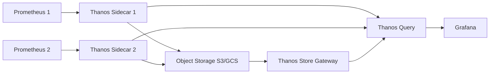

# How to Run Thanos in Docker for Prometheus High Availability

Author: [nawazdhandala](https://github.com/nawazdhandala)

Tags: Docker, Prometheus, Thanos, Monitoring, High Availability, Observability, DevOps

Description: Learn how to deploy Thanos alongside Prometheus in Docker for highly available, long-term metric storage and global querying.

---

Prometheus is excellent at scraping and storing metrics, but it was not designed for high availability or long-term storage out of the box. If you run multiple Prometheus instances for redundancy, you end up with duplicated data and no unified query layer. Thanos solves this problem by adding a set of components that extend Prometheus with global querying, deduplication, and seamless long-term storage in object storage backends like S3 or GCS.

In this guide, you will set up a complete Thanos deployment alongside Prometheus using Docker and Docker Compose. By the end, you will have a working stack that provides high availability, global querying across multiple Prometheus instances, and long-term metric retention.

## Architecture Overview

Thanos works by attaching sidecar processes to each Prometheus instance. These sidecars expose the Prometheus data via a gRPC API and optionally upload blocks to object storage. A Thanos Query component then aggregates data from all sidecars (and from object storage via a Store Gateway) into a single query interface.



## Prerequisites

You need Docker and Docker Compose installed on your system. Verify the installation with these commands.

```bash
# Check Docker version (19.03+ recommended)
docker --version

# Check Docker Compose version (v2+ recommended)
docker compose version
```

## Prometheus Configuration

First, create the Prometheus configuration files. You will run two Prometheus instances for redundancy.

Create a file called `prometheus1.yml` for the first instance.

```yaml
# prometheus1.yml - First Prometheus instance
# The external_labels distinguish this instance from the second one
global:
  scrape_interval: 15s
  evaluation_interval: 15s
  external_labels:
    cluster: "docker-local"
    replica: "prom-1"

scrape_configs:
  # Prometheus scrapes its own metrics
  - job_name: "prometheus"
    static_configs:
      - targets: ["localhost:9090"]

  # Scrape node-exporter for host metrics
  - job_name: "node-exporter"
    static_configs:
      - targets: ["node-exporter:9100"]
```

Create `prometheus2.yml` for the second instance. The only difference is the replica label.

```yaml
# prometheus2.yml - Second Prometheus instance
# Same config as prom-1 but with a different replica label for deduplication
global:
  scrape_interval: 15s
  evaluation_interval: 15s
  external_labels:
    cluster: "docker-local"
    replica: "prom-2"

scrape_configs:
  - job_name: "prometheus"
    static_configs:
      - targets: ["localhost:9090"]

  - job_name: "node-exporter"
    static_configs:
      - targets: ["node-exporter:9100"]
```

## Object Storage Configuration

Thanos needs a configuration file to connect to object storage. For local testing, you can use MinIO as an S3-compatible store.

Create a file called `bucket.yml`.

```yaml
# bucket.yml - Thanos object storage config pointing to local MinIO
type: S3
config:
  bucket: "thanos"
  endpoint: "minio:9000"
  access_key: "minioadmin"
  secret_key: "minioadmin"
  insecure: true
```

## Docker Compose Setup

Now create the `docker-compose.yml` that ties everything together.

```yaml
# docker-compose.yml - Complete Thanos + Prometheus HA stack
version: "3.8"

services:
  # First Prometheus instance with Thanos sidecar
  prometheus-1:
    image: prom/prometheus:v2.51.0
    volumes:
      - ./prometheus1.yml:/etc/prometheus/prometheus.yml
      - prometheus1-data:/prometheus
    # Thanos sidecar needs access to the TSDB, so we set the storage path explicitly
    command:
      - "--config.file=/etc/prometheus/prometheus.yml"
      - "--storage.tsdb.path=/prometheus"
      - "--storage.tsdb.min-block-duration=2h"
      - "--storage.tsdb.max-block-duration=2h"
      - "--web.enable-lifecycle"
    ports:
      - "9091:9090"
    networks:
      - thanos

  # Thanos Sidecar for Prometheus 1
  thanos-sidecar-1:
    image: thanosio/thanos:v0.34.1
    command:
      - "sidecar"
      - "--tsdb.path=/prometheus"
      - "--prometheus.url=http://prometheus-1:9090"
      - "--objstore.config-file=/etc/thanos/bucket.yml"
      - "--grpc-address=0.0.0.0:10901"
      - "--http-address=0.0.0.0:10902"
    volumes:
      - prometheus1-data:/prometheus
      - ./bucket.yml:/etc/thanos/bucket.yml
    depends_on:
      - prometheus-1
      - minio
    networks:
      - thanos

  # Second Prometheus instance
  prometheus-2:
    image: prom/prometheus:v2.51.0
    volumes:
      - ./prometheus2.yml:/etc/prometheus/prometheus.yml
      - prometheus2-data:/prometheus
    command:
      - "--config.file=/etc/prometheus/prometheus.yml"
      - "--storage.tsdb.path=/prometheus"
      - "--storage.tsdb.min-block-duration=2h"
      - "--storage.tsdb.max-block-duration=2h"
      - "--web.enable-lifecycle"
    ports:
      - "9092:9090"
    networks:
      - thanos

  # Thanos Sidecar for Prometheus 2
  thanos-sidecar-2:
    image: thanosio/thanos:v0.34.1
    command:
      - "sidecar"
      - "--tsdb.path=/prometheus"
      - "--prometheus.url=http://prometheus-2:9090"
      - "--objstore.config-file=/etc/thanos/bucket.yml"
      - "--grpc-address=0.0.0.0:10901"
      - "--http-address=0.0.0.0:10902"
    volumes:
      - prometheus2-data:/prometheus
      - ./bucket.yml:/etc/thanos/bucket.yml
    depends_on:
      - prometheus-2
      - minio
    networks:
      - thanos

  # Thanos Query - provides the unified query layer
  thanos-query:
    image: thanosio/thanos:v0.34.1
    command:
      - "query"
      - "--http-address=0.0.0.0:9090"
      - "--grpc-address=0.0.0.0:10901"
      - "--store=thanos-sidecar-1:10901"
      - "--store=thanos-sidecar-2:10901"
      - "--store=thanos-store:10901"
      - "--query.replica-label=replica"
    ports:
      - "9090:9090"
    depends_on:
      - thanos-sidecar-1
      - thanos-sidecar-2
    networks:
      - thanos

  # Thanos Store Gateway - serves historical data from object storage
  thanos-store:
    image: thanosio/thanos:v0.34.1
    command:
      - "store"
      - "--data-dir=/tmp/thanos/store"
      - "--objstore.config-file=/etc/thanos/bucket.yml"
      - "--grpc-address=0.0.0.0:10901"
      - "--http-address=0.0.0.0:10902"
    volumes:
      - ./bucket.yml:/etc/thanos/bucket.yml
      - thanos-store-data:/tmp/thanos/store
    depends_on:
      - minio
    networks:
      - thanos

  # Thanos Compactor - downsamples and compacts blocks in object storage
  thanos-compactor:
    image: thanosio/thanos:v0.34.1
    command:
      - "compact"
      - "--data-dir=/tmp/thanos/compact"
      - "--objstore.config-file=/etc/thanos/bucket.yml"
      - "--wait"
      - "--wait-interval=30s"
    volumes:
      - ./bucket.yml:/etc/thanos/bucket.yml
      - thanos-compact-data:/tmp/thanos/compact
    depends_on:
      - minio
    networks:
      - thanos

  # MinIO - local S3-compatible object storage for testing
  minio:
    image: minio/minio:latest
    command: server /data --console-address ":9001"
    environment:
      MINIO_ROOT_USER: minioadmin
      MINIO_ROOT_PASSWORD: minioadmin
    volumes:
      - minio-data:/data
    ports:
      - "9000:9000"
      - "9001:9001"
    networks:
      - thanos

  # Create the thanos bucket in MinIO on startup
  minio-init:
    image: minio/mc:latest
    depends_on:
      - minio
    entrypoint: >
      /bin/sh -c "
      sleep 5;
      mc alias set local http://minio:9000 minioadmin minioadmin;
      mc mb local/thanos --ignore-existing;
      "
    networks:
      - thanos

  # Node exporter provides host-level metrics to scrape
  node-exporter:
    image: prom/node-exporter:v1.7.0
    ports:
      - "9100:9100"
    networks:
      - thanos

volumes:
  prometheus1-data:
  prometheus2-data:
  minio-data:
  thanos-store-data:
  thanos-compact-data:

networks:
  thanos:
    driver: bridge
```

## Starting the Stack

Bring up the entire stack with a single command.

```bash
# Start all services in the background
docker compose up -d

# Watch the logs to confirm everything starts cleanly
docker compose logs -f thanos-query thanos-sidecar-1 thanos-sidecar-2
```

After about 30 seconds, all services should be healthy. Open `http://localhost:9090` in your browser to access the Thanos Query UI. This interface looks almost identical to the Prometheus UI, but it queries across both Prometheus instances.

## Verifying the Setup

Check that both stores (sidecars) are connected to the query layer.

```bash
# Query the Thanos stores endpoint to see connected components
curl -s http://localhost:9090/api/v1/stores | python3 -m json.tool
```

You should see entries for both sidecars and the store gateway. Run a test query to confirm deduplication is working.

```bash
# Query a metric - Thanos will deduplicate results from both Prometheus instances
curl -s 'http://localhost:9090/api/v1/query?query=up&dedup=true' | python3 -m json.tool
```

With `dedup=true`, Thanos removes duplicate series that differ only by the `replica` label, giving you a clean, single view of your metrics.

## Connecting Grafana

To visualize your metrics, add Grafana to the stack or point an existing Grafana instance at the Thanos Query endpoint. In Grafana, add a Prometheus data source with the URL set to `http://thanos-query:9090`. All your standard PromQL queries will work without modification.

## Production Considerations

For production deployments, keep these points in mind. First, replace MinIO with a managed object storage service like AWS S3 or Google Cloud Storage. Second, enable TLS between Thanos components by providing certificate files in the command arguments. Third, set appropriate retention policies on the compactor to control how long historical data is kept. Fourth, consider running the Thanos Query Frontend component to add query caching and splitting for better performance under heavy query load.

Resource-wise, the sidecars add minimal overhead since they mostly proxy data. The Store Gateway benefits from SSD-backed cache directories, and the Compactor can be memory-intensive during compaction of large blocks.

## Cleanup

When you are done testing, tear down the stack and remove all data.

```bash
# Stop all containers and remove volumes
docker compose down -v
```

## Conclusion

Thanos transforms Prometheus from a single-instance metrics system into a highly available, globally queryable platform with virtually unlimited retention. The Docker Compose setup in this guide gives you a working foundation that mirrors production architectures. From here, you can scale by adding more Prometheus instances with sidecars, tuning compaction settings, and integrating with your preferred object storage backend.

For monitoring your Thanos deployment itself, consider setting up alerts on sidecar upload failures and store gateway sync times using tools like [OneUptime](https://oneuptime.com) to keep your observability stack observable.
