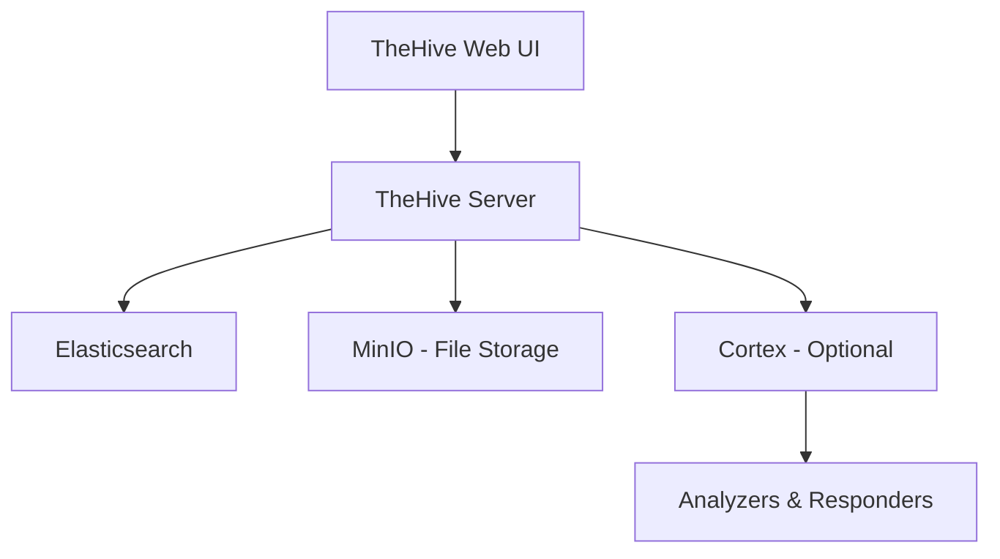

# How to Run TheHive in Docker for Incident Response

Author: [nawazdhandala](https://github.com/nawazdhandala)

Tags: docker, thehive, incident response, security, SOAR, containerization, cybersecurity

Description: Learn how to deploy TheHive incident response platform in Docker for streamlined security operations and case management.

---

Security teams need fast, reliable ways to track and manage incidents. TheHive is an open-source, scalable incident response platform that helps analysts collaborate on investigations. Running it in Docker eliminates the pain of manual dependency management and gives you a reproducible deployment every time.

This guide walks you through setting up TheHive with Docker, connecting it to its required backends, and configuring it for production use.

## What Is TheHive?

TheHive is a Security Incident Response Platform (SIRP) designed for SOC analysts, CSIRT members, and incident handlers. It provides case management, alert intake from multiple sources, integration with MISP for threat intelligence sharing, and Cortex for automated analysis. Think of it as a ticketing system built specifically for security incidents.

Key features include:

- Case and task management with customizable templates
- Observable enrichment through Cortex analyzers
- Alert ingestion from SIEM tools, email, and APIs
- Role-based access control
- Full audit trail of all analyst actions

## Prerequisites

Before starting, make sure you have the following installed on your system:

- Docker Engine 20.10 or newer
- Docker Compose v2
- At least 4 GB of available RAM
- 20 GB of free disk space

Verify your Docker installation with these commands.

```bash
# Check Docker version
docker --version

# Check Docker Compose version
docker compose version
```

## Architecture Overview

TheHive requires two backend services: Elasticsearch for data storage and Cassandra as an alternative database. For this guide, we will use Elasticsearch since it is the simpler option for getting started. MinIO handles file storage for attachments and evidence.



## Setting Up the Docker Compose File

Create a project directory and add the following Docker Compose configuration. This sets up TheHive along with Elasticsearch and MinIO.

```bash
# Create the project directory
mkdir -p ~/thehive-docker && cd ~/thehive-docker
```

Now create the main compose file.

```yaml
# docker-compose.yml - TheHive with Elasticsearch and MinIO
version: "3.8"

services:
  elasticsearch:
    image: docker.elastic.co/elasticsearch/elasticsearch:7.17.9
    container_name: thehive-elasticsearch
    environment:
      # Run as a single-node cluster for simplicity
      - discovery.type=single-node
      # Disable security features for local development
      - xpack.security.enabled=false
      # Set JVM heap size to 1GB
      - "ES_JAVA_OPTS=-Xms1g -Xmx1g"
    volumes:
      - elasticsearch_data:/usr/share/elasticsearch/data
    networks:
      - thehive-net
    restart: unless-stopped
    healthcheck:
      test: ["CMD", "curl", "-f", "http://localhost:9200"]
      interval: 30s
      timeout: 10s
      retries: 5

  minio:
    image: quay.io/minio/minio
    container_name: thehive-minio
    command: server /data --console-address ":9001"
    environment:
      # Set MinIO root credentials
      MINIO_ROOT_USER: thehive
      MINIO_ROOT_PASSWORD: thehive-secret-key
    volumes:
      - minio_data:/data
    networks:
      - thehive-net
    restart: unless-stopped

  thehive:
    image: strangebee/thehive:5.2
    container_name: thehive
    depends_on:
      elasticsearch:
        condition: service_healthy
      minio:
        condition: service_started
    ports:
      # Expose TheHive web interface on port 9000
      - "9000:9000"
    environment:
      - JVM_OPTS=-Xms1g -Xmx1g
    volumes:
      - ./thehive.conf:/etc/thehive/application.conf
    networks:
      - thehive-net
    restart: unless-stopped

volumes:
  elasticsearch_data:
  minio_data:

networks:
  thehive-net:
    driver: bridge
```

## Creating the TheHive Configuration

TheHive needs a configuration file that tells it how to connect to Elasticsearch and MinIO. Create this file in your project directory.

```hocon
# thehive.conf - Main configuration for TheHive
# Database configuration pointing to our Elasticsearch container
db.janusgraph {
  storage {
    backend = cql
    hostname = ["elasticsearch"]
  }
  index.search {
    backend = elasticsearch
    hostname = ["elasticsearch"]
    index-name = thehive
  }
}

# File storage configuration using MinIO (S3-compatible)
storage {
  provider = s3
  s3 {
    bucket = "thehive"
    readTimeout = 1 minute
    writeTimeout = 1 minute
    chunkSize = 1 MB
    endpoint = "http://minio:9000"
    accessKey = "thehive"
    secretKey = "thehive-secret-key"
    region = "us-east-1"
  }
}

# Cortex integration - uncomment if you run Cortex alongside
# play.modules.enabled += org.thp.thehive.connector.cortex.CortexModule
# cortex {
#   servers = [
#     {
#       name = local
#       url = "http://cortex:9001"
#       auth {
#         type = "bearer"
#         key = "your-cortex-api-key"
#       }
#     }
#   ]
# }
```

## Starting TheHive

With all configuration files in place, bring up the entire stack.

```bash
# Start all services in detached mode
docker compose up -d

# Watch the logs to confirm everything starts correctly
docker compose logs -f thehive
```

Wait for TheHive to fully initialize. You will see a message indicating the web server is ready, usually within 60 to 90 seconds. Once ready, open your browser and navigate to `http://localhost:9000`.

The default credentials are:

- Username: `admin@thehive.local`
- Password: `secret`

Change these immediately after your first login.

## Creating Your First Case

After logging in, you can create your first incident case through the web UI. But you can also do it via the API, which is more useful for automation.

```bash
# Create a new case via the TheHive API
curl -X POST http://localhost:9000/api/v1/case \
  -H "Authorization: Bearer YOUR_API_KEY" \
  -H "Content-Type: application/json" \
  -d '{
    "title": "Suspicious Login Activity",
    "description": "Multiple failed login attempts detected from IP 192.168.1.50",
    "severity": 2,
    "tlp": 2,
    "tags": ["login-anomaly", "brute-force"]
  }'
```

## Adding Cortex for Automated Analysis

Cortex is a companion tool that runs analyzers and responders against observables in your cases. Adding it to the stack is straightforward.

```yaml
# Add this service block to your docker-compose.yml
  cortex:
    image: thehiveproject/cortex:3.1.7
    container_name: cortex
    ports:
      - "9001:9001"
    volumes:
      - cortex_data:/var/run/docker.sock
    networks:
      - thehive-net
    restart: unless-stopped
```

After bringing up Cortex, configure the API key in TheHive and enable the Cortex module in your configuration file. This lets analysts run automated enrichment on IP addresses, file hashes, domain names, and other observables directly from within a case.

## Production Hardening Tips

Running TheHive in Docker for production requires a few additional steps beyond the basic setup.

**Use strong credentials.** Replace all default passwords in the configuration. Generate random strings for MinIO keys and TheHive admin passwords.

```bash
# Generate a secure random password
openssl rand -base64 32
```

**Enable TLS.** Place a reverse proxy like Nginx or Traefik in front of TheHive to handle HTTPS termination.

**Back up your data.** Create regular snapshots of the Docker volumes holding Elasticsearch and MinIO data.

```bash
# Back up Elasticsearch data volume
docker run --rm -v thehive-docker_elasticsearch_data:/data -v $(pwd):/backup \
  alpine tar czf /backup/es-backup-$(date +%Y%m%d).tar.gz /data

# Back up MinIO data volume
docker run --rm -v thehive-docker_minio_data:/data -v $(pwd):/backup \
  alpine tar czf /backup/minio-backup-$(date +%Y%m%d).tar.gz /data
```

**Set resource limits.** Prevent any single container from consuming all host resources.

```yaml
# Add resource limits to each service in docker-compose.yml
    deploy:
      resources:
        limits:
          memory: 2G
          cpus: "1.0"
```

**Monitor container health.** Use Docker's built-in health checks and forward logs to a central system.

## Integrating with External Alert Sources

TheHive excels at ingesting alerts from other security tools. You can push alerts from your SIEM, IDS, or custom scripts using the REST API.

```python
# Python script to push an alert from a SIEM to TheHive
import requests

THEHIVE_URL = "http://localhost:9000"
API_KEY = "YOUR_API_KEY"

alert = {
    "type": "siem-alert",
    "source": "wazuh",
    "sourceRef": "alert-12345",
    "title": "High severity event detected",
    "description": "Rootkit detection on host web-server-01",
    "severity": 3,
    "tags": ["rootkit", "wazuh", "critical"],
    "artifacts": [
        {"dataType": "ip", "data": "10.0.0.15"},
        {"dataType": "hostname", "data": "web-server-01"}
    ]
}

# Send the alert to TheHive
response = requests.post(
    f"{THEHIVE_URL}/api/v1/alert",
    headers={"Authorization": f"Bearer {API_KEY}", "Content-Type": "application/json"},
    json=alert
)

print(f"Alert created: {response.status_code}")
```

## Troubleshooting Common Issues

**Elasticsearch fails to start.** Check that vm.max_map_count is set high enough on the host.

```bash
# Increase vm.max_map_count for Elasticsearch
sudo sysctl -w vm.max_map_count=262144

# Make it persistent across reboots
echo "vm.max_map_count=262144" | sudo tee -a /etc/sysctl.conf
```

**TheHive cannot connect to Elasticsearch.** Verify the network configuration and ensure both containers are on the same Docker network.

```bash
# Check which networks a container is connected to
docker inspect thehive --format '{{json .NetworkSettings.Networks}}'
```

**Out of memory errors.** Increase the JVM heap size in the environment variables and ensure your host has enough RAM allocated to Docker.

## Conclusion

Running TheHive in Docker gives security teams a fast path to deploying a fully functional incident response platform. The containerized approach keeps all dependencies isolated, makes upgrades simple through image version bumps, and lets you tear down and rebuild the entire environment in minutes. Pair it with Cortex for automated analysis and MISP for threat intelligence sharing, and you have a capable security operations stack running entirely in containers.
