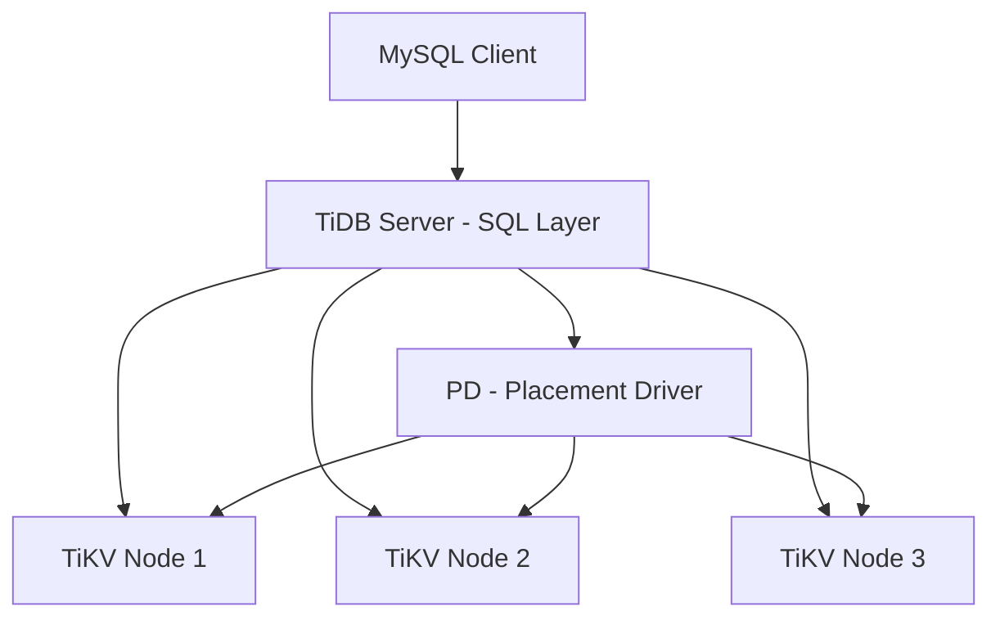

# How to Run TiDB in Docker for Distributed SQL

Author: [nawazdhandala](https://github.com/nawazdhandala)

Tags: Docker, TiDB, Distributed SQL, Databases, DevOps, MySQL

Description: Deploy TiDB distributed SQL database in Docker with TiKV storage nodes and PD scheduling for horizontal scalability

---

TiDB is an open-source distributed SQL database that speaks the MySQL protocol. It separates compute from storage, scales horizontally, and supports ACID transactions across multiple nodes. You can connect to TiDB with any MySQL client, which means existing applications often work without code changes. Running TiDB in Docker lets you explore its distributed architecture on a single machine.

## TiDB Architecture Overview

TiDB has three core components that work together.



**TiDB Server** handles SQL parsing, optimization, and execution. It is stateless, so you can run multiple instances behind a load balancer.

**TiKV** is the distributed key-value storage layer. Data is automatically split into regions and distributed across TiKV nodes. It uses the Raft consensus protocol for replication.

**PD (Placement Driver)** manages metadata, assigns timestamps for transactions, and makes data placement decisions. It decides which TiKV node stores which data region.

## Quick Start with Docker Compose

The easiest way to run a full TiDB cluster locally is with Docker Compose.

```yaml
# docker-compose.yml
version: "3.8"

services:
  pd:
    image: pingcap/pd:v8.1.0
    container_name: tidb-pd
    ports:
      - "2379:2379"
      - "2380:2380"
    volumes:
      - pd_data:/data
    command:
      - --name=pd
      - --client-urls=http://0.0.0.0:2379
      - --peer-urls=http://0.0.0.0:2380
      - --advertise-client-urls=http://pd:2379
      - --advertise-peer-urls=http://pd:2380
      - --data-dir=/data/pd
      - --initial-cluster=pd=http://pd:2380
    networks:
      - tidb-net

  tikv1:
    image: pingcap/tikv:v8.1.0
    container_name: tidb-tikv1
    volumes:
      - tikv1_data:/data
    command:
      - --addr=0.0.0.0:20160
      - --advertise-addr=tikv1:20160
      - --data-dir=/data/tikv1
      - --pd=pd:2379
    depends_on:
      - pd
    networks:
      - tidb-net

  tikv2:
    image: pingcap/tikv:v8.1.0
    container_name: tidb-tikv2
    volumes:
      - tikv2_data:/data
    command:
      - --addr=0.0.0.0:20160
      - --advertise-addr=tikv2:20160
      - --data-dir=/data/tikv2
      - --pd=pd:2379
    depends_on:
      - pd
    networks:
      - tidb-net

  tikv3:
    image: pingcap/tikv:v8.1.0
    container_name: tidb-tikv3
    volumes:
      - tikv3_data:/data
    command:
      - --addr=0.0.0.0:20160
      - --advertise-addr=tikv3:20160
      - --data-dir=/data/tikv3
      - --pd=pd:2379
    depends_on:
      - pd
    networks:
      - tidb-net

  tidb:
    image: pingcap/tidb:v8.1.0
    container_name: tidb-server
    ports:
      - "4000:4000"    # MySQL protocol
      - "10080:10080"  # Status port
    command:
      - --store=tikv
      - --path=pd:2379
      - --advertise-address=tidb
    depends_on:
      - tikv1
      - tikv2
      - tikv3
    networks:
      - tidb-net

networks:
  tidb-net:
    driver: bridge

volumes:
  pd_data:
  tikv1_data:
  tikv2_data:
  tikv3_data:
```

Start the cluster.

```bash
# Launch the full TiDB cluster
docker compose up -d

# Wait for all components to initialize (typically 30-60 seconds)
sleep 30

# Verify all containers are running
docker compose ps
```

## Connecting to TiDB

TiDB speaks MySQL protocol on port 4000. Use any MySQL client.

```bash
# Connect using the MySQL CLI
mysql -h 127.0.0.1 -P 4000 -u root
```

If you do not have the MySQL client installed locally, use it from a container.

```bash
# Run MySQL client from a container
docker run -it --rm --network tidb-net mysql:8 \
  mysql -h tidb-server -P 4000 -u root
```

## Creating Tables and Inserting Data

Standard MySQL syntax works in TiDB.

```sql
-- Create a database
CREATE DATABASE ecommerce;
USE ecommerce;

-- Create a table with standard SQL
CREATE TABLE products (
    id BIGINT PRIMARY KEY AUTO_RANDOM,
    name VARCHAR(255) NOT NULL,
    category VARCHAR(100),
    price DECIMAL(10, 2),
    stock INT DEFAULT 0,
    created_at TIMESTAMP DEFAULT CURRENT_TIMESTAMP,
    INDEX idx_category (category)
);

-- Create an orders table
CREATE TABLE orders (
    id BIGINT PRIMARY KEY AUTO_RANDOM,
    user_id BIGINT NOT NULL,
    product_id BIGINT NOT NULL,
    quantity INT NOT NULL,
    total DECIMAL(10, 2) NOT NULL,
    status VARCHAR(20) DEFAULT 'pending',
    created_at TIMESTAMP DEFAULT CURRENT_TIMESTAMP,
    INDEX idx_user (user_id),
    INDEX idx_status (status)
);

-- Insert sample data
INSERT INTO products (name, category, price, stock) VALUES
    ('Laptop Pro', 'electronics', 1299.99, 50),
    ('Wireless Mouse', 'electronics', 29.99, 200),
    ('Standing Desk', 'furniture', 599.00, 30),
    ('Monitor 27"', 'electronics', 449.99, 75),
    ('Ergonomic Chair', 'furniture', 799.00, 25);

INSERT INTO orders (user_id, product_id, quantity, total, status) VALUES
    (1001, 1, 1, 1299.99, 'completed'),
    (1002, 2, 3, 89.97, 'completed'),
    (1001, 4, 2, 899.98, 'shipped'),
    (1003, 5, 1, 799.00, 'pending');
```

## Distributed Features

TiDB automatically distributes data across TiKV nodes. Check where data lives.

```sql
-- View the regions (data shards) for a table
SHOW TABLE products REGIONS;

-- Check TiKV store status through PD API
-- (Run from the host, not from MySQL)
```

```bash
# Query PD for store (TiKV node) information
curl http://localhost:2379/pd/api/v1/stores | python3 -m json.tool
```

## Transactions Across Shards

TiDB supports distributed ACID transactions. This works even when rows are on different TiKV nodes.

```sql
-- Start a transaction that touches multiple rows potentially on different nodes
BEGIN;

UPDATE products SET stock = stock - 1 WHERE id = 1;
INSERT INTO orders (user_id, product_id, quantity, total, status)
    VALUES (1004, 1, 1, 1299.99, 'pending');

COMMIT;
```

TiDB uses a two-phase commit protocol with Percolator-style transactions to guarantee consistency across shards.

## AUTO_RANDOM vs AUTO_INCREMENT

In distributed databases, `AUTO_INCREMENT` creates a hotspot because all inserts go to the same region. TiDB provides `AUTO_RANDOM` to distribute inserts evenly.

```sql
-- AUTO_RANDOM distributes new rows across TiKV nodes
CREATE TABLE events (
    id BIGINT PRIMARY KEY AUTO_RANDOM,
    event_type VARCHAR(50),
    payload JSON,
    created_at TIMESTAMP DEFAULT CURRENT_TIMESTAMP
);

-- Inserts are scattered across regions, avoiding write hotspots
INSERT INTO events (event_type, payload) VALUES
    ('page_view', '{"url": "/home", "user_id": 42}'),
    ('click', '{"element": "buy_button", "user_id": 42}');
```

## Monitoring the Cluster

Check cluster health and performance.

```bash
# TiDB server status
curl http://localhost:10080/status

# PD cluster members
curl http://localhost:2379/pd/api/v1/members | python3 -m json.tool

# TiKV store details
curl http://localhost:2379/pd/api/v1/stores | python3 -m json.tool
```

From within MySQL, check cluster information.

```sql
-- View TiDB server version and uptime
SELECT tidb_version();

-- Check session variables related to distributed execution
SHOW VARIABLES LIKE 'tidb%';

-- Analyze query execution to see how it distributes across nodes
EXPLAIN ANALYZE SELECT category, COUNT(*) FROM products GROUP BY category;
```

## Adding a Dashboard

TiDB ships with a built-in dashboard. Access it at `http://localhost:2379/dashboard` when running the PD component with dashboard enabled.

For more comprehensive monitoring, add Prometheus and Grafana.

```yaml
# Add to docker-compose.yml
  prometheus:
    image: prom/prometheus:v2.50.0
    container_name: tidb-prometheus
    ports:
      - "9090:9090"
    volumes:
      - ./prometheus.yml:/etc/prometheus/prometheus.yml
    networks:
      - tidb-net

  grafana:
    image: grafana/grafana:10.3.0
    container_name: tidb-grafana
    ports:
      - "3000:3000"
    environment:
      GF_SECURITY_ADMIN_PASSWORD: admin
    networks:
      - tidb-net
```

## Backup and Restore

Use the `dumpling` tool for logical backups.

```bash
# Export data using TiDB's Dumpling tool
docker run --rm --network tidb-net \
  pingcap/dumpling:v8.1.0 \
  dumpling \
    -h tidb-server \
    -P 4000 \
    -u root \
    -o /output \
    --filetype sql
```

## Summary

TiDB in Docker gives you a horizontally scalable MySQL-compatible database. The three-component architecture (TiDB, TiKV, PD) separates compute from storage and provides automatic sharding, distributed ACID transactions, and Raft-based replication. Connect with any MySQL client on port 4000 and use standard SQL. For development, run the full stack with Docker Compose. Use `AUTO_RANDOM` instead of `AUTO_INCREMENT` to avoid write hotspots, and monitor the cluster through the PD API and TiDB status endpoints.
