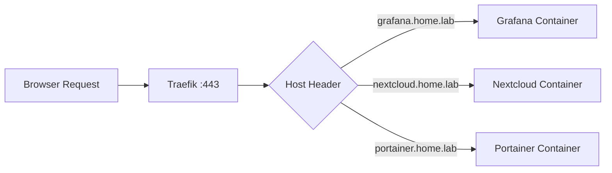

# How to Run Traefik in Docker for Home Lab Reverse Proxy

Author: [nawazdhandala](https://github.com/nawazdhandala)

Tags: Docker, Traefik, Reverse Proxy, Home Lab, SSL, Let's Encrypt, Docker Compose

Description: Set up Traefik as a Docker-native reverse proxy for your home lab with automatic SSL certificates and service discovery.

---

Running multiple services in a home lab quickly leads to a port management headache. You end up memorizing that Grafana is on port 3000, Portainer on 9443, and Nextcloud on port 8080. A reverse proxy solves this by letting you access every service through a clean subdomain like grafana.home.lab or nextcloud.home.lab, all over HTTPS with valid certificates.

Traefik is a natural fit for Docker environments because it discovers services automatically by reading Docker labels. You do not need to edit a configuration file every time you spin up a new container. This guide covers setting up Traefik in Docker, configuring automatic SSL with Let's Encrypt, routing traffic to your services, and securing the dashboard.

## How Traefik Works with Docker

Traefik watches the Docker socket for container events. When a new container starts with the right labels, Traefik automatically creates routing rules. When the container stops, Traefik removes the routes. No reloading, no manual edits.



## Prerequisites

You need Docker and Docker Compose on your server. For automatic SSL certificates from Let's Encrypt, your domain needs to be publicly resolvable (you can use a DNS challenge for internal-only setups). If you only need local access, self-signed certificates or a local certificate authority like mkcert work fine.

```bash
# Confirm Docker is ready
docker --version
docker compose version
```

## Basic Traefik Setup

Start with a Docker Compose file that runs Traefik and exposes ports 80 and 443.

```yaml
# docker-compose.yml - Traefik reverse proxy for home lab
version: "3.8"

services:
  traefik:
    image: traefik:v3.0
    container_name: traefik
    restart: unless-stopped
    ports:
      # HTTP entrypoint - will redirect to HTTPS
      - "80:80"
      # HTTPS entrypoint
      - "443:443"
    volumes:
      # Let Traefik read Docker events for auto-discovery
      - /var/run/docker.sock:/var/run/docker.sock:ro
      # Persist SSL certificates
      - traefik-certs:/letsencrypt
      # Static configuration file
      - ./traefik.yml:/etc/traefik/traefik.yml:ro
    networks:
      - proxy
    labels:
      # Enable Traefik dashboard on a subdomain
      - "traefik.enable=true"
      - "traefik.http.routers.dashboard.rule=Host(`traefik.home.lab`)"
      - "traefik.http.routers.dashboard.service=api@internal"
      - "traefik.http.routers.dashboard.entrypoints=websecure"
      - "traefik.http.routers.dashboard.tls.certresolver=letsencrypt"
      # Protect the dashboard with basic auth
      - "traefik.http.routers.dashboard.middlewares=auth"
      - "traefik.http.middlewares.auth.basicauth.users=admin:$$apr1$$xyz$$hashedpassword"

networks:
  proxy:
    name: proxy
    external: false

volumes:
  traefik-certs:
```

Create the Traefik static configuration file.

```yaml
# traefik.yml - Static configuration for Traefik
api:
  dashboard: true

entryPoints:
  web:
    address: ":80"
    # Redirect all HTTP traffic to HTTPS
    http:
      redirections:
        entryPoint:
          to: websecure
          scheme: https
  websecure:
    address: ":443"

providers:
  docker:
    # Only route containers with traefik.enable=true labels
    exposedByDefault: false
    network: proxy

certificatesResolvers:
  letsencrypt:
    acme:
      email: your-email@example.com
      storage: /letsencrypt/acme.json
      # Use the DNS challenge for wildcard certs or internal-only domains
      dnsChallenge:
        provider: cloudflare
        resolvers:
          - "1.1.1.1:53"
          - "8.8.8.8:53"
```

If you use the DNS challenge with Cloudflare, add your API credentials to the Traefik service.

```yaml
# Add to the traefik service environment section
environment:
  CF_API_EMAIL: your-cloudflare-email@example.com
  CF_DNS_API_TOKEN: your-cloudflare-api-token
```

Generate a hashed password for the dashboard basic auth.

```bash
# Generate a bcrypt hash for basic auth (install apache2-utils if needed)
htpasswd -nb admin your-secure-password

# The output looks like: admin:$apr1$xyz$hashedpassword
# Double the $ signs when pasting into Docker labels
```

Launch Traefik.

```bash
# Start Traefik
docker compose up -d

# Verify it is running and listening
docker compose logs -f traefik
```

## Adding Services Behind Traefik

The real power of Traefik shows when you add services. Each service just needs the right labels. Here is an example with Grafana.

```yaml
# docker-compose.yml for Grafana behind Traefik
version: "3.8"

services:
  grafana:
    image: grafana/grafana:latest
    container_name: grafana
    restart: unless-stopped
    volumes:
      - grafana-data:/var/lib/grafana
    networks:
      - proxy
    labels:
      # Tell Traefik to route traffic for this container
      - "traefik.enable=true"
      # Define the routing rule based on hostname
      - "traefik.http.routers.grafana.rule=Host(`grafana.home.lab`)"
      # Use the HTTPS entrypoint
      - "traefik.http.routers.grafana.entrypoints=websecure"
      # Request a certificate from Let's Encrypt
      - "traefik.http.routers.grafana.tls.certresolver=letsencrypt"
      # Tell Traefik which port the service listens on
      - "traefik.http.services.grafana.loadbalancer.server.port=3000"

networks:
  proxy:
    external: true

volumes:
  grafana-data:
```

Notice that Grafana does not publish any ports. Traefik handles all incoming traffic and forwards it to port 3000 inside the container. The service is only reachable through the reverse proxy.

## Middleware for Security

Traefik middlewares let you add security headers, rate limiting, and IP whitelisting to any service.

```yaml
# Add security headers middleware via labels
labels:
  - "traefik.http.middlewares.secure-headers.headers.stsSeconds=31536000"
  - "traefik.http.middlewares.secure-headers.headers.stsIncludeSubdomains=true"
  - "traefik.http.middlewares.secure-headers.headers.contentTypeNosniff=true"
  - "traefik.http.middlewares.secure-headers.headers.browserXssFilter=true"
  - "traefik.http.middlewares.secure-headers.headers.frameDeny=true"
```

Apply the middleware to a router.

```yaml
# Apply to a service's router
- "traefik.http.routers.grafana.middlewares=secure-headers"
```

For IP whitelisting, useful if you only want local network access to certain services:

```yaml
# Only allow requests from your local network
- "traefik.http.middlewares.local-only.ipwhitelist.sourcerange=192.168.1.0/24,10.0.0.0/8"
- "traefik.http.routers.grafana.middlewares=local-only,secure-headers"
```

## Wildcard SSL Certificates

Instead of getting a separate certificate for each subdomain, use a wildcard certificate. This requires the DNS challenge.

```yaml
# traefik.yml - Wildcard certificate configuration
tls:
  stores:
    default:
      defaultCertificate:
        certFile: ""
        keyFile: ""

certificatesResolvers:
  letsencrypt:
    acme:
      email: your-email@example.com
      storage: /letsencrypt/acme.json
      dnsChallenge:
        provider: cloudflare
```

Then add a wildcard certificate request in your Traefik labels.

```yaml
# Request a wildcard certificate for your domain
- "traefik.http.routers.traefik.tls.domains[0].main=home.lab"
- "traefik.http.routers.traefik.tls.domains[0].sans=*.home.lab"
```

## Local DNS Setup

For home lab use, point your subdomains to the Traefik host. You can do this with your router's DNS settings, a Pi-hole, or an /etc/hosts file on each client.

```bash
# /etc/hosts entry on client machines (or configure in Pi-hole)
192.168.1.100  traefik.home.lab
192.168.1.100  grafana.home.lab
192.168.1.100  nextcloud.home.lab
192.168.1.100  portainer.home.lab
```

A better approach is running a DNS server like Pi-hole or AdGuard Home that returns a wildcard record for *.home.lab pointing to your Traefik host.

## Monitoring Traefik

Traefik exposes Prometheus metrics out of the box. Enable them in the static configuration.

```yaml
# Add to traefik.yml
metrics:
  prometheus:
    addEntryPointsLabels: true
    addServicesLabels: true
    addRoutersLabels: true
```

Scrape the metrics endpoint at `http://traefik:8080/metrics` from your Prometheus instance.

You can also integrate with OneUptime to monitor your home lab services through Traefik. If a backend becomes unresponsive, Traefik will return 502 errors, and your monitoring will catch it before you notice.

## Summary

Traefik turns a messy collection of Docker containers into a cleanly organized, SSL-secured home lab. The Docker provider eliminates manual configuration by reading labels directly from your containers. Middlewares add security features without modifying the applications themselves. Combined with local DNS and wildcard certificates, every new service you deploy becomes immediately accessible at a clean HTTPS subdomain.
