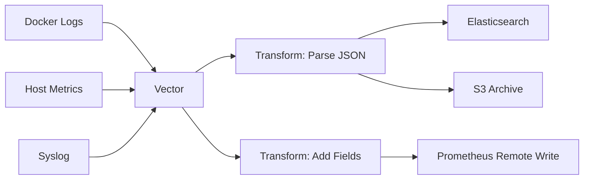

# How to Run Vector in Docker for Observability Pipelines

Author: [nawazdhandala](https://github.com/nawazdhandala)

Tags: Docker, Vector, Observability, Logging, Metrics, DevOps, Pipelines

Description: Deploy Vector in Docker to build high-performance observability pipelines that collect, transform, and route logs and metrics.

---

Vector is a high-performance observability data pipeline built by Timber and now maintained by Datadog. Written in Rust, it handles logs, metrics, and traces with a single tool. Where you might need separate agents for log collection, metric forwarding, and data transformation, Vector combines all of these into one lightweight binary. It processes millions of events per second while using minimal memory.

This guide walks through deploying Vector in Docker, building pipelines that collect container logs and host metrics, transforming them with Vector's built-in VRL (Vector Remap Language), and routing them to appropriate destinations.

## Why Vector

Most observability stacks require multiple tools: Fluent Bit for logs, Telegraf for metrics, and custom scripts for transformations. Vector replaces all of these with a single agent. Its configuration uses a declarative TOML or YAML format where you define sources, transforms, and sinks. The pipeline engine automatically handles backpressure, buffering, and delivery guarantees.



## Prerequisites

Ensure Docker and Docker Compose are installed.

```bash
docker --version
docker compose version
```

## Vector Configuration

Create a `vector.yaml` file. This configuration collects Docker container logs, parses them, enriches them with metadata, and sends them to multiple destinations.

```yaml
# vector.yaml - Observability pipeline configuration

# Sources define where Vector collects data from
sources:
  # Collect logs from Docker containers via the Docker API
  docker_logs:
    type: docker_logs
    # Exclude Vector's own logs to avoid feedback loops
    exclude_containers:
      - "vector"

  # Collect host-level metrics (CPU, memory, disk, network)
  host_metrics:
    type: host_metrics
    collectors:
      - cpu
      - memory
      - disk
      - network
    scrape_interval_secs: 15

  # Accept logs via syslog protocol on port 1514
  syslog_input:
    type: syslog
    address: "0.0.0.0:1514"
    mode: tcp

# Transforms modify events as they flow through the pipeline
transforms:
  # Parse JSON-formatted log messages
  parse_json_logs:
    type: remap
    inputs:
      - docker_logs
    # VRL (Vector Remap Language) script to parse and enrich logs
    source: |
      # Try to parse the message field as JSON
      parsed, err = parse_json(.message)
      if err == null {
        . = merge(., parsed)
      }
      # Add a processed timestamp
      .processed_at = now()
      # Normalize the log level field
      .level = downcase(.level) ?? "unknown"

  # Filter out noisy health check logs
  filter_health_checks:
    type: filter
    inputs:
      - parse_json_logs
    condition:
      type: vrl
      source: '!contains(string!(.message), "/health") ?? true'

  # Add environment metadata to all events
  enrich_metadata:
    type: remap
    inputs:
      - filter_health_checks
    source: |
      .environment = get_env_var("VECTOR_ENV") ?? "development"
      .pipeline = "vector-docker"

  # Convert host metrics to a format suitable for Prometheus
  format_metrics:
    type: remap
    inputs:
      - host_metrics
    source: |
      .tags.source = "vector"
      .tags.environment = get_env_var("VECTOR_ENV") ?? "development"

# Sinks define where Vector sends processed data
sinks:
  # Send processed logs to Elasticsearch
  elasticsearch_logs:
    type: elasticsearch
    inputs:
      - enrich_metadata
    endpoints:
      - "http://elasticsearch:9200"
    bulk:
      index: "vector-logs-%Y.%m.%d"
    encoding:
      codec: json

  # Send logs to stdout for debugging (remove in production)
  console_debug:
    type: console
    inputs:
      - enrich_metadata
    encoding:
      codec: json

  # Send metrics to Prometheus via remote write
  prometheus_metrics:
    type: prometheus_exporter
    inputs:
      - format_metrics
    address: "0.0.0.0:9598"

  # Archive all raw logs to a file (simulating S3)
  file_archive:
    type: file
    inputs:
      - docker_logs
    path: "/var/log/vector/archive/%Y-%m-%d.log"
    encoding:
      codec: json
```

## Docker Compose Stack

Create the `docker-compose.yml` with Vector, Elasticsearch, and sample applications.

```yaml
# docker-compose.yml - Vector observability pipeline
version: "3.8"

services:
  # Vector - the observability pipeline
  vector:
    image: timberio/vector:0.37.0-alpine
    volumes:
      - ./vector.yaml:/etc/vector/vector.yaml
      - /var/run/docker.sock:/var/run/docker.sock:ro
      - vector-logs:/var/log/vector
    environment:
      - VECTOR_ENV=development
      - VECTOR_CONFIG=/etc/vector/vector.yaml
    ports:
      - "8686:8686"   # Vector API
      - "9598:9598"   # Prometheus metrics endpoint
      - "1514:1514"   # Syslog input
    depends_on:
      - elasticsearch
    networks:
      - observability

  # Elasticsearch for log storage
  elasticsearch:
    image: docker.elastic.co/elasticsearch/elasticsearch:8.13.0
    environment:
      - discovery.type=single-node
      - xpack.security.enabled=false
      - "ES_JAVA_OPTS=-Xms512m -Xmx512m"
    volumes:
      - es-data:/usr/share/elasticsearch/data
    ports:
      - "9200:9200"
    networks:
      - observability

  # Sample web application generating logs
  web-app:
    image: nginx:alpine
    ports:
      - "8080:80"
    labels:
      - "vector.collect=true"
      - "app=web"
    networks:
      - observability

  # Sample API generating structured JSON logs
  api-simulator:
    image: alpine:3.19
    command: >
      sh -c "while true; do
        echo '{\"level\":\"info\",\"service\":\"api\",\"endpoint\":\"/users\",\"method\":\"GET\",\"status\":200,\"duration_ms\":'$$(shuf -i 5-200 -n 1)'}';
        sleep 1;
      done"
    labels:
      - "vector.collect=true"
      - "app=api"
    networks:
      - observability

  # Error-generating service
  error-simulator:
    image: alpine:3.19
    command: >
      sh -c "while true; do
        echo '{\"level\":\"error\",\"service\":\"payments\",\"error\":\"connection timeout\",\"retry_count\":'$$(shuf -i 1-5 -n 1)'}';
        sleep 10;
      done"
    labels:
      - "vector.collect=true"
      - "app=payments"
    networks:
      - observability

volumes:
  es-data:
  vector-logs:

networks:
  observability:
    driver: bridge
```

## Starting and Validating

Bring up the stack and verify Vector is processing events.

```bash
# Start all services
docker compose up -d

# Check Vector's health via its API
curl -s http://localhost:8686/health | python3 -m json.tool

# View Vector's internal metrics
curl -s http://localhost:9598/metrics | head -30

# Generate some traffic to the nginx container
for i in $(seq 1 10); do curl -s http://localhost:8080 > /dev/null; done
```

## Using Vector's Top Command

Vector ships with a built-in TUI (terminal UI) for real-time monitoring.

```bash
# Watch Vector's throughput in real time from inside the container
docker compose exec vector vector top
```

This shows you events per second for each component, error rates, and buffer utilization. It is extremely useful for debugging pipeline bottlenecks.

## Using VRL for Advanced Transforms

VRL is Vector's transformation language. Here are practical examples for common operations.

```yaml
# Example: Route logs to different sinks based on severity
transforms:
  route_by_severity:
    type: route
    inputs:
      - parse_json_logs
    # Route events to named outputs based on conditions
    route:
      critical: '.level == "error" || .level == "fatal"'
      standard: '.level == "info" || .level == "debug"'

sinks:
  # Critical logs go to a dedicated index
  critical_logs:
    type: elasticsearch
    inputs:
      - route_by_severity.critical
    endpoints:
      - "http://elasticsearch:9200"
    bulk:
      index: "critical-logs-%Y.%m.%d"

  # Standard logs go to the regular index
  standard_logs:
    type: elasticsearch
    inputs:
      - route_by_severity.standard
    endpoints:
      - "http://elasticsearch:9200"
    bulk:
      index: "standard-logs-%Y.%m.%d"
```

## Performance Characteristics

Vector is designed for high throughput. On a single core, it can process over 10GB of log data per second for simple pipelines. Memory usage stays low because Vector uses a fixed-size buffer system rather than unbounded queues. For Docker deployments, you can limit resources without worrying about Vector falling behind under normal load.

```yaml
# Resource limits for Vector in Docker Compose
vector:
  deploy:
    resources:
      limits:
        cpus: "1.0"
        memory: 256M
      reservations:
        cpus: "0.25"
        memory: 64M
```

## Cleanup

```bash
docker compose down -v
```

## Conclusion

Vector provides a single binary solution for building observability pipelines that handle logs, metrics, and traces. The Docker deployment in this guide demonstrates collecting container logs, parsing structured data with VRL, and routing events to multiple destinations. The combination of Rust-level performance and a flexible pipeline configuration makes Vector an excellent choice for Docker-based infrastructure. For alerting on pipeline health, [OneUptime](https://oneuptime.com) can monitor Vector's metrics endpoint and notify you if event processing stalls or error rates spike.
