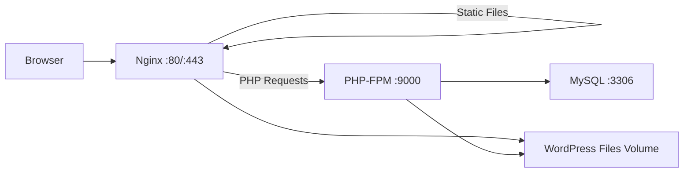

# How to Run WordPress with Docker Compose (Nginx + MySQL + PHP)

Author: [nawazdhandala](https://github.com/nawazdhandala)

Tags: Docker, WordPress, Nginx, MySQL, PHP, Docker Compose, CMS, Web Development

Description: Deploy WordPress with Docker Compose using Nginx as a reverse proxy, MySQL for the database, and PHP-FPM for processing.

---

WordPress powers over 40% of the web, and running it in Docker gives you a reproducible, portable setup that eliminates the "it works on my machine" problem. The default WordPress Docker image bundles Apache, but many production deployments prefer Nginx for its lower resource usage and better static file serving performance. This guide builds a WordPress stack from scratch with Nginx, PHP-FPM, and MySQL, all orchestrated with Docker Compose.

This approach gives you full control over every layer of the stack. You configure Nginx exactly how you want, tune PHP-FPM pools for your traffic, and optimize MySQL for your content volume. No shared hosting limitations, no control panel abstractions.

## Architecture Overview

The stack consists of three containers working together. Nginx handles incoming HTTP requests and serves static files directly. For PHP files, it forwards the request to PHP-FPM, which processes the WordPress code and returns HTML. MySQL stores all WordPress data: posts, pages, users, settings, and plugin data.



## Prerequisites

Docker and Docker Compose installed on your server. At least 1 GB of RAM for a basic WordPress site, more if you expect heavy traffic or run resource-intensive plugins.

```bash
# Verify Docker installation
docker --version
docker compose version
```

## Project Structure

Create a project directory with the necessary configuration files.

```bash
# Create the project structure
mkdir -p wordpress-docker/{nginx,php}
cd wordpress-docker
```

The final directory structure will look like this:

```
wordpress-docker/
  docker-compose.yml
  .env
  nginx/
    default.conf
  php/
    uploads.ini
```

## Docker Compose Configuration

```yaml
# docker-compose.yml - WordPress with Nginx, PHP-FPM, and MySQL
version: "3.8"

services:
  nginx:
    image: nginx:1.25-alpine
    container_name: wp-nginx
    restart: unless-stopped
    ports:
      - "80:80"
      - "443:443"
    volumes:
      # Share WordPress files with Nginx for static file serving
      - wordpress-files:/var/www/html
      # Nginx configuration
      - ./nginx/default.conf:/etc/nginx/conf.d/default.conf:ro
      # SSL certificates (if using)
      - ./nginx/certs:/etc/nginx/certs:ro
    depends_on:
      - wordpress
    networks:
      - wp-network

  wordpress:
    image: wordpress:6-php8.3-fpm-alpine
    container_name: wp-php
    restart: unless-stopped
    volumes:
      # WordPress installation files
      - wordpress-files:/var/www/html
      # Custom PHP settings for uploads
      - ./php/uploads.ini:/usr/local/etc/php/conf.d/uploads.ini:ro
    environment:
      WORDPRESS_DB_HOST: wp-mysql:3306
      WORDPRESS_DB_NAME: wordpress
      WORDPRESS_DB_USER: wordpress
      WORDPRESS_DB_PASSWORD: ${MYSQL_PASSWORD}
      # Security keys - generate at https://api.wordpress.org/secret-key/1.1/salt/
      WORDPRESS_AUTH_KEY: ${WP_AUTH_KEY}
      WORDPRESS_SECURE_AUTH_KEY: ${WP_SECURE_AUTH_KEY}
      WORDPRESS_LOGGED_IN_KEY: ${WP_LOGGED_IN_KEY}
      WORDPRESS_NONCE_KEY: ${WP_NONCE_KEY}
      WORDPRESS_AUTH_SALT: ${WP_AUTH_SALT}
      WORDPRESS_SECURE_AUTH_SALT: ${WP_SECURE_AUTH_SALT}
      WORDPRESS_LOGGED_IN_SALT: ${WP_LOGGED_IN_SALT}
      WORDPRESS_NONCE_SALT: ${WP_NONCE_SALT}
      # Table prefix
      WORDPRESS_TABLE_PREFIX: wp_
    depends_on:
      wp-mysql:
        condition: service_healthy
    networks:
      - wp-network

  wp-mysql:
    image: mysql:8.0
    container_name: wp-mysql
    restart: unless-stopped
    volumes:
      - mysql-data:/var/lib/mysql
    environment:
      MYSQL_ROOT_PASSWORD: ${MYSQL_ROOT_PASSWORD}
      MYSQL_DATABASE: wordpress
      MYSQL_USER: wordpress
      MYSQL_PASSWORD: ${MYSQL_PASSWORD}
    command:
      # Optimized MySQL settings for WordPress
      - --default-authentication-plugin=mysql_native_password
      - --innodb-buffer-pool-size=256M
      - --innodb-log-file-size=64M
      - --max-allowed-packet=64M
      - --max-connections=100
    healthcheck:
      test: ["CMD", "mysqladmin", "ping", "-h", "localhost", "-u", "root", "-p${MYSQL_ROOT_PASSWORD}"]
      interval: 10s
      timeout: 5s
      retries: 5
    networks:
      - wp-network

  # Optional: phpMyAdmin for database management
  phpmyadmin:
    image: phpmyadmin:latest
    container_name: wp-phpmyadmin
    restart: unless-stopped
    ports:
      - "8081:80"
    environment:
      PMA_HOST: wp-mysql
      PMA_PORT: 3306
      UPLOAD_LIMIT: 64M
    depends_on:
      - wp-mysql
    networks:
      - wp-network

networks:
  wp-network:
    name: wp-network

volumes:
  wordpress-files:
  mysql-data:
```

## Nginx Configuration

Create the Nginx server block optimized for WordPress.

```nginx
# nginx/default.conf - Nginx configuration for WordPress with PHP-FPM

server {
    listen 80;
    server_name yourdomain.com www.yourdomain.com;

    root /var/www/html;
    index index.php index.html;

    # Maximum upload size (match php uploads.ini)
    client_max_body_size 64M;

    # Security headers
    add_header X-Frame-Options "SAMEORIGIN" always;
    add_header X-Content-Type-Options "nosniff" always;
    add_header X-XSS-Protection "1; mode=block" always;

    # Gzip compression for faster page loads
    gzip on;
    gzip_types text/plain text/css application/json application/javascript text/xml application/xml text/javascript image/svg+xml;
    gzip_min_length 256;

    # Main location block
    location / {
        try_files $uri $uri/ /index.php?$args;
    }

    # Pass PHP requests to PHP-FPM
    location ~ \.php$ {
        try_files $uri =404;
        fastcgi_split_path_info ^(.+\.php)(/.+)$;
        # Connect to the WordPress PHP-FPM container
        fastcgi_pass wordpress:9000;
        fastcgi_index index.php;
        include fastcgi_params;
        fastcgi_param SCRIPT_FILENAME $document_root$fastcgi_script_name;
        fastcgi_param PATH_INFO $fastcgi_path_info;
        # Increase timeouts for slow admin pages
        fastcgi_read_timeout 300;
    }

    # Cache static assets for 30 days
    location ~* \.(css|js|jpg|jpeg|png|gif|ico|svg|woff|woff2|ttf|eot)$ {
        expires 30d;
        add_header Cache-Control "public, immutable";
        access_log off;
    }

    # Deny access to sensitive files
    location ~ /\.ht {
        deny all;
    }

    location = /wp-config.php {
        deny all;
    }

    location ~* /xmlrpc\.php$ {
        deny all;
    }

    # Deny access to hidden files
    location ~ /\. {
        deny all;
        access_log off;
        log_not_found off;
    }
}
```

## PHP Configuration

Create a custom PHP configuration for WordPress upload limits.

```ini
; php/uploads.ini - PHP settings for WordPress file uploads

; Maximum file upload size
upload_max_filesize = 64M

; Maximum POST data size (should be >= upload_max_filesize)
post_max_size = 64M

; Maximum execution time for PHP scripts (seconds)
max_execution_time = 300

; Maximum input time
max_input_time = 300

; Memory limit per script
memory_limit = 256M
```

## Environment File

Create the `.env` file with all credentials and security keys.

```bash
# .env - WordPress credentials and security keys

# MySQL credentials
MYSQL_ROOT_PASSWORD=your-mysql-root-password
MYSQL_PASSWORD=your-wordpress-db-password

# WordPress security keys (generate at https://api.wordpress.org/secret-key/1.1/salt/)
WP_AUTH_KEY=put-your-unique-phrase-here
WP_SECURE_AUTH_KEY=put-your-unique-phrase-here
WP_LOGGED_IN_KEY=put-your-unique-phrase-here
WP_NONCE_KEY=put-your-unique-phrase-here
WP_AUTH_SALT=put-your-unique-phrase-here
WP_SECURE_AUTH_SALT=put-your-unique-phrase-here
WP_LOGGED_IN_SALT=put-your-unique-phrase-here
WP_NONCE_SALT=put-your-unique-phrase-here
```

Generate unique security keys.

```bash
# Fetch fresh security keys from the WordPress API
curl -s https://api.wordpress.org/secret-key/1.1/salt/
```

## Launch the Stack

```bash
# Start all services
docker compose up -d

# Verify all containers are running
docker compose ps

# Check logs for any startup errors
docker compose logs -f
```

Navigate to `http://yourdomain.com` to complete the WordPress installation wizard.

## Adding SSL with Let's Encrypt

For production, add SSL. You can use Certbot in a separate container or put the entire stack behind Traefik.

```bash
# Option 1: Use Certbot standalone to get certificates
docker run --rm \
  -v ./nginx/certs:/etc/letsencrypt \
  -p 80:80 \
  certbot/certbot certonly \
    --standalone \
    -d yourdomain.com \
    -d www.yourdomain.com \
    --email your-email@example.com \
    --agree-tos
```

Then update the Nginx configuration to serve HTTPS.

```nginx
# Add SSL server block to nginx/default.conf
server {
    listen 443 ssl;
    server_name yourdomain.com www.yourdomain.com;

    ssl_certificate /etc/nginx/certs/live/yourdomain.com/fullchain.pem;
    ssl_certificate_key /etc/nginx/certs/live/yourdomain.com/privkey.pem;
    ssl_protocols TLSv1.2 TLSv1.3;
    ssl_ciphers HIGH:!aNULL:!MD5;

    # ... rest of the server configuration same as above
}
```

## Backup Strategy

```bash
# Backup the MySQL database
docker exec wp-mysql mysqldump -u root -p"$MYSQL_ROOT_PASSWORD" wordpress > wordpress-db-$(date +%Y%m%d).sql

# Backup WordPress files (themes, plugins, uploads)
docker run --rm \
  -v wordpress-files:/source:ro \
  -v $(pwd)/backups:/backup \
  alpine tar czf /backup/wordpress-files-$(date +%Y%m%d).tar.gz -C /source .
```

## Updating WordPress

Update WordPress core, themes, and plugins through the admin dashboard. Update the Docker images separately.

```bash
# Update the Docker images
docker compose pull

# Recreate containers with new images
docker compose up -d
```

## Summary

Running WordPress with Nginx, PHP-FPM, and MySQL in Docker gives you complete control over every layer of the stack. Nginx serves static assets efficiently and delegates PHP processing to a dedicated FPM container. The configuration files are version-controllable, the deployment is reproducible, and scaling individual components is straightforward. Monitor MySQL query performance and Nginx response times with OneUptime to catch performance issues before your visitors notice.
