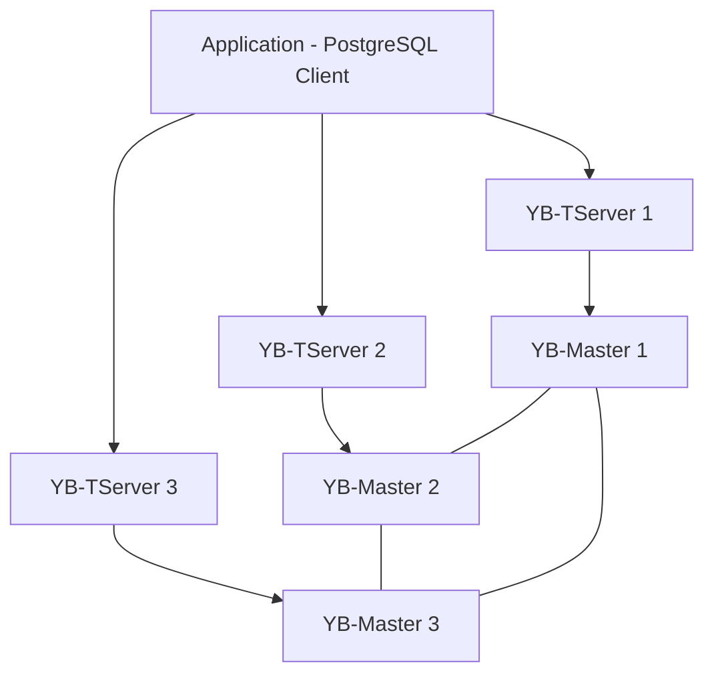

# How to Run YugabyteDB in Docker for Distributed SQL

Author: [nawazdhandala](https://github.com/nawazdhandala)

Tags: Docker, YugabyteDB, Distributed SQL, Databases, PostgreSQL, DevOps

Description: Deploy YugabyteDB in Docker for distributed PostgreSQL-compatible SQL with automatic sharding and fault tolerance

---

YugabyteDB is a distributed SQL database that aims to be a drop-in replacement for PostgreSQL. It automatically shards data across nodes, replicates using Raft consensus, and supports ACID transactions spanning multiple shards. If you want PostgreSQL compatibility with horizontal scalability, YugabyteDB is a strong contender. Docker makes it easy to run a multi-node cluster on your local machine.

## Architecture at a Glance

YugabyteDB has two main server processes.

**YB-Master** manages cluster metadata, tracks tablet (shard) locations, and handles DDL operations like CREATE TABLE. You typically run three master servers for high availability.

**YB-TServer** stores the actual data in tablets and handles read/write requests. This is where your queries execute.



## Quick Start - Single Node

For quick testing, run a single node that combines both master and tserver.

```bash
# Run a single YugabyteDB node
docker run -d \
  --name yugabytedb \
  -p 5433:5433 \
  -p 7000:7000 \
  -p 9000:9000 \
  -p 15433:15433 \
  -v yb_data:/home/yugabyte/yb_data \
  yugabytedb/yugabyte:2.21.1.0-b271 \
  bin/yugabyted start \
    --base_dir=/home/yugabyte/yb_data \
    --daemon=false
```

Port reference:
- **5433**: YSQL (PostgreSQL-compatible) API
- **7000**: YB-Master web UI
- **9000**: YB-TServer web UI
- **15433**: YSQL admin UI

## Multi-Node Cluster with Docker Compose

A production-like setup with three nodes, each running both master and tserver processes.

```yaml
# docker-compose.yml
version: "3.8"

services:
  yb-node1:
    image: yugabytedb/yugabyte:2.21.1.0-b271
    container_name: yb-node1
    hostname: yb-node1
    ports:
      - "5433:5433"    # YSQL
      - "7000:7000"    # Master UI
      - "9000:9000"    # TServer UI
    command:
      - bash
      - -c
      - |
        bin/yugabyted start \
          --base_dir=/home/yugabyte/yb_data \
          --advertise_address=yb-node1 \
          --cloud_location=cloud.region.zone1 \
          --fault_tolerance=zone \
          --daemon=false
    volumes:
      - yb_data1:/home/yugabyte/yb_data
    networks:
      - yb-net
    deploy:
      resources:
        limits:
          memory: 2G

  yb-node2:
    image: yugabytedb/yugabyte:2.21.1.0-b271
    container_name: yb-node2
    hostname: yb-node2
    command:
      - bash
      - -c
      - |
        bin/yugabyted start \
          --base_dir=/home/yugabyte/yb_data \
          --advertise_address=yb-node2 \
          --join=yb-node1 \
          --cloud_location=cloud.region.zone2 \
          --fault_tolerance=zone \
          --daemon=false
    volumes:
      - yb_data2:/home/yugabyte/yb_data
    depends_on:
      - yb-node1
    networks:
      - yb-net
    deploy:
      resources:
        limits:
          memory: 2G

  yb-node3:
    image: yugabytedb/yugabyte:2.21.1.0-b271
    container_name: yb-node3
    hostname: yb-node3
    command:
      - bash
      - -c
      - |
        bin/yugabyted start \
          --base_dir=/home/yugabyte/yb_data \
          --advertise_address=yb-node3 \
          --join=yb-node1 \
          --cloud_location=cloud.region.zone3 \
          --fault_tolerance=zone \
          --daemon=false
    volumes:
      - yb_data3:/home/yugabyte/yb_data
    depends_on:
      - yb-node1
    networks:
      - yb-net
    deploy:
      resources:
        limits:
          memory: 2G

networks:
  yb-net:
    driver: bridge

volumes:
  yb_data1:
  yb_data2:
  yb_data3:
```

```bash
# Start the cluster
docker compose up -d

# Wait for nodes to join (about 30-45 seconds)
sleep 45

# Check cluster status
docker exec yb-node1 bin/yugabyted status --base_dir=/home/yugabyte/yb_data
```

## Connecting with PostgreSQL Clients

YugabyteDB's YSQL API is PostgreSQL-compatible. Use psql or any PostgreSQL driver.

```bash
# Connect with psql
docker exec -it yb-node1 bin/ysqlsh -h yb-node1

# Or from the host if you have psql installed
psql -h 127.0.0.1 -p 5433 -U yugabyte
```

## Creating Tables with Distribution

YugabyteDB automatically shards tables. You can control the sharding strategy.

```sql
-- Create a database
CREATE DATABASE myapp;
\c myapp

-- Hash-sharded table (default, distributes rows evenly)
CREATE TABLE users (
    id UUID DEFAULT gen_random_uuid() PRIMARY KEY,
    email VARCHAR(255) UNIQUE NOT NULL,
    name VARCHAR(255) NOT NULL,
    created_at TIMESTAMPTZ DEFAULT NOW()
);

-- Range-sharded table (good for time-series or range scans)
CREATE TABLE events (
    id UUID DEFAULT gen_random_uuid(),
    user_id UUID NOT NULL,
    event_type VARCHAR(50) NOT NULL,
    payload JSONB,
    created_at TIMESTAMPTZ DEFAULT NOW(),
    PRIMARY KEY (created_at ASC, id)
);

-- Colocated table (keeps small tables on one tablet for JOIN performance)
-- First, create a colocated database
CREATE DATABASE colocated_db WITH COLOCATION = true;
\c colocated_db

-- Tables in a colocated database share a single tablet
CREATE TABLE countries (
    code CHAR(2) PRIMARY KEY,
    name VARCHAR(100) NOT NULL
);

CREATE TABLE cities (
    id SERIAL PRIMARY KEY,
    name VARCHAR(100) NOT NULL,
    country_code CHAR(2) REFERENCES countries(code)
);
```

## Working with Data

Standard PostgreSQL SQL works as expected.

```sql
-- Insert data
INSERT INTO users (email, name) VALUES
    ('alice@example.com', 'Alice Johnson'),
    ('bob@example.com', 'Bob Smith'),
    ('carol@example.com', 'Carol Williams');

-- Complex queries work, including JOINs across distributed tables
SELECT
    u.name,
    COUNT(e.id) AS event_count,
    MAX(e.created_at) AS last_activity
FROM users u
LEFT JOIN events e ON u.id = e.user_id
GROUP BY u.name
ORDER BY event_count DESC;

-- JSONB queries
SELECT
    event_type,
    payload->>'action' AS action,
    COUNT(*)
FROM events
WHERE payload @> '{"source": "web"}'
GROUP BY event_type, action;
```

## Distributed Transactions

YugabyteDB supports distributed ACID transactions that span multiple tablets and nodes.

```sql
-- Transaction spanning multiple tables on potentially different nodes
BEGIN;

INSERT INTO users (id, email, name)
VALUES ('a0eebc99-9c0b-4ef8-bb6d-6bb9bd380a11', 'dave@example.com', 'Dave Brown');

INSERT INTO events (user_id, event_type, payload)
VALUES (
    'a0eebc99-9c0b-4ef8-bb6d-6bb9bd380a11',
    'account_created',
    '{"source": "signup_form", "campaign": "spring_2025"}'
);

COMMIT;
```

## Checking Data Distribution

See how YugabyteDB distributed your data across nodes.

```bash
# View tablet distribution through the master UI
# Open http://localhost:7000 in your browser

# Or query the yb_servers() function
docker exec yb-node1 bin/ysqlsh -h yb-node1 -c "SELECT * FROM yb_servers();"
```

```sql
-- Check tablet leaders and their locations
SELECT * FROM yb_table_properties('users'::regclass);
```

## Fault Tolerance Testing

With three nodes, the cluster survives one node failure. Test it.

```bash
# Stop one node
docker stop yb-node3

# The cluster continues to work (queries still succeed)
docker exec yb-node1 bin/ysqlsh -h yb-node1 -c "SELECT COUNT(*) FROM myapp.users;"

# Bring the node back
docker start yb-node3
```

## Monitoring

Access the built-in web UIs.

- **Master UI**: http://localhost:7000 - Shows cluster status, tablet distribution, and replication health.
- **TServer UI**: http://localhost:9000 - Shows per-node metrics, tablet details, and transaction information.

Query system tables for metrics.

```sql
-- Active connections
SELECT * FROM pg_stat_activity WHERE state = 'active';

-- Table sizes
SELECT
    relname AS table_name,
    pg_size_pretty(pg_total_relation_size(oid)) AS total_size
FROM pg_class
WHERE relkind = 'r'
ORDER BY pg_total_relation_size(oid) DESC;
```

## Backup with ysql_dump

Use the PostgreSQL-compatible dump tool.

```bash
# Dump a database
docker exec yb-node1 bin/ysql_dump -h yb-node1 --dbname=myapp > myapp_backup.sql

# Restore to another cluster
docker exec -i yb-node1 bin/ysqlsh -h yb-node1 -d myapp < myapp_backup.sql
```

## Summary

YugabyteDB in Docker gives you PostgreSQL compatibility with distributed SQL capabilities. The three-node Docker Compose setup provides fault tolerance and automatic data distribution. Use hash sharding for even distribution, range sharding for time-series workloads, and colocated tables for small lookup tables that need fast JOINs. Connect with standard PostgreSQL tools, write standard SQL, and let YugabyteDB handle the distribution, replication, and failover automatically.
