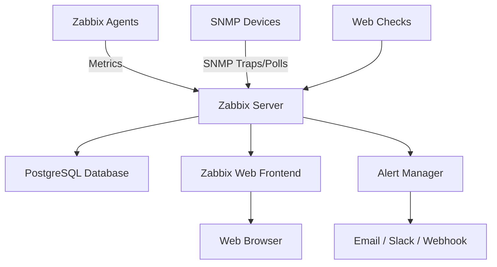

# How to Run Zabbix in Docker for Network Monitoring

Author: [nawazdhandala](https://github.com/nawazdhandala)

Tags: Docker, Zabbix, Network Monitoring, SNMP, Infrastructure, Alerting, Observability

Description: Deploy Zabbix monitoring platform in Docker with PostgreSQL, web frontend, and agent configuration for full network visibility.

---

Zabbix is an enterprise-grade open-source monitoring platform that tracks the health of servers, networks, applications, and cloud resources. It collects metrics through agents, SNMP, JMX, IPMI, and HTTP checks, then visualizes everything through dashboards, graphs, and maps. When things go wrong, Zabbix fires alerts through email, Slack, PagerDuty, webhooks, and dozens of other integrations.

Running Zabbix in Docker reduces a multi-hour manual installation to a few minutes. This guide walks you through deploying the complete Zabbix stack - server, web interface, database, and agents - using Docker Compose.

## Zabbix Architecture

The Zabbix stack consists of several components that work together.



- **Zabbix Server**: The central process that collects data, evaluates triggers, and sends alerts
- **Zabbix Frontend**: A PHP-based web interface for configuration and visualization
- **Database**: Stores configuration, historical data, and events (PostgreSQL or MySQL)
- **Zabbix Agent**: Runs on monitored hosts to collect local metrics
- **Zabbix Proxy**: Optional component for distributed monitoring

## Docker Compose Deployment

Here is a complete Docker Compose setup that runs the entire Zabbix stack.

```yaml
# docker-compose.yml - Full Zabbix monitoring stack
# Includes server, web UI, PostgreSQL, and SNMP trap handling
version: "3.8"

services:
  # PostgreSQL database for Zabbix data storage
  postgres:
    image: postgres:15-alpine
    container_name: zabbix-postgres
    restart: unless-stopped
    environment:
      POSTGRES_USER: zabbix
      POSTGRES_PASSWORD: zabbix_db_password
      POSTGRES_DB: zabbix
    volumes:
      - postgres-data:/var/lib/postgresql/data
    healthcheck:
      test: ["CMD-SHELL", "pg_isready -U zabbix"]
      interval: 10s
      timeout: 5s
      retries: 5
    networks:
      - zabbix-net

  # Zabbix Server - the core monitoring engine
  zabbix-server:
    image: zabbix/zabbix-server-pgsql:alpine-7.0-latest
    container_name: zabbix-server
    restart: unless-stopped
    ports:
      - "10051:10051"  # Zabbix agent communication port
    environment:
      DB_SERVER_HOST: postgres
      POSTGRES_USER: zabbix
      POSTGRES_PASSWORD: zabbix_db_password
      POSTGRES_DB: zabbix
      ZBX_CACHESIZE: 128M
      ZBX_HISTORYCACHESIZE: 64M
      ZBX_TRENDCACHESIZE: 32M
      ZBX_STARTPOLLERS: 10
      ZBX_STARTPINGERS: 5
      ZBX_STARTTRAPPERS: 5
      ZBX_STARTDISCOVERERS: 3
    volumes:
      - zabbix-alertscripts:/usr/lib/zabbix/alertscripts
      - zabbix-externalscripts:/usr/lib/zabbix/externalscripts
      - zabbix-snmptraps:/var/lib/zabbix/snmptraps
    depends_on:
      postgres:
        condition: service_healthy
    networks:
      - zabbix-net

  # Zabbix Web Frontend with Nginx
  zabbix-web:
    image: zabbix/zabbix-web-nginx-pgsql:alpine-7.0-latest
    container_name: zabbix-web
    restart: unless-stopped
    ports:
      - "8080:8080"    # HTTP interface
      - "8443:8443"    # HTTPS interface
    environment:
      ZBX_SERVER_HOST: zabbix-server
      DB_SERVER_HOST: postgres
      POSTGRES_USER: zabbix
      POSTGRES_PASSWORD: zabbix_db_password
      POSTGRES_DB: zabbix
      PHP_TZ: UTC
    depends_on:
      - zabbix-server
    networks:
      - zabbix-net

  # SNMP Trap receiver for network device alerts
  zabbix-snmptraps:
    image: zabbix/zabbix-snmptraps:alpine-7.0-latest
    container_name: zabbix-snmptraps
    restart: unless-stopped
    ports:
      - "162:1162/udp"  # SNMP trap port
    volumes:
      - zabbix-snmptraps:/var/lib/zabbix/snmptraps
      - zabbix-mibs:/usr/share/snmp/mibs
    networks:
      - zabbix-net

  # Zabbix Agent for monitoring the Docker host itself
  zabbix-agent:
    image: zabbix/zabbix-agent2:alpine-7.0-latest
    container_name: zabbix-agent
    restart: unless-stopped
    ports:
      - "10050:10050"
    environment:
      ZBX_HOSTNAME: "docker-host"
      ZBX_SERVER_HOST: zabbix-server
      ZBX_ACTIVE_ALLOW: "true"
    volumes:
      # Mount Docker socket for container monitoring
      - /var/run/docker.sock:/var/run/docker.sock:ro
      - /proc:/host/proc:ro
      - /sys:/host/sys:ro
    privileged: true
    networks:
      - zabbix-net

volumes:
  postgres-data:
  zabbix-alertscripts:
  zabbix-externalscripts:
  zabbix-snmptraps:
  zabbix-mibs:

networks:
  zabbix-net:
    driver: bridge
```

## Starting the Stack

```bash
# Launch all Zabbix services
docker compose up -d

# Wait for the database initialization (takes 1-2 minutes on first run)
docker compose logs -f zabbix-server | head -50

# Check all services are running
docker compose ps
```

Access the web interface at http://your-server:8080. The default credentials are:
- Username: Admin
- Password: zabbix

Change the admin password immediately after first login.

## Configuring Hosts

Add hosts to monitor through the web interface or the Zabbix API.

```bash
# Add a host using the Zabbix API
# First, authenticate and get a session token
curl -s -X POST http://localhost:8080/api_jsonrpc.php \
  -H "Content-Type: application/json" \
  -d '{
    "jsonrpc": "2.0",
    "method": "user.login",
    "params": {
        "username": "Admin",
        "password": "zabbix"
    },
    "id": 1
}'

# Create a new monitored host using the session token
curl -s -X POST http://localhost:8080/api_jsonrpc.php \
  -H "Content-Type: application/json" \
  -d '{
    "jsonrpc": "2.0",
    "method": "host.create",
    "params": {
        "host": "web-server-01",
        "interfaces": [{
            "type": 1,
            "main": 1,
            "useip": 1,
            "ip": "192.168.1.50",
            "dns": "",
            "port": "10050"
        }],
        "groups": [{"groupid": "2"}],
        "templates": [{"templateid": "10001"}]
    },
    "auth": "YOUR_AUTH_TOKEN",
    "id": 2
}'
```

## SNMP Monitoring Configuration

Monitor network devices like switches and routers through SNMP.

```bash
# Add SNMP community strings to the Zabbix SNMP traps configuration
# Edit the snmptrapd.conf in the snmptraps container
docker exec -it zabbix-snmptraps sh -c 'cat > /etc/snmp/snmptrapd.conf << EOF
# Accept SNMP traps from any device using these community strings
authCommunity log,execute,net public
authCommunity log,execute,net private

# Forward traps to the Zabbix SNMP trap processor
traphandle default /usr/sbin/zabbix_trap_receiver.pl
EOF'

# Restart the SNMP traps container to apply changes
docker restart zabbix-snmptraps
```

To add an SNMP-monitored device through the web interface, create a host with an SNMP interface instead of a Zabbix agent interface. Assign an SNMP template matching your device type (Cisco, Juniper, generic network device, etc.).

## Setting Up Alerts

Configure alert notifications through the web interface under Administration > Media types. Here is an example of setting up a webhook alert.

```bash
# Create a custom webhook media type using the API
curl -s -X POST http://localhost:8080/api_jsonrpc.php \
  -H "Content-Type: application/json" \
  -d '{
    "jsonrpc": "2.0",
    "method": "mediatype.create",
    "params": {
        "name": "Slack Webhook",
        "type": 4,
        "parameters": [
            {"name": "URL", "value": "https://hooks.slack.com/services/YOUR/WEBHOOK/URL"},
            {"name": "alert_message", "value": "{ALERT.MESSAGE}"},
            {"name": "alert_subject", "value": "{ALERT.SUBJECT}"}
        ],
        "script": "var params = JSON.parse(value);\nvar req = new HttpRequest();\nreq.addHeader(\"Content-Type: application/json\");\nvar payload = JSON.stringify({text: params.alert_subject + \"\\n\" + params.alert_message});\nreq.post(params.URL, payload);\nreturn \"OK\";"
    },
    "auth": "YOUR_AUTH_TOKEN",
    "id": 3
}'
```

## Database Maintenance

Zabbix generates a significant amount of historical data. Configure housekeeping to manage database growth.

```bash
# Check the current database size
docker exec zabbix-postgres psql -U zabbix -c "SELECT pg_size_pretty(pg_database_size('zabbix'));"

# View the largest tables
docker exec zabbix-postgres psql -U zabbix -c "
SELECT relname, pg_size_pretty(pg_total_relation_size(relid))
FROM pg_catalog.pg_statio_user_tables
ORDER BY pg_total_relation_size(relid) DESC
LIMIT 10;"
```

Configure data retention in the Zabbix web interface under Administration > Housekeeping. Typical settings include 90 days for detailed history and 365 days for trends.

## Scaling with Zabbix Proxy

For large or distributed environments, deploy Zabbix Proxies to collect data locally and forward it to the central server.

```yaml
  # Add to your docker-compose.yml for a remote site
  zabbix-proxy:
    image: zabbix/zabbix-proxy-sqlite3:alpine-7.0-latest
    container_name: zabbix-proxy
    restart: unless-stopped
    ports:
      - "10051:10051"
    environment:
      ZBX_HOSTNAME: "remote-site-proxy"
      ZBX_SERVER_HOST: "central-zabbix-server.example.com"
      ZBX_PROXYMODE: 0  # Active proxy
    volumes:
      - proxy-data:/var/lib/zabbix/db_data
```

## Backup Strategy

Back up both the database and configuration regularly.

```bash
# Dump the Zabbix database for backup
docker exec zabbix-postgres pg_dump -U zabbix zabbix | gzip > zabbix-backup-$(date +%Y%m%d).sql.gz

# Back up the alert scripts and external scripts
docker cp zabbix-server:/usr/lib/zabbix/alertscripts ./backup-alertscripts
docker cp zabbix-server:/usr/lib/zabbix/externalscripts ./backup-externalscripts
```

## Production Tips

For production Zabbix deployments, tune the PostgreSQL container with appropriate `shared_buffers`, `work_mem`, and `effective_cache_size` settings. Increase the Zabbix server cache sizes based on the number of monitored items. Use Zabbix Agent 2 instead of the legacy agent for better performance and built-in plugin support. Enable HTTPS on the web frontend by mounting TLS certificates. Set up partitioning on the history tables for databases with millions of items. Monitor Zabbix itself using the built-in self-monitoring template.

Zabbix in Docker gives you a professional monitoring platform that scales from a handful of servers to thousands of devices. The containerized deployment makes upgrades simple, and the comprehensive feature set covers virtually any monitoring scenario you might encounter.
