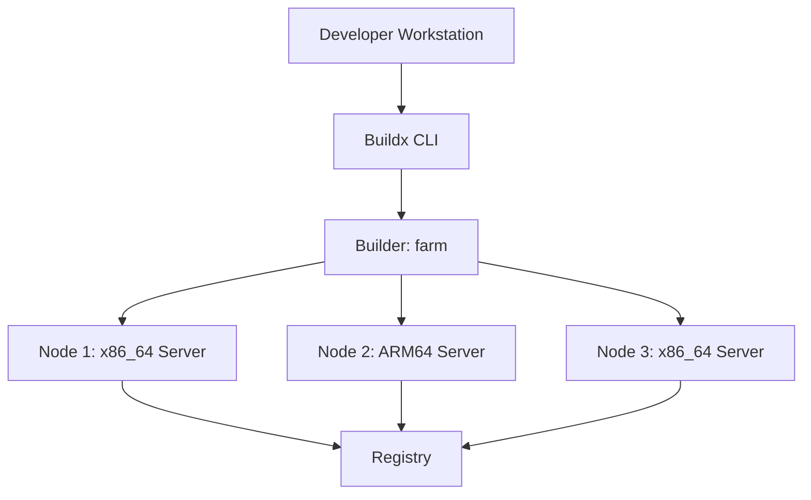

# How to Set Up a Docker Build Farm with Multiple Builders

Author: [nawazdhandala](https://github.com/nawazdhandala)

Tags: Docker, BuildKit, Build Farm, CI/CD, DevOps, Multi-Architecture, Docker Buildx

Description: Create a Docker build farm using Buildx with multiple builder instances to parallelize builds and support multi-architecture images.

---

When your Docker build pipeline grows beyond what a single machine can handle, you need a build farm. A Docker build farm distributes build work across multiple machines, each running a BuildKit instance. This lets you parallelize builds, build for multiple architectures simultaneously, and reduce build times from an hour to minutes.

Docker Buildx makes this straightforward. You create a builder that spans multiple nodes, and Buildx automatically distributes work based on the requested platform. A single `docker buildx build` command can produce images for linux/amd64, linux/arm64, and linux/arm/v7 at the same time, with each architecture building on native hardware instead of slow emulation.

## Architecture



## Prerequisites

You need Docker with Buildx installed on your workstation and SSH access (or Docker API access) to the remote build nodes.

```bash
# Verify Buildx is available
docker buildx version

# Check available platforms on your local machine
docker buildx ls
```

## Setting Up Remote Build Nodes

Each build node needs Docker installed and the Docker daemon accessible, either via SSH or by exposing the Docker API over TCP (with TLS).

### SSH-Based Access (Recommended)

SSH is the simplest and most secure approach. Ensure your SSH key is deployed to each build node and that your user can run Docker without sudo.

```bash
# Test SSH connectivity to each build node
ssh builder@node1.example.com "docker info --format '{{.Architecture}}'"
ssh builder@node2.example.com "docker info --format '{{.Architecture}}'"
ssh builder@node3.example.com "docker info --format '{{.Architecture}}'"
```

### TCP-Based Access with TLS

For TCP access, configure the Docker daemon on each node to listen on a TCP port with TLS.

```json
{
  "hosts": ["unix:///var/run/docker.sock", "tcp://0.0.0.0:2376"],
  "tls": true,
  "tlscacert": "/etc/docker/ca.pem",
  "tlscert": "/etc/docker/server-cert.pem",
  "tlskey": "/etc/docker/server-key.pem",
  "tlsverify": true
}
```

## Creating the Multi-Node Builder

Create a Buildx builder that spans multiple nodes. Each node is added with its architecture and connection details.

```bash
# Create a new builder named "farm"
docker buildx create \
  --name farm \
  --driver docker-container \
  --platform linux/amd64 \
  ssh://builder@node1.example.com

# Add a second x86_64 node for parallel amd64 builds
docker buildx create \
  --name farm \
  --append \
  --platform linux/amd64 \
  ssh://builder@node2.example.com

# Add an ARM64 node for native arm64 builds
docker buildx create \
  --name farm \
  --append \
  --platform linux/arm64 \
  ssh://builder@node3.example.com

# Boot the builder instances
docker buildx inspect farm --bootstrap

# Set the farm as the default builder
docker buildx use farm
```

Verify the builder has all nodes registered.

```bash
# List all builders and their nodes
docker buildx ls

# Inspect the farm builder in detail
docker buildx inspect farm
```

You should see output listing each node with its platform capabilities.

## Building Multi-Architecture Images

With the build farm set up, build and push multi-arch images with a single command.

```bash
# Build for both amd64 and arm64, push to a registry
docker buildx build \
  --platform linux/amd64,linux/arm64 \
  --tag myregistry/myapp:latest \
  --push \
  .
```

Buildx routes the amd64 build to node1 or node2 and the arm64 build to node3. Both builds run in parallel, and the resulting manifest list contains both architectures.

## Optimized Dockerfile for Multi-Arch

Write your Dockerfile to work well across architectures. Use multi-stage builds and the `TARGETPLATFORM` build argument.

```dockerfile
# Dockerfile - Multi-architecture build
# The syntax directive enables BuildKit features
# syntax=docker/dockerfile:1

# Build stage - uses the platform-specific Go compiler
FROM --platform=$BUILDPLATFORM golang:1.22-alpine AS builder

# TARGETPLATFORM is set by Buildx (e.g., linux/amd64, linux/arm64)
ARG TARGETPLATFORM
ARG TARGETOS
ARG TARGETARCH

WORKDIR /app
COPY go.mod go.sum ./
RUN go mod download

COPY . .

# Cross-compile for the target platform
# GOOS and GOARCH are set from the Buildx target arguments
RUN CGO_ENABLED=0 GOOS=${TARGETOS} GOARCH=${TARGETARCH} \
    go build -ldflags="-s -w" -o /app/server ./cmd/server

# Runtime stage - uses the target platform's base image
FROM alpine:3.19

RUN apk add --no-cache ca-certificates tzdata

COPY --from=builder /app/server /usr/local/bin/server

EXPOSE 8080
ENTRYPOINT ["/usr/local/bin/server"]
```

```bash
# Build for all target platforms
docker buildx build \
  --platform linux/amd64,linux/arm64,linux/arm/v7 \
  --tag myregistry/myapp:v1.0.0 \
  --push \
  .
```

## Load Balancing Across Nodes

When multiple nodes share the same platform (e.g., two amd64 nodes), Buildx can distribute builds across them. This is useful when you have a CI system running many builds concurrently.

```bash
# Create a builder with multiple amd64 nodes for load distribution
docker buildx create --name ci-farm --driver docker-container \
  --platform linux/amd64 ssh://builder@amd64-node1.example.com

docker buildx create --name ci-farm --append \
  --platform linux/amd64 ssh://builder@amd64-node2.example.com

docker buildx create --name ci-farm --append \
  --platform linux/amd64 ssh://builder@amd64-node3.example.com

docker buildx create --name ci-farm --append \
  --platform linux/arm64 ssh://builder@arm64-node1.example.com

docker buildx inspect ci-farm --bootstrap
```

## Build Caching with a Shared Registry

For the build farm to share layer caches across nodes, use registry-based cache export and import.

```bash
# Build with registry cache for cross-node cache sharing
docker buildx build \
  --platform linux/amd64,linux/arm64 \
  --tag myregistry/myapp:latest \
  --cache-from type=registry,ref=myregistry/myapp:buildcache \
  --cache-to type=registry,ref=myregistry/myapp:buildcache,mode=max \
  --push \
  .
```

The `mode=max` flag exports all intermediate layers, not just the final image layers. This maximizes cache hit rates across builds.

## CI/CD Integration

Integrate the build farm into your CI pipeline. Here is a GitHub Actions example.

```yaml
# .github/workflows/build.yml - Multi-arch build using the build farm
name: Build Multi-Arch Image

on:
  push:
    tags: ["v*"]

jobs:
  build:
    runs-on: ubuntu-latest
    steps:
      - uses: actions/checkout@v4

      - name: Set up SSH key for build nodes
        run: |
          mkdir -p ~/.ssh
          echo "${{ secrets.BUILD_NODE_SSH_KEY }}" > ~/.ssh/id_rsa
          chmod 600 ~/.ssh/id_rsa
          ssh-keyscan node1.example.com node2.example.com node3.example.com >> ~/.ssh/known_hosts

      - name: Set up Docker Buildx
        uses: docker/setup-buildx-action@v3

      - name: Create build farm
        run: |
          docker buildx create --name ci-farm \
            --platform linux/amd64 ssh://builder@node1.example.com
          docker buildx create --name ci-farm --append \
            --platform linux/arm64 ssh://builder@node3.example.com
          docker buildx use ci-farm
          docker buildx inspect ci-farm --bootstrap

      - name: Build and push
        uses: docker/build-push-action@v5
        with:
          context: .
          platforms: linux/amd64,linux/arm64
          push: true
          tags: myregistry/myapp:${{ github.ref_name }}
          cache-from: type=registry,ref=myregistry/myapp:buildcache
          cache-to: type=registry,ref=myregistry/myapp:buildcache,mode=max
```

## Monitoring the Build Farm

Keep track of your build nodes' health and build performance.

```bash
# Check the status of each builder node
docker buildx inspect farm

# Monitor disk usage on build nodes (build caches grow over time)
for node in node1 node2 node3; do
  echo "=== ${node} ==="
  ssh builder@${node}.example.com "docker system df"
done

# Prune old build caches on all nodes
for node in node1 node2 node3; do
  ssh builder@${node}.example.com "docker builder prune -f --keep-storage 10GB"
done
```

## Cleanup

```bash
# Remove the builder
docker buildx rm farm

# Remove builder data on remote nodes
for node in node1 node2 node3; do
  ssh builder@${node}.example.com "docker builder prune -af"
done
```

## Conclusion

A Docker build farm with multiple Buildx builders gives you parallel, multi-architecture builds that drastically cut build times. Native ARM builds on actual ARM hardware are especially impactful, since QEMU emulation is orders of magnitude slower. The SSH-based builder setup is secure and simple to maintain. For tracking the health and performance of your build farm, [OneUptime](https://oneuptime.com) can monitor each build node and alert you when disk space runs low or nodes become unreachable.
