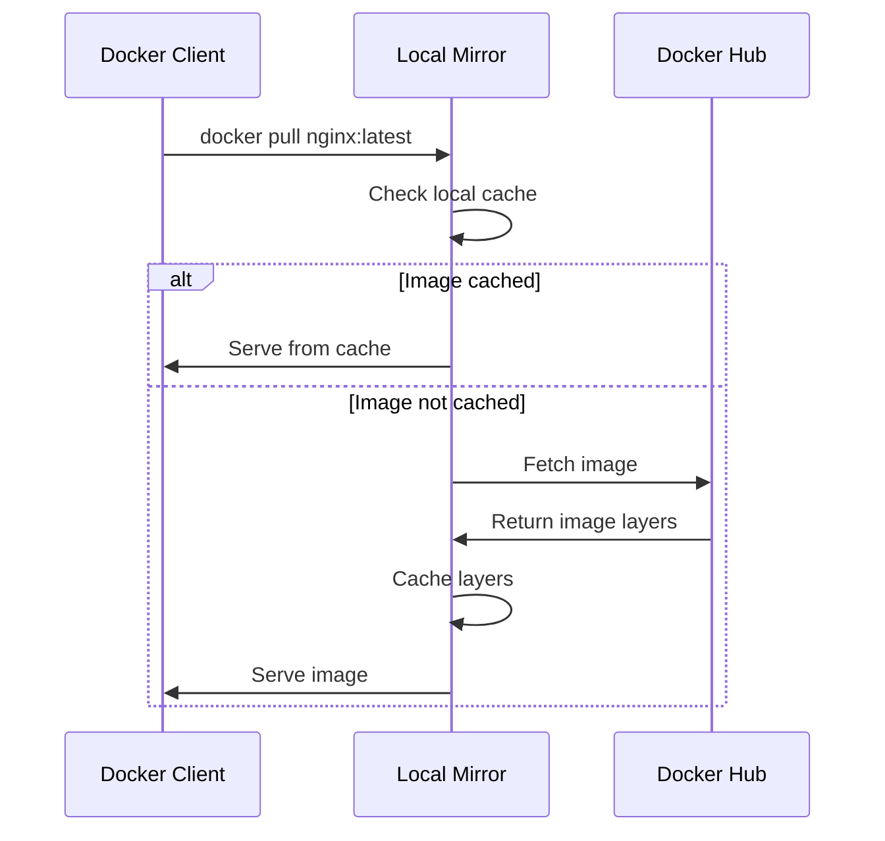

# How to Set Up a Docker Registry with Read-Only Mirror

Author: [nawazdhandala](https://github.com/nawazdhandala)

Tags: Docker, Registry, Mirror, Pull-Through Cache, Image Distribution, DevOps, Infrastructure

Description: Configure a Docker registry as a read-only mirror and pull-through cache to speed up image pulls and reduce external bandwidth usage.

---

When a developer runs `docker pull` for an image the Docker daemon does not already have, the image is downloaded from a remote registry. In organizations with hundreds of developers or CI/CD pipelines, this means the same images get pulled thousands of times over the internet. A local registry mirror acts as a pull-through cache: the first pull fetches from the upstream registry, and subsequent pulls can serve cached content from the local cache. This reduces bandwidth, speeds up builds, and provides some resilience for already-cached content when the upstream registry has an outage.

This guide covers setting up a Docker registry mirror, configuring clients to use it, and managing the cache for long-term operation.

## How a Pull-Through Cache Works

A pull-through cache sits between your Docker clients and the upstream registry. When a client requests an image:

1. The mirror checks if it has the image cached locally
2. If yes, it serves it directly (fast, no internet needed)
3. If no, it fetches it from the upstream registry, caches it, and serves it to the client

For tag-based pulls, the registry checks the upstream registry to make sure it has the latest version of the tag.

The mirror is read-only from the client's perspective. You cannot push images to it. It only caches images pulled through it.


```mermaid
sequenceDiagram
    participant Client as Docker Client
    participant Mirror as Local Mirror
    participant Upstream as Docker Hub

    Client->>Mirror: docker pull nginx:latest
    Mirror->>Mirror: Check local cache
    alt Image cached
        Mirror->>Client: Serve from cache
    else Image not cached
        Mirror->>Upstream: Fetch image
        Upstream->>Mirror: Return image layers
        Mirror->>Mirror: Cache layers
        Mirror->>Client: Serve image
    end
```

## Prerequisites

- Docker Engine 20.10+
- Docker Compose v2
- Sufficient disk space for cached images (depends on your usage, start with 100 GB)
- A host accessible to all Docker clients in your network

## Setting Up the Registry Mirror

Docker's official registry image supports pull-through cache mode out of the box.

```yaml
# docker-compose.yml - Registry pull-through mirror

version: "3.8"

services:
  registry-mirror:
    image: registry:2
    container_name: registry-mirror
    ports:
      # Expose the mirror on port 5000
      - "5000:5000"
    environment:
      # Enable pull-through cache mode pointing to Docker Hub
      REGISTRY_PROXY_REMOTEURL: https://registry-1.docker.io
      # Enable deletes so the proxy cache scheduler can clean old entries
      REGISTRY_STORAGE_DELETE_ENABLED: "true"
    volumes:
      # Persistent storage for cached images
      - mirror_data:/var/lib/registry
      # Custom configuration file
      - ./config.yml:/etc/docker/registry/config.yml
    restart: unless-stopped

volumes:
  mirror_data:
```

Create the detailed registry configuration.

```yaml
# config.yml - Full registry mirror configuration
version: 0.1

log:
  level: info
  formatter: text

storage:
  filesystem:
    rootdirectory: /var/lib/registry
  # Enable layer deletion for cache management
  delete:
    enabled: true
  # Redirect clients to pull directly from blob storage when possible
  redirect:
    disable: false
  cache:
    blobdescriptor: inmemory

http:
  addr: :5000
  headers:
    X-Content-Type-Options: [nosniff]

# Pull-through cache configuration
proxy:
  remoteurl: https://registry-1.docker.io
  # Uncomment and add credentials for authenticated pulls
  # username: your-dockerhub-username
  # password: your-dockerhub-token

# Health check endpoint
health:
  storagedriver:
    enabled: true
    interval: 10s
    threshold: 3
```

Start the mirror.

```bash
# Start the registry mirror
docker compose up -d

# Verify the mirror is running
curl http://localhost:5000/v2/

# Check the mirror's catalog (empty initially)
curl http://localhost:5000/v2/_catalog
```

## Configuring Docker Clients

Every Docker daemon that should use the mirror needs to be configured to point to it.

### Linux Configuration

```bash
# Edit or create the Docker daemon configuration
sudo tee /etc/docker/daemon.json <<EOF
{
  "registry-mirrors": ["http://mirror-host:5000"]
}
EOF

# Restart Docker to apply the configuration
sudo systemctl restart docker

# Verify the mirror is configured
docker info | grep -A 5 "Registry Mirrors"
```

### Docker Desktop (macOS/Windows)

Open Docker Desktop settings, go to Docker Engine, and add the mirror configuration.

```json
{
  "registry-mirrors": ["http://mirror-host:5000"]
}
```

Click "Apply & Restart" to activate.

## Testing the Mirror

Pull an image and verify it gets cached in the mirror.

```bash
# Pull an image through the mirror
docker pull nginx:alpine

# Check that the mirror now has the image cached
curl http://mirror-host:5000/v2/_catalog

# You should see the nginx library in the catalog
# Subsequent pulls of the same image will be served from cache
```

## Mirroring Multiple Registries

The Docker Engine `registry-mirrors` setting and Docker's official registry mirror documentation are for Docker Hub. The built-in pull-through cache only supports one upstream, and Docker's documentation states that only the central Docker Hub can be mirrored this way. Do not run additional `registry:2` instances for GHCR or Quay.io and expect Docker clients to use them transparently through `registry-mirrors`.

To cache other registries, use a registry product or runtime configuration that explicitly supports proxy caching for those registries, and configure clients to pull from the cache address or use registry-specific mirror settings where your runtime supports them.

## Adding TLS to the Mirror

For production use, serve the mirror over HTTPS with a certificate trusted by your Docker clients.

```yaml
# config-tls.yml - Mirror configuration with TLS
version: 0.1

log:
  level: info

storage:
  filesystem:
    rootdirectory: /var/lib/registry
  delete:
    enabled: true

http:
  addr: :5000
  tls:
    # Path to TLS certificate and key
    certificate: /certs/mirror.crt
    key: /certs/mirror.key
  headers:
    X-Content-Type-Options: [nosniff]

proxy:
  remoteurl: https://registry-1.docker.io
```

Update the compose file to mount certificates.

```yaml
  registry-mirror:
    image: registry:2
    ports:
      - "5000:5000"
    volumes:
      - mirror_data:/var/lib/registry
      - ./config-tls.yml:/etc/docker/registry/config.yml
      - ./certs:/certs:ro
    restart: unless-stopped
```

## Authenticating to Docker Hub

Docker Hub rate limits anonymous pulls to 100 per 6 hours. Authenticated Docker Personal users get 200 pulls per 6 hours, while authenticated Pro, Team, and Business users have no pull rate limit under the current Docker Hub usage policy. Adding credentials to the mirror lets it authenticate and get the limit for that account.

```yaml
# config.yml - Mirror with Docker Hub authentication
proxy:
  remoteurl: https://registry-1.docker.io
  username: your-dockerhub-username
  password: your-dockerhub-access-token
```

Generate an access token in your Docker Hub account settings rather than using your password directly.

## Cache Management

The mirror cache grows over time. Implement a cleanup strategy to prevent disk exhaustion.

```bash
# Check how much space the cache is using
docker exec registry-mirror du -sh /var/lib/registry

# View all cached repositories
curl -s http://localhost:5000/v2/_catalog | python3 -m json.tool

# List tags for a specific cached image
curl -s http://localhost:5000/v2/library/nginx/tags/list | python3 -m json.tool
```

The pull-through cache has its own scheduler for stale cached content, but you can also run garbage collection after deletions or untagged manifests. Garbage collection should run while the registry is stopped or in read-only mode.

```bash
#!/bin/bash
# cleanup-mirror.sh - Stop the mirror and run garbage collection

REGISTRY_SERVICE="registry-mirror"

echo "Starting cache cleanup at $(date)"

# Stop the registry before garbage collection to avoid corrupting uploads
docker compose stop ${REGISTRY_SERVICE}

# Run garbage collection using the same service config and volume
docker compose run --rm --no-deps ${REGISTRY_SERVICE} garbage-collect \
  /etc/docker/registry/config.yml --delete-untagged

docker compose up -d ${REGISTRY_SERVICE}

# Log the current cache size
CACHE_SIZE=$(docker compose exec -T ${REGISTRY_SERVICE} du -sh /var/lib/registry | awk '{print $1}')
echo "Cache size after cleanup: ${CACHE_SIZE}"
```

```bash
# Schedule the cleanup to run weekly
chmod +x cleanup-mirror.sh
echo "0 3 * * 0 /path/to/cleanup-mirror.sh >> /var/log/mirror-cleanup.log 2>&1" | crontab -
```

## Monitoring the Mirror

Track mirror performance to understand cache hit rates and usage patterns.

```bash
# Enable metrics in the registry configuration
# Add to config.yml:
# http:
#   debug:
#     addr: :5001
#     prometheus:
#       enabled: true

# Then scrape metrics from the debug endpoint
curl http://localhost:5001/metrics | grep registry_proxy
```

Key metrics to watch:

- `registry_proxy_hits_total` - number of cache hits
- `registry_proxy_misses_total` - number of cache misses
- `registry_proxy_pulled_bytes_total` - amount of data pulled from the upstream registry

## Handling Mirror Failures

If the mirror goes down, Docker clients configured with `registry-mirrors` can fall back to pulling directly from Docker Hub. However, builds will be slower and consume external bandwidth until the mirror is restored.

```bash
# Quick health check for the mirror
curl -f http://localhost:5000/v2/ || echo "Mirror is down"

# Check container status
docker inspect registry-mirror --format '{{.State.Status}}'
```

## Conclusion

A Docker registry mirror is one of the simplest infrastructure improvements you can make for a team that works heavily with containers. It reduces external bandwidth, speeds up image pulls, provides resilience for cached content, and helps stay within Docker Hub rate limits. The setup takes minutes with Docker Compose, and the ongoing maintenance is minimal. Start with a single Docker Hub mirror and use registry-specific cache solutions for other registries as your usage grows.
