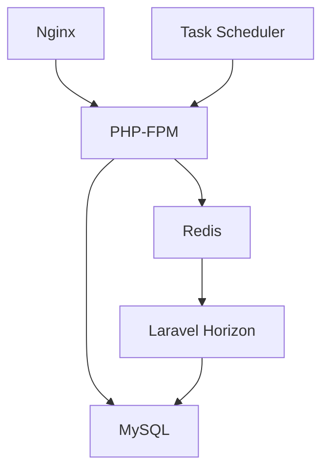

# How to Set Up a Laravel + MySQL + Redis + Horizon Stack with Docker Compose

Author: [nawazdhandala](https://github.com/nawazdhandala)

Tags: Docker, Docker Compose, Laravel, PHP, MySQL, Redis, Horizon, Queue

Description: Build a complete Laravel stack with MySQL, Redis, and Laravel Horizon for queue management using Docker Compose.

---

Laravel is the most popular PHP framework, and its ecosystem includes powerful tools for background job processing. Laravel Horizon provides a dashboard and configuration layer on top of Redis queues that makes managing workers, monitoring failed jobs, and tuning throughput straightforward. Putting the full stack into Docker Compose means you can run Laravel, MySQL, Redis, and Horizon with a single command.

This guide builds a production-grade Docker Compose setup for the complete Laravel stack. You will get a working web server, MySQL database, Redis cache and queue backend, Horizon worker, and a scheduler for cron-based tasks.

## Architecture



Nginx handles incoming HTTP traffic and forwards requests to PHP-FPM. Laravel talks to MySQL for persistence and Redis for caching plus queues. Horizon supervises the queue workers, and a separate container runs the Laravel scheduler.

## Project Structure

```
laravel-docker/
├── docker-compose.yml
├── Dockerfile
├── docker/
│   ├── nginx/
│   │   └── default.conf
│   └── php/
│       └── php.ini
├── app/
├── config/
├── routes/
└── ...
```

## The Dockerfile

```dockerfile
# PHP 8.3 FPM base image
FROM php:8.3-fpm-alpine AS base

# Install system dependencies and PHP extensions
RUN apk add --no-cache \
    nginx \
    supervisor \
    libpng-dev \
    libjpeg-turbo-dev \
    freetype-dev \
    oniguruma-dev \
    libzip-dev \
    && docker-php-ext-configure gd --with-freetype --with-jpeg \
    && docker-php-ext-install pdo_mysql mbstring gd zip opcache pcntl

# Install Redis PHP extension
RUN apk add --no-cache --virtual .build-deps $PHPIZE_DEPS \
    && pecl install redis \
    && docker-php-ext-enable redis \
    && apk del .build-deps

# Install Composer from the official image
COPY --from=composer:2 /usr/bin/composer /usr/bin/composer

WORKDIR /var/www/html

# Copy composer files and install dependencies first for caching
COPY composer.json composer.lock ./
RUN composer install --no-dev --no-scripts --no-autoloader --prefer-dist

# Copy the rest of the application
COPY . .

# Generate optimized autoloader and cache config
RUN composer dump-autoload --optimize \
    && php artisan config:cache \
    && php artisan route:cache \
    && php artisan view:cache

# Set proper permissions for Laravel storage and cache
RUN chown -R www-data:www-data storage bootstrap/cache \
    && chmod -R 775 storage bootstrap/cache

EXPOSE 9000
CMD ["php-fpm"]
```

## Nginx Configuration

```nginx
# docker/nginx/default.conf - Nginx config for Laravel
server {
    listen 80;
    server_name localhost;
    root /var/www/html/public;
    index index.php;

    # Handle Laravel routing
    location / {
        try_files $uri $uri/ /index.php?$query_string;
    }

    # Pass PHP requests to PHP-FPM
    location ~ \.php$ {
        fastcgi_pass app:9000;
        fastcgi_index index.php;
        fastcgi_param SCRIPT_FILENAME $document_root$fastcgi_script_name;
        include fastcgi_params;
        fastcgi_read_timeout 300;
    }

    # Deny access to dotfiles
    location ~ /\.(?!well-known).* {
        deny all;
    }
}
```

## Docker Compose Configuration

```yaml
# Laravel + MySQL + Redis + Horizon full stack
version: "3.8"

services:
  # PHP-FPM application server
  app:
    build:
      context: .
      dockerfile: Dockerfile
    volumes:
      - ./:/var/www/html
      - ./docker/php/php.ini:/usr/local/etc/php/conf.d/custom.ini
    environment:
      DB_HOST: mysql
      DB_PORT: 3306
      DB_DATABASE: laravel
      DB_USERNAME: laravel
      DB_PASSWORD: secret
      REDIS_HOST: redis
      REDIS_PORT: 6379
      CACHE_DRIVER: redis
      SESSION_DRIVER: redis
      QUEUE_CONNECTION: redis
    depends_on:
      mysql:
        condition: service_healthy
      redis:
        condition: service_healthy
    networks:
      - laravel-network

  # Nginx web server
  nginx:
    image: nginx:1.25-alpine
    ports:
      - "8080:80"
    volumes:
      - ./:/var/www/html
      - ./docker/nginx/default.conf:/etc/nginx/conf.d/default.conf
    depends_on:
      - app
    networks:
      - laravel-network

  # MySQL database
  mysql:
    image: mysql:8.0
    ports:
      - "3306:3306"
    environment:
      MYSQL_ROOT_PASSWORD: rootsecret
      MYSQL_DATABASE: laravel
      MYSQL_USER: laravel
      MYSQL_PASSWORD: secret
    volumes:
      - mysql-data:/var/lib/mysql
    healthcheck:
      test: ["CMD", "mysqladmin", "ping", "-h", "localhost"]
      interval: 10s
      timeout: 5s
      retries: 5
    networks:
      - laravel-network

  # Redis for cache, sessions, and queues
  redis:
    image: redis:7-alpine
    ports:
      - "6379:6379"
    volumes:
      - redis-data:/data
    healthcheck:
      test: ["CMD", "redis-cli", "ping"]
      interval: 10s
      timeout: 5s
      retries: 5
    command: redis-server --appendonly yes --maxmemory 256mb --maxmemory-policy allkeys-lru
    networks:
      - laravel-network

  # Laravel Horizon for queue management
  horizon:
    build:
      context: .
      dockerfile: Dockerfile
    command: php artisan horizon
    volumes:
      - ./:/var/www/html
    environment:
      DB_HOST: mysql
      DB_PORT: 3306
      DB_DATABASE: laravel
      DB_USERNAME: laravel
      DB_PASSWORD: secret
      REDIS_HOST: redis
      REDIS_PORT: 6379
      QUEUE_CONNECTION: redis
    depends_on:
      - app
      - redis
    restart: unless-stopped
    networks:
      - laravel-network

  # Laravel scheduler for cron jobs
  scheduler:
    build:
      context: .
      dockerfile: Dockerfile
    command: >
      sh -c "while true; do php artisan schedule:run --verbose --no-interaction; sleep 60; done"
    volumes:
      - ./:/var/www/html
    environment:
      DB_HOST: mysql
      DB_PORT: 3306
      DB_DATABASE: laravel
      DB_USERNAME: laravel
      DB_PASSWORD: secret
      REDIS_HOST: redis
      REDIS_PORT: 6379
    depends_on:
      - app
    restart: unless-stopped
    networks:
      - laravel-network

volumes:
  mysql-data:
  redis-data:

networks:
  laravel-network:
    driver: bridge
```

## Horizon Configuration

Configure Horizon in `config/horizon.php` to define your queue workers:

```php
// config/horizon.php - Horizon supervisor configuration
'environments' => [
    'production' => [
        'supervisor-1' => [
            'maxProcesses' => 10,
            'balanceMaxShift' => 1,
            'balanceCooldown' => 3,
            'connection' => 'redis',
            'queue' => ['default', 'emails', 'notifications'],
            'balance' => 'auto',
            'tries' => 3,
            'timeout' => 300,
        ],
    ],
    'local' => [
        'supervisor-1' => [
            'maxProcesses' => 3,
            'connection' => 'redis',
            'queue' => ['default', 'emails', 'notifications'],
            'balance' => 'simple',
            'tries' => 3,
            'timeout' => 300,
        ],
    ],
],
```

## Running the Stack

```bash
# Build and start all services
docker compose up --build -d

# Run database migrations
docker compose exec app php artisan migrate

# Seed the database
docker compose exec app php artisan db:seed

# Check Horizon status
docker compose exec app php artisan horizon:status
```

## Accessing the Services

Once everything is running:

- Laravel application: http://localhost:8080
- Horizon dashboard: http://localhost:8080/horizon
- MySQL: localhost:3306 (connect with any MySQL client)
- Redis: localhost:6379

## Dispatching Jobs

Test the queue system by dispatching a job:

```php
// Dispatch a job to the default queue
dispatch(new App\Jobs\ProcessData($data));

// Dispatch to a specific queue
dispatch(new App\Jobs\SendEmail($user))->onQueue('emails');
```

Watch it execute in the Horizon dashboard or check the logs:

```bash
# Watch Horizon worker logs in real time
docker compose logs -f horizon
```

## Custom PHP Configuration

Create `docker/php/php.ini` for any PHP tuning:

```ini
; docker/php/php.ini - Custom PHP settings
upload_max_filesize = 64M
post_max_size = 64M
memory_limit = 256M
max_execution_time = 300
opcache.enable = 1
opcache.memory_consumption = 128
opcache.max_accelerated_files = 10000
opcache.validate_timestamps = 0
```

Set `opcache.validate_timestamps = 1` during development so code changes take effect immediately.

## Troubleshooting

If Horizon stops processing jobs, check the connection between Horizon and Redis:

```bash
# Restart Horizon
docker compose restart horizon

# Check Redis connectivity from the app container
docker compose exec app php artisan tinker --execute="dump(app('redis')->ping());"

# Clear failed jobs
docker compose exec app php artisan queue:flush
```

## Summary

This stack gives you everything Laravel needs for a real production application. Nginx and PHP-FPM handle web requests, MySQL stores your data, Redis powers caching, sessions, and queues, Horizon manages your queue workers with a beautiful dashboard, and the scheduler runs your cron tasks. All of it starts with `docker compose up` and runs identically on every machine.
