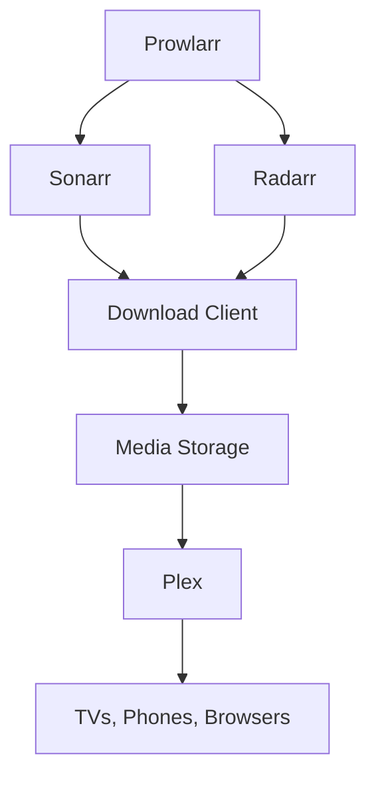

# How to Set Up a Media Server Stack (Plex + Sonarr + Radarr) with Docker Compose

Author: [nawazdhandala](https://github.com/nawazdhandala)

Tags: Docker, Docker Compose, Plex, Sonarr, Radarr, Media Server, Self-Hosted, Home Server

Description: Deploy a complete home media server with Plex, Sonarr, and Radarr using Docker Compose for automated media management.

---

Running your own media server gives you full control over your library, and Docker Compose makes the setup reproducible and portable. Plex handles media streaming to any device in your home or remotely. Sonarr automates TV show management, and Radarr does the same for movies. Together, they form an automated pipeline that organizes your media library with minimal manual effort.

This guide walks through deploying all three services with Docker Compose, including proper volume mapping, network configuration, and the additional services that tie everything together.

## Architecture



Prowlarr manages indexers (search sources) and feeds results to Sonarr and Radarr. When they find content that matches your criteria, they send it to a download client. Once complete, the files land in a shared media directory that Plex monitors for new content.

## Directory Structure

Plan your media directories carefully. The key is giving all services access to a common root so file moves are instant (hard links or atomic moves) rather than copies.

```
/path/to/media/
├── downloads/
│   ├── complete/
│   └── incomplete/
├── tv/
├── movies/
└── docker/
    ├── plex/
    ├── sonarr/
    ├── radarr/
    └── prowlarr/
```

## Docker Compose Configuration

```yaml
# Media server stack - Plex, Sonarr, Radarr, Prowlarr
version: "3.8"

services:
  # Plex Media Server - streaming and playback
  plex:
    image: lscr.io/linuxserver/plex:latest
    container_name: plex
    network_mode: host
    environment:
      - PUID=1000
      - PGID=1000
      - TZ=America/New_York
      - VERSION=docker
    volumes:
      - ./docker/plex:/config
      - /path/to/media/tv:/tv
      - /path/to/media/movies:/movies
    restart: unless-stopped

  # Sonarr - TV show management and automation
  sonarr:
    image: lscr.io/linuxserver/sonarr:latest
    container_name: sonarr
    environment:
      - PUID=1000
      - PGID=1000
      - TZ=America/New_York
    ports:
      - "8989:8989"
    volumes:
      - ./docker/sonarr:/config
      - /path/to/media/tv:/tv
      - /path/to/media/downloads:/downloads
    restart: unless-stopped
    networks:
      - media-network

  # Radarr - Movie management and automation
  radarr:
    image: lscr.io/linuxserver/radarr:latest
    container_name: radarr
    environment:
      - PUID=1000
      - PGID=1000
      - TZ=America/New_York
    ports:
      - "7878:7878"
    volumes:
      - ./docker/radarr:/config
      - /path/to/media/movies:/movies
      - /path/to/media/downloads:/downloads
    restart: unless-stopped
    networks:
      - media-network

  # Prowlarr - Indexer management for Sonarr and Radarr
  prowlarr:
    image: lscr.io/linuxserver/prowlarr:latest
    container_name: prowlarr
    environment:
      - PUID=1000
      - PGID=1000
      - TZ=America/New_York
    ports:
      - "9696:9696"
    volumes:
      - ./docker/prowlarr:/config
    restart: unless-stopped
    networks:
      - media-network

  # SABnzbd - Usenet download client (optional, swap for your preferred client)
  sabnzbd:
    image: lscr.io/linuxserver/sabnzbd:latest
    container_name: sabnzbd
    environment:
      - PUID=1000
      - PGID=1000
      - TZ=America/New_York
    ports:
      - "8080:8080"
    volumes:
      - ./docker/sabnzbd:/config
      - /path/to/media/downloads:/downloads
    restart: unless-stopped
    networks:
      - media-network

networks:
  media-network:
    driver: bridge
```

Notice that Plex uses `network_mode: host`. This is the recommended approach because Plex uses DLNA and other discovery protocols that work best without NAT. All other services use a bridged network.

## Understanding PUID and PGID

The LinuxServer.io images use PUID and PGID to run processes as a specific user. This ensures files created by the containers have the correct ownership.

Find your user's IDs:

```bash
# Get your user ID and group ID
id $(whoami)
# Output: uid=1000(youruser) gid=1000(yourgroup) ...
```

Use these values in the compose file. If all services run as the same user, they can freely read and write each other's files.

## Starting the Stack

```bash
# Create the config directories
mkdir -p docker/{plex,sonarr,radarr,prowlarr,sabnzbd}

# Update the volume paths in docker-compose.yml to match your system
# Then start everything
docker compose up -d

# Verify all containers are running
docker compose ps
```

## Initial Configuration

Each service needs initial setup through its web interface.

**Plex** (http://your-ip:32400/web):
1. Sign in with your Plex account
2. Add libraries pointing to `/tv` and `/movies`
3. Configure remote access if you want to stream outside your home

**Sonarr** (http://localhost:8989):
1. Go to Settings, then Media Management
2. Add a root folder: `/tv`
3. Go to Settings, then Download Clients
4. Add your download client (e.g., SABnzbd at `http://sabnzbd:8080`)

**Radarr** (http://localhost:7878):
1. Go to Settings, then Media Management
2. Add a root folder: `/movies`
3. Add the same download client as Sonarr

**Prowlarr** (http://localhost:9696):
1. Add your indexers
2. Go to Settings, then Apps
3. Add Sonarr and Radarr as applications (use the container names as hostnames)

## Connecting Prowlarr to Sonarr and Radarr

Prowlarr needs the API keys from Sonarr and Radarr to sync indexers automatically.

```bash
# Get the Sonarr API key from its config
docker compose exec sonarr cat /config/config.xml | grep ApiKey

# Get the Radarr API key from its config
docker compose exec radarr cat /config/config.xml | grep ApiKey
```

In Prowlarr's app settings, use `http://sonarr:8989` and `http://radarr:7878` as the server URLs, along with the API keys you extracted.

## Volume Mapping Strategy

The volume configuration above deserves explanation. Both Sonarr and Radarr can see the `/downloads` directory and their respective media directories. When a download finishes, Sonarr or Radarr moves (or hard-links) the file from `/downloads` to `/tv` or `/movies`. Because both paths are on the same Docker volume, this operation is instant.

If you map downloads and media to different volumes, files will be copied instead of moved, doubling disk usage temporarily and slowing down the process.

## Hardware Transcoding for Plex

If your server has an Intel CPU with Quick Sync, you can enable hardware transcoding:

```yaml
# Add to the Plex service for hardware transcoding
plex:
  devices:
    - /dev/dri:/dev/dri
  environment:
    - PUID=1000
    - PGID=1000
    - TZ=America/New_York
    - VERSION=docker
```

This passes the GPU device to the container, allowing Plex to transcode video using hardware acceleration instead of CPU.

## Backup Strategy

Back up the config directories regularly. These contain your library metadata, watch history, and service configurations:

```bash
# Back up all service configs
tar -czf media-stack-backup-$(date +%Y%m%d).tar.gz docker/

# Restore from backup
tar -xzf media-stack-backup-20260208.tar.gz
```

## Updating Services

LinuxServer.io images are updated frequently. Pull new versions with:

```bash
# Pull latest images and recreate containers
docker compose pull
docker compose up -d

# Check running versions
docker compose exec sonarr cat /config/logs/sonarr.txt | head -5
```

## Troubleshooting

```bash
# Check container logs for errors
docker compose logs plex
docker compose logs sonarr
docker compose logs radarr

# Verify volume permissions
docker compose exec sonarr ls -la /tv
docker compose exec radarr ls -la /movies

# Test connectivity between services
docker compose exec sonarr curl -s http://radarr:7878/api/v3/system/status -H "X-Api-Key: YOUR_KEY"
```

## Summary

This media server stack automates your entire media workflow. Prowlarr feeds indexer results to Sonarr and Radarr, which manage downloads and organize files. Plex streams everything to your devices. Docker Compose keeps the whole setup portable and reproducible, and updating any component takes a single command. Store the compose file and your config backups, and you can rebuild the entire server from scratch in minutes.
