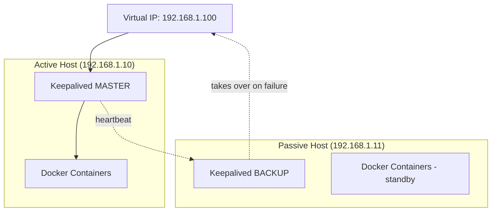

# How to Set Up Active-Passive Docker Container Failover

Author: [nawazdhandala](https://github.com/nawazdhandala)

Tags: Docker, Failover, High Availability, Keepalived, Production, DevOps

Description: Build an active-passive failover setup for Docker containers using Keepalived and health check scripts for automatic recovery.

---

Active-passive failover is the simplest form of high availability. One server handles all the traffic while a second server sits idle, ready to take over if the primary fails. This pattern works well for stateful services like databases, message queues, and applications that cannot easily run as multiple instances.

This guide sets up active-passive failover between two Docker hosts using Keepalived, a battle-tested Linux tool for managing virtual IP addresses and failover.

## How Active-Passive Failover Works

The two servers share a virtual IP (VIP) address. Clients connect to the VIP. The active server owns the VIP and handles all requests. Keepalived monitors the active server's health. If the active server fails, Keepalived moves the VIP to the passive server, which then starts handling traffic.



## Prerequisites

You need two servers on the same network with Docker installed. Both servers must be able to communicate over VRRP (Virtual Router Redundancy Protocol) on the network.

For this guide, the servers are:
- Primary: 192.168.1.10
- Secondary: 192.168.1.11
- Virtual IP: 192.168.1.100

## Installing Keepalived

Install Keepalived on both servers:

```bash
# Install Keepalived on both primary and secondary servers
sudo apt-get update
sudo apt-get install -y keepalived
```

## Configuring the Primary Server

Create the Keepalived configuration on the primary server:

```bash
# /etc/keepalived/keepalived.conf on the PRIMARY server
vrrp_script check_docker {
    # Script that checks if the Docker container is healthy
    script "/usr/local/bin/check-docker-health.sh"
    interval 5          # Check every 5 seconds
    weight -20          # Reduce priority by 20 if the check fails
    fall 2              # Mark as failed after 2 consecutive failures
    rise 2              # Mark as recovered after 2 consecutive successes
}

vrrp_instance DOCKER_HA {
    state MASTER                # This is the primary server
    interface eth0              # Network interface to use
    virtual_router_id 51        # Must be the same on both servers
    priority 100                # Higher priority wins the VIP
    advert_int 1                # Send heartbeat every 1 second
    authentication {
        auth_type PASS
        auth_pass docker_ha_secret
    }
    virtual_ipaddress {
        192.168.1.100/24        # The virtual IP address
    }
    track_script {
        check_docker             # Use the health check script
    }
    notify /usr/local/bin/keepalived-notify.sh
}
```

## Configuring the Secondary Server

The secondary configuration is nearly identical, with two changes: the state is BACKUP and the priority is lower.

```bash
# /etc/keepalived/keepalived.conf on the SECONDARY server
vrrp_script check_docker {
    script "/usr/local/bin/check-docker-health.sh"
    interval 5
    weight -20
    fall 2
    rise 2
}

vrrp_instance DOCKER_HA {
    state BACKUP                # This is the backup server
    interface eth0
    virtual_router_id 51        # Same ID as the primary
    priority 90                 # Lower priority than the primary
    advert_int 1
    authentication {
        auth_type PASS
        auth_pass docker_ha_secret
    }
    virtual_ipaddress {
        192.168.1.100/24
    }
    track_script {
        check_docker
    }
    notify /usr/local/bin/keepalived-notify.sh
}
```

## Health Check Script

This script checks that Docker is running and that key containers are healthy. Deploy it on both servers.

```bash
#!/bin/bash
# /usr/local/bin/check-docker-health.sh
# Returns 0 (success) if Docker and critical containers are healthy
# Returns 1 (failure) to trigger Keepalived failover

# Check if Docker daemon is responding
if ! docker info > /dev/null 2>&1; then
    echo "Docker daemon is not responding"
    exit 1
fi

# List of critical containers that must be running and healthy
CRITICAL_CONTAINERS=("app" "redis")

for CONTAINER in "${CRITICAL_CONTAINERS[@]}"; do
    # Check if container exists and is running
    STATE=$(docker inspect --format='{{.State.Running}}' "$CONTAINER" 2>/dev/null)
    if [ "$STATE" != "true" ]; then
        echo "Container $CONTAINER is not running"
        exit 1
    fi

    # Check health status if the container has a health check defined
    HEALTH=$(docker inspect --format='{{if .State.Health}}{{.State.Health.Status}}{{else}}none{{end}}' "$CONTAINER" 2>/dev/null)
    if [ "$HEALTH" != "healthy" ] && [ "$HEALTH" != "none" ]; then
        echo "Container $CONTAINER health status: $HEALTH"
        exit 1
    fi
done

# All checks passed
exit 0
```

Make it executable on both servers:

```bash
# Set the script as executable
sudo chmod +x /usr/local/bin/check-docker-health.sh
```

## Notification Script

This script runs when Keepalived changes state. Use it to start or stop containers and send alerts.

```bash
#!/bin/bash
# /usr/local/bin/keepalived-notify.sh
# Called by Keepalived on state changes
# Arguments: $1=group/instance, $2=name, $3=state (MASTER/BACKUP/FAULT)

TYPE=$1
NAME=$2
STATE=$3
LOGFILE="/var/log/keepalived-transitions.log"
WEBHOOK="https://hooks.slack.com/services/YOUR/WEBHOOK/URL"

log_and_notify() {
    local MSG="$1"
    echo "$(date '+%Y-%m-%d %H:%M:%S') - $MSG" >> "$LOGFILE"
    # Send notification
    curl -s -X POST "$WEBHOOK" \
      -H "Content-Type: application/json" \
      -d "{\"text\": \"$MSG\"}" > /dev/null 2>&1
}

case $STATE in
    "MASTER")
        log_and_notify "$(hostname) became MASTER - starting containers"
        # Start containers when becoming master
        cd /opt/app && docker compose up -d
        ;;
    "BACKUP")
        log_and_notify "$(hostname) became BACKUP - stopping containers"
        # Stop containers when becoming backup (optional)
        # Some setups keep containers running on both hosts
        cd /opt/app && docker compose stop
        ;;
    "FAULT")
        log_and_notify "$(hostname) entered FAULT state"
        ;;
esac
```

Make it executable:

```bash
sudo chmod +x /usr/local/bin/keepalived-notify.sh
```

## Setting Up the Application Stack

Create identical Docker Compose files on both servers:

```yaml
# /opt/app/docker-compose.yml - identical on both hosts
version: "3.9"

services:
  app:
    image: myapp:latest
    restart: unless-stopped
    ports:
      - "8080:8080"
    environment:
      DATABASE_URL: postgresql://db.external:5432/myapp
      REDIS_URL: redis://localhost:6379
    healthcheck:
      test: ["CMD", "curl", "-f", "http://localhost:8080/health"]
      interval: 10s
      timeout: 5s
      retries: 3
    depends_on:
      redis:
        condition: service_healthy

  redis:
    image: redis:7-alpine
    restart: unless-stopped
    command: redis-server --appendonly yes
    volumes:
      - redis-data:/data
    healthcheck:
      test: ["CMD", "redis-cli", "ping"]
      interval: 10s
      timeout: 5s
      retries: 3

volumes:
  redis-data:
```

Pull images on both servers so failover is fast:

```bash
# Pre-pull images on both servers so failover does not wait for downloads
docker compose -f /opt/app/docker-compose.yml pull
```

Start the stack on the primary:

```bash
# Start the application stack on the primary server
cd /opt/app && docker compose up -d
```

## Starting Keepalived

Start Keepalived on both servers:

```bash
# Enable and start Keepalived
sudo systemctl enable keepalived
sudo systemctl start keepalived
```

Verify the VIP is assigned to the primary:

```bash
# Check that the VIP is on the primary server's network interface
ip addr show eth0 | grep 192.168.1.100
```

You should see the VIP listed on the primary server.

## Testing the Failover

Simulate a failure by stopping Docker on the primary:

```bash
# On the primary server, stop Docker to simulate a failure
sudo systemctl stop docker
```

Within a few seconds, Keepalived detects the failure through the health check script, lowers the primary's priority, and the secondary takes over the VIP. Check on the secondary:

```bash
# On the secondary, verify it now holds the VIP
ip addr show eth0 | grep 192.168.1.100
```

The secondary should now have the VIP, and its notification script should have started the containers.

Test that the service responds through the VIP:

```bash
# From any machine on the network, test the service
curl http://192.168.1.100:8080/health
```

Restore the primary:

```bash
# On the primary, restart Docker
sudo systemctl start docker
```

Because the primary has a higher priority (100 vs 90), Keepalived will move the VIP back to the primary automatically. This is called preemption. If you prefer the secondary to keep the VIP after a failover (non-preemptive), add `nopreempt` to the BACKUP server's configuration.

## Data Synchronization

The biggest challenge with active-passive failover is keeping data in sync. Several strategies work:

**External database.** Store all application state in a managed database or a database on separate servers. Both Docker hosts connect to the same external database. No data sync is needed.

**Shared storage.** Use a network filesystem like NFS or GlusterFS mounted on both hosts. The active host writes to it, and the passive host has immediate access if it takes over.

**DRBD (Distributed Replicated Block Device).** Replicate a block device between the two hosts. DRBD synchronously mirrors writes from the primary to the secondary.

For most applications, an external database is the simplest and most reliable approach. Keep your Docker containers stateless and push all state to the database.

## Monitoring the Failover Setup

Keep an eye on the Keepalived state and transition history:

```bash
# Check Keepalived status
sudo systemctl status keepalived

# Watch the transition log
tail -f /var/log/keepalived-transitions.log

# Check VRRP statistics
sudo journalctl -u keepalived --since "1 hour ago"
```

Active-passive failover with Keepalived is a proven pattern that has been used in production for decades. It trades some resource utilization (the passive server sits idle) for simplicity and predictability. When your container goes down, you get automatic recovery in seconds without any orchestration platform.
