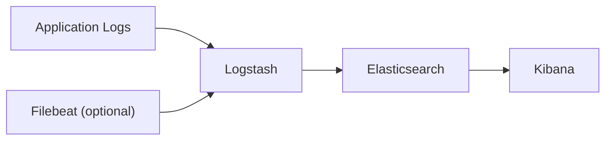

# How to Set Up an ELK Stack (Elasticsearch + Logstash + Kibana) with Docker Compose

Author: [nawazdhandala](https://github.com/nawazdhandala)

Tags: Docker, Docker Compose, Elasticsearch, Logstash, Kibana, ELK, Logging, Observability

Description: Deploy the full ELK stack with Docker Compose for centralized log collection, processing, and visualization.

---

The ELK stack, consisting of Elasticsearch, Logstash, and Kibana, remains one of the most widely used solutions for centralized logging. Elasticsearch stores and indexes your logs, Logstash ingests and transforms them, and Kibana gives you a visual interface for searching and building dashboards. Running all three components locally with Docker Compose lets you develop log pipelines, test configurations, and prototype dashboards without provisioning any infrastructure.

This guide walks through a complete Docker Compose setup for the ELK stack, including pipeline configuration, security basics, and tips for handling real-world log formats.

## Architecture



Applications send logs to Logstash (directly or via Filebeat). Logstash processes, filters, and transforms the logs before sending them to Elasticsearch for indexing. Kibana connects to Elasticsearch and provides the search and visualization layer.

## Directory Structure

```
elk-stack/
├── docker-compose.yml
├── logstash/
│   ├── pipeline/
│   │   └── logstash.conf
│   └── config/
│       └── logstash.yml
├── elasticsearch/
│   └── elasticsearch.yml
└── kibana/
    └── kibana.yml
```

## Docker Compose Configuration

```yaml
# ELK Stack - Elasticsearch, Logstash, Kibana
version: "3.8"

services:
  # Elasticsearch - search and analytics engine
  elasticsearch:
    image: docker.elastic.co/elasticsearch/elasticsearch:8.12.0
    environment:
      - discovery.type=single-node
      - xpack.security.enabled=false
      - "ES_JAVA_OPTS=-Xms1g -Xmx1g"
      - cluster.name=elk-cluster
      - bootstrap.memory_lock=true
    ulimits:
      memlock:
        soft: -1
        hard: -1
    ports:
      - "9200:9200"
      - "9300:9300"
    volumes:
      - es-data:/usr/share/elasticsearch/data
    healthcheck:
      test: ["CMD-SHELL", "curl -f http://localhost:9200/_cluster/health || exit 1"]
      interval: 15s
      timeout: 10s
      retries: 10
    networks:
      - elk-network

  # Logstash - data processing pipeline
  logstash:
    image: docker.elastic.co/logstash/logstash:8.12.0
    ports:
      - "5044:5044"
      - "5000:5000/tcp"
      - "5000:5000/udp"
      - "9600:9600"
    volumes:
      - ./logstash/pipeline:/usr/share/logstash/pipeline:ro
      - ./logstash/config/logstash.yml:/usr/share/logstash/config/logstash.yml:ro
    environment:
      - "LS_JAVA_OPTS=-Xms512m -Xmx512m"
    depends_on:
      elasticsearch:
        condition: service_healthy
    networks:
      - elk-network

  # Kibana - visualization and dashboards
  kibana:
    image: docker.elastic.co/kibana/kibana:8.12.0
    ports:
      - "5601:5601"
    environment:
      - ELASTICSEARCH_HOSTS=http://elasticsearch:9200
    volumes:
      - ./kibana/kibana.yml:/usr/share/kibana/config/kibana.yml:ro
    depends_on:
      elasticsearch:
        condition: service_healthy
    networks:
      - elk-network

volumes:
  es-data:

networks:
  elk-network:
    driver: bridge
```

Notice the `memlock` ulimit for Elasticsearch. This prevents the JVM from swapping, which is critical for performance. The `discovery.type=single-node` setting tells Elasticsearch this is a standalone instance, not part of a cluster.

## Elasticsearch Configuration

```yaml
# elasticsearch/elasticsearch.yml - Elasticsearch settings
cluster.name: elk-cluster
network.host: 0.0.0.0
discovery.type: single-node

# Disable security for local development (enable in production)
xpack.security.enabled: false

# Index lifecycle management
xpack.ilm.enabled: true
```

## Logstash Configuration

```yaml
# logstash/config/logstash.yml - Logstash global settings
http.host: "0.0.0.0"
xpack.monitoring.elasticsearch.hosts: ["http://elasticsearch:9200"]
pipeline.workers: 2
pipeline.batch.size: 125
```

## Logstash Pipeline

The pipeline is where Logstash does its real work. This configuration accepts logs via TCP, parses JSON, and sends them to Elasticsearch.

```ruby
# logstash/pipeline/logstash.conf - Log processing pipeline
input {
  # Accept logs over TCP on port 5000
  tcp {
    port => 5000
    codec => json_lines
    type => "tcp-input"
  }

  # Accept Filebeat input on port 5044
  beats {
    port => 5044
  }
}

filter {
  # Parse JSON-formatted log messages
  if [message] =~ /^\{/ {
    json {
      source => "message"
      target => "parsed"
    }
  }

  # Parse timestamp from log entries
  date {
    match => ["timestamp", "ISO8601", "yyyy-MM-dd HH:mm:ss"]
    target => "@timestamp"
  }

  # Add geographic data from IP addresses
  if [client_ip] {
    geoip {
      source => "client_ip"
      target => "geoip"
    }
  }

  # Extract log level and categorize
  if [level] {
    mutate {
      uppercase => ["level"]
    }
  }

  # Remove unnecessary fields to save storage
  mutate {
    remove_field => ["host", "@version"]
  }
}

output {
  # Send processed logs to Elasticsearch
  elasticsearch {
    hosts => ["http://elasticsearch:9200"]
    index => "logs-%{+YYYY.MM.dd}"
    action => "index"
  }

  # Also print to stdout for debugging (remove in production)
  stdout {
    codec => rubydebug
  }
}
```

## Kibana Configuration

```yaml
# kibana/kibana.yml - Kibana settings
server.host: "0.0.0.0"
server.name: kibana
elasticsearch.hosts: ["http://elasticsearch:9200"]
monitoring.ui.container.elasticsearch.enabled: true
```

## Starting the Stack

```bash
# Pull images and start everything
docker compose up -d

# Wait for Elasticsearch to become healthy
docker compose logs -f elasticsearch

# Verify Elasticsearch is running
curl http://localhost:9200/_cluster/health?pretty
```

Elasticsearch takes 30 to 60 seconds to start. Wait for the health check to pass before trying to send logs.

## Sending Test Logs

Send logs directly to Logstash via TCP to verify the pipeline works:

```bash
# Send a JSON log entry to Logstash on port 5000
echo '{"timestamp":"2026-02-08T10:30:00Z","level":"INFO","service":"auth","message":"User login successful","user_id":1234}' | nc localhost 5000

# Send multiple log entries
for i in $(seq 1 10); do
  echo "{\"timestamp\":\"2026-02-08T10:30:0${i}Z\",\"level\":\"INFO\",\"service\":\"api\",\"message\":\"Request processed\",\"duration_ms\":$((RANDOM % 500))}" | nc localhost 5000
done
```

## Configuring Kibana

After sending some logs, open Kibana at http://localhost:5601 and create an index pattern:

1. Go to Stack Management and then Index Patterns
2. Create a pattern matching `logs-*`
3. Select `@timestamp` as the time field
4. Go to Discover to search your logs

## Sending Application Logs

Configure your application to ship logs to Logstash. Here is an example using Python:

```python
# Python logging configuration for Logstash
import logging
import json
import socket

class LogstashHandler(logging.Handler):
    """Custom handler that sends JSON logs to Logstash over TCP."""
    def __init__(self, host="localhost", port=5000):
        super().__init__()
        self.host = host
        self.port = port

    def emit(self, record):
        log_entry = {
            "timestamp": self.format(record),
            "level": record.levelname,
            "message": record.getMessage(),
            "logger": record.name,
            "service": "my-python-app",
        }
        try:
            sock = socket.socket(socket.AF_INET, socket.SOCK_STREAM)
            sock.connect((self.host, self.port))
            sock.sendall((json.dumps(log_entry) + "\n").encode())
            sock.close()
        except Exception:
            self.handleError(record)
```

## Index Lifecycle Management

For long-running deployments, configure index lifecycle management to prevent Elasticsearch from consuming all disk space:

```bash
# Create an ILM policy that deletes logs older than 30 days
curl -X PUT "http://localhost:9200/_ilm/policy/logs-policy" -H "Content-Type: application/json" -d '{
  "policy": {
    "phases": {
      "hot": {
        "min_age": "0ms",
        "actions": {
          "rollover": {
            "max_size": "5gb",
            "max_age": "1d"
          }
        }
      },
      "delete": {
        "min_age": "30d",
        "actions": {
          "delete": {}
        }
      }
    }
  }
}'
```

## Memory Tuning

The ELK stack is memory-hungry. For local development, adjust the JVM heap sizes in the compose file:

```yaml
# Reduced memory settings for development
elasticsearch:
  environment:
    - "ES_JAVA_OPTS=-Xms512m -Xmx512m"

logstash:
  environment:
    - "LS_JAVA_OPTS=-Xms256m -Xmx256m"
```

For production, give Elasticsearch at least 4GB of heap and Logstash at least 1GB.

## Troubleshooting

```bash
# Check Elasticsearch cluster health
curl http://localhost:9200/_cluster/health?pretty

# List all indices
curl http://localhost:9200/_cat/indices?v

# Check Logstash pipeline stats
curl http://localhost:9600/_node/stats/pipelines?pretty

# View Logstash processing errors
docker compose logs logstash | grep -i error
```

## Summary

The ELK stack with Docker Compose gives you a complete log management system that runs locally. Logstash handles log ingestion and transformation, Elasticsearch indexes everything for fast search, and Kibana provides the visualization layer. This setup works for local development, testing log pipelines, and prototyping dashboards before deploying to a production cluster.
