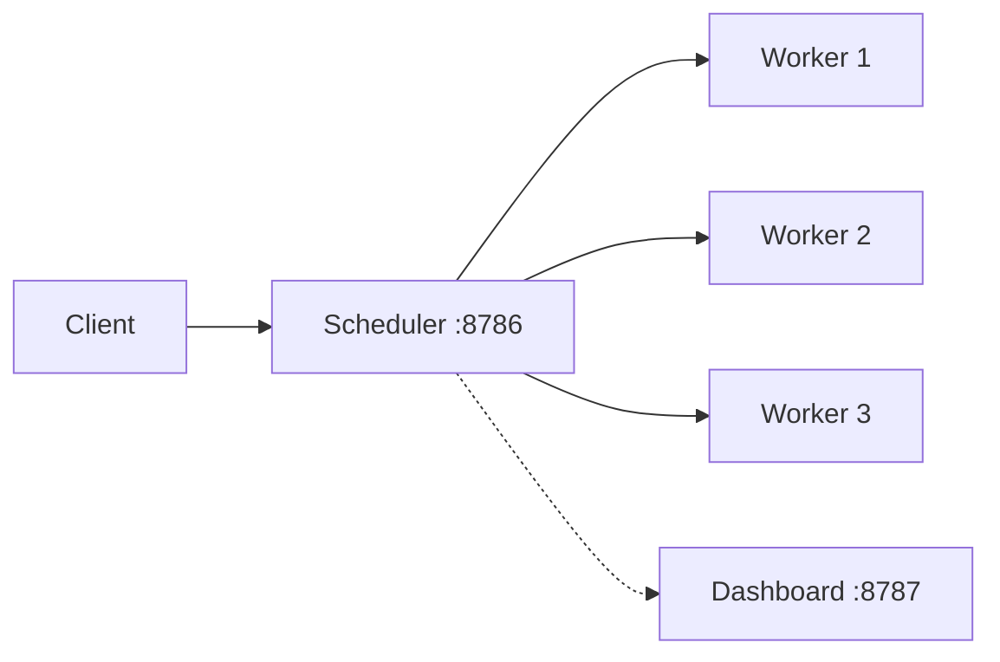

# How to Set Up Dask Distributed Computing in Docker

Author: [nawazdhandala](https://github.com/nawazdhandala)

Tags: Docker, Dask, Distributed Computing, Python, Data Science, Docker Compose, Parallel Computing

Description: A hands-on guide to running Dask distributed computing clusters in Docker for scalable Python workloads

---

Dask is a parallel computing library for Python that scales from a single laptop to large clusters. Unlike Apache Spark, Dask integrates natively with the Python ecosystem. It works with NumPy, Pandas, and scikit-learn out of the box. If you already write Python data analysis code, Dask lets you parallelize it with minimal changes. Docker provides the ideal deployment target for Dask clusters because you can run identical scheduler and worker environments, scale workers up and down easily, and avoid dependency conflicts.

This guide walks through deploying a Dask distributed cluster with Docker, from local development to a production-ready multi-worker setup.

## How Dask Distributed Works

A Dask distributed cluster has three components:

- **Scheduler**: Coordinates task execution across workers. There is exactly one scheduler.
- **Workers**: Execute tasks and hold intermediate results in memory. You can have as many as you need.
- **Client**: Your Python script or notebook that submits work to the scheduler.



## Quick Start with a Single Container

For simple development tasks, you can run Dask in a single container:

```bash
# Run Dask in single-machine mode with the dashboard
docker run -it --rm \
  --name dask-single \
  -p 8787:8787 \
  ghcr.io/dask/dask:latest \
  python -c "
from dask.distributed import Client, LocalCluster
cluster = LocalCluster(dashboard_address=':8787')
client = Client(cluster)
print(f'Dashboard: {client.dashboard_link}')
import dask.array as da
x = da.random.random((10000, 10000), chunks=(1000, 1000))
print(f'Sum: {x.sum().compute()}')
"
```

## Multi-Node Cluster with Docker Compose

The real power of Dask comes from distributing work across multiple machines or containers. Docker Compose sets this up cleanly:

```yaml
# docker-compose.yml - Dask cluster with scheduler, 3 workers, and notebook
version: "3.8"

services:
  scheduler:
    image: ghcr.io/dask/dask:latest
    container_name: dask-scheduler
    command: dask scheduler
    ports:
      - "8786:8786"   # Scheduler port for clients
      - "8787:8787"   # Dashboard web UI
    restart: unless-stopped

  worker-1:
    image: ghcr.io/dask/dask:latest
    container_name: dask-worker-1
    command: >
      dask worker tcp://scheduler:8786
      --nworkers 1
      --nthreads 4
      --memory-limit 4GB
    depends_on:
      - scheduler
    restart: unless-stopped

  worker-2:
    image: ghcr.io/dask/dask:latest
    container_name: dask-worker-2
    command: >
      dask worker tcp://scheduler:8786
      --nworkers 1
      --nthreads 4
      --memory-limit 4GB
    depends_on:
      - scheduler
    restart: unless-stopped

  worker-3:
    image: ghcr.io/dask/dask:latest
    container_name: dask-worker-3
    command: >
      dask worker tcp://scheduler:8786
      --nworkers 1
      --nthreads 4
      --memory-limit 4GB
    depends_on:
      - scheduler
    restart: unless-stopped

  notebook:
    image: ghcr.io/dask/dask-notebook:latest
    container_name: dask-notebook
    ports:
      - "8888:8888"
    environment:
      - DASK_SCHEDULER_ADDRESS=tcp://scheduler:8786
    depends_on:
      - scheduler
    volumes:
      - ./notebooks:/home/jovyan/work

volumes:
  notebooks:
```

Start everything:

```bash
# Launch the Dask cluster
docker compose up -d

# Verify all services are running
docker compose ps
```

The Dask dashboard at http://localhost:8787 provides real-time visibility into task execution, worker memory usage, and task stream timelines.

## Connecting a Client

From any Python environment that can reach the scheduler, connect and submit work:

```python
# client_example.py - connect to the Dask cluster and run a computation
from dask.distributed import Client
import dask.dataframe as dd

# Connect to the scheduler running in Docker
client = Client("tcp://localhost:8786")
print(client)  # Shows cluster status: workers, cores, memory

# Read a large CSV file in parallel across workers
df = dd.read_csv("/path/to/large-dataset-*.csv")

# Compute mean of a column - distributed across all workers
result = df["value"].mean().compute()
print(f"Mean value: {result}")

# Group by and aggregate - distributed
summary = df.groupby("category").agg({"value": "sum", "count": "mean"}).compute()
print(summary)
```

## Scaling Workers Dynamically

One of Docker Compose's strengths is the ability to scale services. You can add workers without modifying the compose file:

```bash
# Scale workers up to 6 instances
docker compose up -d --scale worker-1=6

# Check worker count on the dashboard
curl -s http://localhost:8787/info/main/workers.html | grep "Worker"
```

For more granular control, use separate named workers with different resource allocations.

## Custom Image with Additional Libraries

Data science workflows usually need more packages than what the base Dask image provides:

```dockerfile
# Dockerfile - Dask worker with additional data science libraries
FROM ghcr.io/dask/dask:latest

# Install additional libraries needed by your workflows
RUN pip install --no-cache-dir \
    scikit-learn \
    xgboost \
    pyarrow \
    fastparquet \
    s3fs \
    sqlalchemy \
    psycopg2-binary

# Set the working directory
WORKDIR /app
```

Build and reference it in your compose file:

```bash
# Build custom Dask image
docker build -t dask-custom:latest .
```

Update the image reference in your docker-compose.yml for all services (scheduler, workers, and notebook) to ensure consistency.

## Working with Large Datasets

Dask shines when processing datasets that do not fit in memory. Here is a pattern for processing Parquet files stored in a mounted volume:

```python
# process_parquet.py - distributed Parquet processing
from dask.distributed import Client
import dask.dataframe as dd

client = Client("tcp://localhost:8786")

# Read partitioned Parquet files - Dask reads them lazily
df = dd.read_parquet("/data/events/year=2025/**/*.parquet")

# Filter and transform without loading everything into memory
filtered = df[df["event_type"] == "purchase"]
filtered["revenue_cents"] = (filtered["price"] * 100).astype(int)

# Write results back as partitioned Parquet
filtered.to_parquet(
    "/data/output/purchases/",
    partition_on=["region"],
    engine="pyarrow"
)

print("Processing complete")
```

## Dask with GPU Workers

If you have NVIDIA GPUs, you can use Dask with RAPIDS (cuDF, cuML) for GPU-accelerated data processing:

```yaml
# docker-compose-gpu.yml - Dask with GPU workers
version: "3.8"

services:
  scheduler:
    image: rapidsai/rapidsai:24.04-cuda12.2-runtime-ubuntu22.04-py3.11
    command: dask scheduler
    ports:
      - "8786:8786"
      - "8787:8787"

  gpu-worker:
    image: rapidsai/rapidsai:24.04-cuda12.2-runtime-ubuntu22.04-py3.11
    command: >
      dask worker tcp://scheduler:8786
      --nworkers 1
      --nthreads 1
      --memory-limit 16GB
    deploy:
      resources:
        reservations:
          devices:
            - driver: nvidia
              count: 1
              capabilities: [gpu]
    depends_on:
      - scheduler
```

## Monitoring and Diagnostics

The Dask dashboard provides several useful pages:

- **/status**: Overview of cluster activity and task progress
- **/workers**: Per-worker memory and CPU usage
- **/tasks**: Detailed task stream showing execution timeline
- **/graph**: Task dependency graph visualization

You can also collect metrics programmatically:

```python
# monitor.py - collect cluster metrics
from dask.distributed import Client

client = Client("tcp://localhost:8786")

# Get cluster-level information
info = client.scheduler_info()
print(f"Workers: {len(info['workers'])}")
for addr, worker in info["workers"].items():
    print(f"  {addr}: {worker['memory_limit'] / 1e9:.1f} GB, "
          f"{worker['nthreads']} threads")
```

## Resource Limits and Memory Management

Setting proper memory limits prevents workers from consuming all available RAM:

```bash
# Run a worker with strict memory limits
docker run -d \
  --name dask-worker \
  --memory 4g \
  --cpus 4 \
  ghcr.io/dask/dask:latest \
  dask worker tcp://scheduler:8786 \
  --nworkers 1 \
  --nthreads 4 \
  --memory-limit 3.5GB
```

Set the Dask memory limit slightly below the Docker memory limit. This gives the worker process room for overhead and prevents the container from being killed by the OOM killer.

## Conclusion

Dask in Docker provides a Pythonic approach to distributed computing that fits naturally into existing data science workflows. The scheduler-worker architecture maps cleanly onto Docker Compose services, and scaling is as simple as adding more worker containers. Start with the official images for prototyping, build custom images when your workflows need additional packages, and use the dashboard to understand where time is being spent. For teams already invested in the Python ecosystem, Dask is often a simpler alternative to Spark for parallelizing DataFrame operations, array computations, and machine learning training.
