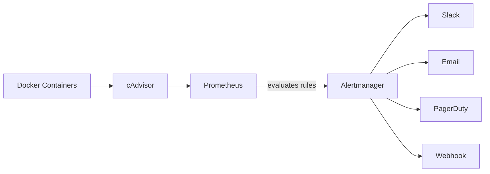

# How to Set Up Docker Container Alerting with Alertmanager

Author: [nawazdhandala](https://github.com/nawazdhandala)

Tags: Docker, Alertmanager, Prometheus, Monitoring, Alerting, DevOps, Production

Description: Configure Prometheus Alertmanager to send alerts for Docker container failures, resource exhaustion, and performance issues.

---

Running Docker containers without alerting is like driving without a dashboard. Everything seems fine until it suddenly is not. Prometheus Alertmanager integrates with Prometheus to evaluate alert rules against your container metrics and send notifications through Slack, email, PagerDuty, or webhooks. This guide sets up a complete alerting pipeline for Docker containers.

## Architecture

The alerting stack has three components: cAdvisor collects container metrics, Prometheus stores and evaluates them against alert rules, and Alertmanager handles notification routing and deduplication.



## Deploying the Monitoring Stack

Create a Docker Compose file for the full stack:

```yaml
# docker-compose.monitoring.yml - Complete monitoring and alerting stack
version: "3.9"

services:
  # cAdvisor collects container metrics from the Docker daemon
  cadvisor:
    image: gcr.io/cadvisor/cadvisor:v0.47.2
    restart: unless-stopped
    ports:
      - "8080:8080"
    volumes:
      - /:/rootfs:ro
      - /var/run:/var/run:ro
      - /sys:/sys:ro
      - /var/lib/docker/:/var/lib/docker:ro
    networks:
      - monitoring

  # Prometheus scrapes metrics and evaluates alert rules
  prometheus:
    image: prom/prometheus:v2.48.0
    restart: unless-stopped
    ports:
      - "9090:9090"
    volumes:
      - ./prometheus/prometheus.yml:/etc/prometheus/prometheus.yml:ro
      - ./prometheus/alert-rules.yml:/etc/prometheus/alert-rules.yml:ro
      - prometheus-data:/prometheus
    command:
      - '--config.file=/etc/prometheus/prometheus.yml'
      - '--storage.tsdb.retention.time=30d'
      - '--web.enable-lifecycle'
    networks:
      - monitoring

  # Alertmanager receives alerts and sends notifications
  alertmanager:
    image: prom/alertmanager:v0.26.0
    restart: unless-stopped
    ports:
      - "9093:9093"
    volumes:
      - ./alertmanager/alertmanager.yml:/etc/alertmanager/alertmanager.yml:ro
      - alertmanager-data:/alertmanager
    command:
      - '--config.file=/etc/alertmanager/alertmanager.yml'
      - '--storage.path=/alertmanager'
    networks:
      - monitoring

volumes:
  prometheus-data:
  alertmanager-data:

networks:
  monitoring:
    driver: bridge
```

## Configuring Prometheus

Create the Prometheus configuration that scrapes cAdvisor and connects to Alertmanager:

```yaml
# prometheus/prometheus.yml - Prometheus configuration
global:
  scrape_interval: 15s
  evaluation_interval: 15s

# Tell Prometheus where Alertmanager lives
alerting:
  alertmanagers:
    - static_configs:
        - targets:
          - alertmanager:9093

# Load alert rules from this file
rule_files:
  - "alert-rules.yml"

# Scrape configurations for metrics sources
scrape_configs:
  # Scrape cAdvisor for container metrics
  - job_name: "cadvisor"
    static_configs:
      - targets: ["cadvisor:8080"]
    scrape_interval: 10s

  # Scrape Prometheus itself for self-monitoring
  - job_name: "prometheus"
    static_configs:
      - targets: ["localhost:9090"]
```

## Writing Alert Rules

This is the core of the setup. Alert rules define the conditions that trigger notifications.

Create a comprehensive set of alert rules for Docker containers:

```yaml
# prometheus/alert-rules.yml - Alert rules for Docker containers
groups:
  - name: container_health
    rules:
      # Alert when a container stops running
      - alert: ContainerDown
        expr: |
          absent(container_last_seen{name=~".+"})
          or
          time() - container_last_seen{name=~".+"} > 60
        for: 1m
        labels:
          severity: critical
        annotations:
          summary: "Container {{ $labels.name }} is down"
          description: "Container {{ $labels.name }} has not been seen for more than 60 seconds."

      # Alert when a container restarts repeatedly
      - alert: ContainerRestarting
        expr: |
          increase(container_start_time_seconds{name=~".+"}[15m]) > 3
        for: 5m
        labels:
          severity: warning
        annotations:
          summary: "Container {{ $labels.name }} is restarting frequently"
          description: "Container {{ $labels.name }} has restarted more than 3 times in the last 15 minutes."

  - name: container_resources
    rules:
      # Alert when a container uses more than 85% of its memory limit
      - alert: ContainerHighMemoryUsage
        expr: |
          container_memory_usage_bytes{name=~".+"}
          / container_spec_memory_limit_bytes{name=~".+"}
          * 100 > 85
        for: 5m
        labels:
          severity: warning
        annotations:
          summary: "Container {{ $labels.name }} memory usage is high"
          description: "Container {{ $labels.name }} is using {{ $value | printf \"%.1f\" }}% of its memory limit."

      # Alert when a container hits its memory limit (OOM risk)
      - alert: ContainerMemoryNearLimit
        expr: |
          container_memory_usage_bytes{name=~".+"}
          / container_spec_memory_limit_bytes{name=~".+"}
          * 100 > 95
        for: 2m
        labels:
          severity: critical
        annotations:
          summary: "Container {{ $labels.name }} is near OOM"
          description: "Container {{ $labels.name }} is using {{ $value | printf \"%.1f\" }}% of memory. OOM kill is imminent."

      # Alert when CPU usage is sustained above 80%
      - alert: ContainerHighCPU
        expr: |
          rate(container_cpu_usage_seconds_total{name=~".+"}[5m]) * 100 > 80
        for: 10m
        labels:
          severity: warning
        annotations:
          summary: "Container {{ $labels.name }} CPU usage is high"
          description: "Container {{ $labels.name }} CPU usage has been above 80% for 10 minutes."

      # Alert when a container's disk write rate is unusually high
      - alert: ContainerHighDiskIO
        expr: |
          rate(container_fs_writes_bytes_total{name=~".+"}[5m]) > 50000000
        for: 10m
        labels:
          severity: warning
        annotations:
          summary: "Container {{ $labels.name }} has high disk I/O"
          description: "Container {{ $labels.name }} is writing more than 50MB/s for 10+ minutes."

  - name: container_network
    rules:
      # Alert when network errors are detected
      - alert: ContainerNetworkErrors
        expr: |
          rate(container_network_receive_errors_total{name=~".+"}[5m]) > 0
          or
          rate(container_network_transmit_errors_total{name=~".+"}[5m]) > 0
        for: 5m
        labels:
          severity: warning
        annotations:
          summary: "Container {{ $labels.name }} has network errors"
          description: "Container {{ $labels.name }} is experiencing network errors."

      # Alert when network traffic drops to zero (possible network partition)
      - alert: ContainerNetworkStalled
        expr: |
          rate(container_network_receive_bytes_total{name=~".+"}[5m]) == 0
          and
          rate(container_network_transmit_bytes_total{name=~".+"}[5m]) == 0
        for: 10m
        labels:
          severity: warning
        annotations:
          summary: "Container {{ $labels.name }} has no network traffic"
          description: "Container {{ $labels.name }} has had zero network traffic for 10 minutes."
```

## Configuring Alertmanager

Alertmanager routes alerts to the right notification channels based on labels and severity.

```yaml
# alertmanager/alertmanager.yml - Alertmanager routing and notification config
global:
  # Default SMTP settings for email notifications
  smtp_smarthost: "smtp.gmail.com:587"
  smtp_from: "alerts@example.com"
  smtp_auth_username: "alerts@example.com"
  smtp_auth_password: "app-password-here"
  smtp_require_tls: true

  # Slack API URL (used as default for Slack receivers)
  slack_api_url: "https://hooks.slack.com/services/YOUR/WEBHOOK/URL"

# Notification templates
templates:
  - "/etc/alertmanager/templates/*.tmpl"

# Route tree - determines which alerts go where
route:
  # Default receiver for unmatched alerts
  receiver: "slack-default"
  # Group alerts by these labels
  group_by: ["alertname", "severity"]
  # Wait this long before sending the first notification for a group
  group_wait: 30s
  # Wait this long before sending updated notifications
  group_interval: 5m
  # Wait this long before resending a notification
  repeat_interval: 4h

  # Child routes for specific alert types
  routes:
    # Critical alerts go to PagerDuty and Slack
    - match:
        severity: critical
      receiver: "critical-alerts"
      group_wait: 10s
      repeat_interval: 1h

    # Warning alerts go to Slack only
    - match:
        severity: warning
      receiver: "slack-warnings"
      repeat_interval: 4h

# Notification receivers
receivers:
  - name: "slack-default"
    slack_configs:
      - channel: "#docker-alerts"
        send_resolved: true
        title: '{{ .GroupLabels.alertname }}'
        text: >-
          {{ range .Alerts }}
          *Alert:* {{ .Annotations.summary }}
          *Details:* {{ .Annotations.description }}
          *Severity:* {{ .Labels.severity }}
          {{ end }}

  - name: "critical-alerts"
    slack_configs:
      - channel: "#critical-alerts"
        send_resolved: true
        title: 'CRITICAL: {{ .GroupLabels.alertname }}'
        text: >-
          {{ range .Alerts }}
          *Alert:* {{ .Annotations.summary }}
          *Details:* {{ .Annotations.description }}
          {{ end }}
    pagerduty_configs:
      - service_key: "your-pagerduty-service-key"
        severity: critical

  - name: "slack-warnings"
    slack_configs:
      - channel: "#docker-warnings"
        send_resolved: true
        title: 'WARNING: {{ .GroupLabels.alertname }}'
        text: >-
          {{ range .Alerts }}
          *Alert:* {{ .Annotations.summary }}
          *Details:* {{ .Annotations.description }}
          {{ end }}

# Inhibition rules - suppress less important alerts when critical ones fire
inhibit_rules:
  # If a critical alert is firing, suppress the warning version
  - source_match:
      severity: critical
    target_match:
      severity: warning
    equal: ["alertname"]
```

## Starting the Stack

Create the directory structure and start everything:

```bash
# Create the configuration directories
mkdir -p prometheus alertmanager

# Start the monitoring stack
docker compose -f docker-compose.monitoring.yml up -d

# Verify all services are running
docker compose -f docker-compose.monitoring.yml ps
```

## Validating Alert Rules

Check that Prometheus loaded the alert rules correctly:

```bash
# Check Prometheus alert rules via the API
curl -s http://localhost:9090/api/v1/rules | python3 -m json.tool | head -50
```

You can also use the Prometheus web UI at http://localhost:9090/alerts to see all configured alerts and their current status.

## Testing Alerts

Trigger a test alert by running a container that will exceed its memory limit:

```bash
# Run a container with a low memory limit that will trigger the high memory alert
docker run -d \
  --name memory-stress-test \
  --memory="100m" \
  ubuntu:22.04 \
  bash -c "dd if=/dev/zero of=/dev/null bs=1M"
```

Within a few minutes, the ContainerHighMemoryUsage alert should fire. Check Alertmanager:

```bash
# Check active alerts in Alertmanager
curl -s http://localhost:9093/api/v2/alerts | python3 -m json.tool
```

Clean up the test container:

```bash
# Remove the stress test container
docker rm -f memory-stress-test
```

## Silencing Alerts During Maintenance

When performing maintenance, silence specific alerts to avoid noise:

```bash
# Create a silence for all alerts on a specific container for 2 hours
curl -s -X POST http://localhost:9093/api/v2/silences \
  -H "Content-Type: application/json" \
  -d '{
    "matchers": [
      {"name": "name", "value": "app", "isRegex": false}
    ],
    "startsAt": "2026-02-08T00:00:00Z",
    "endsAt": "2026-02-08T02:00:00Z",
    "createdBy": "admin",
    "comment": "Maintenance window for app container"
  }'
```

List active silences:

```bash
# View all active silences
curl -s http://localhost:9093/api/v2/silences | python3 -m json.tool
```

## Best Practices

A few tips from production experience:

1. **Set memory limits on every container.** Without limits, the memory usage percentage alerts cannot fire because there is no limit to compare against.

2. **Use `for` duration wisely.** Short durations cause alert noise from transient spikes. A `for: 5m` on resource alerts means the condition must persist for 5 full minutes before firing.

3. **Group related alerts.** The `group_by` setting in Alertmanager batches related alerts into single notifications instead of flooding your Slack channel.

4. **Always send resolved notifications.** The `send_resolved: true` setting tells you when a problem is fixed, not just when it starts.

5. **Use inhibition rules.** If a container is completely down (critical), you do not also need the high CPU warning for it. Inhibition rules suppress redundant alerts.

With this setup, you will know about container problems within minutes and have the context needed to diagnose them quickly.
