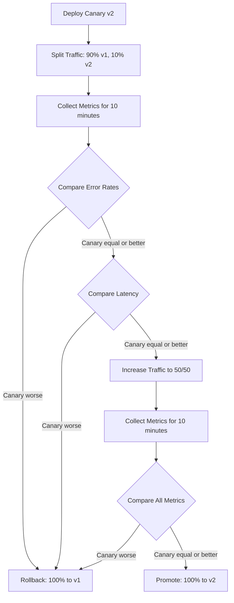

# How to Set Up Docker Container Canary Analysis

Author: [nawazdhandala](https://github.com/nawazdhandala)

Tags: Docker, Canary Deployment, Analysis, Monitoring, Deployment Strategy, DevOps

Description: Implement canary analysis for Docker container deployments by comparing metrics between old and new versions before full rollout.

---

Canary deployment sends a small percentage of traffic to a new version while the old version handles the rest. Canary analysis takes this a step further. Instead of manually watching dashboards, you automate the comparison of metrics between the canary and the baseline. If the canary's error rate, latency, or other key metrics are worse, the deployment rolls back automatically.

This guide builds a canary analysis system for Docker containers using Nginx for traffic splitting and a Python script for automated metric comparison.

## The Canary Analysis Flow

The process follows a clear sequence: deploy the canary, split traffic, collect metrics, compare them, and make a go/no-go decision.



## Setting Up the Traffic Splitter

Nginx splits traffic between the baseline and canary containers using weighted upstream groups.

Create the Nginx configuration:

```nginx
# /etc/nginx/conf.d/canary.conf
# Traffic splitting configuration for canary analysis

# Upstream for the stable version
upstream app_stable {
    server 127.0.0.1:8001;
}

# Upstream for the canary version
upstream app_canary {
    server 127.0.0.1:8002;
}

# Split map based on a consistent hash of the client IP
# This ensures the same client always hits the same version
split_clients "${remote_addr}" $upstream_variant {
    90% app_stable;
    *   app_canary;
}

server {
    listen 80;
    server_name app.example.com;

    # Log which version handled each request
    log_format canary '$remote_addr - $upstream_variant - $status '
                      '$request_time $upstream_response_time';
    access_log /var/log/nginx/canary.log canary;

    location / {
        proxy_pass http://$upstream_variant;
        proxy_set_header Host $host;
        proxy_set_header X-Real-IP $remote_addr;
        proxy_set_header X-Canary-Version $upstream_variant;
    }

    # Metrics endpoint for the analysis script
    location /nginx-status {
        stub_status on;
        allow 127.0.0.1;
        deny all;
    }
}
```

## Running the Containers

Start the baseline and canary containers side by side:

```bash
# Start the stable (baseline) version on port 8001
docker run -d \
  --name app-stable \
  -p 8001:8080 \
  --health-cmd="curl -f http://localhost:8080/health || exit 1" \
  --health-interval=10s \
  myapp:1.0

# Start the canary version on port 8002
docker run -d \
  --name app-canary \
  -p 8002:8080 \
  --health-cmd="curl -f http://localhost:8080/health || exit 1" \
  --health-interval=10s \
  myapp:2.0
```

Start the Nginx traffic splitter:

```bash
# Start Nginx for traffic splitting
docker run -d \
  --name nginx-canary \
  --network host \
  -v /etc/nginx/conf.d/canary.conf:/etc/nginx/conf.d/default.conf:ro \
  nginx:alpine
```

## Setting Up Metrics Collection

Each application container should expose Prometheus-compatible metrics. Add a metrics endpoint that exposes request count, error count, and latency histograms.

If your application does not have built-in metrics, use a sidecar approach with a metrics collector:

```yaml
# docker-compose.canary.yml - Canary setup with metrics collection
version: "3.9"

services:
  app-stable:
    image: myapp:1.0
    ports:
      - "8001:8080"
      - "9101:9090"  # Prometheus metrics port
    healthcheck:
      test: ["CMD", "curl", "-f", "http://localhost:8080/health"]
      interval: 10s
      timeout: 5s
      retries: 3

  app-canary:
    image: myapp:2.0
    ports:
      - "8002:8080"
      - "9102:9090"  # Prometheus metrics port
    healthcheck:
      test: ["CMD", "curl", "-f", "http://localhost:8080/health"]
      interval: 10s
      timeout: 5s
      retries: 3

  prometheus:
    image: prom/prometheus:v2.48.0
    ports:
      - "9090:9090"
    volumes:
      - ./prometheus-canary.yml:/etc/prometheus/prometheus.yml:ro

  nginx:
    image: nginx:alpine
    network_mode: host
    volumes:
      - ./canary.conf:/etc/nginx/conf.d/default.conf:ro
```

Create the Prometheus configuration that scrapes both versions:

```yaml
# prometheus-canary.yml - Scrape both canary and baseline
global:
  scrape_interval: 5s

scrape_configs:
  - job_name: "app-stable"
    static_configs:
      - targets: ["app-stable:9090"]
    metrics_path: /metrics

  - job_name: "app-canary"
    static_configs:
      - targets: ["app-canary:9090"]
    metrics_path: /metrics
```

## The Canary Analysis Script

This Python script compares metrics between the baseline and canary, then makes a promotion or rollback decision:

```python
#!/usr/bin/env python3
"""
canary_analysis.py - Automated canary analysis for Docker deployments

Compares error rates and latency between baseline and canary containers.
Exits with 0 if the canary is safe to promote, 1 if it should be rolled back.
"""

import requests
import time
import sys
import json

PROMETHEUS_URL = "http://localhost:9090"
ANALYSIS_DURATION = 600  # 10 minutes of data collection
ERROR_RATE_THRESHOLD = 0.01  # Canary error rate must not exceed baseline by more than 1%
LATENCY_THRESHOLD = 1.2  # Canary p99 latency must not exceed baseline by more than 20%

def query_prometheus(query):
    """Execute a PromQL query and return the result."""
    response = requests.get(
        f"{PROMETHEUS_URL}/api/v1/query",
        params={"query": query}
    )
    data = response.json()
    if data["status"] != "success":
        print(f"Prometheus query failed: {data}")
        return None
    results = data["data"]["result"]
    if not results:
        return None
    return float(results[0]["value"][1])

def get_error_rate(job_name):
    """Calculate the error rate for a given job over the analysis window."""
    query = f"""
        sum(rate(http_requests_total{{job="{job_name}", status=~"5.."}}[5m]))
        /
        sum(rate(http_requests_total{{job="{job_name}"}}[5m]))
    """
    return query_prometheus(query) or 0.0

def get_p99_latency(job_name):
    """Get the p99 latency for a given job."""
    query = f"""
        histogram_quantile(0.99,
            sum(rate(http_request_duration_seconds_bucket{{job="{job_name}"}}[5m])) by (le)
        )
    """
    return query_prometheus(query) or 0.0

def analyze():
    """Run the canary analysis and return True if safe to promote."""
    print(f"Collecting metrics for {ANALYSIS_DURATION} seconds...")
    time.sleep(ANALYSIS_DURATION)

    print("Analyzing metrics...")

    # Compare error rates
    stable_errors = get_error_rate("app-stable")
    canary_errors = get_error_rate("app-canary")
    print(f"Error rates - Stable: {stable_errors:.4f}, Canary: {canary_errors:.4f}")

    if canary_errors > stable_errors + ERROR_RATE_THRESHOLD:
        print(f"FAIL: Canary error rate exceeds threshold")
        print(f"  Difference: {canary_errors - stable_errors:.4f} > {ERROR_RATE_THRESHOLD}")
        return False

    # Compare latency
    stable_latency = get_p99_latency("app-stable")
    canary_latency = get_p99_latency("app-canary")
    print(f"P99 latency - Stable: {stable_latency:.4f}s, Canary: {canary_latency:.4f}s")

    if stable_latency > 0 and canary_latency > stable_latency * LATENCY_THRESHOLD:
        print(f"FAIL: Canary latency exceeds threshold")
        print(f"  Ratio: {canary_latency/stable_latency:.2f}x > {LATENCY_THRESHOLD}x")
        return False

    print("PASS: Canary metrics are within acceptable thresholds")
    return True

if __name__ == "__main__":
    result = analyze()
    sys.exit(0 if result else 1)
```

## The Complete Canary Deployment Script

Tie everything together with a deployment script:

```bash
#!/bin/bash
# canary-deploy.sh - Full canary deployment with automated analysis
# Usage: ./canary-deploy.sh myapp:2.0

set -e

NEW_IMAGE=$1
CANARY_WEIGHT=10  # Start with 10% traffic to canary

if [ -z "$NEW_IMAGE" ]; then
    echo "Usage: $0 <new-image:tag>"
    exit 1
fi

echo "=== Starting Canary Deployment ==="
echo "New image: $NEW_IMAGE"

# Step 1: Pull the new image
echo "Pulling new image..."
docker pull "$NEW_IMAGE"

# Step 2: Start the canary container
echo "Starting canary container..."
docker run -d \
  --name app-canary \
  -p 8002:8080 \
  --health-cmd="curl -f http://localhost:8080/health || exit 1" \
  --health-interval=10s \
  --health-retries=3 \
  "$NEW_IMAGE"

# Step 3: Wait for canary to become healthy
echo "Waiting for canary health check..."
for i in $(seq 1 30); do
    STATUS=$(docker inspect --format='{{.State.Health.Status}}' app-canary 2>/dev/null || echo "starting")
    if [ "$STATUS" = "healthy" ]; then
        echo "Canary is healthy."
        break
    fi
    if [ "$i" -eq 30 ]; then
        echo "ERROR: Canary failed health check. Rolling back."
        docker rm -f app-canary
        exit 1
    fi
    sleep 5
done

# Step 4: Enable traffic splitting (90/10)
echo "Enabling traffic split: 90% stable, 10% canary..."
# Update Nginx config to split traffic
docker exec nginx-canary nginx -s reload

# Step 5: Run canary analysis
echo "Running canary analysis (this takes ~10 minutes)..."
if python3 /opt/scripts/canary_analysis.py; then
    echo "Canary analysis PASSED"
else
    echo "Canary analysis FAILED. Rolling back."
    docker rm -f app-canary
    docker exec nginx-canary nginx -s reload
    exit 1
fi

# Step 6: Promote canary to stable
echo "Promoting canary to stable..."

# Stop the old stable container
docker stop app-stable
docker rm app-stable

# Rename canary to stable and update port mapping
docker stop app-canary
docker rm app-canary

# Start the new version as the stable container
docker run -d \
  --name app-stable \
  -p 8001:8080 \
  --health-cmd="curl -f http://localhost:8080/health || exit 1" \
  --health-interval=10s \
  --health-retries=3 \
  "$NEW_IMAGE"

# Update Nginx to send all traffic to the new stable
docker exec nginx-canary nginx -s reload

echo "=== Canary Deployment Complete ==="
echo "New stable version: $NEW_IMAGE"
```

## Adding Metric Thresholds for Different Services

Not every service has the same tolerance for errors or latency. Customize thresholds per service:

```json
{
  "services": {
    "api-gateway": {
      "error_rate_threshold": 0.005,
      "latency_threshold_multiplier": 1.1,
      "analysis_duration_seconds": 900,
      "minimum_request_count": 1000
    },
    "payment-service": {
      "error_rate_threshold": 0.001,
      "latency_threshold_multiplier": 1.05,
      "analysis_duration_seconds": 1800,
      "minimum_request_count": 500
    },
    "notification-service": {
      "error_rate_threshold": 0.02,
      "latency_threshold_multiplier": 1.5,
      "analysis_duration_seconds": 600,
      "minimum_request_count": 100
    }
  }
}
```

Critical services like payment processing get tighter thresholds and longer analysis windows. Less critical services like notifications can tolerate more variance.

## Tips from Production

Several lessons learned from running canary analysis in production:

1. **Set a minimum request count.** If the canary only receives 5 requests during the analysis window, the error rate is statistically meaningless. Require at least a few hundred requests before making a decision.

2. **Check multiple metrics, not just error rates.** A new version might have the same error rate but consume twice the CPU. Include resource metrics in your analysis.

3. **Run canary analysis during peak traffic.** A version that works fine at 2 AM might break under daytime load. Schedule canary deployments when traffic is representative.

4. **Keep the canary running long enough.** Ten minutes is the minimum. For critical services, 30-60 minutes gives much higher confidence.

5. **Log everything.** Record the exact metrics, thresholds, and decision for every canary analysis. This history is invaluable for debugging and tuning thresholds.

Canary analysis removes the human judgment from deployment decisions and replaces it with data. Your deployments become safer, your on-call engineers sleep better, and bad releases get caught before they affect most of your users.
