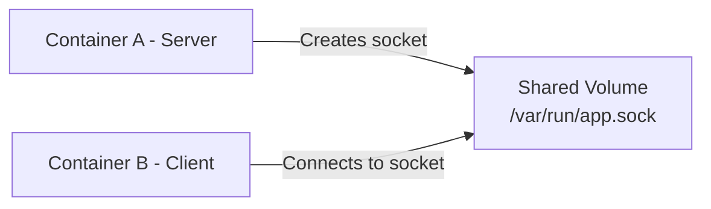

# How to Set Up Docker Containers with Unix Socket Communication

Author: [nawazdhandala](https://github.com/nawazdhandala)

Tags: docker, unix sockets, ipc, containers, volumes, inter-process communication, performance

Description: Learn how to use Unix sockets for fast, low-latency communication between Docker containers on the same host.

---

Unix sockets offer significantly lower latency than TCP for communication between processes on the same machine. When two Docker containers run on the same host and need to talk to each other, mounting a shared Unix socket eliminates the overhead of the TCP/IP stack entirely. There is no network routing, no port allocation, and no packet encapsulation. The data travels directly through the kernel.

This guide shows you how to set up Unix socket communication between Docker containers, covering shared volumes, permissions, and practical use cases like Nginx to application server communication.

## Unix Sockets vs TCP for Container Communication

TCP communication between containers goes through the Docker bridge network. Even on the same host, packets traverse the full networking stack: source container, virtual ethernet, bridge, virtual ethernet, destination container. Unix sockets bypass all of that.

Benchmarks consistently show 10-30% lower latency with Unix sockets compared to TCP loopback. For high-throughput services where two containers exchange thousands of messages per second, this difference adds up.

The tradeoff is that Unix sockets only work between containers on the same host. If you plan to distribute services across multiple machines later, you will need to switch back to TCP. But for sidecar patterns, local proxies, and tightly coupled services that always run together, Unix sockets are the better choice.

## How It Works in Docker

Unix sockets are files on the filesystem. Two containers can communicate through a Unix socket by sharing a volume that contains the socket file. One container creates and listens on the socket, the other connects to it. Docker volumes provide the shared filesystem path.

The flow looks like this:



## Basic Setup with a Shared Volume

Here is the simplest example: two containers sharing a Unix socket through a Docker volume.

Start by creating a named volume:

```bash
# Create a named volume for the Unix socket file
docker volume create socket-vol
```

Run the server container that listens on a Unix socket:

```bash
# Start a Python-based server listening on a Unix socket
docker run -d \
  --name socket-server \
  -v socket-vol:/var/run/app \
  python:3.12-slim \
  python3 -c "
import socket, os
sock_path = '/var/run/app/app.sock'
# Remove stale socket file if it exists from a previous run
if os.path.exists(sock_path):
    os.unlink(sock_path)
server = socket.socket(socket.AF_UNIX, socket.SOCK_STREAM)
server.bind(sock_path)
# Make the socket world-readable so other containers can connect
os.chmod(sock_path, 0o777)
server.listen(1)
print('Server listening on', sock_path)
while True:
    conn, _ = server.accept()
    data = conn.recv(1024)
    print('Received:', data.decode())
    conn.sendall(b'Hello from server')
    conn.close()
"
```

Run the client container that connects to the same socket:

```bash
# Start a client that connects to the server via the shared Unix socket
docker run --rm \
  -v socket-vol:/var/run/app \
  python:3.12-slim \
  python3 -c "
import socket, time
# Wait briefly for the server to create the socket file
time.sleep(2)
client = socket.socket(socket.AF_UNIX, socket.SOCK_STREAM)
client.connect('/var/run/app/app.sock')
client.sendall(b'Hello from client')
response = client.recv(1024)
print('Response:', response.decode())
client.close()
"
```

The key detail is that both containers mount the same volume at the same path. The server creates the socket file inside that volume, and the client connects to it.

## Nginx and Application Server with Unix Sockets

The most common real-world use case is connecting Nginx to a backend application server over a Unix socket instead of TCP. This is how many production deployments of Python (Gunicorn), Ruby (Puma), and PHP (PHP-FPM) applications work.

Here is a Docker Compose setup for Nginx proxying to Gunicorn via Unix socket:

```yaml
# docker-compose.yml - Nginx to Gunicorn communication via Unix socket
version: "3.8"

services:
  app:
    build: ./app
    volumes:
      # Shared volume for the Unix socket
      - socket-data:/var/run/gunicorn
    command: >
      gunicorn myapp.wsgi:application
      --bind unix:/var/run/gunicorn/gunicorn.sock
      --workers 4
      --timeout 120

  nginx:
    image: nginx:alpine
    ports:
      - "80:80"
    volumes:
      # Mount the same volume to access the socket
      - socket-data:/var/run/gunicorn
      - ./nginx.conf:/etc/nginx/conf.d/default.conf:ro
    depends_on:
      - app

volumes:
  socket-data:
```

The Nginx configuration that connects to the Unix socket:

```nginx
# nginx.conf - Upstream defined as a Unix socket path
upstream app_server {
    # Connect to Gunicorn through the shared Unix socket
    server unix:/var/run/gunicorn/gunicorn.sock;
}

server {
    listen 80;

    location / {
        proxy_pass http://app_server;
        proxy_set_header Host $host;
        proxy_set_header X-Real-IP $remote_addr;
        proxy_set_header X-Forwarded-For $proxy_add_x_forwarded_for;
        proxy_set_header X-Forwarded-Proto $scheme;
    }

    # Serve static files directly without hitting Gunicorn
    location /static/ {
        alias /var/www/static/;
    }
}
```

## Handling Permissions

Unix socket permissions are a common source of "connection refused" errors. The process that creates the socket sets its file permissions, and any connecting process must have the right access.

There are several approaches to handle this.

### Match User IDs Across Containers

Run both containers with the same user ID:

```yaml
# docker-compose.yml - Both services run as the same UID
services:
  app:
    build: ./app
    user: "1000:1000"
    volumes:
      - socket-data:/var/run/app

  sidecar:
    image: some-sidecar:latest
    user: "1000:1000"
    volumes:
      - socket-data:/var/run/app
```

### Set Permissive Socket Permissions

If matching UIDs is not practical, set the socket to be world-writable:

```python
# In your application startup, set socket permissions after binding
import os
import socket

sock_path = '/var/run/app/app.sock'
server = socket.socket(socket.AF_UNIX, socket.SOCK_STREAM)
server.bind(sock_path)

# Allow any user to connect to the socket
os.chmod(sock_path, 0o666)
```

For Gunicorn, use the `--umask` flag:

```bash
# Start Gunicorn with permissive umask so Nginx can access the socket
gunicorn myapp.wsgi:application \
  --bind unix:/var/run/gunicorn/gunicorn.sock \
  --umask 0000
```

## Waiting for the Socket to Appear

The client container might start before the server has created the socket file. You need a startup check.

This shell script waits for the socket file to exist before proceeding:

```bash
#!/bin/sh
# wait-for-socket.sh - Block until the Unix socket file appears
SOCKET_PATH="$1"
TIMEOUT="${2:-30}"
ELAPSED=0

echo "Waiting for socket at ${SOCKET_PATH}..."

while [ ! -S "$SOCKET_PATH" ]; do
  sleep 1
  ELAPSED=$((ELAPSED + 1))
  if [ "$ELAPSED" -ge "$TIMEOUT" ]; then
    echo "Timeout waiting for socket after ${TIMEOUT} seconds"
    exit 1
  fi
done

echo "Socket found at ${SOCKET_PATH}"
```

Use it in your Compose service:

```yaml
services:
  nginx:
    command: >
      sh -c "/wait-for-socket.sh /var/run/gunicorn/gunicorn.sock 30 &&
             nginx -g 'daemon off;'"
    volumes:
      - socket-data:/var/run/gunicorn
      - ./wait-for-socket.sh:/wait-for-socket.sh:ro
```

## Docker Socket Mounting

A special case of Unix socket sharing is mounting the Docker daemon socket itself. This allows a container to manage other containers, which is how tools like Portainer, Traefik, and Watchtower work.

Mount the Docker socket into a container:

```bash
# Give a container access to the Docker daemon via its Unix socket
docker run -d \
  --name portainer \
  -v /var/run/docker.sock:/var/run/docker.sock \
  -p 9000:9000 \
  portainer/portainer-ce
```

This is powerful but dangerous. A container with access to the Docker socket can create, modify, and delete any container on the host. Treat it as root-level access.

For read-only monitoring, use a socket proxy that limits which API calls are allowed:

```yaml
# docker-compose.yml - Docker socket proxy for safe read-only access
services:
  socket-proxy:
    image: tecnativa/docker-socket-proxy
    volumes:
      - /var/run/docker.sock:/var/run/docker.sock:ro
    environment:
      # Only allow read-only container listing
      CONTAINERS: 1
      SERVICES: 0
      TASKS: 0
      NETWORKS: 0
      VOLUMES: 0
    expose:
      - "2375"

  monitoring:
    image: your-monitoring-tool
    environment:
      DOCKER_HOST: tcp://socket-proxy:2375
    depends_on:
      - socket-proxy
```

## Cleaning Up Stale Sockets

When a server container crashes or restarts, the socket file may remain in the volume. The next instance will fail to bind because the file already exists. Handle this in your application startup.

Add cleanup logic to the entrypoint:

```bash
#!/bin/sh
# entrypoint.sh - Remove stale socket before starting the application
SOCKET_PATH="/var/run/app/app.sock"

if [ -S "$SOCKET_PATH" ]; then
  echo "Removing stale socket file at ${SOCKET_PATH}"
  rm -f "$SOCKET_PATH"
fi

# Start the actual application
exec "$@"
```

Reference it in your Dockerfile:

```dockerfile
COPY entrypoint.sh /entrypoint.sh
RUN chmod +x /entrypoint.sh
ENTRYPOINT ["/entrypoint.sh"]
CMD ["python", "server.py"]
```

## Health Checks for Socket-Based Services

Standard HTTP health checks do not work with Unix socket services. Use a custom check that tests socket connectivity.

```yaml
# docker-compose.yml - Health check that tests the Unix socket
services:
  app:
    healthcheck:
      # Test that the socket exists and accepts connections
      test: ["CMD-SHELL", "python3 -c \"import socket; s=socket.socket(socket.AF_UNIX); s.connect('/var/run/app/app.sock'); s.close()\""]
      interval: 10s
      timeout: 5s
      retries: 3
```

## Summary

Unix sockets provide the fastest IPC mechanism for Docker containers on the same host. Share a Docker volume between containers, have the server create a socket file in the shared path, and point the client to that file. Pay attention to file permissions, handle stale socket cleanup on restart, and implement proper wait logic for startup ordering. For the Nginx-to-application pattern, Unix sockets are the standard production approach and deliver measurably better performance than TCP loopback.
