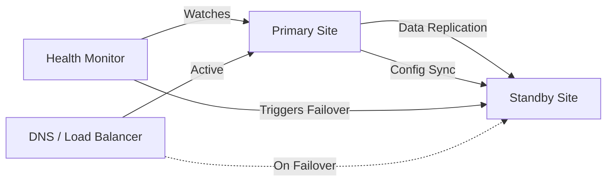

# How to Set Up Docker Disaster Recovery with Warm Standby

Author: [nawazdhandala](https://github.com/nawazdhandala)

Tags: docker, disaster recovery, warm standby, high availability, replication, failover, infrastructure

Description: Set up a warm standby Docker disaster recovery environment with automated replication, health checks, and failover procedures.

---

Production outages happen. Hardware fails, data centers go dark, and networks partition in ways nobody predicted. When your Docker-based applications go down, the difference between minutes of downtime and hours depends entirely on your disaster recovery setup. A warm standby configuration keeps a secondary environment ready to take over with minimal delay.

This guide covers how to build a warm standby disaster recovery system for Docker workloads, including data replication, configuration synchronization, health monitoring, and failover procedures.

## What Is Warm Standby?

Disaster recovery strategies fall on a spectrum. Cold standby means you have backups but need to spin up fresh infrastructure from scratch. Hot standby means an identical environment runs in parallel, handling traffic simultaneously. Warm standby sits in between - your secondary environment is running and receiving data updates, but it does not serve production traffic until you trigger a failover.

Warm standby gives you a recovery time of minutes rather than hours, without the cost of running two full production environments.

## Architecture Overview

The warm standby setup involves two environments:



The primary site handles all production traffic. The standby site mirrors the primary's data and configuration, stays warm by running the same container images, and waits for a failover trigger.

## Setting Up the Primary Site

Start with a standard Docker Compose setup for your primary environment.

```yaml
# docker-compose.primary.yml
# Primary production environment with database, application, and cache
version: "3.8"

services:
  app:
    image: registry.example.com/myapp:latest
    ports:
      - "8080:8080"
    environment:
      - DATABASE_URL=postgres://app:secret@db:5432/myapp
      - REDIS_URL=redis://cache:6379
    depends_on:
      - db
      - cache
    deploy:
      replicas: 3

  db:
    image: postgres:16
    volumes:
      - pg_data:/var/lib/postgresql/data
    environment:
      - POSTGRES_DB=myapp
      - POSTGRES_USER=app
      - POSTGRES_PASSWORD=secret
    ports:
      - "5432:5432"

  cache:
    image: redis:7-alpine
    volumes:
      - redis_data:/data
    command: redis-server --appendonly yes

volumes:
  pg_data:
  redis_data:
```

## Configuring Database Replication

PostgreSQL streaming replication keeps the standby database in sync with the primary. This is the most critical piece of the warm standby setup.

On the primary, configure replication settings:

```bash
# Add replication settings to postgresql.conf on the primary
# These enable write-ahead log shipping to the standby server
cat >> /var/lib/postgresql/data/postgresql.conf << 'EOF'
wal_level = replica
max_wal_senders = 5
wal_keep_size = 512MB
hot_standby = on
EOF

# Allow the standby server to connect for replication
echo "host replication replicator standby-server-ip/32 md5" >> /var/lib/postgresql/data/pg_hba.conf

# Create the replication user
docker exec -it primary_db_1 psql -U app -d myapp -c \
  "CREATE ROLE replicator WITH REPLICATION LOGIN PASSWORD 'repl_password';"
```

On the standby site, set up the replica:

```yaml
# docker-compose.standby.yml
# Standby environment with PostgreSQL replica and pre-pulled application images
version: "3.8"

services:
  app:
    image: registry.example.com/myapp:latest
    ports:
      - "8080:8080"
    environment:
      - DATABASE_URL=postgres://app:secret@db:5432/myapp
      - REDIS_URL=redis://cache:6379
    depends_on:
      - db
      - cache
    deploy:
      replicas: 0  # Zero replicas - app is not serving traffic yet

  db:
    image: postgres:16
    volumes:
      - pg_data:/var/lib/postgresql/data
    environment:
      - POSTGRES_DB=myapp
      - POSTGRES_USER=app
      - POSTGRES_PASSWORD=secret

  cache:
    image: redis:7-alpine
    volumes:
      - redis_data:/data
    command: redis-server --appendonly yes --replicaof primary-redis-host 6379

volumes:
  pg_data:
  redis_data:
```

Initialize the standby database from the primary:

```bash
# Take a base backup from the primary and restore it on the standby
docker exec -it standby_db_1 bash -c "
  rm -rf /var/lib/postgresql/data/*
  PGPASSWORD=repl_password pg_basebackup \
    -h primary-server-ip \
    -U replicator \
    -D /var/lib/postgresql/data \
    -P -Xs -R
"

# The -R flag creates standby.signal and sets primary_conninfo automatically
# Restart the standby database to begin streaming replication
docker restart standby_db_1
```

## Synchronizing Configuration and Images

Keep container images synchronized between sites so the standby can start immediately.

```bash
#!/bin/bash
# sync-images.sh
# Pulls the latest images on the standby site to match the primary

REGISTRY="registry.example.com"
IMAGES="myapp nginx worker"

for IMAGE in $IMAGES; do
    echo "Pulling latest image: ${REGISTRY}/${IMAGE}"
    docker pull "${REGISTRY}/${IMAGE}:latest"

    # Also pull the specific version tag from the primary's running containers
    VERSION=$(ssh primary-server "docker inspect --format='{{.Config.Image}}' primary_${IMAGE}_1" 2>/dev/null)
    if [ -n "$VERSION" ]; then
        docker pull "$VERSION"
    fi
done

echo "Image sync completed at $(date)"
```

Schedule this with cron to run every 15 minutes:

```bash
# Keep standby images fresh by syncing every 15 minutes
*/15 * * * * /opt/dr/sync-images.sh >> /var/log/image-sync.log 2>&1
```

## Building the Health Monitor

The health monitor watches the primary site and triggers failover when it detects sustained failures.

```bash
#!/bin/bash
# health-monitor.sh
# Monitors primary site health and triggers failover after sustained failures

PRIMARY_URL="https://primary.example.com/health"
STANDBY_COMPOSE="/opt/dr/docker-compose.standby.yml"
FAIL_THRESHOLD=5
FAIL_COUNT=0
CHECK_INTERVAL=10

while true; do
    # Check if the primary health endpoint responds within 5 seconds
    HTTP_CODE=$(curl -s -o /dev/null -w "%{http_code}" --max-time 5 "$PRIMARY_URL" 2>/dev/null)

    if [ "$HTTP_CODE" = "200" ]; then
        FAIL_COUNT=0
    else
        FAIL_COUNT=$((FAIL_COUNT + 1))
        echo "[$(date)] Primary health check failed ($FAIL_COUNT/$FAIL_THRESHOLD) - HTTP $HTTP_CODE"
    fi

    # Trigger failover if failures exceed the threshold
    if [ "$FAIL_COUNT" -ge "$FAIL_THRESHOLD" ]; then
        echo "[$(date)] FAILOVER TRIGGERED - Primary unreachable after $FAIL_THRESHOLD checks"
        /opt/dr/failover.sh
        break
    fi

    sleep "$CHECK_INTERVAL"
done
```

## The Failover Script

When the health monitor triggers failover, this script promotes the standby to primary.

```bash
#!/bin/bash
# failover.sh
# Promotes the standby environment to handle production traffic

set -euo pipefail

STANDBY_COMPOSE="/opt/dr/docker-compose.standby.yml"
DNS_ZONE="example.com"
STANDBY_IP="203.0.113.50"

echo "[$(date)] Starting failover procedure"

# Step 1: Promote the PostgreSQL replica to primary
echo "[$(date)] Promoting database replica..."
docker exec standby_db_1 pg_ctl promote -D /var/lib/postgresql/data

# Step 2: Wait for the database to accept write connections
echo "[$(date)] Waiting for database to accept writes..."
for i in $(seq 1 30); do
    if docker exec standby_db_1 psql -U app -d myapp -c "SELECT 1" > /dev/null 2>&1; then
        echo "[$(date)] Database is ready"
        break
    fi
    sleep 1
done

# Step 3: Scale up the application containers
echo "[$(date)] Starting application containers..."
docker compose -f "$STANDBY_COMPOSE" up -d --scale app=3

# Step 4: Update DNS to point to the standby site
echo "[$(date)] Updating DNS records..."
gcloud dns record-sets update app.example.com \
    --type=A \
    --ttl=60 \
    --rrdatas="$STANDBY_IP" \
    --zone="$DNS_ZONE"

# Step 5: Send notification
curl -s -X POST "https://hooks.slack.com/services/YOUR/WEBHOOK" \
    -H 'Content-type: application/json' \
    -d "{\"text\":\"FAILOVER COMPLETE: Traffic now routed to standby site at $(date)\"}"

echo "[$(date)] Failover complete"
```

## Testing the Failover

Never wait for a real disaster to test your failover. Run regular drills.

```bash
#!/bin/bash
# failover-test.sh
# Performs a controlled failover test and validates the standby environment

echo "=== Failover Drill Started ==="

# Check replication lag before starting
LAG=$(docker exec standby_db_1 psql -U app -d myapp -t -c \
    "SELECT EXTRACT(EPOCH FROM replay_lag) FROM pg_stat_replication;" 2>/dev/null)
echo "Current replication lag: ${LAG}s"

# Simulate primary failure by stopping the primary app containers
ssh primary-server "docker compose -f /opt/app/docker-compose.primary.yml stop app"

# Run the failover
/opt/dr/failover.sh

# Validate the standby is serving traffic
sleep 5
HEALTH=$(curl -s -o /dev/null -w "%{http_code}" "http://localhost:8080/health")
if [ "$HEALTH" = "200" ]; then
    echo "PASS: Standby is serving traffic"
else
    echo "FAIL: Standby health check returned $HEALTH"
fi

# Roll back - restart primary and reconfigure standby as replica
echo "Rolling back to primary..."
ssh primary-server "docker compose -f /opt/app/docker-compose.primary.yml start app"
```

## Monitoring Replication Health

Keep an eye on replication status between drills.

```bash
#!/bin/bash
# check-replication.sh
# Reports the current state of database replication between primary and standby

# Check if the standby is in recovery mode (it should be during normal operation)
IS_REPLICA=$(docker exec standby_db_1 psql -U app -d myapp -t -c "SELECT pg_is_in_recovery();")
echo "Standby in recovery mode: $IS_REPLICA"

# Check replication lag on the primary side
ssh primary-server "docker exec primary_db_1 psql -U app -d myapp -c \
    \"SELECT client_addr, state, sent_lsn, replay_lsn,
     EXTRACT(EPOCH FROM replay_lag) as lag_seconds
     FROM pg_stat_replication;\""
```

## Recovery Time Objectives

With a warm standby setup, you can expect these approximate recovery times:

- Database promotion: 5-10 seconds
- Application container startup: 15-30 seconds (images already pulled)
- DNS propagation: 60-300 seconds (depends on TTL)
- Total recovery time: 2-5 minutes

Compare this with a cold standby approach where you would need to provision infrastructure, pull images, restore database backups, and update DNS. That process typically takes 30-60 minutes.

## Summary

A warm standby disaster recovery setup for Docker environments requires ongoing effort, but it reduces your recovery time from hours to minutes. The key components are database streaming replication, synchronized container images, automated health monitoring, and a tested failover script. Run failover drills monthly. Document the procedure so any team member can execute it under pressure. The investment in setup and testing pays for itself the first time a production failure hits.
