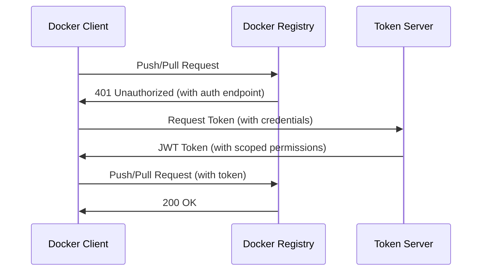

# How to Set Up Docker Registry Access Controls

Author: [nawazdhandala](https://github.com/nawazdhandala)

Tags: docker, registry, access control, authentication, authorization, security, RBAC

Description: Configure Docker registry access controls with authentication, role-based authorization, and token-based policies for secure image management.

---

A Docker registry without access controls is an open invitation for trouble. Anyone who can reach it can pull your proprietary images, push malicious ones, or delete tags you depend on. Whether you run a self-hosted registry or use a cloud provider, locking down who can push, pull, and manage images is essential.

This guide covers setting up access controls for Docker registries, from basic authentication to fine-grained role-based authorization.

## Basic Authentication with htpasswd

The simplest way to protect a Docker registry is HTTP basic authentication. This works with the official Docker registry image.

```bash
# Create a directory for authentication files
mkdir -p /opt/registry/auth

# Generate an htpasswd file with bcrypt encryption
# Add the first user (the -B flag enables bcrypt, -c creates a new file)
docker run --rm --entrypoint htpasswd httpd:2 \
  -Bbn admin 'strong_password_here' > /opt/registry/auth/htpasswd

# Add additional users without the -c flag (appends instead of overwriting)
docker run --rm --entrypoint htpasswd httpd:2 \
  -Bbn developer 'dev_password_here' >> /opt/registry/auth/htpasswd

docker run --rm --entrypoint htpasswd httpd:2 \
  -Bbn cicd 'cicd_password_here' >> /opt/registry/auth/htpasswd
```

Run the registry with authentication enabled:

```yaml
# docker-compose.registry.yml
# Docker registry with basic authentication and TLS
version: "3.8"

services:
  registry:
    image: registry:2
    ports:
      - "5000:5000"
    environment:
      # Enable htpasswd-based authentication
      REGISTRY_AUTH: htpasswd
      REGISTRY_AUTH_HTPASSWD_REALM: "Docker Registry"
      REGISTRY_AUTH_HTPASSWD_PATH: /auth/htpasswd
      # Enable TLS (required for authentication in production)
      REGISTRY_HTTP_TLS_CERTIFICATE: /certs/registry.crt
      REGISTRY_HTTP_TLS_KEY: /certs/registry.key
    volumes:
      - /opt/registry/auth:/auth
      - /opt/registry/certs:/certs
      - /opt/registry/data:/var/lib/registry
    restart: always
```

Test authentication:

```bash
# Login to the registry
docker login registry.example.com:5000

# Try pushing an image (should succeed after login)
docker tag alpine:latest registry.example.com:5000/test/alpine:latest
docker push registry.example.com:5000/test/alpine:latest
```

## Token-Based Authentication

For fine-grained access control, use token-based authentication. The registry delegates authentication to a separate token server that issues JWT tokens with specific permissions.



Set up the registry to use token authentication:

```yaml
# docker-compose.token-auth.yml
# Registry with token-based authentication for fine-grained access control
version: "3.8"

services:
  registry:
    image: registry:2
    ports:
      - "5000:5000"
    environment:
      REGISTRY_AUTH: token
      REGISTRY_AUTH_TOKEN_REALM: https://auth.example.com/token
      REGISTRY_AUTH_TOKEN_SERVICE: "Docker Registry"
      REGISTRY_AUTH_TOKEN_ISSUER: "Auth Service"
      REGISTRY_AUTH_TOKEN_ROOTCERTBUNDLE: /certs/auth.crt
    volumes:
      - /opt/registry/certs:/certs
      - /opt/registry/data:/var/lib/registry

  auth:
    image: cesanta/docker_auth:1
    ports:
      - "5001:5001"
    volumes:
      - /opt/registry/auth-config:/config:ro
      - /opt/registry/certs:/certs
    command: --v=2 --alsologtostderr /config/auth_config.yml
```

Configure the token server with role-based access:

```yaml
# auth_config.yml
# Token server configuration with user roles and repository-level permissions

server:
  addr: ":5001"
  certificate: "/certs/auth.crt"
  key: "/certs/auth.key"

token:
  issuer: "Auth Service"
  expiration: 900  # Token valid for 15 minutes

# User definitions with bcrypt-hashed passwords
users:
  "admin":
    password: "$2y$05$LO.CTgkPkl/XQos..." # bcrypt hash
  "developer":
    password: "$2y$05$Ah2TkF.4hXqR7os..."
  "cicd":
    password: "$2y$05$Yt3kL.9dFnQp5as..."
  "readonly":
    password: "$2y$05$Kp9mN.2eFgRs8qs..."

# Access control lists define who can do what on which repositories
acl:
  # Admins get full access to everything
  - match: {account: "admin"}
    actions: ["*"]

  # Developers can push and pull from their team's namespace
  - match: {account: "developer", name: "team-a/*"}
    actions: ["push", "pull"]

  # CI/CD can push to all repositories
  - match: {account: "cicd"}
    actions: ["push", "pull"]

  # Read-only user can only pull
  - match: {account: "readonly"}
    actions: ["pull"]

  # Everyone can pull public images
  - match: {name: "public/*"}
    actions: ["pull"]
```

## Setting Up TLS Certificates

Authentication without TLS sends credentials in plain text. Always use TLS.

```bash
# Generate a self-signed certificate for testing
# In production, use certificates from a trusted CA
openssl req -newkey rsa:4096 -nodes \
  -keyout /opt/registry/certs/registry.key \
  -x509 -days 365 \
  -out /opt/registry/certs/registry.crt \
  -subj "/CN=registry.example.com"

# If using a self-signed cert, configure Docker to trust it
mkdir -p /etc/docker/certs.d/registry.example.com:5000
cp /opt/registry/certs/registry.crt \
   /etc/docker/certs.d/registry.example.com:5000/ca.crt

# Restart Docker to pick up the new certificate
sudo systemctl restart docker
```

## Repository-Level Access Control with Harbor

For enterprise environments, Harbor provides a full-featured registry with a web UI and project-based access control.

```yaml
# docker-compose.harbor.yml (simplified)
# Harbor registry with RBAC, vulnerability scanning, and audit logging
version: "3.8"

services:
  harbor-core:
    image: goharbor/harbor-core:v2.10
    environment:
      - CONFIG_PATH=/etc/harbor/app.conf
    volumes:
      - /opt/harbor/config:/etc/harbor
      - /opt/harbor/data:/data

  harbor-db:
    image: goharbor/harbor-db:v2.10
    volumes:
      - /opt/harbor/database:/var/lib/postgresql/data

  harbor-portal:
    image: goharbor/harbor-portal:v2.10
    ports:
      - "8080:8080"
```

Install Harbor using the official installer for a production-ready setup:

```bash
# Download and extract the Harbor installer
wget https://github.com/goharbor/harbor/releases/download/v2.10.0/harbor-online-installer-v2.10.0.tgz
tar xzf harbor-online-installer-v2.10.0.tgz

# Edit the configuration file
cd harbor

# Key settings in harbor.yml:
# - hostname: registry.example.com
# - harbor_admin_password: change_this
# - database password
# - https certificate and key paths

# Run the installer
./install.sh --with-trivy
```

Harbor's RBAC model uses projects and member roles:

```bash
# Create a project using the Harbor API
curl -s -X POST "https://registry.example.com/api/v2.0/projects" \
  -H "Content-Type: application/json" \
  -u "admin:Harbor12345" \
  -d '{
    "project_name": "team-a",
    "public": false,
    "metadata": {
      "auto_scan": "true",
      "prevent_vul": "true",
      "severity": "high"
    }
  }'

# Add a user as a developer (role 2) to the project
curl -s -X POST "https://registry.example.com/api/v2.0/projects/team-a/members" \
  -H "Content-Type: application/json" \
  -u "admin:Harbor12345" \
  -d '{
    "role_id": 2,
    "member_user": {"username": "developer1"}
  }'
```

Harbor role IDs: 1 = Project Admin, 2 = Developer, 3 = Guest (read-only), 4 = Maintainer.

## Restricting Actions with Registry Middleware

You can add a reverse proxy in front of your registry to enforce additional access rules:

```nginx
# nginx.conf
# Reverse proxy that restricts write operations by IP and method

upstream registry {
    server registry:5000;
}

server {
    listen 443 ssl;
    server_name registry.example.com;

    ssl_certificate /etc/nginx/certs/registry.crt;
    ssl_certificate_key /etc/nginx/certs/registry.key;

    # Allow push operations only from CI/CD server IPs
    location /v2/ {
        # Block PUT, POST, PATCH, DELETE from unauthorized IPs
        if ($request_method !~ ^(GET|HEAD)$) {
            set $deny_write "1";
        }

        # Allow write operations from CI/CD servers
        if ($remote_addr ~ ^(10\.0\.1\.50|10\.0\.1\.51)$) {
            set $deny_write "0";
        }

        if ($deny_write = "1") {
            return 403;
        }

        proxy_pass https://registry;
        proxy_set_header Host $host;
        proxy_set_header X-Real-IP $remote_addr;
        proxy_set_header X-Forwarded-For $proxy_add_x_forwarded_for;
        proxy_set_header X-Forwarded-Proto $scheme;

        # Increase limits for large image layer uploads
        client_max_body_size 0;
        chunked_transfer_encoding on;
    }
}
```

## Auditing Registry Access

Track who pushed and pulled what:

```bash
# Enable verbose logging in the registry
# Add this environment variable to your registry container
REGISTRY_LOG_LEVEL=info
REGISTRY_LOG_ACCESSLOG_DISABLED=false
```

Parse registry logs for audit reports:

```bash
# Extract push and pull events from registry logs
docker logs registry 2>&1 | grep -E "(push|pull)" | \
  jq -r 'select(.msg | test("(push|pull)")) |
    "\(.time) \(.http.request.remoteaddr) \(.http.request.method) \(.http.request.uri)"'
```

## Summary

Docker registry access controls range from simple htpasswd files to full RBAC systems like Harbor. Start with basic authentication and TLS, then move to token-based authorization as your needs grow. Use namespace-based policies to organize repositories by team, enforce push restrictions through CI/CD pipelines, and audit access regularly. The goal is to ensure that every image in your registry is put there intentionally by an authorized user.
