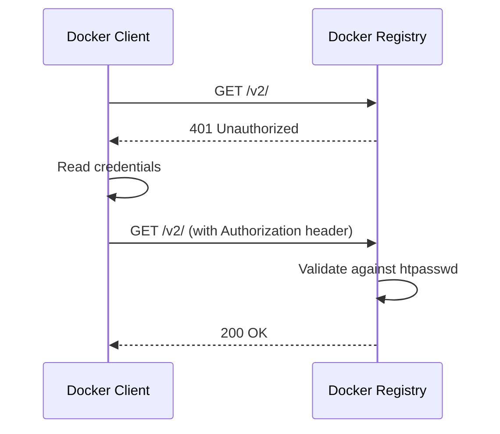

# How to Set Up Docker Registry with Basic Auth and htpasswd

Author: [nawazdhandala](https://github.com/nawazdhandala)

Tags: Docker, Docker Registry, Authentication, htpasswd, Security, Self-Hosted, Basic Auth

Description: Secure your private Docker registry with HTTP Basic Authentication using htpasswd for simple, effective access control.

---

A Docker registry without authentication is an open door. Anyone who can reach the network endpoint can push images, pull your proprietary code, or even replace images with malicious ones. HTTP Basic Authentication with htpasswd is the simplest way to lock down a private registry. It requires no external identity provider, no database, and no complex configuration. You create a password file, point the registry at it, and every push or pull requires valid credentials.

This guide covers setting up htpasswd authentication directly on the registry, managing users, and combining it with TLS for a secure production setup.

## How Basic Auth Works with Docker Registry

When a Docker client tries to push or pull, the registry responds with a 401 status and a `WWW-Authenticate` header. The Docker client then prompts for credentials (or uses stored ones from `docker login`), encodes them as a Base64 Authorization header, and retries the request. The registry validates the credentials against the htpasswd file.



## Prerequisites

You need Docker and Docker Compose installed. For generating htpasswd files, you can use the `htpasswd` utility from Apache or generate them inside a Docker container.

## Step 1: Generate the htpasswd File

The htpasswd file stores usernames and bcrypt-hashed passwords. Never use plain text or MD5 hashing for passwords.

```bash
# Create the auth directory
mkdir -p auth

# Generate htpasswd with bcrypt hashing using a Docker container
# This avoids needing to install apache2-utils on your host
docker run --rm --entrypoint htpasswd httpd:2 -Bbn admin secretpassword > auth/htpasswd

# Add another user
docker run --rm --entrypoint htpasswd httpd:2 -Bbn developer devpassword >> auth/htpasswd

# Add a CI/CD service account
docker run --rm --entrypoint htpasswd httpd:2 -Bbn cirunner cipassword >> auth/htpasswd
```

The `-B` flag specifies bcrypt hashing, `-b` takes the password from the command line, and `-n` outputs to stdout instead of a file.

Verify the file contents:

```bash
# Check the htpasswd file (passwords are hashed, safe to view)
cat auth/htpasswd
# admin:$2y$05$...
# developer:$2y$05$...
# cirunner:$2y$05$...
```

## Step 2: Registry Configuration

You can configure authentication through environment variables or a config file.

### Using Environment Variables

```yaml
# docker-compose.yml - Registry with htpasswd authentication
version: "3.8"

services:
  registry:
    image: registry:2
    ports:
      - "5000:5000"
    environment:
      # Enable htpasswd authentication
      REGISTRY_AUTH: htpasswd
      REGISTRY_AUTH_HTPASSWD_REALM: "Docker Registry"
      REGISTRY_AUTH_HTPASSWD_PATH: /auth/htpasswd
      # Storage settings
      REGISTRY_STORAGE_DELETE_ENABLED: "true"
    volumes:
      # Mount the htpasswd file
      - ./auth:/auth:ro
      # Persistent image storage
      - registry-data:/var/lib/registry
    restart: unless-stopped

volumes:
  registry-data:
```

### Using a Configuration File

For more control, use a YAML config:

```yaml
# config.yml - Registry configuration with htpasswd auth
version: 0.1

storage:
  filesystem:
    rootdirectory: /var/lib/registry
  delete:
    enabled: true
  cache:
    blobdescriptor: inmemory

auth:
  htpasswd:
    realm: "Docker Registry"
    path: /auth/htpasswd

http:
  addr: :5000
  headers:
    X-Content-Type-Options: [nosniff]

health:
  storagedriver:
    enabled: true
    interval: 10s
    threshold: 3
```

```yaml
# docker-compose.yml with config file
version: "3.8"

services:
  registry:
    image: registry:2
    ports:
      - "5000:5000"
    volumes:
      - ./config.yml:/etc/docker/registry/config.yml:ro
      - ./auth:/auth:ro
      - registry-data:/var/lib/registry
    restart: unless-stopped

volumes:
  registry-data:
```

## Step 3: Adding TLS

Basic Auth sends credentials as Base64-encoded text, which is trivially reversible. You must use TLS to encrypt the connection. Without TLS, anyone sniffing network traffic can capture your credentials.

### Self-Signed Certificates (for testing)

```bash
# Generate a self-signed certificate
mkdir -p certs
openssl req -newkey rsa:4096 -nodes -sha256 \
  -keyout certs/registry.key \
  -x509 -days 365 \
  -out certs/registry.crt \
  -subj "/CN=registry.local"
```

### Compose with TLS

```yaml
# docker-compose.yml - Registry with htpasswd auth and TLS
version: "3.8"

services:
  registry:
    image: registry:2
    ports:
      - "5000:5000"
    environment:
      REGISTRY_AUTH: htpasswd
      REGISTRY_AUTH_HTPASSWD_REALM: "Docker Registry"
      REGISTRY_AUTH_HTPASSWD_PATH: /auth/htpasswd
      # TLS configuration
      REGISTRY_HTTP_TLS_CERTIFICATE: /certs/registry.crt
      REGISTRY_HTTP_TLS_KEY: /certs/registry.key
      REGISTRY_STORAGE_DELETE_ENABLED: "true"
    volumes:
      - ./auth:/auth:ro
      - ./certs:/certs:ro
      - registry-data:/var/lib/registry
    restart: unless-stopped

volumes:
  registry-data:
```

If using self-signed certificates, Docker clients need to trust the CA:

```bash
# Copy the certificate to Docker's trusted certificates directory
sudo mkdir -p /etc/docker/certs.d/registry.local:5000
sudo cp certs/registry.crt /etc/docker/certs.d/registry.local:5000/ca.crt

# Restart Docker to pick up the new certificate
sudo systemctl restart docker
```

## Step 4: Testing Authentication

```bash
# Start the registry
docker compose up -d

# Try accessing without credentials (should fail with 401)
curl -v http://localhost:5000/v2/_catalog
# Response: 401 Unauthorized

# Access with valid credentials
curl -u admin:secretpassword http://localhost:5000/v2/_catalog
# Response: {"repositories":[]}

# Log in with Docker
docker login localhost:5000
# Enter username: admin
# Enter password: secretpassword
# Response: Login Succeeded

# Push an image
docker tag alpine:latest localhost:5000/alpine:latest
docker push localhost:5000/alpine:latest

# Verify the image is in the catalog
curl -u admin:secretpassword http://localhost:5000/v2/_catalog
# Response: {"repositories":["alpine"]}
```

## Managing Users

### Adding a New User

```bash
# Append a new user to the htpasswd file
docker run --rm --entrypoint htpasswd httpd:2 -Bbn newuser newpassword >> auth/htpasswd

# The registry picks up changes without restart
```

### Removing a User

```bash
# Remove a user by filtering them out
# First, check current users
cat auth/htpasswd

# Remove the user named "developer"
grep -v "^developer:" auth/htpasswd > auth/htpasswd.tmp && mv auth/htpasswd.tmp auth/htpasswd
```

### Changing a Password

```bash
# Generate the new entry
NEW_ENTRY=$(docker run --rm --entrypoint htpasswd httpd:2 -Bbn admin newpassword)

# Replace the old entry
grep -v "^admin:" auth/htpasswd > auth/htpasswd.tmp
echo "$NEW_ENTRY" >> auth/htpasswd.tmp
mv auth/htpasswd.tmp auth/htpasswd
```

## Docker Login and Credential Storage

When you run `docker login`, Docker stores credentials in `~/.docker/config.json`. On Linux without a credential helper, they are stored as Base64-encoded text, which is not secure.

Use a credential helper for better security:

```bash
# On macOS, Docker Desktop uses the keychain automatically
# On Linux, install docker-credential-pass or docker-credential-secretservice

# Check your current credential storage
cat ~/.docker/config.json
```

## CI/CD Integration

For CI/CD systems, log in non-interactively:

```bash
# Log in using environment variables (in your CI pipeline)
echo "$REGISTRY_PASSWORD" | docker login localhost:5000 -u "$REGISTRY_USERNAME" --password-stdin
```

This avoids passing the password on the command line, which would be visible in process listings.

## Nginx Alternative

Instead of having the registry handle authentication directly, you can put Nginx in front and let it handle auth:

```nginx
# nginx/registry.conf - Nginx with basic auth proxying to registry
server {
    listen 443 ssl;
    server_name registry.yourdomain.com;

    ssl_certificate /etc/nginx/certs/registry.crt;
    ssl_certificate_key /etc/nginx/certs/registry.key;

    client_max_body_size 0;

    auth_basic "Docker Registry";
    auth_basic_user_file /etc/nginx/auth/htpasswd;

    location /v2/ {
        proxy_pass http://registry:5000;
        proxy_set_header Host $http_host;
        proxy_set_header X-Real-IP $remote_addr;
        proxy_set_header X-Forwarded-For $proxy_add_x_forwarded_for;
        proxy_set_header X-Forwarded-Proto $scheme;
        proxy_read_timeout 900;
    }
}
```

This approach gives you more flexibility with Nginx features like rate limiting and access logs.

## Troubleshooting

```bash
# Test htpasswd file is valid
docker run --rm -v $(pwd)/auth:/auth --entrypoint htpasswd httpd:2 -vb /auth/htpasswd admin secretpassword
# Should output: Password for user admin correct

# Check registry logs for auth errors
docker compose logs registry | grep -i "auth\|error\|denied"

# Verify the htpasswd file is mounted correctly
docker compose exec registry cat /auth/htpasswd

# Test with curl and verbose output to see auth headers
curl -v -u admin:secretpassword http://localhost:5000/v2/
```

## Summary

HTTP Basic Authentication with htpasswd is the quickest path to securing a Docker registry. Generate a password file, mount it into the registry container, and every interaction requires valid credentials. Pair it with TLS (self-signed for internal use or Let's Encrypt for public-facing registries) to keep those credentials safe on the wire. For most small-to-medium teams, this is all the authentication you need.
