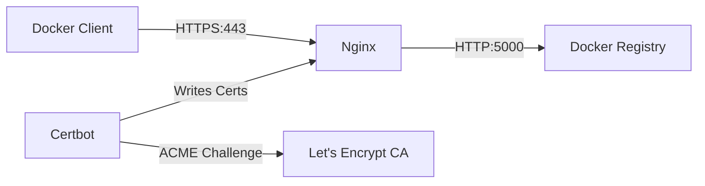

# How to Set Up Docker Registry with Let's Encrypt SSL

Author: [nawazdhandala](https://github.com/nawazdhandala)

Tags: Docker, Docker Registry, SSL, Let's Encrypt, Nginx, HTTPS, Security, Self-Hosted

Description: Configure a private Docker registry with automatic Let's Encrypt SSL certificates using Nginx as a reverse proxy.

---

Running your own Docker registry makes sense when you need to keep images private, reduce bandwidth costs, or avoid rate limits from Docker Hub. But Docker refuses to push or pull from registries that lack TLS, unless you explicitly mark them as insecure, which is a bad idea for anything beyond local testing.

Let's Encrypt provides free TLS certificates that auto-renew, making it the ideal choice for securing your private registry. This guide sets up a Docker registry behind Nginx with automatic Let's Encrypt certificate management.

## Prerequisites

You need a server with a public IP address and a domain name pointing to it. Docker and Docker Compose must be installed. Ports 80 and 443 need to be open in your firewall.

Verify DNS is configured correctly:

```bash
# Check that your domain points to your server's IP
dig registry.yourdomain.com +short
# Should return your server's public IP
```

## Architecture



Nginx terminates TLS and proxies requests to the Docker registry running on port 5000. Certbot handles certificate issuance and renewal through the ACME protocol.

## Directory Structure

```
docker-registry/
├── docker-compose.yml
├── nginx/
│   └── registry.conf
├── auth/
│   └── htpasswd
└── certbot/
    ├── conf/
    └── www/
```

## Docker Compose Configuration

```yaml
# Private Docker Registry with Let's Encrypt SSL
version: "3.8"

services:
  # Docker Registry - image storage
  registry:
    image: registry:2
    volumes:
      - registry-data:/var/lib/registry
    environment:
      REGISTRY_STORAGE_DELETE_ENABLED: "true"
    restart: unless-stopped
    networks:
      - registry-network

  # Nginx - TLS termination and reverse proxy
  nginx:
    image: nginx:1.25-alpine
    ports:
      - "80:80"
      - "443:443"
    volumes:
      - ./nginx/registry.conf:/etc/nginx/conf.d/default.conf:ro
      - ./certbot/conf:/etc/letsencrypt:ro
      - ./certbot/www:/var/www/certbot:ro
      - ./auth:/etc/nginx/auth:ro
    depends_on:
      - registry
    restart: unless-stopped
    networks:
      - registry-network

  # Certbot - automatic SSL certificate management
  certbot:
    image: certbot/certbot
    volumes:
      - ./certbot/conf:/etc/letsencrypt
      - ./certbot/www:/var/www/certbot
    entrypoint: "/bin/sh -c 'trap exit TERM; while :; do certbot renew; sleep 12h & wait $${!}; done;'"
    networks:
      - registry-network

volumes:
  registry-data:

networks:
  registry-network:
    driver: bridge
```

The Certbot container runs a renewal loop every 12 hours. Let's Encrypt certificates are valid for 90 days, and Certbot renews them when they have less than 30 days remaining.

## Step 1: Initial Nginx Configuration (HTTP Only)

Before obtaining certificates, Nginx needs to serve the ACME challenge over HTTP. Start with this minimal configuration:

```nginx
# nginx/registry.conf - Initial HTTP-only config for certificate issuance
server {
    listen 80;
    server_name registry.yourdomain.com;

    # Let's Encrypt ACME challenge directory
    location /.well-known/acme-challenge/ {
        root /var/www/certbot;
    }

    # Redirect everything else to HTTPS (once certs are ready)
    location / {
        return 301 https://$host$request_uri;
    }
}
```

## Step 2: Obtain the Certificate

```bash
# Start Nginx with the HTTP-only config
docker compose up -d nginx

# Request the certificate from Let's Encrypt
docker compose run --rm certbot certonly \
  --webroot \
  --webroot-path=/var/www/certbot \
  --email your-email@example.com \
  --agree-tos \
  --no-eff-email \
  -d registry.yourdomain.com
```

You should see a success message with the path to your new certificates.

## Step 3: Full Nginx Configuration (HTTPS)

Now update the Nginx config to serve HTTPS and proxy to the registry:

```nginx
# nginx/registry.conf - Full HTTPS config with registry proxy
server {
    listen 80;
    server_name registry.yourdomain.com;

    location /.well-known/acme-challenge/ {
        root /var/www/certbot;
    }

    location / {
        return 301 https://$host$request_uri;
    }
}

server {
    listen 443 ssl http2;
    server_name registry.yourdomain.com;

    # Let's Encrypt SSL certificates
    ssl_certificate /etc/letsencrypt/live/registry.yourdomain.com/fullchain.pem;
    ssl_certificate_key /etc/letsencrypt/live/registry.yourdomain.com/privkey.pem;

    # SSL security settings
    ssl_protocols TLSv1.2 TLSv1.3;
    ssl_ciphers ECDHE-ECDSA-AES128-GCM-SHA256:ECDHE-RSA-AES128-GCM-SHA256:ECDHE-ECDSA-AES256-GCM-SHA384:ECDHE-RSA-AES256-GCM-SHA384;
    ssl_prefer_server_ciphers off;
    ssl_session_cache shared:SSL:10m;
    ssl_session_timeout 10m;

    # Required for Docker push - large image layers
    client_max_body_size 0;
    chunked_transfer_encoding on;

    # Basic authentication (optional but recommended)
    auth_basic "Docker Registry";
    auth_basic_user_file /etc/nginx/auth/htpasswd;

    # Proxy to Docker registry
    location /v2/ {
        proxy_pass http://registry:5000;
        proxy_set_header Host $http_host;
        proxy_set_header X-Real-IP $remote_addr;
        proxy_set_header X-Forwarded-For $proxy_add_x_forwarded_for;
        proxy_set_header X-Forwarded-Proto $scheme;
        proxy_read_timeout 900;
    }
}
```

The `client_max_body_size 0` directive is critical. Docker image layers can be hundreds of megabytes, and Nginx's default 1MB limit will cause pushes to fail.

## Step 4: Create Authentication

Generate a password file for basic authentication:

```bash
# Create the auth directory
mkdir -p auth

# Generate htpasswd file (install apache2-utils if needed)
docker run --rm --entrypoint htpasswd httpd:2 -Bbn myuser mypassword > auth/htpasswd
```

## Step 5: Start Everything

```bash
# Restart Nginx with the full config and start the registry
docker compose up -d

# Verify the registry is accessible
curl https://registry.yourdomain.com/v2/_catalog -u myuser:mypassword
```

## Pushing and Pulling Images

```bash
# Log in to your private registry
docker login registry.yourdomain.com

# Tag a local image for your registry
docker tag myapp:latest registry.yourdomain.com/myapp:latest

# Push the image
docker push registry.yourdomain.com/myapp:latest

# Pull the image on another machine
docker pull registry.yourdomain.com/myapp:latest
```

## Certificate Renewal

The Certbot container automatically handles renewal. You can test it manually:

```bash
# Test certificate renewal (dry run)
docker compose run --rm certbot renew --dry-run
```

To reload Nginx after renewal so it picks up the new certificates, add a deploy hook:

```bash
# Force renewal and reload Nginx
docker compose run --rm certbot renew --force-renewal
docker compose exec nginx nginx -s reload
```

For automated reload, add a cron job on the host:

```bash
# Add to crontab - reload Nginx daily at 3 AM
0 3 * * * cd /path/to/docker-registry && docker compose exec nginx nginx -s reload
```

## Storage Configuration

By default, images are stored on the local filesystem. For large registries, you may want to use object storage:

```yaml
# Registry with S3-compatible storage
registry:
  image: registry:2
  environment:
    REGISTRY_STORAGE: s3
    REGISTRY_STORAGE_S3_ACCESSKEY: your-access-key
    REGISTRY_STORAGE_S3_SECRETKEY: your-secret-key
    REGISTRY_STORAGE_S3_REGION: us-east-1
    REGISTRY_STORAGE_S3_BUCKET: my-registry-bucket
    REGISTRY_STORAGE_DELETE_ENABLED: "true"
```

## Garbage Collection

Docker registry does not automatically clean up deleted image layers. Run garbage collection periodically:

```bash
# Run garbage collection in dry-run mode first
docker compose exec registry bin/registry garbage-collect /etc/docker/registry/config.yml --dry-run

# Run actual garbage collection
docker compose exec registry bin/registry garbage-collect /etc/docker/registry/config.yml
```

## Troubleshooting

```bash
# Check if the certificate was issued correctly
docker compose run --rm certbot certificates

# Verify SSL from outside
openssl s_client -connect registry.yourdomain.com:443 -servername registry.yourdomain.com

# Check registry logs for push/pull issues
docker compose logs registry

# Check Nginx logs for proxy errors
docker compose logs nginx
```

## Summary

A private Docker registry with Let's Encrypt SSL gives you secure, rate-limit-free image hosting that you fully control. Nginx handles TLS termination and authentication, Certbot automates certificate management, and the registry itself stores your images. The entire setup fits in a single Docker Compose file and costs nothing beyond the server itself.
